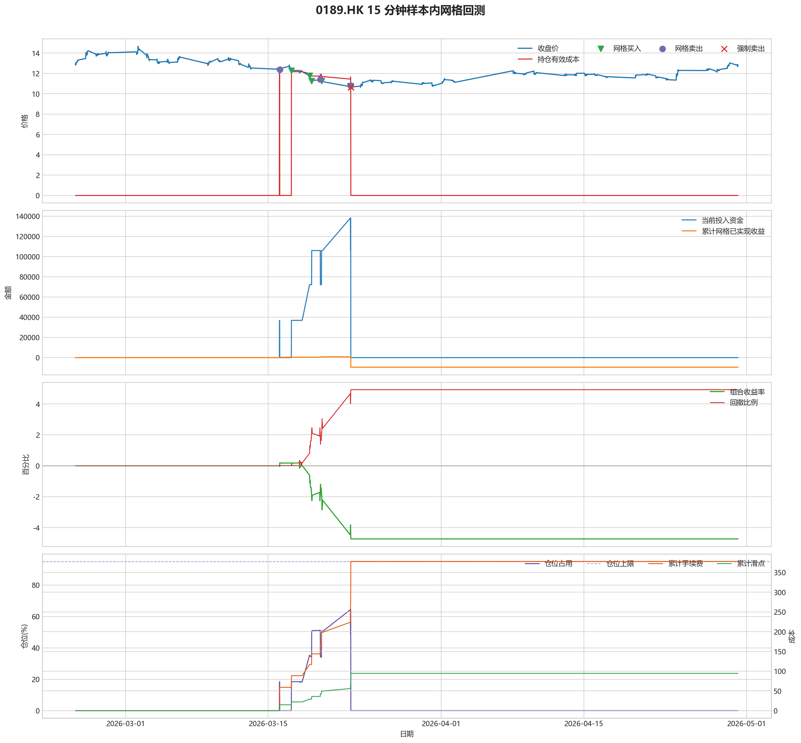
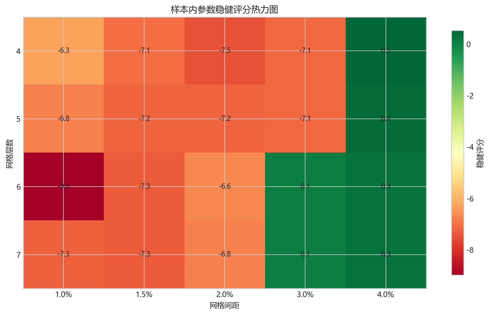
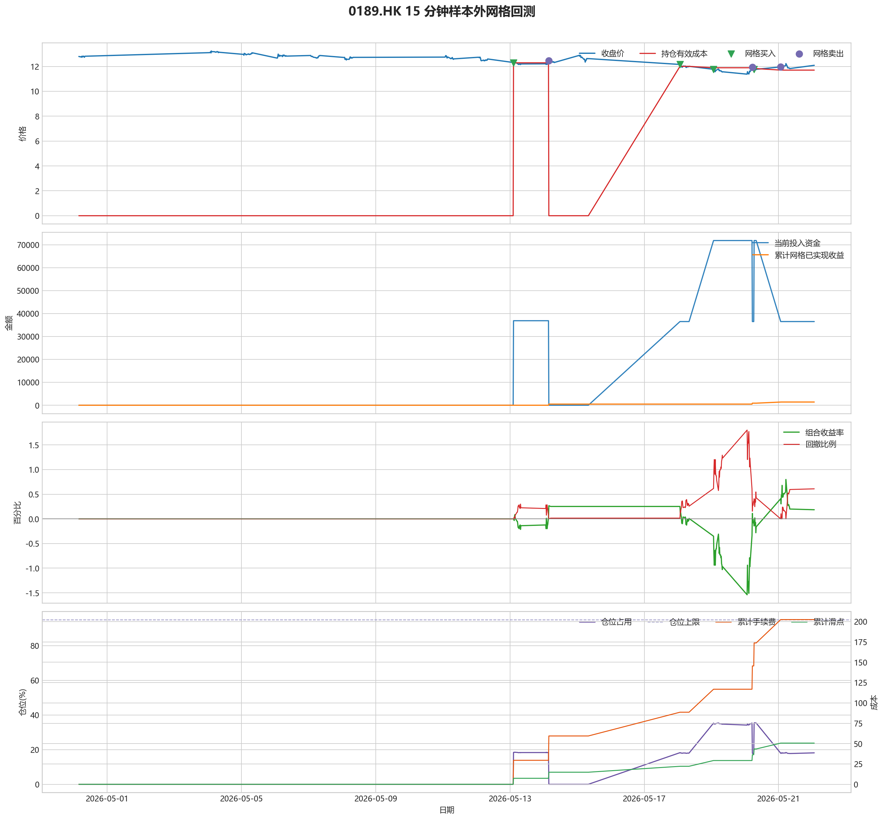

# 0189.HK 网格回测报告

## 摘要

- 标的：`0189.HK`
- 数据周期：Yahoo Finance 最近 60 天 `15m`；下载必须配置代理，Yahoo 失败时流程直接停止
- 样本内窗口：2026-02-24 01:30:00 至 2026-04-30 03:30:00
- 样本外窗口：2026-04-30 03:45:00 至 2026-05-22 01:30:00
- 切分方式：最近分钟线样本按 `75% / 25%` 拆分样本内与样本外
- 网格模式：纯现金网格，不在样本起点建立底仓；第一根 K 线收盘价只作为网格锚点
- 最小交易单位：1000 股，来源：AASTOCKS 快照页 Lot Size
- 单层网格固定数量：3000 股
- 左侧处理：`both`，强制退出阈值 `5.00%` 总资金浮亏
- 执行口径：`realistic`，手续费 `8.00` bps，滑点 `2.00` bps
- 最优参数：网格间距 4.00% / 网格层数 4 / 止盈比例 1.00%

这套网格在不同阶段表现不一致，说明它对行情结构比较敏感，不能只看单段结果下结论。

## 第一层：先看结论

### 先回答关键问题

| 问题 | 样本内 | 样本外 | 怎么理解 |
| --- | --- | --- | --- |
| 这套策略能不能赚钱 | -4.73% | 0.19% | 样本外已经转正，但样本内没有稳定赚钱，暂时只能说参数在新阶段有改善，不能证明长期稳定盈利。 |
| 比现金闲置好不好 | -9456.27 | 370.38 | 正数表示网格策略赚到钱，负数表示不交易反而更好。 |
| 比买入持有好不好 | -9113.49 | 11212.41 | 买入持有用同样资金、交易单位和执行口径估算，正数表示网格更好。 |
| 交易成本高不高 | 378.07 | 202.42 | 这里统计手续费，滑点会单独体现在估算成交价和滑点成本里。 |
| 最坏会亏到什么程度 | 4.92% | 1.80% | 这是账户在样本期间相对阶段高点出现过的最大回撤。 |
| 这组参数稳不稳 | 稳健分 0.52 | 沿用同一组参数 | 不是只看一整段最高分，而是看多窗口表现是否稳定。当前结果：100% 窗口为正，最差窗口收益 `0.18%`，收益波动 `1.96` 个百分点。 |

### 一句话判断

- 这套网格在不同阶段表现不一致，说明它对行情结构比较敏感，不能只看单段结果下结论。
- 当前正式拿去实盘的证据还不够，更合理的定位是：先验证它能否通过网格闭环赚钱，再看左侧行情下能否控制亏损。
- 如果你只想知道现在值不值得继续研究，看完上面这张表就够了。

## 第二层：展开细节

### 参数是怎么选的

| 筛选环节 | 结果 | 你该怎么理解 |
| --- | --- | --- |
| 执行口径 | realistic | 手续费 8.00 bps，滑点 2.00 bps。 |
| 候选组合数 | 80 | 先把候选参数全部跑完，不做随机抽样。 |
| 单窗综合分 | -10.55 | 这是整段样本内的收益、回撤、闭环网格利润综合分。 |
| 稳健窗口数 | 3 | 再把样本内按时间顺序拆成多个连续窗口，检查同一参数会不会只在一小段行情里好看。 |
| 稳健分 RobustScore | 0.52 | 计算方式：0.6 x 窗口平均分 + 0.4 x 最差窗口分 - 0.25 x 窗口收益波动。 |
| 最终入选参数 | 间距 4.00% / 层数 4 / 止盈 1.00% | 优先挑多窗口更稳的组合，而不是只挑单窗最亮的孤点。 |

### 关键结果对照

| 指标 | 样本内 | 样本外 | 怎么读 |
| --- | --- | --- | --- |
| 净收益率 | -4.73% | 0.19% | 已经按当前执行口径扣除回测引擎支持的费用影响。 |
| 最大回撤 | 4.92% | 1.80% | 再看亏起来最难受会到什么程度。 |
| 交易成本 | 378.07 | 202.42 | 策略内部估算的手续费累计值，帮助判断网格频繁交易是否吃掉收益。 |
| 滑点成本 | 94.52 | 50.60 | 按收盘价和估算成交价差额累计，属于近似实盘口径。 |
| 未平网格有效成本 | 0.00 | 11.70 | 只在期末仍有未平网格仓位时有意义。 |
| 闭环网格净利润 | -9502.59 | 1403.46 | 这是已经完成低买高卖、真正落袋的利润，不等于总账户收益。 |
| 未平网格浮动盈亏 | 0.00 | -282.75 | hold 口径会保留这部分风险，force_exit 口径触发后通常回到 0。 |
| 网格闭环次数 | 3 | 3 | 次数越多，说明震荡里成交越频繁；但次数多不等于总账户一定赚钱。 |

### 执行口径和风控约束

| 约束 | 样本内 | 样本外 |
| --- | --- | --- |
| 执行口径 | realistic | realistic |
| 网格模式 | cash | cash |
| 左侧处理口径 | both | both |
| 手续费 / 滑点 | 8.00 / 2.00 bps | 8.00 / 2.00 bps |
| 最大仓位占用 | 64.56% / 上限 95.00% | 35.49% / 上限 95.00% |
| 停手事件 | 0 | 0 |
| 强制退出事件 | 4 | 0 |

### 网格到底有没有帮忙

| 对比项 | 样本内 | 样本外 |
| --- | --- | --- |
| 现金闲置收益率 | 0.00% | 0.00% |
| 买入持有收益率 | -0.17% | -5.42% |
| 网格策略收益率 | -4.73% | 0.19% |
| 网格相对现金闲置多赚/多亏 | -9456.27 | 370.38 |
| 网格相对买入持有多赚/多亏 | -9113.49 | 11212.41 |

### 左侧行情怎么处理

| 左侧口径 | 样本内净收益率 | 样本内闭环利润 | 样本内浮动盈亏 | 样本内强平 | 样本外净收益率 | 样本外闭环利润 | 样本外浮动盈亏 | 样本外强平 |
| --- | --- | --- | --- | --- | --- | --- | --- | --- |
| hold：未平网格继续持有 | 5.83% | 11511.39 | 0.00 | 否 | 0.19% | 1403.46 | -282.75 | 否 |
| force_exit：达到亏损阈值强平 | -4.73% | -9502.59 | 0.00 | 是 | 0.19% | 1403.46 | -282.75 | 否 |

补一句最重要的解释：

- “网格已实现收益”只代表已经完成低买高卖、真正落袋的那部分利润。
- 真正决定你账户最后赚没赚钱的，是“已实现网格收益 + 未平仓网格浮动盈亏 + 现金余额”三者一起的结果。
- 所以完全可能出现“网格已经落袋赚钱，但总账户还是亏钱”的情况。

### 图表速读总结

#### 样本内回测图

- 这一段价格从 `12.85` 走到 `12.84`，区间涨跌幅约 `-0.08%`。
- 样本结束时没有未平网格仓位，剩余风险已经体现在现金和已实现利润里。
- 图里的买卖点一共完成了 `3` 轮网格闭环，已经落袋的网格利润累计 `-9502.59`。
- 左侧强制退出已经触发，后续不再继续开新网格。
- 总账户最终仍是亏损状态，期末权益 `190543.73`；也就是说，已实现网格利润还没完全覆盖未平仓或强制退出带来的亏损。

#### 热力图

- 热力图横轴是网格间距，纵轴是网格层数，颜色越偏绿代表稳健评分越高；每个格子里没有单独画出的止盈比例，已经折叠成该格子的最好结果。
- 当前样本里，最优参数落在“网格间距 `4.00%` / 网格层数 `4` / 止盈比例 `1.00%`”。
- 从前几名结果看，高分区域主要集中在网格间距 `4.00%`、网格层数 `4` 附近。
- 最优点比较集中在网格间距 `4.00%`、网格层数 `4` 附近，说明这组参数不是完全随机撞出来的。

#### 分钟线样本外验证

- 样本外账户最终从 `200000` 走到 `200370.38`，总盈亏 `370.38`。
- 样本外单层网格按最小交易单位 `1000` 股取整，固定数量是 `3000` 股。
- 样本外结果转正，说明这组参数在新阶段没有立刻失效。

#### 样本外回测图

- 这一段价格从 `12.80` 走到 `12.09`，区间涨跌幅约 `-5.55%`。
- 样本结束时收盘价 `12.09` 已经回到有效成本 `11.70` 之上，未平网格按当前口径已经转回浮盈区。
- 图里的买卖点一共完成了 `3` 轮网格闭环，已经落袋的网格利润累计 `1403.46`。
- 期末未平网格浮动盈亏为 `-282.75`。
- 总账户最终是盈利状态，期末权益 `200370.38`，说明闭环利润、未平仓浮动盈亏和现金余额合计后已经转正。

### 交易记录和明细

如果你只是想判断策略值不值得继续，到这里通常已经够了；下面这些表主要用于追交易过程和排查归因。

### 样本内事件流水

| 时间 | 事件类型 | 层级 | 价格 | 估算成交价 | 数量 | 金额 | 手续费 | 滑点成本 | 说明 |
| --- | --- | --- | --- | --- | --- | --- | --- | --- | --- |
| 2026-03-16 02:30:00 | grid_buy | 1 | 12.25 | 12.25 | 3000 | 36786.76 | 29.41 | 7.35 | 触发下行网格买入 |
| 2026-03-16 03:15:00 | grid_sell | 1 | 12.39 | 12.39 | 3000 | 37132.84 | 29.73 | 7.43 | 达到网格止盈价后卖出本层仓位 |
| 2026-03-17 06:45:00 | grid_buy | 1 | 12.28 | 12.28 | 3000 | 36876.85 | 29.48 | 7.37 | 触发下行网格买入 |
| 2026-03-19 01:30:00 | grid_buy | 2 | 11.77 | 11.77 | 3000 | 35345.32 | 28.25 | 7.06 | 触发下行网格买入 |
| 2026-03-19 06:30:00 | grid_buy | 3 | 11.26 | 11.26 | 3000 | 33813.79 | 27.03 | 6.76 | 触发下行网格买入 |
| 2026-03-20 03:00:00 | grid_sell | 3 | 11.42 | 11.42 | 3000 | 34225.75 | 27.40 | 6.85 | 达到网格止盈价后卖出本层仓位 |
| 2026-03-20 05:45:00 | grid_buy | 3 | 11.25 | 11.25 | 3000 | 33783.76 | 27.01 | 6.75 | 触发下行网格买入 |
| 2026-03-23 01:30:00 | grid_buy | 4 | 10.70 | 10.70 | 3000 | 32132.10 | 25.69 | 6.42 | 触发下行网格买入 |
| 2026-03-23 02:00:00 | grid_sell | 4 | 10.81 | 10.81 | 3000 | 32397.58 | 25.94 | 6.49 | 达到网格止盈价后卖出本层仓位 |
| 2026-03-23 02:15:00 | grid_buy | 4 | 10.76 | 10.76 | 3000 | 32312.29 | 25.83 | 6.46 | 触发下行网格买入 |
| 2026-03-23 02:45:00 | force_exit_sell | 1 | 10.66 | 10.66 | 3000 | 31948.02 | 25.58 | 6.40 | 未平网格浮亏达到总资金 5.00% 阈值，强制卖出本层仓位 |
| 2026-03-23 02:45:00 | force_exit_sell | 2 | 10.66 | 10.66 | 3000 | 31948.02 | 25.58 | 6.40 | 未平网格浮亏达到总资金 5.00% 阈值，强制卖出本层仓位 |
| 2026-03-23 02:45:00 | force_exit_sell | 3 | 10.66 | 10.66 | 3000 | 31948.02 | 25.58 | 6.40 | 未平网格浮亏达到总资金 5.00% 阈值，强制卖出本层仓位 |
| 2026-03-23 02:45:00 | force_exit_sell | 4 | 10.66 | 10.66 | 3000 | 31948.02 | 25.58 | 6.40 | 未平网格浮亏达到总资金 5.00% 阈值，强制卖出本层仓位 |

### 样本内成交结果

| 开仓时间 | 平仓时间 | 持有时长 | 开仓价 | 平仓价 | 数量 | 盈亏 | 收益率(%) | 仓位类型 |
| --- | --- | --- | --- | --- | --- | --- | --- | --- |
| 2026-03-16 02:30:00 | 2026-03-16 03:15:00 | 0 days 00:45:00 | 12.25 | 12.39 | 3000 | 353.51 | 0.96 | 网格 1 |
| 2026-03-19 06:30:00 | 2026-03-20 03:00:00 | 0 days 20:30:00 | 11.26 | 11.42 | 3000 | 418.81 | 1.24 | 网格 3 |
| 2026-03-23 01:30:00 | 2026-03-23 02:00:00 | 0 days 00:30:00 | 10.70 | 10.81 | 3000 | 271.95 | 0.85 | 网格 4 |
| 2026-03-23 02:15:00 | 2026-03-23 02:45:00 | 0 days 00:30:00 | 10.76 | 10.66 | 3000 | -357.87 | -1.11 | 网格 4 |
| 2026-03-20 05:45:00 | 2026-03-23 02:45:00 | 2 days 21:00:00 | 11.25 | 10.66 | 3000 | -1829.34 | -5.42 | 网格 3 |
| 2026-03-19 01:30:00 | 2026-03-23 02:45:00 | 4 days 01:15:00 | 11.77 | 10.66 | 3000 | -3390.90 | -9.60 | 网格 2 |
| 2026-03-17 06:45:00 | 2026-03-23 02:45:00 | 5 days 20:00:00 | 12.28 | 10.66 | 3000 | -4922.43 | -13.36 | 网格 1 |

### 样本外事件流水

| 时间 | 事件类型 | 层级 | 价格 | 估算成交价 | 数量 | 金额 | 手续费 | 滑点成本 | 说明 |
| --- | --- | --- | --- | --- | --- | --- | --- | --- | --- |
| 2026-05-13 02:30:00 | grid_buy | 1 | 12.28 | 12.28 | 3000 | 36876.85 | 29.48 | 7.37 | 触发下行网格买入 |
| 2026-05-14 03:45:00 | grid_sell | 1 | 12.47 | 12.47 | 3000 | 37372.60 | 29.92 | 7.48 | 达到网格止盈价后卖出本层仓位 |
| 2026-05-18 01:30:00 | grid_buy | 1 | 12.16 | 12.16 | 3000 | 36516.49 | 29.19 | 7.30 | 触发下行网格买入 |
| 2026-05-19 01:30:00 | grid_buy | 2 | 11.77 | 11.77 | 3000 | 35345.32 | 28.25 | 7.06 | 触发下行网格买入 |
| 2026-05-20 05:15:00 | grid_sell | 2 | 11.93 | 11.93 | 3000 | 35754.22 | 28.63 | 7.16 | 达到网格止盈价后卖出本层仓位 |
| 2026-05-20 06:30:00 | grid_buy | 2 | 11.77 | 11.77 | 3000 | 35345.32 | 28.25 | 7.06 | 触发下行网格买入 |
| 2026-05-21 01:30:00 | grid_sell | 2 | 11.96 | 11.96 | 3000 | 35844.13 | 28.70 | 7.18 | 达到网格止盈价后卖出本层仓位 |

### 样本外成交结果

| 开仓时间 | 平仓时间 | 持有时长 | 开仓价 | 平仓价 | 数量 | 盈亏 | 收益率(%) | 仓位类型 |
| --- | --- | --- | --- | --- | --- | --- | --- | --- |
| 2026-05-13 02:30:00 | 2026-05-14 03:45:00 | 1 days 01:15:00 | 12.28 | 12.47 | 3000 | 503.23 | 1.37 | 网格 1 |
| 2026-05-19 01:30:00 | 2026-05-20 05:15:00 | 1 days 03:45:00 | 11.77 | 11.93 | 3000 | 416.05 | 1.18 | 网格 2 |
| 2026-05-20 06:30:00 | 2026-05-21 01:30:00 | 0 days 19:00:00 | 11.77 | 11.96 | 3000 | 505.98 | 1.43 | 网格 2 |
| 2026-05-18 01:30:00 | 2026-05-21 08:00:00 | 3 days 06:30:00 | 12.16 | 11.83 | 3000 | -1054.88 | -2.89 | 网格 1 |

## 最终结论

- 这套参数更适合“先跌一段、再进入震荡或反弹”的行情，因为它依赖反弹来兑现网格利润。
- 如果行情持续单边下跌，hold 口径会继续持有未平网格，force_exit 口径会在浮亏达到阈值后清仓并停止交易。
- 当前样本下，闭环网格净利润：样本内 -9502.59，样本外 1403.46。
- 这份报告只代表最近 60 天分钟级行情下的短周期表现，不等同于长期日线参数。
