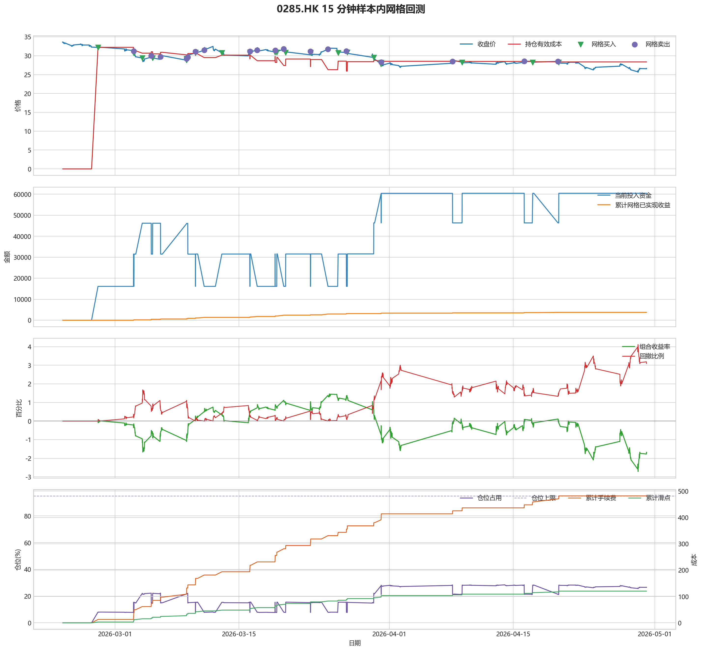
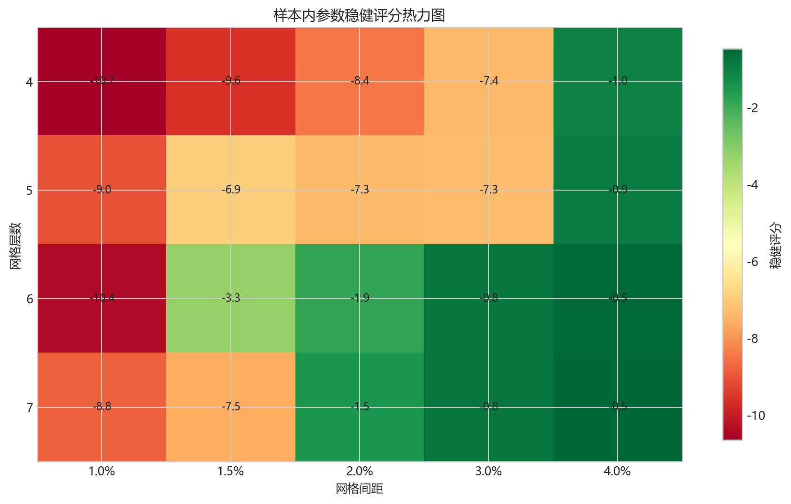
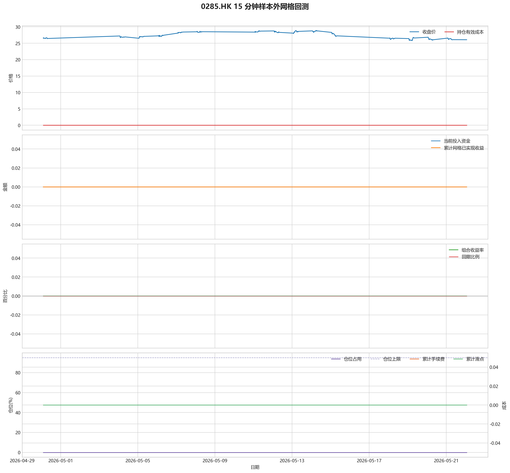

# 0285.HK 网格回测报告

## 摘要

- 标的：`0285.HK`
- 数据周期：Yahoo Finance 最近 60 天 `15m`；下载必须配置代理，Yahoo 失败时流程直接停止
- 样本内窗口：2026-02-23 01:30:00 至 2026-04-30 02:00:00
- 样本外窗口：2026-04-30 02:15:00 至 2026-05-22 01:30:00
- 切分方式：最近分钟线样本按 `75% / 25%` 拆分样本内与样本外
- 网格模式：纯现金网格，不在样本起点建立底仓；第一根 K 线收盘价只作为网格锚点
- 最小交易单位：500 股，来源：AASTOCKS 快照页 Lot Size
- 单层网格固定数量：500 股
- 左侧处理：`both`，强制退出阈值 `5.00%` 总资金浮亏
- 执行口径：`realistic`，手续费 `8.00` bps，滑点 `2.00` bps
- 最优参数：网格间距 4.00% / 网格层数 7 / 止盈比例 1.00%

这套网格当前还不能证明能稳定把总账户做成正收益，左侧下跌风险是主要约束。

## 第一层：先看结论

### 先回答关键问题

| 问题 | 样本内 | 样本外 | 怎么理解 |
| --- | --- | --- | --- |
| 这套策略能不能赚钱 | -1.70% | 0.00% | 当前还不能证明这套网格能稳定盈利，尤其要继续观察单边下跌时未平仓风险如何处理。 |
| 比现金闲置好不好 | -3390.28 | 0.00 | 正数表示网格策略赚到钱，负数表示不交易反而更好。 |
| 比买入持有好不好 | 35514.54 | 3649.09 | 买入持有用同样资金、交易单位和执行口径估算，正数表示网格更好。 |
| 交易成本高不高 | 481.75 | 0.00 | 这里统计手续费，滑点会单独体现在估算成交价和滑点成本里。 |
| 最坏会亏到什么程度 | 4.11% | 0.00% | 这是账户在样本期间相对阶段高点出现过的最大回撤。 |
| 这组参数稳不稳 | 稳健分 -0.47 | 沿用同一组参数 | 不是只看一整段最高分，而是看多窗口表现是否稳定。当前结果：100% 窗口为正，最差窗口收益 `0.07%`，收益波动 `0.18` 个百分点。 |

### 一句话判断

- 这套网格当前还不能证明能稳定把总账户做成正收益，左侧下跌风险是主要约束。
- 当前正式拿去实盘的证据还不够，更合理的定位是：先验证它能否通过网格闭环赚钱，再看左侧行情下能否控制亏损。
- 如果你只想知道现在值不值得继续研究，看完上面这张表就够了。

## 第二层：展开细节

### 参数是怎么选的

| 筛选环节 | 结果 | 你该怎么理解 |
| --- | --- | --- |
| 执行口径 | realistic | 手续费 8.00 bps，滑点 2.00 bps。 |
| 候选组合数 | 80 | 先把候选参数全部跑完，不做随机抽样。 |
| 单窗综合分 | -3.64 | 这是整段样本内的收益、回撤、闭环网格利润综合分。 |
| 稳健窗口数 | 3 | 再把样本内按时间顺序拆成多个连续窗口，检查同一参数会不会只在一小段行情里好看。 |
| 稳健分 RobustScore | -0.47 | 计算方式：0.6 x 窗口平均分 + 0.4 x 最差窗口分 - 0.25 x 窗口收益波动。 |
| 最终入选参数 | 间距 4.00% / 层数 7 / 止盈 1.00% | 优先挑多窗口更稳的组合，而不是只挑单窗最亮的孤点。 |

### 关键结果对照

| 指标 | 样本内 | 样本外 | 怎么读 |
| --- | --- | --- | --- |
| 净收益率 | -1.70% | 0.00% | 已经按当前执行口径扣除回测引擎支持的费用影响。 |
| 最大回撤 | 4.11% | 0.00% | 再看亏起来最难受会到什么程度。 |
| 交易成本 | 481.75 | 0.00 | 策略内部估算的手续费累计值，帮助判断网格频繁交易是否吃掉收益。 |
| 滑点成本 | 120.44 | 0.00 | 按收盘价和估算成交价差额累计，属于近似实盘口径。 |
| 未平网格有效成本 | 28.36 | 0.00 | 只在期末仍有未平网格仓位时有意义。 |
| 闭环网格净利润 | 3748.23 | 0.00 | 这是已经完成低买高卖、真正落袋的利润，不等于总账户收益。 |
| 未平网格浮动盈亏 | -7403.53 | 0.00 | hold 口径会保留这部分风险，force_exit 口径触发后通常回到 0。 |
| 网格闭环次数 | 18 | 0 | 次数越多，说明震荡里成交越频繁；但次数多不等于总账户一定赚钱。 |

### 执行口径和风控约束

| 约束 | 样本内 | 样本外 |
| --- | --- | --- |
| 执行口径 | realistic | realistic |
| 网格模式 | cash | cash |
| 左侧处理口径 | both | both |
| 手续费 / 滑点 | 8.00 / 2.00 bps | 8.00 / 2.00 bps |
| 最大仓位占用 | 28.44% / 上限 95.00% | 0.00% / 上限 95.00% |
| 停手事件 | 4 | 0 |
| 强制退出事件 | 0 | 0 |

### 网格到底有没有帮忙

| 对比项 | 样本内 | 样本外 |
| --- | --- | --- |
| 现金闲置收益率 | 0.00% | 0.00% |
| 买入持有收益率 | -19.45% | -1.82% |
| 网格策略收益率 | -1.70% | 0.00% |
| 网格相对现金闲置多赚/多亏 | -3390.28 | 0.00 |
| 网格相对买入持有多赚/多亏 | 35514.54 | 3649.09 |

### 左侧行情怎么处理

| 左侧口径 | 样本内净收益率 | 样本内闭环利润 | 样本内浮动盈亏 | 样本内强平 | 样本外净收益率 | 样本外闭环利润 | 样本外浮动盈亏 | 样本外强平 |
| --- | --- | --- | --- | --- | --- | --- | --- | --- |
| hold：未平网格继续持有 | -1.70% | 3748.23 | -7403.53 | 否 | 0.00% | 0.00 | 0.00 | 否 |
| force_exit：达到亏损阈值强平 | -1.70% | 3748.23 | -7403.53 | 否 | 0.00% | 0.00 | 0.00 | 否 |

补一句最重要的解释：

- “网格已实现收益”只代表已经完成低买高卖、真正落袋的那部分利润。
- 真正决定你账户最后赚没赚钱的，是“已实现网格收益 + 未平仓网格浮动盈亏 + 现金余额”三者一起的结果。
- 所以完全可能出现“网格已经落袋赚钱，但总账户还是亏钱”的情况。

### 图表速读总结

#### 样本内回测图

- 这一段价格从 `33.60` 走到 `26.56`，区间涨跌幅约 `-20.95%`。
- 样本结束时收盘价 `26.56` 仍低于有效成本 `28.36`，未平网格还处在约 `6.35%` 的浮亏区。
- 图里的买卖点一共完成了 `18` 轮网格闭环，已经落袋的网格利润累计 `3748.23`。
- 期末未平网格浮动盈亏为 `-7403.53`。
- 总账户最终仍是亏损状态，期末权益 `196609.72`；也就是说，已实现网格利润还没完全覆盖未平仓或强制退出带来的亏损。

#### 热力图

- 热力图横轴是网格间距，纵轴是网格层数，颜色越偏绿代表稳健评分越高；每个格子里没有单独画出的止盈比例，已经折叠成该格子的最好结果。
- 当前样本里，最优参数落在“网格间距 `4.00%` / 网格层数 `7` / 止盈比例 `1.00%`”。
- 从前几名结果看，高分区域主要集中在网格间距 `4.00%`、网格层数 `7` 附近。
- 最优点比较集中在网格间距 `4.00%`、网格层数 `7` 附近，说明这组参数不是完全随机撞出来的。

#### 分钟线样本外验证

- 样本外账户最终从 `200000` 走到 `200000.00`，总盈亏 `0.00`。
- 样本外单层网格按最小交易单位 `500` 股取整，固定数量是 `1000` 股。
- 样本外这段区间没有触发任何网格买入，所以这里只能说明价格没有进入计划网格区间。

#### 样本外回测图

- 这一段价格从 `26.54` 走到 `26.08`，区间涨跌幅约 `-1.73%`。
- 样本结束时没有未平网格仓位，剩余风险已经体现在现金和已实现利润里。
- 这段区间里没有完成任何网格闭环，所以图上即使有持仓波动，也还没有形成已落袋的网格利润。
- 期末未平网格浮动盈亏为 `0.00`。
- 总账户最终是盈利状态，期末权益 `200000.00`，说明闭环利润、未平仓浮动盈亏和现金余额合计后已经转正。

### 交易记录和明细

如果你只是想判断策略值不值得继续，到这里通常已经够了；下面这些表主要用于追交易过程和排查归因。

### 样本内事件流水

| 时间 | 事件类型 | 层级 | 价格 | 估算成交价 | 数量 | 金额 | 手续费 | 滑点成本 | 说明 |
| --- | --- | --- | --- | --- | --- | --- | --- | --- | --- |
| 2026-02-27 01:30:00 | grid_buy | 1 | 32.20 | 32.21 | 500 | 16116.10 | 12.88 | 3.22 | 触发下行网格买入 |
| 2026-03-03 02:00:00 | grid_buy | 2 | 30.82 | 30.83 | 500 | 15425.41 | 12.33 | 3.08 | 触发下行网格买入 |
| 2026-03-03 02:30:00 | grid_sell | 2 | 31.24 | 31.23 | 500 | 15604.38 | 12.49 | 3.12 | 达到网格止盈价后卖出本层仓位 |
| 2026-03-03 03:15:00 | grid_buy | 2 | 30.72 | 30.73 | 500 | 15375.36 | 12.29 | 3.07 | 触发下行网格买入 |
| 2026-03-04 01:30:00 | grid_buy | 3 | 29.40 | 29.41 | 500 | 14714.70 | 11.76 | 2.94 | 触发下行网格买入 |
| 2026-03-05 02:00:00 | grid_sell | 3 | 29.98 | 29.97 | 500 | 14975.01 | 11.99 | 3.00 | 达到网格止盈价后卖出本层仓位 |
| 2026-03-05 05:45:00 | grid_buy | 3 | 29.38 | 29.39 | 500 | 14704.69 | 11.75 | 2.94 | 触发下行网格买入 |
| 2026-03-06 03:15:00 | grid_sell | 3 | 29.70 | 29.69 | 500 | 14835.15 | 11.88 | 2.97 | 达到网格止盈价后卖出本层仓位 |
| 2026-03-09 01:30:00 | grid_buy | 3 | 28.82 | 28.83 | 500 | 14424.41 | 11.53 | 2.88 | 触发下行网格买入 |
| 2026-03-09 02:00:00 | grid_sell | 3 | 29.20 | 29.19 | 500 | 14585.40 | 11.68 | 2.92 | 达到网格止盈价后卖出本层仓位 |
| 2026-03-09 02:00:00 | grid_buy | 3 | 29.20 | 29.21 | 500 | 14614.60 | 11.68 | 2.92 | 触发下行网格买入 |
| 2026-03-09 05:15:00 | grid_sell | 3 | 29.60 | 29.59 | 500 | 14785.20 | 11.84 | 2.96 | 达到网格止盈价后卖出本层仓位 |
| 2026-03-10 02:00:00 | grid_sell | 2 | 31.12 | 31.11 | 500 | 15544.44 | 12.45 | 3.11 | 达到网格止盈价后卖出本层仓位 |
| 2026-03-10 02:15:00 | grid_buy | 2 | 30.82 | 30.83 | 500 | 15425.41 | 12.33 | 3.08 | 触发下行网格买入 |
| 2026-03-11 01:30:00 | grid_sell | 2 | 31.46 | 31.45 | 500 | 15714.27 | 12.58 | 3.15 | 达到网格止盈价后卖出本层仓位 |
| 2026-03-13 01:30:00 | grid_buy | 2 | 30.78 | 30.79 | 500 | 15405.39 | 12.31 | 3.08 | 触发下行网格买入 |
| 2026-03-16 05:30:00 | grid_sell | 2 | 31.18 | 31.17 | 500 | 15574.41 | 12.47 | 3.12 | 达到网格止盈价后卖出本层仓位 |
| 2026-03-16 06:00:00 | grid_buy | 2 | 30.90 | 30.91 | 500 | 15465.45 | 12.36 | 3.09 | 触发下行网格买入 |
| 2026-03-17 01:30:00 | grid_sell | 2 | 31.46 | 31.45 | 500 | 15714.27 | 12.58 | 3.15 | 达到网格止盈价后卖出本层仓位 |
| 2026-03-19 02:00:00 | grid_buy | 2 | 30.90 | 30.91 | 500 | 15465.45 | 12.36 | 3.09 | 触发下行网格买入 |
| 2026-03-19 02:15:00 | grid_sell | 2 | 31.42 | 31.41 | 500 | 15694.29 | 12.57 | 3.14 | 达到网格止盈价后卖出本层仓位 |
| 2026-03-19 06:45:00 | grid_buy | 2 | 30.90 | 30.91 | 500 | 15465.45 | 12.36 | 3.09 | 触发下行网格买入 |
| 2026-03-20 01:30:00 | grid_sell | 2 | 31.78 | 31.77 | 500 | 15874.11 | 12.71 | 3.18 | 达到网格止盈价后卖出本层仓位 |
| 2026-03-20 06:45:00 | grid_buy | 2 | 30.82 | 30.83 | 500 | 15425.41 | 12.33 | 3.08 | 触发下行网格买入 |
| 2026-03-23 02:00:00 | grid_sell | 2 | 31.18 | 31.17 | 500 | 15574.41 | 12.47 | 3.12 | 达到网格止盈价后卖出本层仓位 |
| 2026-03-23 02:30:00 | grid_buy | 2 | 30.86 | 30.87 | 500 | 15445.43 | 12.35 | 3.09 | 触发下行网格买入 |
| 2026-03-25 01:30:00 | grid_sell | 2 | 31.72 | 31.71 | 500 | 15844.14 | 12.69 | 3.17 | 达到网格止盈价后卖出本层仓位 |
| 2026-03-26 05:00:00 | grid_buy | 2 | 30.80 | 30.81 | 500 | 15415.40 | 12.32 | 3.08 | 触发下行网格买入 |
| 2026-03-27 03:30:00 | grid_sell | 2 | 31.24 | 31.23 | 500 | 15604.38 | 12.49 | 3.12 | 达到网格止盈价后卖出本层仓位 |
| 2026-03-27 06:00:00 | grid_buy | 2 | 30.90 | 30.91 | 500 | 15465.45 | 12.36 | 3.09 | 触发下行网格买入 |
| 2026-03-30 05:45:00 | grid_buy | 3 | 29.50 | 29.51 | 500 | 14764.75 | 11.80 | 2.95 | 触发下行网格买入 |
| 2026-03-31 01:30:00 | grid_buy | 4 | 27.78 | 27.79 | 500 | 13903.89 | 11.11 | 2.78 | 触发下行网格买入 |
| 2026-03-31 01:45:00 | grid_sell | 4 | 28.28 | 28.27 | 500 | 14125.86 | 11.31 | 2.83 | 达到网格止盈价后卖出本层仓位 |
| 2026-03-31 02:00:00 | grid_buy | 4 | 28.16 | 28.17 | 500 | 14094.08 | 11.27 | 2.82 | 触发下行网格买入 |
| 2026-04-08 03:30:00 | grid_sell | 4 | 28.46 | 28.45 | 500 | 14215.77 | 11.38 | 2.85 | 达到网格止盈价后卖出本层仓位 |
| 2026-04-09 05:30:00 | grid_buy | 4 | 28.22 | 28.23 | 500 | 14124.11 | 11.29 | 2.82 | 触发下行网格买入 |
| 2026-04-16 06:00:00 | grid_sell | 4 | 28.54 | 28.53 | 500 | 14255.73 | 11.41 | 2.85 | 达到网格止盈价后卖出本层仓位 |
| 2026-04-17 05:00:00 | grid_buy | 4 | 28.20 | 28.21 | 500 | 14114.10 | 11.28 | 2.82 | 触发下行网格买入 |
| 2026-04-20 01:30:00 | grid_sell | 4 | 28.50 | 28.49 | 500 | 14235.75 | 11.40 | 2.85 | 达到网格止盈价后卖出本层仓位 |
| 2026-04-20 03:45:00 | grid_buy | 4 | 28.22 | 28.23 | 500 | 14124.11 | 11.29 | 2.82 | 触发下行网格买入 |
| 2026-04-23 02:00:00 | risk_stop_loss | 0 | 26.80 | 26.80 | 0 | 0.00 | 0.00 | 0.00 | 价格跌破锚定停手线 26.88，暂停新增网格 |
| 2026-04-23 02:15:00 | risk_cooldown | 0 | 26.86 | 26.86 | 0 | 0.00 | 0.00 | 0.00 | 停手机制冷却中，剩余 4 根 K 线 |
| 2026-04-23 02:30:00 | risk_cooldown | 0 | 26.78 | 26.78 | 0 | 0.00 | 0.00 | 0.00 | 停手机制冷却中，剩余 3 根 K 线 |
| 2026-04-23 02:45:00 | risk_cooldown | 0 | 26.82 | 26.82 | 0 | 0.00 | 0.00 | 0.00 | 停手机制冷却中，剩余 2 根 K 线 |
| 2026-04-23 03:00:00 | risk_cooldown | 0 | 26.64 | 26.64 | 0 | 0.00 | 0.00 | 0.00 | 停手机制冷却中，剩余 1 根 K 线 |
| 2026-04-23 05:30:00 | risk_stop_loss | 0 | 26.80 | 26.80 | 0 | 0.00 | 0.00 | 0.00 | 价格跌破锚定停手线 26.88，暂停新增网格 |
| 2026-04-23 05:45:00 | risk_cooldown | 0 | 26.82 | 26.82 | 0 | 0.00 | 0.00 | 0.00 | 停手机制冷却中，剩余 4 根 K 线 |
| 2026-04-23 06:00:00 | risk_cooldown | 0 | 26.88 | 26.88 | 0 | 0.00 | 0.00 | 0.00 | 停手机制冷却中，剩余 3 根 K 线 |
| 2026-04-23 06:15:00 | risk_cooldown | 0 | 26.80 | 26.80 | 0 | 0.00 | 0.00 | 0.00 | 停手机制冷却中，剩余 2 根 K 线 |
| 2026-04-23 06:30:00 | risk_cooldown | 0 | 26.80 | 26.80 | 0 | 0.00 | 0.00 | 0.00 | 停手机制冷却中，剩余 1 根 K 线 |
| 2026-04-28 01:30:00 | risk_stop_loss | 0 | 26.70 | 26.70 | 0 | 0.00 | 0.00 | 0.00 | 价格跌破锚定停手线 26.88，暂停新增网格 |
| 2026-04-28 01:45:00 | risk_cooldown | 0 | 26.60 | 26.60 | 0 | 0.00 | 0.00 | 0.00 | 停手机制冷却中，剩余 4 根 K 线 |
| 2026-04-28 02:00:00 | risk_cooldown | 0 | 26.62 | 26.62 | 0 | 0.00 | 0.00 | 0.00 | 停手机制冷却中，剩余 3 根 K 线 |
| 2026-04-28 02:15:00 | risk_cooldown | 0 | 26.66 | 26.66 | 0 | 0.00 | 0.00 | 0.00 | 停手机制冷却中，剩余 2 根 K 线 |
| 2026-04-28 02:30:00 | risk_cooldown | 0 | 26.78 | 26.78 | 0 | 0.00 | 0.00 | 0.00 | 停手机制冷却中，剩余 1 根 K 线 |
| 2026-04-28 05:00:00 | risk_stop_loss | 0 | 26.56 | 26.56 | 0 | 0.00 | 0.00 | 0.00 | 价格跌破锚定停手线 26.88，暂停新增网格 |
| 2026-04-28 05:15:00 | risk_cooldown | 0 | 26.60 | 26.60 | 0 | 0.00 | 0.00 | 0.00 | 停手机制冷却中，剩余 4 根 K 线 |
| 2026-04-28 05:30:00 | risk_cooldown | 0 | 26.46 | 26.46 | 0 | 0.00 | 0.00 | 0.00 | 停手机制冷却中，剩余 3 根 K 线 |
| 2026-04-28 05:45:00 | risk_cooldown | 0 | 26.44 | 26.44 | 0 | 0.00 | 0.00 | 0.00 | 停手机制冷却中，剩余 2 根 K 线 |
| 2026-04-28 06:00:00 | risk_cooldown | 0 | 26.40 | 26.40 | 0 | 0.00 | 0.00 | 0.00 | 停手机制冷却中，剩余 1 根 K 线 |

### 样本内成交结果

| 开仓时间 | 平仓时间 | 持有时长 | 开仓价 | 平仓价 | 数量 | 盈亏 | 收益率(%) | 仓位类型 |
| --- | --- | --- | --- | --- | --- | --- | --- | --- |
| 2026-03-03 02:00:00 | 2026-03-03 02:30:00 | 0 days 00:30:00 | 30.83 | 31.24 | 500 | 182.09 | 1.18 | 网格 2 |
| 2026-03-04 01:30:00 | 2026-03-05 02:00:00 | 1 days 00:30:00 | 29.41 | 29.98 | 500 | 263.31 | 1.79 | 网格 3 |
| 2026-03-05 05:45:00 | 2026-03-06 03:15:00 | 0 days 21:30:00 | 29.39 | 29.70 | 500 | 133.43 | 0.91 | 网格 3 |
| 2026-03-09 01:30:00 | 2026-03-09 02:00:00 | 0 days 00:30:00 | 28.83 | 29.20 | 500 | 163.91 | 1.14 | 网格 3 |
| 2026-03-09 02:00:00 | 2026-03-09 05:15:00 | 0 days 03:15:00 | 29.21 | 29.60 | 500 | 173.56 | 1.19 | 网格 3 |
| 2026-03-03 03:15:00 | 2026-03-10 02:00:00 | 6 days 22:45:00 | 30.73 | 31.12 | 500 | 172.19 | 1.12 | 网格 2 |
| 2026-03-10 02:15:00 | 2026-03-11 01:30:00 | 0 days 23:15:00 | 30.83 | 31.46 | 500 | 292.00 | 1.89 | 网格 2 |
| 2026-03-13 01:30:00 | 2026-03-16 05:30:00 | 3 days 04:00:00 | 30.79 | 31.18 | 500 | 172.14 | 1.12 | 网格 2 |
| 2026-03-16 06:00:00 | 2026-03-17 01:30:00 | 0 days 19:30:00 | 30.91 | 31.46 | 500 | 251.96 | 1.63 | 网格 2 |
| 2026-03-19 02:00:00 | 2026-03-19 02:15:00 | 0 days 00:15:00 | 30.91 | 31.42 | 500 | 231.98 | 1.50 | 网格 2 |
| 2026-03-19 06:45:00 | 2026-03-20 01:30:00 | 0 days 18:45:00 | 30.91 | 31.78 | 500 | 411.84 | 2.67 | 网格 2 |
| 2026-03-20 06:45:00 | 2026-03-23 02:00:00 | 2 days 19:15:00 | 30.83 | 31.18 | 500 | 152.12 | 0.99 | 网格 2 |
| 2026-03-23 02:30:00 | 2026-03-25 01:30:00 | 1 days 23:00:00 | 30.87 | 31.72 | 500 | 401.88 | 2.60 | 网格 2 |
| 2026-03-26 05:00:00 | 2026-03-27 03:30:00 | 0 days 22:30:00 | 30.81 | 31.24 | 500 | 192.10 | 1.25 | 网格 2 |
| 2026-03-31 01:30:00 | 2026-03-31 01:45:00 | 0 days 00:15:00 | 27.79 | 28.28 | 500 | 224.80 | 1.62 | 网格 4 |
| 2026-03-31 02:00:00 | 2026-04-08 03:30:00 | 8 days 01:30:00 | 28.17 | 28.46 | 500 | 124.53 | 0.88 | 网格 4 |
| 2026-04-09 05:30:00 | 2026-04-16 06:00:00 | 7 days 00:30:00 | 28.23 | 28.54 | 500 | 134.47 | 0.95 | 网格 4 |
| 2026-04-17 05:00:00 | 2026-04-20 01:30:00 | 2 days 20:30:00 | 28.21 | 28.50 | 500 | 124.50 | 0.88 | 网格 4 |
| 2026-02-27 01:30:00 | 2026-04-30 01:45:00 | 62 days 00:15:00 | 32.21 | 26.66 | 500 | -2796.77 | -17.37 | 网格 1 |
| 2026-03-27 06:00:00 | 2026-04-30 01:45:00 | 33 days 19:45:00 | 30.91 | 26.66 | 500 | -2146.12 | -13.89 | 网格 2 |
| 2026-03-30 05:45:00 | 2026-04-30 01:45:00 | 30 days 20:00:00 | 29.51 | 26.66 | 500 | -1445.42 | -9.80 | 网格 3 |
| 2026-04-20 03:45:00 | 2026-04-30 01:45:00 | 9 days 22:00:00 | 28.23 | 26.66 | 500 | -804.78 | -5.70 | 网格 4 |

### 样本外事件流水

暂无记录。

### 样本外成交结果

暂无记录。

## 最终结论

- 这套参数更适合“先跌一段、再进入震荡或反弹”的行情，因为它依赖反弹来兑现网格利润。
- 如果行情持续单边下跌，hold 口径会继续持有未平网格，force_exit 口径会在浮亏达到阈值后清仓并停止交易。
- 当前样本下，闭环网格净利润：样本内 3748.23，样本外 0.00。
- 这份报告只代表最近 60 天分钟级行情下的短周期表现，不等同于长期日线参数。
