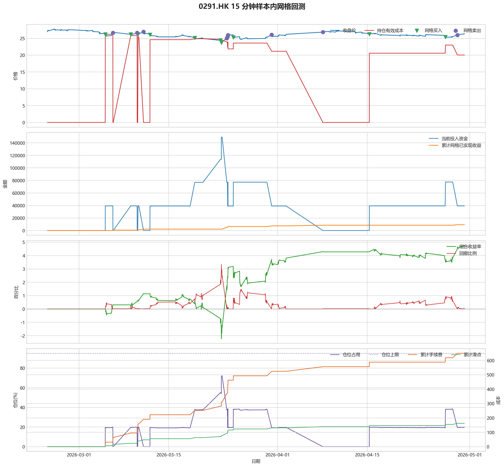
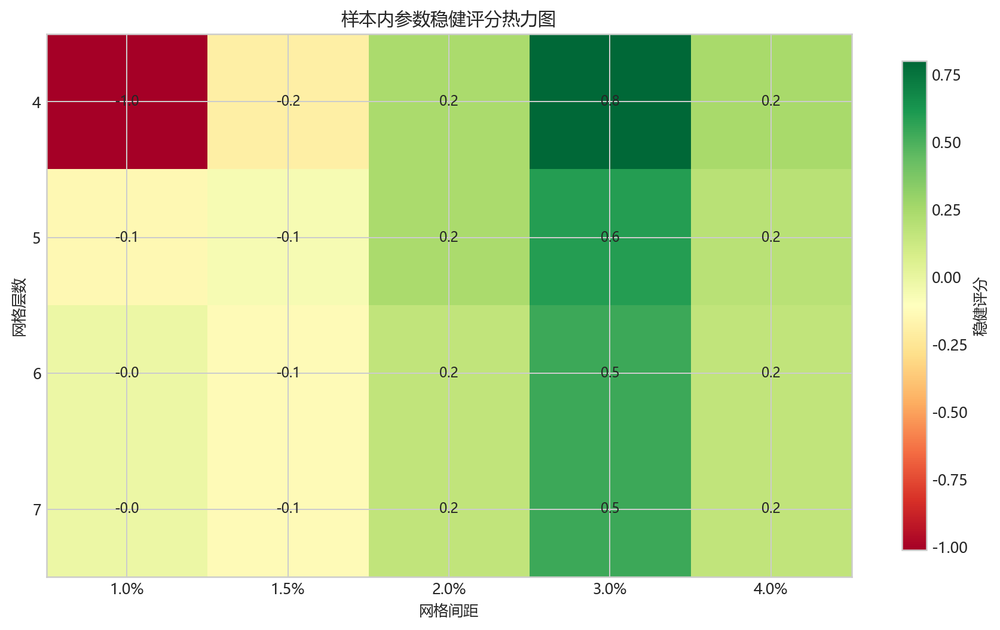
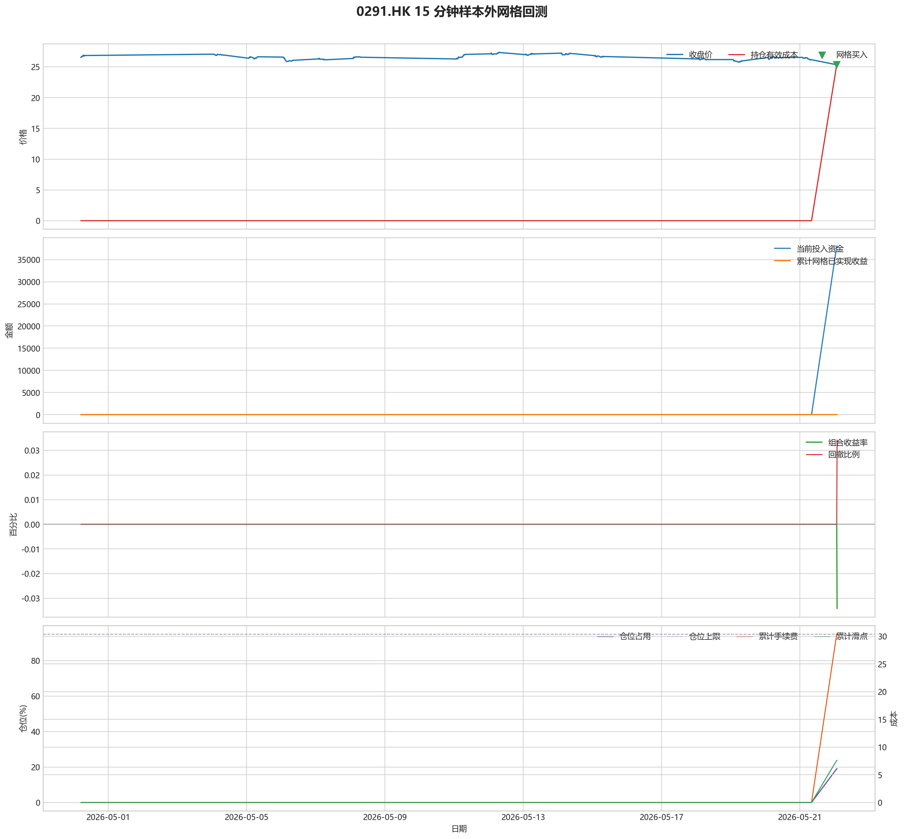

# 0291.HK 网格回测报告

## 摘要

- 标的：`0291.HK`
- 数据周期：Yahoo Finance 最近 60 天 `15m`；下载必须配置代理，Yahoo 失败时流程直接停止
- 样本内窗口：2026-02-24 01:30:00 至 2026-04-30 03:45:00
- 样本外窗口：2026-04-30 05:00:00 至 2026-05-22 01:45:00
- 切分方式：最近分钟线样本按 `75% / 25%` 拆分样本内与样本外
- 网格模式：纯现金网格，不在样本起点建立底仓；第一根 K 线收盘价只作为网格锚点
- 最小交易单位：500 股，来源：AASTOCKS 快照页 Lot Size
- 单层网格固定数量：1500 股
- 左侧处理：`both`，强制退出阈值 `5.00%` 总资金浮亏
- 执行口径：`realistic`，手续费 `8.00` bps，滑点 `2.00` bps
- 最优参数：网格间距 3.00% / 网格层数 4 / 止盈比例 1.50%

这套网格在不同阶段表现不一致，说明它对行情结构比较敏感，不能只看单段结果下结论。

## 第一层：先看结论

### 先回答关键问题

| 问题 | 样本内 | 样本外 | 怎么理解 |
| --- | --- | --- | --- |
| 这套策略能不能赚钱 | 4.76% | -0.03% | 当前还不能证明这套网格能稳定盈利，尤其要继续观察单边下跌时未平仓风险如何处理。 |
| 比现金闲置好不好 | 9524.83 | -68.42 | 正数表示网格策略赚到钱，负数表示不交易反而更好。 |
| 比买入持有好不好 | 14054.27 | 8830.51 | 买入持有用同样资金、交易单位和执行口径估算，正数表示网格更好。 |
| 交易成本高不高 | 649.35 | 30.41 | 这里统计手续费，滑点会单独体现在估算成交价和滑点成本里。 |
| 最坏会亏到什么程度 | 3.33% | 0.03% | 这是账户在样本期间相对阶段高点出现过的最大回撤。 |
| 这组参数稳不稳 | 稳健分 0.80 | 沿用同一组参数 | 不是只看一整段最高分，而是看多窗口表现是否稳定。当前结果：100% 窗口为正，最差窗口收益 `0.62%`，收益波动 `0.39` 个百分点。 |

### 一句话判断

- 这套网格在不同阶段表现不一致，说明它对行情结构比较敏感，不能只看单段结果下结论。
- 当前正式拿去实盘的证据还不够，更合理的定位是：先验证它能否通过网格闭环赚钱，再看左侧行情下能否控制亏损。
- 如果你只想知道现在值不值得继续研究，看完上面这张表就够了。

## 第二层：展开细节

### 参数是怎么选的

| 筛选环节 | 结果 | 你该怎么理解 |
| --- | --- | --- |
| 执行口径 | realistic | 手续费 8.00 bps，滑点 2.00 bps。 |
| 候选组合数 | 80 | 先把候选参数全部跑完，不做随机抽样。 |
| 单窗综合分 | 4.75 | 这是整段样本内的收益、回撤、闭环网格利润综合分。 |
| 稳健窗口数 | 3 | 再把样本内按时间顺序拆成多个连续窗口，检查同一参数会不会只在一小段行情里好看。 |
| 稳健分 RobustScore | 0.80 | 计算方式：0.6 x 窗口平均分 + 0.4 x 最差窗口分 - 0.25 x 窗口收益波动。 |
| 最终入选参数 | 间距 3.00% / 层数 4 / 止盈 1.50% | 优先挑多窗口更稳的组合，而不是只挑单窗最亮的孤点。 |

### 关键结果对照

| 指标 | 样本内 | 样本外 | 怎么读 |
| --- | --- | --- | --- |
| 净收益率 | 4.76% | -0.03% | 已经按当前执行口径扣除回测引擎支持的费用影响。 |
| 最大回撤 | 3.33% | 0.03% | 再看亏起来最难受会到什么程度。 |
| 交易成本 | 649.35 | 30.41 | 策略内部估算的手续费累计值，帮助判断网格频繁交易是否吃掉收益。 |
| 滑点成本 | 162.34 | 7.60 | 按收盘价和估算成交价差额累计，属于近似实盘口径。 |
| 未平网格有效成本 | 20.06 | 25.37 | 只在期末仍有未平网格仓位时有意义。 |
| 闭环网格净利润 | 9277.64 | 0.00 | 这是已经完成低买高卖、真正落袋的利润，不等于总账户收益。 |
| 未平网格浮动盈亏 | 251.01 | -46.05 | hold 口径会保留这部分风险，force_exit 口径触发后通常回到 0。 |
| 网格闭环次数 | 10 | 0 | 次数越多，说明震荡里成交越频繁；但次数多不等于总账户一定赚钱。 |

### 执行口径和风控约束

| 约束 | 样本内 | 样本外 |
| --- | --- | --- |
| 执行口径 | realistic | realistic |
| 网格模式 | cash | cash |
| 左侧处理口径 | both | both |
| 手续费 / 滑点 | 8.00 / 2.00 bps | 8.00 / 2.00 bps |
| 最大仓位占用 | 72.24% / 上限 95.00% | 19.02% / 上限 95.00% |
| 停手事件 | 0 | 0 |
| 强制退出事件 | 0 | 0 |

### 网格到底有没有帮忙

| 对比项 | 样本内 | 样本外 |
| --- | --- | --- |
| 现金闲置收益率 | 0.00% | 0.00% |
| 买入持有收益率 | -2.26% | -4.45% |
| 网格策略收益率 | 4.76% | -0.03% |
| 网格相对现金闲置多赚/多亏 | 9524.83 | -68.42 |
| 网格相对买入持有多赚/多亏 | 14054.27 | 8830.51 |

### 左侧行情怎么处理

| 左侧口径 | 样本内净收益率 | 样本内闭环利润 | 样本内浮动盈亏 | 样本内强平 | 样本外净收益率 | 样本外闭环利润 | 样本外浮动盈亏 | 样本外强平 |
| --- | --- | --- | --- | --- | --- | --- | --- | --- |
| hold：未平网格继续持有 | 4.76% | 9277.64 | 251.01 | 否 | -0.03% | 0.00 | -46.05 | 否 |
| force_exit：达到亏损阈值强平 | 4.76% | 9277.64 | 251.01 | 否 | -0.03% | 0.00 | -46.05 | 否 |

补一句最重要的解释：

- “网格已实现收益”只代表已经完成低买高卖、真正落袋的那部分利润。
- 真正决定你账户最后赚没赚钱的，是“已实现网格收益 + 未平仓网格浮动盈亏 + 现金余额”三者一起的结果。
- 所以完全可能出现“网格已经落袋赚钱，但总账户还是亏钱”的情况。

### 图表速读总结

#### 样本内回测图

- 这一段价格从 `27.06` 走到 `26.44`，区间涨跌幅约 `-2.29%`。
- 样本结束时收盘价 `26.44` 已经回到有效成本 `20.06` 之上，未平网格按当前口径已经转回浮盈区。
- 图里的买卖点一共完成了 `10` 轮网格闭环，已经落袋的网格利润累计 `9277.64`。
- 期末未平网格浮动盈亏为 `251.01`。
- 总账户最终是盈利状态，期末权益 `209524.83`，说明闭环利润、未平仓浮动盈亏和现金余额合计后已经转正。

#### 热力图

- 热力图横轴是网格间距，纵轴是网格层数，颜色越偏绿代表稳健评分越高；每个格子里没有单独画出的止盈比例，已经折叠成该格子的最好结果。
- 当前样本里，最优参数落在“网格间距 `3.00%` / 网格层数 `4` / 止盈比例 `1.50%`”。
- 从前几名结果看，高分区域主要集中在网格间距 `3.00%`、网格层数 `4` 附近。
- 最优点比较集中在网格间距 `3.00%`、网格层数 `4` 附近，说明这组参数不是完全随机撞出来的。

#### 分钟线样本外验证

- 样本外账户最终从 `200000` 走到 `199931.58`，总盈亏 `-68.42`。
- 样本外单层网格按最小交易单位 `500` 股取整，固定数量是 `1500` 股。
- 样本外没有转正，说明这组参数还不能在该行情结构下独立制造稳定盈利。

#### 样本外回测图

- 这一段价格从 `26.52` 走到 `25.36`，区间涨跌幅约 `-4.37%`。
- 样本结束时收盘价 `25.36` 仍低于有效成本 `25.37`，未平网格还处在约 `0.02%` 的浮亏区。
- 这段区间里没有完成任何网格闭环，所以图上即使有持仓波动，也还没有形成已落袋的网格利润。
- 期末未平网格浮动盈亏为 `-46.05`。
- 总账户最终仍是亏损状态，期末权益 `199931.58`；也就是说，已实现网格利润还没完全覆盖未平仓或强制退出带来的亏损。

### 交易记录和明细

如果你只是想判断策略值不值得继续，到这里通常已经够了；下面这些表主要用于追交易过程和排查归因。

### 样本内事件流水

| 时间 | 事件类型 | 层级 | 价格 | 估算成交价 | 数量 | 金额 | 手续费 | 滑点成本 | 说明 |
| --- | --- | --- | --- | --- | --- | --- | --- | --- | --- |
| 2026-03-05 02:15:00 | grid_buy | 1 | 26.20 | 26.21 | 1500 | 39339.31 | 31.45 | 7.86 | 触发下行网格买入 |
| 2026-03-06 06:45:00 | grid_sell | 1 | 26.66 | 26.65 | 1500 | 39950.02 | 31.99 | 8.00 | 达到网格止盈价后卖出本层仓位 |
| 2026-03-09 01:30:00 | grid_buy | 1 | 26.20 | 26.21 | 1500 | 39339.31 | 31.45 | 7.86 | 触发下行网格买入 |
| 2026-03-10 01:45:00 | grid_sell | 1 | 26.64 | 26.63 | 1500 | 39920.05 | 31.96 | 7.99 | 达到网格止盈价后卖出本层仓位 |
| 2026-03-10 05:00:00 | grid_buy | 1 | 26.20 | 26.21 | 1500 | 39339.31 | 31.45 | 7.86 | 触发下行网格买入 |
| 2026-03-11 01:30:00 | grid_sell | 1 | 26.96 | 26.95 | 1500 | 40399.57 | 32.35 | 8.09 | 达到网格止盈价后卖出本层仓位 |
| 2026-03-12 01:45:00 | grid_buy | 1 | 26.10 | 26.11 | 1500 | 39189.16 | 31.33 | 7.83 | 触发下行网格买入 |
| 2026-03-19 01:30:00 | grid_buy | 2 | 25.12 | 25.13 | 1500 | 37717.69 | 30.15 | 7.54 | 触发下行网格买入 |
| 2026-03-23 01:30:00 | grid_buy | 3 | 24.40 | 24.40 | 1500 | 36636.61 | 29.29 | 7.32 | 触发下行网格买入 |
| 2026-03-23 05:15:00 | grid_buy | 4 | 23.74 | 23.74 | 1500 | 35645.62 | 28.49 | 7.12 | 触发下行网格买入 |
| 2026-03-24 01:30:00 | grid_sell | 3 | 25.06 | 25.05 | 1500 | 37552.42 | 30.07 | 7.52 | 达到网格止盈价后卖出本层仓位 |
| 2026-03-24 01:30:00 | grid_sell | 4 | 25.06 | 25.05 | 1500 | 37552.42 | 30.07 | 7.52 | 达到网格止盈价后卖出本层仓位 |
| 2026-03-24 05:00:00 | grid_sell | 2 | 25.56 | 25.55 | 1500 | 38301.67 | 30.67 | 7.67 | 达到网格止盈价后卖出本层仓位 |
| 2026-03-24 05:15:00 | grid_buy | 2 | 25.42 | 25.43 | 1500 | 38168.14 | 30.51 | 7.63 | 触发下行网格买入 |
| 2026-03-24 06:15:00 | grid_sell | 2 | 25.96 | 25.95 | 1500 | 38901.06 | 31.15 | 7.79 | 达到网格止盈价后卖出本层仓位 |
| 2026-03-25 02:00:00 | grid_buy | 2 | 25.32 | 25.33 | 1500 | 38017.99 | 30.39 | 7.60 | 触发下行网格买入 |
| 2026-03-31 01:30:00 | grid_sell | 2 | 26.06 | 26.05 | 1500 | 39050.92 | 31.27 | 7.82 | 达到网格止盈价后卖出本层仓位 |
| 2026-04-08 01:30:00 | grid_sell | 1 | 26.86 | 26.85 | 1500 | 40249.72 | 32.23 | 8.06 | 达到网格止盈价后卖出本层仓位 |
| 2026-04-15 07:45:00 | grid_buy | 1 | 26.22 | 26.23 | 1500 | 39369.34 | 31.47 | 7.87 | 触发下行网格买入 |
| 2026-04-27 05:00:00 | grid_buy | 2 | 25.40 | 25.41 | 1500 | 38138.11 | 30.49 | 7.62 | 触发下行网格买入 |
| 2026-04-29 01:30:00 | grid_sell | 2 | 25.98 | 25.97 | 1500 | 38931.04 | 31.17 | 7.79 | 达到网格止盈价后卖出本层仓位 |

### 样本内成交结果

| 开仓时间 | 平仓时间 | 持有时长 | 开仓价 | 平仓价 | 数量 | 盈亏 | 收益率(%) | 仓位类型 |
| --- | --- | --- | --- | --- | --- | --- | --- | --- |
| 2026-03-05 02:15:00 | 2026-03-06 06:45:00 | 1 days 04:30:00 | 26.21 | 26.66 | 1500 | 618.70 | 1.57 | 网格 1 |
| 2026-03-09 01:30:00 | 2026-03-10 01:45:00 | 1 days 00:15:00 | 26.21 | 26.64 | 1500 | 588.72 | 1.50 | 网格 1 |
| 2026-03-10 05:00:00 | 2026-03-11 01:30:00 | 0 days 20:30:00 | 26.21 | 26.96 | 1500 | 1068.34 | 2.72 | 网格 1 |
| 2026-03-23 05:15:00 | 2026-03-24 01:30:00 | 0 days 20:15:00 | 23.74 | 25.06 | 1500 | 1914.31 | 5.37 | 网格 4 |
| 2026-03-23 01:30:00 | 2026-03-24 01:30:00 | 1 days 00:00:00 | 24.40 | 25.06 | 1500 | 923.32 | 2.52 | 网格 3 |
| 2026-03-19 01:30:00 | 2026-03-24 05:00:00 | 5 days 03:30:00 | 25.13 | 25.56 | 1500 | 591.64 | 1.57 | 网格 2 |
| 2026-03-24 05:15:00 | 2026-03-24 06:15:00 | 0 days 01:00:00 | 25.43 | 25.96 | 1500 | 740.71 | 1.94 | 网格 2 |
| 2026-03-25 02:00:00 | 2026-03-31 01:30:00 | 5 days 23:30:00 | 25.33 | 26.06 | 1500 | 1040.74 | 2.74 | 网格 2 |
| 2026-03-12 01:45:00 | 2026-04-08 01:30:00 | 26 days 23:45:00 | 26.11 | 26.86 | 1500 | 1068.61 | 2.73 | 网格 1 |
| 2026-04-27 05:00:00 | 2026-04-29 01:30:00 | 1 days 20:30:00 | 25.41 | 25.98 | 1500 | 800.72 | 2.10 | 网格 2 |
| 2026-04-15 07:45:00 | 2026-04-30 03:30:00 | 14 days 19:45:00 | 26.23 | 26.38 | 1500 | 169.01 | 0.43 | 网格 1 |

### 样本外事件流水

| 时间 | 事件类型 | 层级 | 价格 | 估算成交价 | 数量 | 金额 | 手续费 | 滑点成本 | 说明 |
| --- | --- | --- | --- | --- | --- | --- | --- | --- | --- |
| 2026-05-22 01:30:00 | grid_buy | 1 | 25.34 | 25.35 | 1500 | 38048.02 | 30.41 | 7.60 | 触发下行网格买入 |

### 样本外成交结果

| 开仓时间 | 平仓时间 | 持有时长 | 开仓价 | 平仓价 | 数量 | 盈亏 | 收益率(%) | 仓位类型 |
| --- | --- | --- | --- | --- | --- | --- | --- | --- |
| 2026-05-22 01:30:00 | 2026-05-22 01:30:00 | 0 days 00:00:00 | 25.35 | 25.34 | 1500 | -68.42 | -0.18 | 网格 1 |

## 最终结论

- 这套参数更适合“先跌一段、再进入震荡或反弹”的行情，因为它依赖反弹来兑现网格利润。
- 如果行情持续单边下跌，hold 口径会继续持有未平网格，force_exit 口径会在浮亏达到阈值后清仓并停止交易。
- 当前样本下，闭环网格净利润：样本内 9277.64，样本外 0.00。
- 这份报告只代表最近 60 天分钟级行情下的短周期表现，不等同于长期日线参数。
