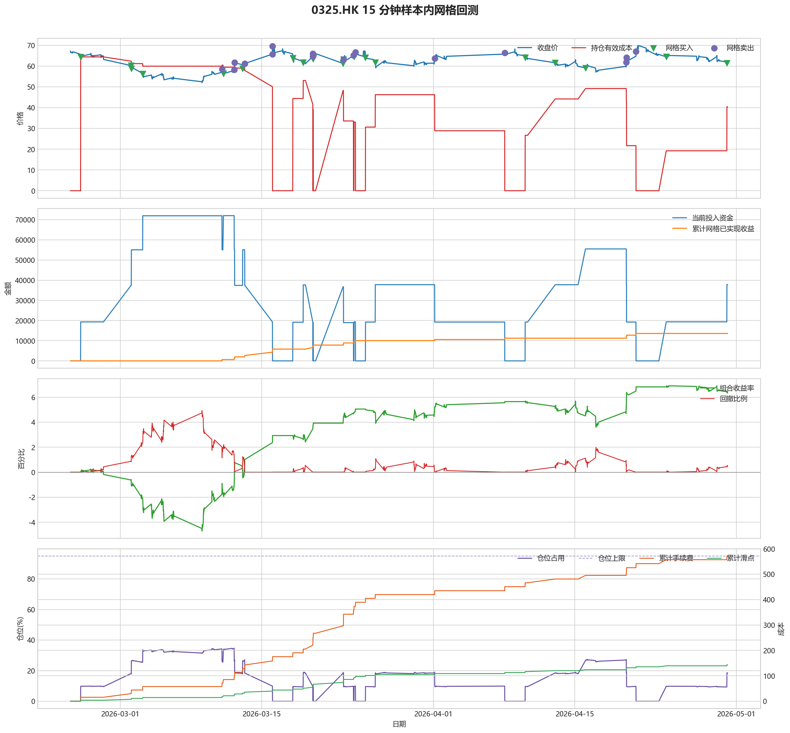
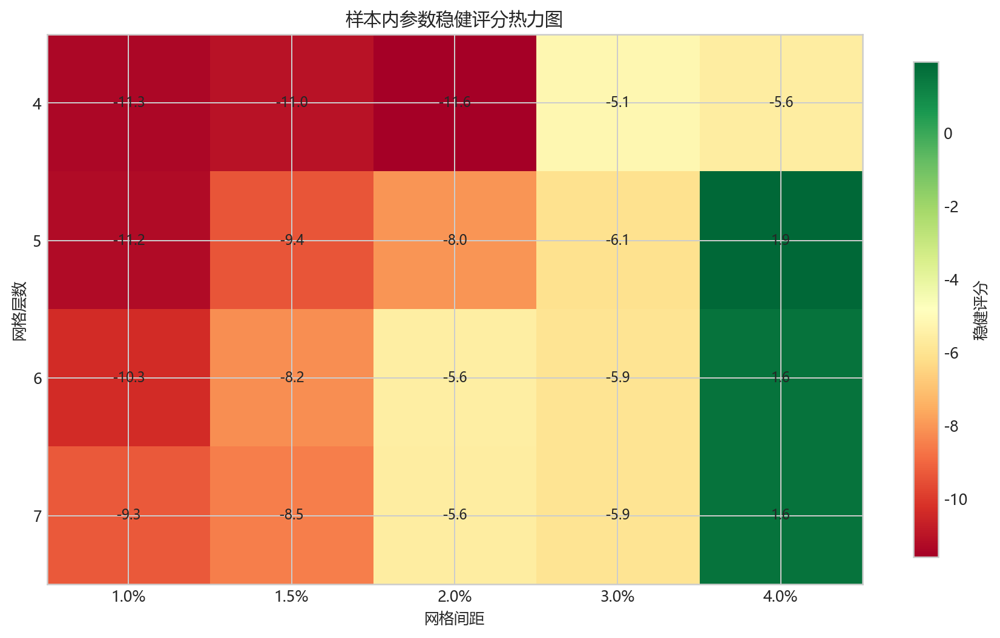
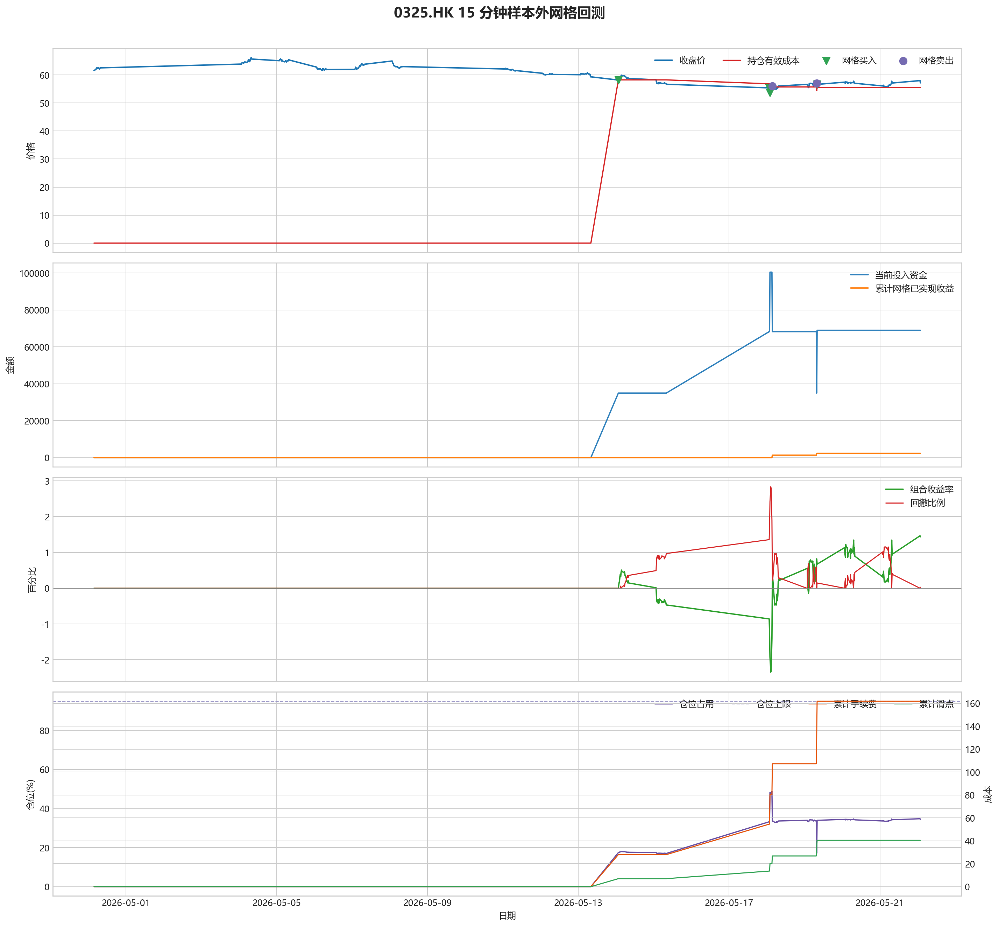

# 0325.HK 网格回测报告

## 摘要

- 标的：`0325.HK`
- 数据周期：Yahoo Finance 最近 60 天 `15m`；下载必须配置代理，Yahoo 失败时流程直接停止
- 样本内窗口：2026-02-24 01:30:00 至 2026-04-30 03:30:00
- 样本外窗口：2026-04-30 03:45:00 至 2026-05-22 01:45:00
- 切分方式：最近分钟线样本按 `75% / 25%` 拆分样本内与样本外
- 网格模式：纯现金网格，不在样本起点建立底仓；第一根 K 线收盘价只作为网格锚点
- 最小交易单位：300 股，来源：AASTOCKS 快照页 Lot Size
- 单层网格固定数量：300 股
- 左侧处理：`both`，强制退出阈值 `5.00%` 总资金浮亏
- 执行口径：`realistic`，手续费 `8.00` bps，滑点 `2.00` bps
- 最优参数：网格间距 4.00% / 网格层数 5 / 止盈比例 3.00%

这套网格在当前样本里样本内外都转正，说明参数具备继续观察的价值。

## 第一层：先看结论

### 先回答关键问题

| 问题 | 样本内 | 样本外 | 怎么理解 |
| --- | --- | --- | --- |
| 这套策略能不能赚钱 | 6.35% | 1.44% | 当前样本内和样本外都为正收益，可以继续观察，但还不能直接等同于稳定实盘盈利。 |
| 比现金闲置好不好 | 12704.88 | 2875.67 | 正数表示网格策略赚到钱，负数表示不交易反而更好。 |
| 比买入持有好不好 | 28546.34 | 16260.49 | 买入持有用同样资金、交易单位和执行口径估算，正数表示网格更好。 |
| 交易成本高不高 | 571.73 | 161.77 | 这里统计手续费，滑点会单独体现在估算成交价和滑点成本里。 |
| 最坏会亏到什么程度 | 4.95% | 2.84% | 这是账户在样本期间相对阶段高点出现过的最大回撤。 |
| 这组参数稳不稳 | 稳健分 1.94 | 沿用同一组参数 | 不是只看一整段最高分，而是看多窗口表现是否稳定。当前结果：100% 窗口为正，最差窗口收益 `2.83%`，收益波动 `0.64` 个百分点。 |

### 一句话判断

- 这套网格在当前样本里样本内外都转正，说明参数具备继续观察的价值。
- 当前正式拿去实盘的证据还不够，更合理的定位是：先验证它能否通过网格闭环赚钱，再看左侧行情下能否控制亏损。
- 如果你只想知道现在值不值得继续研究，看完上面这张表就够了。

## 第二层：展开细节

### 参数是怎么选的

| 筛选环节 | 结果 | 你该怎么理解 |
| --- | --- | --- |
| 执行口径 | realistic | 手续费 8.00 bps，滑点 2.00 bps。 |
| 候选组合数 | 80 | 先把候选参数全部跑完，不做随机抽样。 |
| 单窗综合分 | 6.29 | 这是整段样本内的收益、回撤、闭环网格利润综合分。 |
| 稳健窗口数 | 3 | 再把样本内按时间顺序拆成多个连续窗口，检查同一参数会不会只在一小段行情里好看。 |
| 稳健分 RobustScore | 1.94 | 计算方式：0.6 x 窗口平均分 + 0.4 x 最差窗口分 - 0.25 x 窗口收益波动。 |
| 最终入选参数 | 间距 4.00% / 层数 5 / 止盈 3.00% | 优先挑多窗口更稳的组合，而不是只挑单窗最亮的孤点。 |

### 关键结果对照

| 指标 | 样本内 | 样本外 | 怎么读 |
| --- | --- | --- | --- |
| 净收益率 | 6.35% | 1.44% | 已经按当前执行口径扣除回测引擎支持的费用影响。 |
| 最大回撤 | 4.95% | 2.84% | 再看亏起来最难受会到什么程度。 |
| 交易成本 | 571.73 | 161.77 | 策略内部估算的手续费累计值，帮助判断网格频繁交易是否吃掉收益。 |
| 滑点成本 | 142.93 | 40.44 | 按收盘价和估算成交价差额累计，属于近似实盘口径。 |
| 未平网格有效成本 | 40.39 | 55.57 | 只在期末仍有未平网格仓位时有意义。 |
| 闭环网格净利润 | 13588.13 | 2296.71 | 这是已经完成低买高卖、真正落袋的利润，不等于总账户收益。 |
| 未平网格浮动盈亏 | -1019.62 | -407.55 | hold 口径会保留这部分风险，force_exit 口径触发后通常回到 0。 |
| 网格闭环次数 | 18 | 2 | 次数越多，说明震荡里成交越频繁；但次数多不等于总账户一定赚钱。 |

### 执行口径和风控约束

| 约束 | 样本内 | 样本外 |
| --- | --- | --- |
| 执行口径 | realistic | realistic |
| 网格模式 | cash | cash |
| 左侧处理口径 | both | both |
| 手续费 / 滑点 | 8.00 / 2.00 bps | 8.00 / 2.00 bps |
| 最大仓位占用 | 34.68% / 上限 95.00% | 48.83% / 上限 95.00% |
| 停手事件 | 3 | 0 |
| 强制退出事件 | 0 | 0 |

### 网格到底有没有帮忙

| 对比项 | 样本内 | 样本外 |
| --- | --- | --- |
| 现金闲置收益率 | 0.00% | 0.00% |
| 买入持有收益率 | -7.92% | -6.69% |
| 网格策略收益率 | 6.35% | 1.44% |
| 网格相对现金闲置多赚/多亏 | 12704.88 | 2875.67 |
| 网格相对买入持有多赚/多亏 | 28546.34 | 16260.49 |

### 左侧行情怎么处理

| 左侧口径 | 样本内净收益率 | 样本内闭环利润 | 样本内浮动盈亏 | 样本内强平 | 样本外净收益率 | 样本外闭环利润 | 样本外浮动盈亏 | 样本外强平 |
| --- | --- | --- | --- | --- | --- | --- | --- | --- |
| hold：未平网格继续持有 | 6.35% | 13588.13 | -1019.62 | 否 | 1.44% | 2296.71 | -407.55 | 否 |
| force_exit：达到亏损阈值强平 | 6.35% | 13588.13 | -1019.62 | 否 | 1.44% | 2296.71 | -407.55 | 否 |

补一句最重要的解释：

- “网格已实现收益”只代表已经完成低买高卖、真正落袋的那部分利润。
- 真正决定你账户最后赚没赚钱的，是“已实现网格收益 + 未平仓网格浮动盈亏 + 现金余额”三者一起的结果。
- 所以完全可能出现“网格已经落袋赚钱，但总账户还是亏钱”的情况。

### 图表速读总结

#### 样本内回测图

- 这一段价格从 `67.20` 走到 `61.40`，区间涨跌幅约 `-8.63%`。
- 样本结束时收盘价 `61.40` 已经回到有效成本 `40.39` 之上，未平网格按当前口径已经转回浮盈区。
- 图里的买卖点一共完成了 `18` 轮网格闭环，已经落袋的网格利润累计 `13588.13`。
- 期末未平网格浮动盈亏为 `-1019.62`。
- 总账户最终是盈利状态，期末权益 `212704.88`，说明闭环利润、未平仓浮动盈亏和现金余额合计后已经转正。

#### 热力图

- 热力图横轴是网格间距，纵轴是网格层数，颜色越偏绿代表稳健评分越高；每个格子里没有单独画出的止盈比例，已经折叠成该格子的最好结果。
- 当前样本里，最优参数落在“网格间距 `4.00%` / 网格层数 `5` / 止盈比例 `3.00%`”。
- 从前几名结果看，高分区域主要集中在网格间距 `4.00%`、网格层数 `5` 附近。
- 最优点比较集中在网格间距 `4.00%`、网格层数 `5` 附近，说明这组参数不是完全随机撞出来的。

#### 分钟线样本外验证

- 样本外账户最终从 `200000` 走到 `202875.67`，总盈亏 `2875.67`。
- 样本外单层网格按最小交易单位 `300` 股取整，固定数量是 `600` 股。
- 样本外结果转正，说明这组参数在新阶段没有立刻失效。

#### 样本外回测图

- 这一段价格从 `61.60` 走到 `57.20`，区间涨跌幅约 `-7.14%`。
- 样本结束时收盘价 `57.20` 已经回到有效成本 `55.57` 之上，未平网格按当前口径已经转回浮盈区。
- 图里的买卖点一共完成了 `2` 轮网格闭环，已经落袋的网格利润累计 `2296.71`。
- 期末未平网格浮动盈亏为 `-407.55`。
- 总账户最终是盈利状态，期末权益 `202875.67`，说明闭环利润、未平仓浮动盈亏和现金余额合计后已经转正。

### 交易记录和明细

如果你只是想判断策略值不值得继续，到这里通常已经够了；下面这些表主要用于追交易过程和排查归因。

### 样本内事件流水

| 时间 | 事件类型 | 层级 | 价格 | 估算成交价 | 数量 | 金额 | 手续费 | 滑点成本 | 说明 |
| --- | --- | --- | --- | --- | --- | --- | --- | --- | --- |
| 2026-02-25 01:45:00 | grid_buy | 1 | 64.35 | 64.36 | 300 | 19324.31 | 15.45 | 3.86 | 触发下行网格买入 |
| 2026-03-02 01:30:00 | grid_buy | 2 | 60.25 | 60.26 | 300 | 18093.08 | 14.46 | 3.62 | 触发下行网格买入 |
| 2026-03-02 02:15:00 | grid_buy | 3 | 58.75 | 58.76 | 300 | 17642.63 | 14.10 | 3.52 | 触发下行网格买入 |
| 2026-03-03 05:15:00 | grid_buy | 4 | 56.20 | 56.21 | 300 | 16876.86 | 13.49 | 3.37 | 触发下行网格买入 |
| 2026-03-05 07:45:00 | risk_stop_loss | 0 | 53.40 | 53.40 | 0 | 0.00 | 0.00 | 0.00 | 价格跌破锚定停手线 53.76，暂停新增网格 |
| 2026-03-05 08:00:00 | risk_cooldown | 0 | 53.40 | 53.40 | 0 | 0.00 | 0.00 | 0.00 | 停手机制冷却中，剩余 4 根 K 线 |
| 2026-03-06 01:30:00 | risk_cooldown | 0 | 54.25 | 54.25 | 0 | 0.00 | 0.00 | 0.00 | 停手机制冷却中，剩余 3 根 K 线 |
| 2026-03-06 01:45:00 | risk_cooldown | 0 | 54.25 | 54.25 | 0 | 0.00 | 0.00 | 0.00 | 停手机制冷却中，剩余 2 根 K 线 |
| 2026-03-06 02:00:00 | risk_cooldown | 0 | 54.00 | 54.00 | 0 | 0.00 | 0.00 | 0.00 | 停手机制冷却中，剩余 1 根 K 线 |
| 2026-03-06 05:15:00 | risk_stop_loss | 0 | 53.65 | 53.65 | 0 | 0.00 | 0.00 | 0.00 | 价格跌破锚定停手线 53.76，暂停新增网格 |
| 2026-03-06 05:30:00 | risk_cooldown | 0 | 54.65 | 54.65 | 0 | 0.00 | 0.00 | 0.00 | 停手机制冷却中，剩余 4 根 K 线 |
| 2026-03-06 05:45:00 | risk_cooldown | 0 | 54.45 | 54.45 | 0 | 0.00 | 0.00 | 0.00 | 停手机制冷却中，剩余 3 根 K 线 |
| 2026-03-06 06:00:00 | risk_cooldown | 0 | 54.75 | 54.75 | 0 | 0.00 | 0.00 | 0.00 | 停手机制冷却中，剩余 2 根 K 线 |
| 2026-03-06 06:15:00 | risk_cooldown | 0 | 54.50 | 54.50 | 0 | 0.00 | 0.00 | 0.00 | 停手机制冷却中，剩余 1 根 K 线 |
| 2026-03-09 01:30:00 | risk_stop_loss | 0 | 52.45 | 52.45 | 0 | 0.00 | 0.00 | 0.00 | 价格跌破锚定停手线 53.76，暂停新增网格 |
| 2026-03-09 01:45:00 | risk_cooldown | 0 | 52.25 | 52.25 | 0 | 0.00 | 0.00 | 0.00 | 停手机制冷却中，剩余 4 根 K 线 |
| 2026-03-09 02:00:00 | risk_cooldown | 0 | 52.45 | 52.45 | 0 | 0.00 | 0.00 | 0.00 | 停手机制冷却中，剩余 3 根 K 线 |
| 2026-03-09 02:15:00 | risk_cooldown | 0 | 52.10 | 52.10 | 0 | 0.00 | 0.00 | 0.00 | 停手机制冷却中，剩余 2 根 K 线 |
| 2026-03-09 02:30:00 | risk_cooldown | 0 | 52.45 | 52.45 | 0 | 0.00 | 0.00 | 0.00 | 停手机制冷却中，剩余 1 根 K 线 |
| 2026-03-11 01:45:00 | grid_sell | 4 | 58.45 | 58.44 | 300 | 17517.47 | 14.03 | 3.51 | 达到网格止盈价后卖出本层仓位 |
| 2026-03-11 05:00:00 | grid_buy | 4 | 56.40 | 56.41 | 300 | 16936.92 | 13.54 | 3.38 | 触发下行网格买入 |
| 2026-03-12 06:45:00 | grid_sell | 4 | 58.20 | 58.19 | 300 | 17442.54 | 13.97 | 3.49 | 达到网格止盈价后卖出本层仓位 |
| 2026-03-12 07:45:00 | grid_sell | 3 | 61.70 | 61.69 | 300 | 18491.49 | 14.81 | 3.70 | 达到网格止盈价后卖出本层仓位 |
| 2026-03-13 02:45:00 | grid_buy | 3 | 58.75 | 58.76 | 300 | 17642.63 | 14.10 | 3.52 | 触发下行网格买入 |
| 2026-03-13 07:45:00 | grid_sell | 3 | 61.20 | 61.19 | 300 | 18341.64 | 14.69 | 3.67 | 达到网格止盈价后卖出本层仓位 |
| 2026-03-16 01:30:00 | grid_sell | 2 | 65.75 | 65.74 | 300 | 19705.28 | 15.78 | 3.94 | 达到网格止盈价后卖出本层仓位 |
| 2026-03-16 01:45:00 | grid_sell | 1 | 69.60 | 69.59 | 300 | 20859.12 | 16.70 | 4.18 | 达到网格止盈价后卖出本层仓位 |
| 2026-03-18 02:00:00 | grid_buy | 1 | 63.80 | 63.81 | 300 | 19159.14 | 15.32 | 3.83 | 触发下行网格买入 |
| 2026-03-19 02:45:00 | grid_buy | 2 | 61.65 | 61.66 | 300 | 18513.50 | 14.80 | 3.70 | 触发下行网格买入 |
| 2026-03-20 01:30:00 | grid_sell | 2 | 64.60 | 64.59 | 300 | 19360.62 | 15.50 | 3.88 | 达到网格止盈价后卖出本层仓位 |
| 2026-03-20 01:45:00 | grid_sell | 1 | 65.90 | 65.89 | 300 | 19750.23 | 15.81 | 3.95 | 达到网格止盈价后卖出本层仓位 |
| 2026-03-20 02:00:00 | grid_buy | 1 | 63.40 | 63.41 | 300 | 19039.02 | 15.22 | 3.80 | 触发下行网格买入 |
| 2026-03-20 02:45:00 | grid_sell | 1 | 65.35 | 65.34 | 300 | 19585.40 | 15.68 | 3.92 | 达到网格止盈价后卖出本层仓位 |
| 2026-03-23 01:30:00 | grid_buy | 1 | 61.25 | 61.26 | 300 | 18393.38 | 14.70 | 3.68 | 触发下行网格买入 |
| 2026-03-23 01:30:00 | grid_buy | 2 | 61.25 | 61.26 | 300 | 18393.38 | 14.70 | 3.68 | 触发下行网格买入 |
| 2026-03-23 02:30:00 | grid_sell | 1 | 63.15 | 63.14 | 300 | 18926.06 | 15.15 | 3.79 | 达到网格止盈价后卖出本层仓位 |
| 2026-03-23 02:30:00 | grid_sell | 2 | 63.15 | 63.14 | 300 | 18926.06 | 15.15 | 3.79 | 达到网格止盈价后卖出本层仓位 |
| 2026-03-23 02:30:00 | grid_buy | 1 | 63.15 | 63.16 | 300 | 18963.95 | 15.16 | 3.79 | 触发下行网格买入 |
| 2026-03-24 02:15:00 | grid_sell | 1 | 65.15 | 65.14 | 300 | 19525.46 | 15.63 | 3.91 | 达到网格止盈价后卖出本层仓位 |
| 2026-03-24 03:30:00 | grid_buy | 1 | 64.50 | 64.51 | 300 | 19369.35 | 15.48 | 3.87 | 触发下行网格买入 |
| 2026-03-24 07:00:00 | grid_sell | 1 | 66.65 | 66.64 | 300 | 19975.01 | 15.99 | 4.00 | 达到网格止盈价后卖出本层仓位 |
| 2026-03-25 06:45:00 | grid_buy | 1 | 64.10 | 64.11 | 300 | 19249.23 | 15.39 | 3.85 | 触发下行网格买入 |
| 2026-03-26 06:00:00 | grid_buy | 2 | 61.75 | 61.76 | 300 | 18543.53 | 14.82 | 3.70 | 触发下行网格买入 |
| 2026-04-01 03:15:00 | grid_sell | 2 | 63.65 | 63.64 | 300 | 19075.91 | 15.27 | 3.82 | 达到网格止盈价后卖出本层仓位 |
| 2026-04-08 01:45:00 | grid_sell | 1 | 66.40 | 66.39 | 300 | 19900.08 | 15.93 | 3.98 | 达到网格止盈价后卖出本层仓位 |
| 2026-04-10 02:15:00 | grid_buy | 1 | 64.10 | 64.11 | 300 | 19249.23 | 15.39 | 3.85 | 触发下行网格买入 |
| 2026-04-13 01:30:00 | grid_buy | 2 | 61.60 | 61.61 | 300 | 18498.48 | 14.79 | 3.70 | 触发下行网格买入 |
| 2026-04-16 01:30:00 | grid_buy | 3 | 59.10 | 59.11 | 300 | 17747.73 | 14.19 | 3.55 | 触发下行网格买入 |
| 2026-04-20 02:45:00 | grid_sell | 3 | 61.90 | 61.89 | 300 | 18551.43 | 14.85 | 3.71 | 达到网格止盈价后卖出本层仓位 |
| 2026-04-20 03:15:00 | grid_sell | 2 | 64.05 | 64.04 | 300 | 19195.79 | 15.37 | 3.84 | 达到网格止盈价后卖出本层仓位 |
| 2026-04-21 01:45:00 | grid_sell | 1 | 67.05 | 67.04 | 300 | 20094.89 | 16.09 | 4.02 | 达到网格止盈价后卖出本层仓位 |
| 2026-04-24 01:30:00 | grid_buy | 1 | 64.45 | 64.46 | 300 | 19354.34 | 15.47 | 3.87 | 触发下行网格买入 |
| 2026-04-30 01:45:00 | grid_buy | 2 | 61.50 | 61.51 | 300 | 18468.45 | 14.76 | 3.69 | 触发下行网格买入 |

### 样本内成交结果

| 开仓时间 | 平仓时间 | 持有时长 | 开仓价 | 平仓价 | 数量 | 盈亏 | 收益率(%) | 仓位类型 |
| --- | --- | --- | --- | --- | --- | --- | --- | --- |
| 2026-03-03 05:15:00 | 2026-03-11 01:45:00 | 7 days 20:30:00 | 56.21 | 58.45 | 300 | 644.11 | 3.82 | 网格 4 |
| 2026-03-11 05:00:00 | 2026-03-12 06:45:00 | 1 days 01:45:00 | 56.41 | 58.20 | 300 | 509.11 | 3.01 | 网格 4 |
| 2026-03-02 02:15:00 | 2026-03-12 07:45:00 | 10 days 05:30:00 | 58.76 | 61.70 | 300 | 852.56 | 4.84 | 网格 3 |
| 2026-03-13 02:45:00 | 2026-03-13 07:45:00 | 0 days 05:00:00 | 58.76 | 61.20 | 300 | 702.68 | 3.99 | 网格 3 |
| 2026-03-02 01:30:00 | 2026-03-16 01:30:00 | 14 days 00:00:00 | 60.26 | 65.75 | 300 | 1616.14 | 8.94 | 网格 2 |
| 2026-02-25 01:45:00 | 2026-03-16 01:45:00 | 19 days 00:00:00 | 64.36 | 69.60 | 300 | 1538.99 | 7.97 | 网格 1 |
| 2026-03-19 02:45:00 | 2026-03-20 01:30:00 | 0 days 22:45:00 | 61.66 | 64.60 | 300 | 851.00 | 4.60 | 网格 2 |
| 2026-03-18 02:00:00 | 2026-03-20 01:45:00 | 1 days 23:45:00 | 63.81 | 65.90 | 300 | 595.04 | 3.11 | 网格 1 |
| 2026-03-20 02:00:00 | 2026-03-20 02:45:00 | 0 days 00:45:00 | 63.41 | 65.35 | 300 | 550.29 | 2.89 | 网格 1 |
| 2026-03-23 01:30:00 | 2026-03-23 02:30:00 | 0 days 01:00:00 | 61.26 | 63.15 | 300 | 536.47 | 2.92 | 网格 2 |
| 2026-03-23 01:30:00 | 2026-03-23 02:30:00 | 0 days 01:00:00 | 61.26 | 63.15 | 300 | 536.47 | 2.92 | 网格 1 |
| 2026-03-23 02:30:00 | 2026-03-24 02:15:00 | 0 days 23:45:00 | 63.16 | 65.15 | 300 | 565.42 | 2.98 | 网格 1 |
| 2026-03-24 03:30:00 | 2026-03-24 07:00:00 | 0 days 03:30:00 | 64.51 | 66.65 | 300 | 609.65 | 3.15 | 网格 1 |
| 2026-03-26 06:00:00 | 2026-04-01 03:15:00 | 5 days 21:15:00 | 61.76 | 63.65 | 300 | 536.20 | 2.89 | 网格 2 |
| 2026-03-25 06:45:00 | 2026-04-08 01:45:00 | 13 days 19:00:00 | 64.11 | 66.40 | 300 | 654.83 | 3.40 | 网格 1 |
| 2026-04-16 01:30:00 | 2026-04-20 02:45:00 | 4 days 01:15:00 | 59.11 | 61.90 | 300 | 807.41 | 4.55 | 网格 3 |
| 2026-04-13 01:30:00 | 2026-04-20 03:15:00 | 7 days 01:45:00 | 61.61 | 64.05 | 300 | 701.15 | 3.79 | 网格 2 |
| 2026-04-10 02:15:00 | 2026-04-21 01:45:00 | 10 days 23:30:00 | 64.11 | 67.05 | 300 | 849.68 | 4.42 | 网格 1 |
| 2026-04-24 01:30:00 | 2026-04-30 03:15:00 | 6 days 01:45:00 | 64.46 | 61.50 | 300 | -919.10 | -4.75 | 网格 1 |
| 2026-04-30 01:45:00 | 2026-04-30 03:15:00 | 0 days 01:30:00 | 61.51 | 61.50 | 300 | -33.21 | -0.18 | 网格 2 |

### 样本外事件流水

| 时间 | 事件类型 | 层级 | 价格 | 估算成交价 | 数量 | 金额 | 手续费 | 滑点成本 | 说明 |
| --- | --- | --- | --- | --- | --- | --- | --- | --- | --- |
| 2026-05-14 01:30:00 | grid_buy | 1 | 58.20 | 58.21 | 600 | 34954.93 | 27.94 | 6.98 | 触发下行网格买入 |
| 2026-05-18 01:30:00 | grid_buy | 2 | 55.40 | 55.41 | 600 | 33273.25 | 26.60 | 6.65 | 触发下行网格买入 |
| 2026-05-18 02:00:00 | grid_buy | 3 | 53.65 | 53.66 | 600 | 32222.20 | 25.76 | 6.44 | 触发下行网格买入 |
| 2026-05-18 03:30:00 | grid_sell | 3 | 56.00 | 55.99 | 600 | 33566.41 | 26.87 | 6.72 | 达到网格止盈价后卖出本层仓位 |
| 2026-05-19 07:45:00 | grid_sell | 2 | 57.10 | 57.09 | 600 | 34225.74 | 27.40 | 6.85 | 达到网格止盈价后卖出本层仓位 |
| 2026-05-19 08:00:00 | grid_buy | 2 | 56.65 | 56.66 | 600 | 34024.00 | 27.20 | 6.80 | 触发下行网格买入 |

### 样本外成交结果

| 开仓时间 | 平仓时间 | 持有时长 | 开仓价 | 平仓价 | 数量 | 盈亏 | 收益率(%) | 仓位类型 |
| --- | --- | --- | --- | --- | --- | --- | --- | --- |
| 2026-05-18 02:00:00 | 2026-05-18 03:30:00 | 0 days 01:30:00 | 53.66 | 56.00 | 600 | 1350.92 | 4.20 | 网格 3 |
| 2026-05-18 01:30:00 | 2026-05-19 07:45:00 | 1 days 06:15:00 | 55.41 | 57.10 | 600 | 959.34 | 2.89 | 网格 2 |
| 2026-05-14 01:30:00 | 2026-05-22 01:30:00 | 8 days 00:00:00 | 58.21 | 58.00 | 600 | -182.77 | -0.52 | 网格 1 |
| 2026-05-19 08:00:00 | 2026-05-22 01:30:00 | 2 days 17:30:00 | 56.66 | 58.00 | 600 | 748.16 | 2.20 | 网格 2 |

## 最终结论

- 这套参数更适合“先跌一段、再进入震荡或反弹”的行情，因为它依赖反弹来兑现网格利润。
- 如果行情持续单边下跌，hold 口径会继续持有未平网格，force_exit 口径会在浮亏达到阈值后清仓并停止交易。
- 当前样本下，闭环网格净利润：样本内 13588.13，样本外 2296.71。
- 这份报告只代表最近 60 天分钟级行情下的短周期表现，不等同于长期日线参数。
