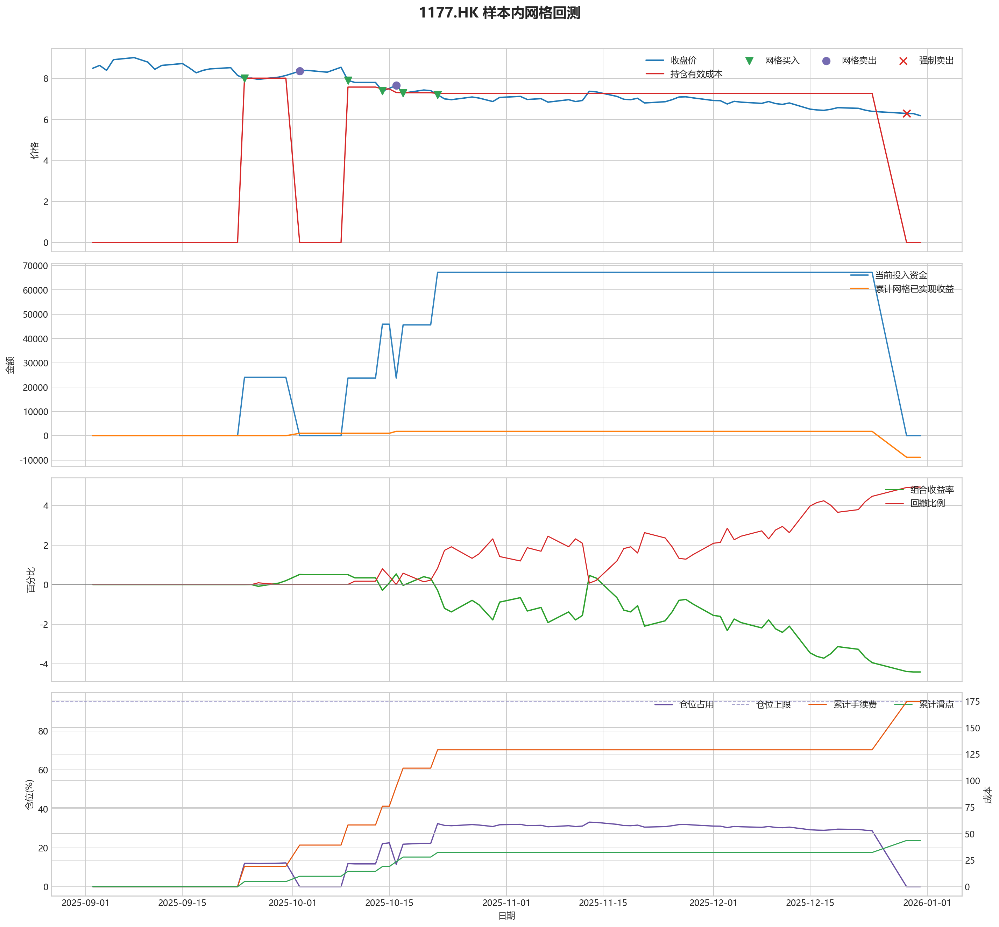
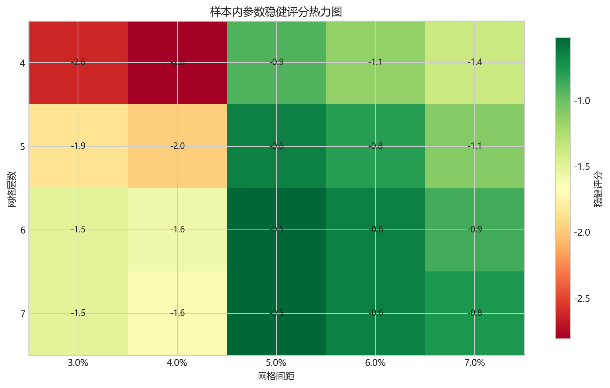
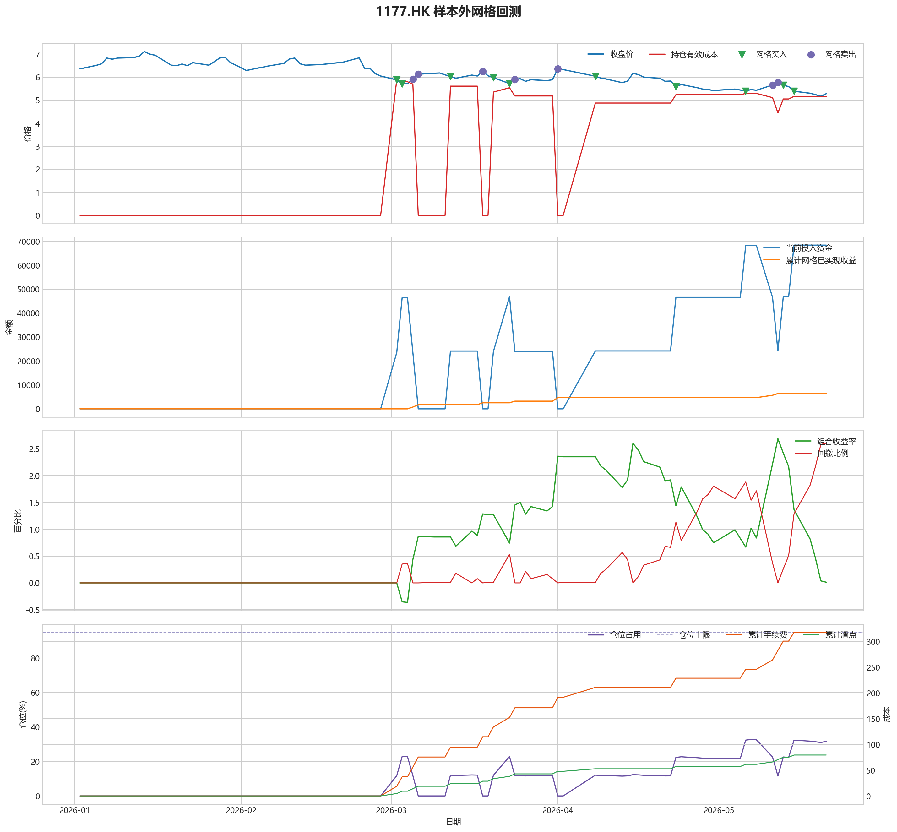

# 1177.HK 网格回测报告

## 摘要

- 标的：`1177.HK`
- 样本内窗口：2025-09-02 至 2025-12-31
- 样本外窗口：2026-01-01 至 2026-05-21
- 网格模式：纯现金网格，不在样本起点建立底仓；第一根 K 线收盘价只作为网格锚点
- 最小交易单位：1000 股，来源：AASTOCKS 快照页 Lot Size
- 单层网格固定数量：3000 股
- 左侧处理：`both`，强制退出阈值 `5.00%` 总资金浮亏
- 执行口径：`realistic`，手续费 `8.00` bps，滑点 `2.00` bps
- 最优参数：网格间距 5.00% / 网格层数 7 / 止盈比例 3.00%

这套网格在不同阶段表现不一致，说明它对行情结构比较敏感，不能只看单段结果下结论。

## 第一层：先看结论

### 先回答关键问题

| 问题 | 样本内 | 样本外 | 怎么理解 |
| --- | --- | --- | --- |
| 这套策略能不能赚钱 | -4.42% | 0.01% | 样本外已经转正，但样本内没有稳定赚钱，暂时只能说参数在新阶段有改善，不能证明长期稳定盈利。 |
| 比现金闲置好不好 | -8837.01 | 26.40 | 正数表示网格策略赚到钱，负数表示不交易反而更好。 |
| 比买入持有好不好 | 44488.29 | 33703.59 | 买入持有用同样资金、交易单位和执行口径估算，正数表示网格更好。 |
| 交易成本高不高 | 174.34 | 318.03 | 这里统计手续费，滑点会单独体现在估算成交价和滑点成本里。 |
| 最坏会亏到什么程度 | 4.93% | 2.61% | 这是账户在样本期间相对阶段高点出现过的最大回撤。 |
| 这组参数稳不稳 | 稳健分 -0.52 | 沿用同一组参数 | 不是只看一整段最高分，而是看多窗口表现是否稳定。当前结果：67% 窗口为正，最差窗口收益 `-0.51%`，收益波动 `0.46` 个百分点。 |

### 一句话判断

- 这套网格在不同阶段表现不一致，说明它对行情结构比较敏感，不能只看单段结果下结论。
- 当前正式拿去实盘的证据还不够，更合理的定位是：先验证它能否通过网格闭环赚钱，再看左侧行情下能否控制亏损。
- 如果你只想知道现在值不值得继续研究，看完上面这张表就够了。

## 第二层：展开细节

### 参数是怎么选的

| 筛选环节 | 结果 | 你该怎么理解 |
| --- | --- | --- |
| 执行口径 | realistic | 手续费 8.00 bps，滑点 2.00 bps。 |
| 候选组合数 | 60 | 先把候选参数全部跑完，不做随机抽样。 |
| 单窗综合分 | -10.09 | 这是整段样本内的收益、回撤、闭环网格利润综合分。 |
| 稳健窗口数 | 3 | 再把样本内按时间顺序拆成多个连续窗口，检查同一参数会不会只在一小段行情里好看。 |
| 稳健分 RobustScore | -0.52 | 计算方式：0.6 x 窗口平均分 + 0.4 x 最差窗口分 - 0.25 x 窗口收益波动。 |
| 最终入选参数 | 间距 5.00% / 层数 7 / 止盈 3.00% | 优先挑多窗口更稳的组合，而不是只挑单窗最亮的孤点。 |

### 关键结果对照

| 指标 | 样本内 | 样本外 | 怎么读 |
| --- | --- | --- | --- |
| 净收益率 | -4.42% | 0.01% | 已经按当前执行口径扣除回测引擎支持的费用影响。 |
| 最大回撤 | 4.93% | 2.61% | 再看亏起来最难受会到什么程度。 |
| 交易成本 | 174.34 | 318.03 | 策略内部估算的手续费累计值，帮助判断网格频繁交易是否吃掉收益。 |
| 滑点成本 | 43.58 | 79.50 | 按收盘价和估算成交价差额累计，属于近似实盘口径。 |
| 未平网格有效成本 | 0.00 | 5.17 | 只在期末仍有未平网格仓位时有意义。 |
| 闭环网格净利润 | -8857.92 | 6390.80 | 这是已经完成低买高卖、真正落袋的利润，不等于总账户收益。 |
| 未平网格浮动盈亏 | 0.00 | -5091.68 | hold 口径会保留这部分风险，force_exit 口径触发后通常回到 0。 |
| 网格闭环次数 | 2 | 7 | 次数越多，说明震荡里成交越频繁；但次数多不等于总账户一定赚钱。 |

### 执行口径和风控约束

| 约束 | 样本内 | 样本外 |
| --- | --- | --- |
| 执行口径 | realistic | realistic |
| 网格模式 | cash | cash |
| 左侧处理口径 | both | both |
| 手续费 / 滑点 | 8.00 / 2.00 bps | 8.00 / 2.00 bps |
| 最大仓位占用 | 33.16% / 上限 95.00% | 32.76% / 上限 95.00% |
| 停手事件 | 2 | 0 |
| 强制退出事件 | 3 | 0 |

### 网格到底有没有帮忙

| 对比项 | 样本内 | 样本外 |
| --- | --- | --- |
| 现金闲置收益率 | 0.00% | 0.00% |
| 买入持有收益率 | -26.66% | -16.84% |
| 网格策略收益率 | -4.42% | 0.01% |
| 网格相对现金闲置多赚/多亏 | -8837.01 | 26.40 |
| 网格相对买入持有多赚/多亏 | 44488.29 | 33703.59 |

### 左侧行情怎么处理

| 左侧口径 | 样本内净收益率 | 样本内闭环利润 | 样本内浮动盈亏 | 样本内强平 | 样本外净收益率 | 样本外闭环利润 | 样本外浮动盈亏 | 样本外强平 |
| --- | --- | --- | --- | --- | --- | --- | --- | --- |
| hold：未平网格继续持有 | -4.46% | 1795.83 | -11642.76 | 否 | 0.01% | 6390.80 | -5091.68 | 否 |
| force_exit：达到亏损阈值强平 | -4.42% | -8857.92 | 0.00 | 是 | 0.01% | 6390.80 | -5091.68 | 否 |

补一句最重要的解释：

- “网格已实现收益”只代表已经完成低买高卖、真正落袋的那部分利润。
- 真正决定你账户最后赚没赚钱的，是“已实现网格收益 + 未平仓网格浮动盈亏 + 现金余额”三者一起的结果。
- 所以完全可能出现“网格已经落袋赚钱，但总账户还是亏钱”的情况。

### 图表速读总结

#### 样本内回测图

- 这一段价格从 `8.49` 走到 `6.18`，区间涨跌幅约 `-27.21%`。
- 样本结束时没有未平网格仓位，剩余风险已经体现在现金和已实现利润里。
- 图里的买卖点一共完成了 `2` 轮网格闭环，已经落袋的网格利润累计 `-8857.92`。
- 左侧强制退出已经触发，后续不再继续开新网格。
- 总账户最终仍是亏损状态，期末权益 `191162.99`；也就是说，已实现网格利润还没完全覆盖未平仓或强制退出带来的亏损。

#### 热力图

- 热力图横轴是网格间距，纵轴是网格层数，颜色越偏绿代表稳健评分越高；每个格子里没有单独画出的止盈比例，已经折叠成该格子的最好结果。
- 当前样本里，最优参数落在“网格间距 `5.00%` / 网格层数 `7` / 止盈比例 `3.00%`”。
- 从前几名结果看，高分区域主要集中在网格间距 `5.00%`、网格层数 `6` 附近。
- 最优点比较集中在网格间距 `5.00%`、网格层数 `7` 附近，说明这组参数不是完全随机撞出来的。

#### 2026 样本外验证

- 样本外账户最终从 `200000` 走到 `200026.40`，总盈亏 `26.40`。
- 样本外单层网格按最小交易单位 `1000` 股取整，固定数量是 `4000` 股。
- 样本外结果转正，说明这组参数在新阶段没有立刻失效。

#### 样本外回测图

- 这一段价格从 `6.36` 走到 `5.28`，区间涨跌幅约 `-16.98%`。
- 样本结束时收盘价 `5.28` 已经回到有效成本 `5.17` 之上，未平网格按当前口径已经转回浮盈区。
- 图里的买卖点一共完成了 `7` 轮网格闭环，已经落袋的网格利润累计 `6390.80`。
- 期末未平网格浮动盈亏为 `-5091.68`。
- 总账户最终是盈利状态，期末权益 `200026.40`，说明闭环利润、未平仓浮动盈亏和现金余额合计后已经转正。

### 交易记录和明细

如果你只是想判断策略值不值得继续，到这里通常已经够了；下面这些表主要用于追交易过程和排查归因。

### 样本内事件流水

| 时间 | 事件类型 | 层级 | 价格 | 估算成交价 | 数量 | 金额 | 手续费 | 滑点成本 | 说明 |
| --- | --- | --- | --- | --- | --- | --- | --- | --- | --- |
| 2025-09-24 | grid_buy | 1 | 8.00 | 8.00 | 3000 | 24024.00 | 19.20 | 4.80 | 触发下行网格买入 |
| 2025-10-02 | grid_sell | 1 | 8.35 | 8.35 | 3000 | 25024.96 | 20.04 | 5.01 | 达到网格止盈价后卖出本层仓位 |
| 2025-10-09 | grid_buy | 1 | 7.90 | 7.90 | 3000 | 23723.70 | 18.96 | 4.74 | 触发下行网格买入 |
| 2025-10-14 | grid_buy | 2 | 7.38 | 7.38 | 3000 | 22162.14 | 17.72 | 4.43 | 触发下行网格买入 |
| 2025-10-16 | grid_sell | 2 | 7.66 | 7.66 | 3000 | 22957.02 | 18.38 | 4.60 | 达到网格止盈价后卖出本层仓位 |
| 2025-10-17 | grid_buy | 2 | 7.28 | 7.28 | 3000 | 21861.84 | 17.48 | 4.37 | 触发下行网格买入 |
| 2025-10-22 | grid_buy | 3 | 7.20 | 7.20 | 3000 | 21621.60 | 17.28 | 4.32 | 触发下行网格买入 |
| 2025-12-03 | risk_stop_loss | 0 | 6.75 | 6.75 | 0 | 0.00 | 0.00 | 0.00 | 价格跌破锚定停手线 6.79，暂停新增网格 |
| 2025-12-04 | risk_cooldown | 0 | 6.88 | 6.88 | 0 | 0.00 | 0.00 | 0.00 | 停手机制冷却中，剩余 4 根 K 线 |
| 2025-12-05 | risk_cooldown | 0 | 6.84 | 6.84 | 0 | 0.00 | 0.00 | 0.00 | 停手机制冷却中，剩余 3 根 K 线 |
| 2025-12-08 | risk_cooldown | 0 | 6.78 | 6.78 | 0 | 0.00 | 0.00 | 0.00 | 停手机制冷却中，剩余 2 根 K 线 |
| 2025-12-09 | risk_cooldown | 0 | 6.87 | 6.87 | 0 | 0.00 | 0.00 | 0.00 | 停手机制冷却中，剩余 1 根 K 线 |
| 2025-12-15 | risk_stop_loss | 0 | 6.50 | 6.50 | 0 | 0.00 | 0.00 | 0.00 | 价格跌破锚定停手线 6.79，暂停新增网格 |
| 2025-12-16 | risk_cooldown | 0 | 6.46 | 6.46 | 0 | 0.00 | 0.00 | 0.00 | 停手机制冷却中，剩余 4 根 K 线 |
| 2025-12-17 | risk_cooldown | 0 | 6.44 | 6.44 | 0 | 0.00 | 0.00 | 0.00 | 停手机制冷却中，剩余 3 根 K 线 |
| 2025-12-18 | risk_cooldown | 0 | 6.49 | 6.49 | 0 | 0.00 | 0.00 | 0.00 | 停手机制冷却中，剩余 2 根 K 线 |
| 2025-12-19 | risk_cooldown | 0 | 6.57 | 6.57 | 0 | 0.00 | 0.00 | 0.00 | 停手机制冷却中，剩余 1 根 K 线 |
| 2025-12-29 | force_exit_sell | 1 | 6.29 | 6.29 | 3000 | 18851.13 | 15.09 | 3.77 | 未平网格浮亏达到总资金 5.00% 阈值，强制卖出本层仓位 |
| 2025-12-29 | force_exit_sell | 2 | 6.29 | 6.29 | 3000 | 18851.13 | 15.09 | 3.77 | 未平网格浮亏达到总资金 5.00% 阈值，强制卖出本层仓位 |
| 2025-12-29 | force_exit_sell | 3 | 6.29 | 6.29 | 3000 | 18851.13 | 15.09 | 3.77 | 未平网格浮亏达到总资金 5.00% 阈值，强制卖出本层仓位 |

### 样本内成交结果

| 开仓时间 | 平仓时间 | 持有时长 | 开仓价 | 平仓价 | 数量 | 盈亏 | 收益率(%) | 仓位类型 |
| --- | --- | --- | --- | --- | --- | --- | --- | --- |
| 2025-09-24 00:00:00 | 2025-10-02 00:00:00 | 8 days 00:00:00 | 8.00 | 8.35 | 3000 | 1005.96 | 4.19 | 网格 1 |
| 2025-10-14 00:00:00 | 2025-10-16 00:00:00 | 2 days 00:00:00 | 7.38 | 7.66 | 3000 | 799.47 | 3.61 | 网格 2 |
| 2025-10-22 00:00:00 | 2025-12-29 00:00:00 | 68 days 00:00:00 | 7.20 | 6.29 | 3000 | -2766.70 | -12.81 | 网格 3 |
| 2025-10-17 00:00:00 | 2025-12-29 00:00:00 | 73 days 00:00:00 | 7.28 | 6.29 | 3000 | -3006.94 | -13.77 | 网格 2 |
| 2025-10-09 00:00:00 | 2025-12-29 00:00:00 | 81 days 00:00:00 | 7.90 | 6.29 | 3000 | -4868.80 | -20.54 | 网格 1 |

### 样本外事件流水

| 时间 | 事件类型 | 层级 | 价格 | 估算成交价 | 数量 | 金额 | 手续费 | 滑点成本 | 说明 |
| --- | --- | --- | --- | --- | --- | --- | --- | --- | --- |
| 2026-03-02 | grid_buy | 1 | 5.88 | 5.88 | 4000 | 23543.52 | 18.82 | 4.70 | 触发下行网格买入 |
| 2026-03-03 | grid_buy | 2 | 5.71 | 5.71 | 4000 | 22862.84 | 18.28 | 4.57 | 触发下行网格买入 |
| 2026-03-05 | grid_sell | 2 | 5.91 | 5.91 | 4000 | 23616.36 | 18.91 | 4.73 | 达到网格止盈价后卖出本层仓位 |
| 2026-03-06 | grid_sell | 1 | 6.13 | 6.13 | 4000 | 24495.48 | 19.61 | 4.90 | 达到网格止盈价后卖出本层仓位 |
| 2026-03-12 | grid_buy | 1 | 6.03 | 6.03 | 4000 | 24144.12 | 19.30 | 4.82 | 触发下行网格买入 |
| 2026-03-18 | grid_sell | 1 | 6.25 | 6.25 | 4000 | 24975.00 | 20.00 | 5.00 | 达到网格止盈价后卖出本层仓位 |
| 2026-03-20 | grid_buy | 1 | 5.98 | 5.98 | 4000 | 23943.92 | 19.14 | 4.78 | 触发下行网格买入 |
| 2026-03-23 | grid_buy | 2 | 5.72 | 5.72 | 4000 | 22902.88 | 18.31 | 4.58 | 触发下行网格买入 |
| 2026-03-24 | grid_sell | 2 | 5.90 | 5.90 | 4000 | 23576.40 | 18.88 | 4.72 | 达到网格止盈价后卖出本层仓位 |
| 2026-04-01 | grid_sell | 1 | 6.36 | 6.36 | 4000 | 25414.56 | 20.35 | 5.09 | 达到网格止盈价后卖出本层仓位 |
| 2026-04-08 | grid_buy | 1 | 6.04 | 6.04 | 4000 | 24184.16 | 19.33 | 4.83 | 触发下行网格买入 |
| 2026-04-23 | grid_buy | 2 | 5.59 | 5.59 | 4000 | 22382.36 | 17.89 | 4.47 | 触发下行网格买入 |
| 2026-05-06 | grid_buy | 3 | 5.40 | 5.40 | 4000 | 21621.60 | 17.28 | 4.32 | 触发下行网格买入 |
| 2026-05-11 | grid_sell | 3 | 5.66 | 5.66 | 4000 | 22617.36 | 18.11 | 4.53 | 达到网格止盈价后卖出本层仓位 |
| 2026-05-12 | grid_sell | 2 | 5.78 | 5.78 | 4000 | 23096.88 | 18.49 | 4.62 | 达到网格止盈价后卖出本层仓位 |
| 2026-05-13 | grid_buy | 2 | 5.65 | 5.65 | 4000 | 22622.60 | 18.08 | 4.52 | 触发下行网格买入 |
| 2026-05-15 | grid_buy | 3 | 5.39 | 5.39 | 4000 | 21581.56 | 17.25 | 4.31 | 触发下行网格买入 |

### 样本外成交结果

| 开仓时间 | 平仓时间 | 持有时长 | 开仓价 | 平仓价 | 数量 | 盈亏 | 收益率(%) | 仓位类型 |
| --- | --- | --- | --- | --- | --- | --- | --- | --- |
| 2026-03-03 00:00:00 | 2026-03-05 00:00:00 | 2 days 00:00:00 | 5.71 | 5.91 | 4000 | 758.24 | 3.32 | 网格 2 |
| 2026-03-02 00:00:00 | 2026-03-06 00:00:00 | 4 days 00:00:00 | 5.88 | 6.13 | 4000 | 956.86 | 4.07 | 网格 1 |
| 2026-03-12 00:00:00 | 2026-03-18 00:00:00 | 6 days 00:00:00 | 6.03 | 6.25 | 4000 | 835.88 | 3.46 | 网格 1 |
| 2026-03-23 00:00:00 | 2026-03-24 00:00:00 | 1 days 00:00:00 | 5.72 | 5.90 | 4000 | 678.24 | 2.96 | 网格 2 |
| 2026-03-20 00:00:00 | 2026-04-01 00:00:00 | 12 days 00:00:00 | 5.98 | 6.36 | 4000 | 1475.72 | 6.17 | 网格 1 |
| 2026-05-06 00:00:00 | 2026-05-11 00:00:00 | 5 days 00:00:00 | 5.40 | 5.66 | 4000 | 1000.28 | 4.63 | 网格 3 |
| 2026-04-23 00:00:00 | 2026-05-12 00:00:00 | 19 days 00:00:00 | 5.59 | 5.78 | 4000 | 719.14 | 3.22 | 网格 2 |
| 2026-04-08 00:00:00 | 2026-05-20 00:00:00 | 42 days 00:00:00 | 6.04 | 5.17 | 4000 | -3520.71 | -14.57 | 网格 1 |
| 2026-05-13 00:00:00 | 2026-05-20 00:00:00 | 7 days 00:00:00 | 5.65 | 5.17 | 4000 | -1959.15 | -8.67 | 网格 2 |
| 2026-05-15 00:00:00 | 2026-05-20 00:00:00 | 5 days 00:00:00 | 5.39 | 5.17 | 4000 | -918.11 | -4.26 | 网格 3 |

## 最终结论

- 这套参数更适合“先跌一段、再进入震荡或反弹”的行情，因为它依赖反弹来兑现网格利润。
- 如果行情持续单边下跌，hold 口径会继续持有未平网格，force_exit 口径会在浮亏达到阈值后清仓并停止交易。
- 当前样本下，闭环网格净利润：样本内 -8857.92，样本外 6390.80。
- 如果后续继续扩展策略，优先方向应该是加入趋势过滤或分阶段停手机制，而不是单纯增加网格层数。
