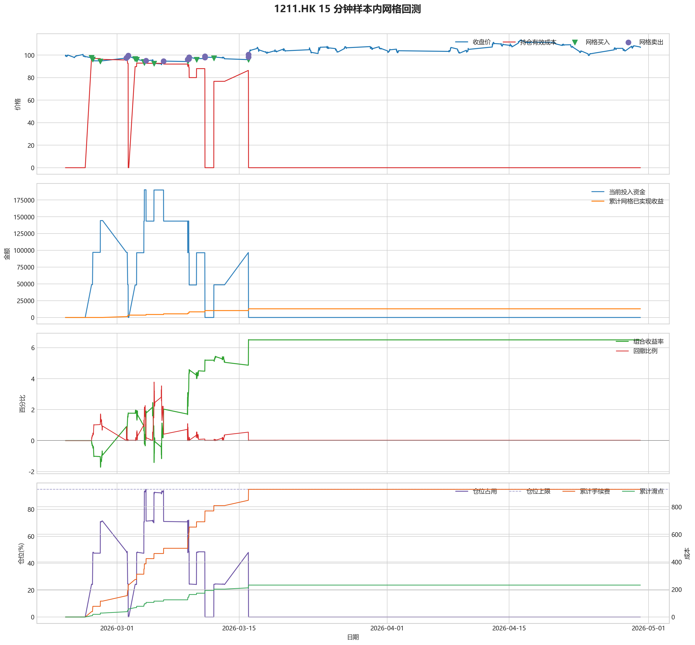
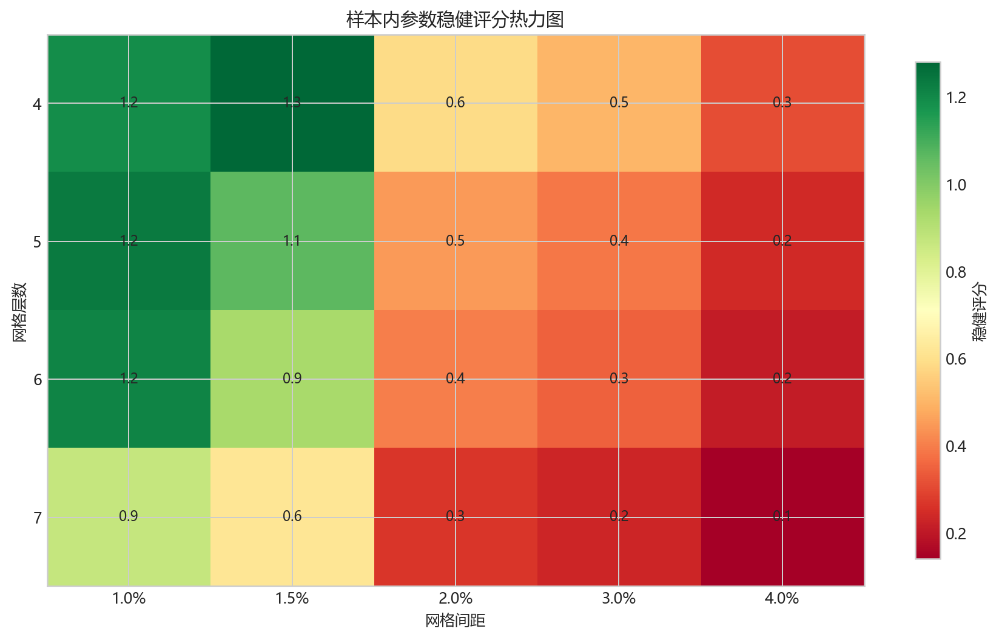
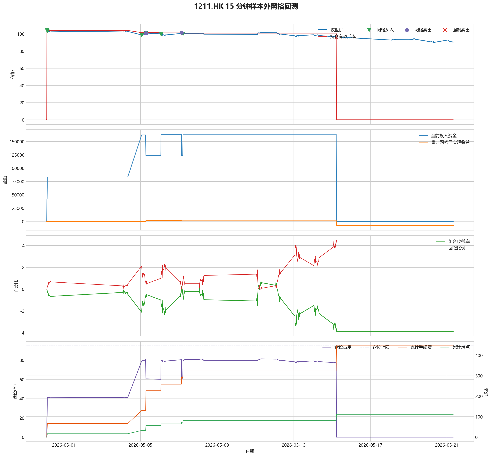

# 1211.HK 网格回测报告

## 摘要

- 标的：`1211.HK`
- 数据周期：Yahoo Finance 最近 60 天 `15m`；下载必须配置代理，Yahoo 失败时流程直接停止
- 样本内窗口：2026-02-23 01:30:00 至 2026-04-30 01:45:00
- 样本外窗口：2026-04-30 02:00:00 至 2026-05-21 08:00:00
- 切分方式：最近分钟线样本按 `75% / 25%` 拆分样本内与样本外
- 网格模式：纯现金网格，不在样本起点建立底仓；第一根 K 线收盘价只作为网格锚点
- 最小交易单位：100 股，来源：AASTOCKS 快照页 Lot Size
- 单层网格固定数量：500 股
- 左侧处理：`both`，强制退出阈值 `5.00%` 总资金浮亏
- 执行口径：`realistic`，手续费 `8.00` bps，滑点 `2.00` bps
- 最优参数：网格间距 1.50% / 网格层数 4 / 止盈比例 2.00%

这套网格在不同阶段表现不一致，说明它对行情结构比较敏感，不能只看单段结果下结论。

## 第一层：先看结论

### 先回答关键问题

| 问题 | 样本内 | 样本外 | 怎么理解 |
| --- | --- | --- | --- |
| 这套策略能不能赚钱 | 6.50% | -3.87% | 当前还不能证明这套网格能稳定盈利，尤其要继续观察单边下跌时未平仓风险如何处理。 |
| 比现金闲置好不好 | 13008.89 | -7742.79 | 正数表示网格策略赚到钱，负数表示不交易反而更好。 |
| 比买入持有好不好 | -2092.78 | 21158.93 | 买入持有用同样资金、交易单位和执行口径估算，正数表示网格更好。 |
| 交易成本高不高 | 926.60 | 446.24 | 这里统计手续费，滑点会单独体现在估算成交价和滑点成本里。 |
| 最坏会亏到什么程度 | 3.78% | 4.51% | 这是账户在样本期间相对阶段高点出现过的最大回撤。 |
| 这组参数稳不稳 | 稳健分 1.28 | 沿用同一组参数 | 不是只看一整段最高分，而是看多窗口表现是否稳定。当前结果：67% 窗口为正，最差窗口收益 `0.00%`，收益波动 `2.17` 个百分点。 |

### 一句话判断

- 这套网格在不同阶段表现不一致，说明它对行情结构比较敏感，不能只看单段结果下结论。
- 当前正式拿去实盘的证据还不够，更合理的定位是：先验证它能否通过网格闭环赚钱，再看左侧行情下能否控制亏损。
- 如果你只想知道现在值不值得继续研究，看完上面这张表就够了。

## 第二层：展开细节

### 参数是怎么选的

| 筛选环节 | 结果 | 你该怎么理解 |
| --- | --- | --- |
| 执行口径 | realistic | 手续费 8.00 bps，滑点 2.00 bps。 |
| 候选组合数 | 80 | 先把候选参数全部跑完，不做随机抽样。 |
| 单窗综合分 | 7.08 | 这是整段样本内的收益、回撤、闭环网格利润综合分。 |
| 稳健窗口数 | 3 | 再把样本内按时间顺序拆成多个连续窗口，检查同一参数会不会只在一小段行情里好看。 |
| 稳健分 RobustScore | 1.28 | 计算方式：0.6 x 窗口平均分 + 0.4 x 最差窗口分 - 0.25 x 窗口收益波动。 |
| 最终入选参数 | 间距 1.50% / 层数 4 / 止盈 2.00% | 优先挑多窗口更稳的组合，而不是只挑单窗最亮的孤点。 |

### 关键结果对照

| 指标 | 样本内 | 样本外 | 怎么读 |
| --- | --- | --- | --- |
| 净收益率 | 6.50% | -3.87% | 已经按当前执行口径扣除回测引擎支持的费用影响。 |
| 最大回撤 | 3.78% | 4.51% | 再看亏起来最难受会到什么程度。 |
| 交易成本 | 926.60 | 446.24 | 策略内部估算的手续费累计值，帮助判断网格频繁交易是否吃掉收益。 |
| 滑点成本 | 231.65 | 111.56 | 按收盘价和估算成交价差额累计，属于近似实盘口径。 |
| 未平网格有效成本 | 0.00 | 0.00 | 只在期末仍有未平网格仓位时有意义。 |
| 闭环网格净利润 | 12891.75 | -7797.81 | 这是已经完成低买高卖、真正落袋的利润，不等于总账户收益。 |
| 未平网格浮动盈亏 | 0.00 | 0.00 | hold 口径会保留这部分风险，force_exit 口径触发后通常回到 0。 |
| 网格闭环次数 | 12 | 3 | 次数越多，说明震荡里成交越频繁；但次数多不等于总账户一定赚钱。 |

### 执行口径和风控约束

| 约束 | 样本内 | 样本外 |
| --- | --- | --- |
| 执行口径 | realistic | realistic |
| 网格模式 | cash | cash |
| 左侧处理口径 | both | both |
| 手续费 / 滑点 | 8.00 / 2.00 bps | 8.00 / 2.00 bps |
| 最大仓位占用 | 94.90% / 上限 95.00% | 81.44% / 上限 95.00% |
| 停手事件 | 0 | 0 |
| 强制退出事件 | 0 | 4 |

### 网格到底有没有帮忙

| 对比项 | 样本内 | 样本外 |
| --- | --- | --- |
| 现金闲置收益率 | 0.00% | 0.00% |
| 买入持有收益率 | 7.55% | -14.45% |
| 网格策略收益率 | 6.50% | -3.87% |
| 网格相对现金闲置多赚/多亏 | 13008.89 | -7742.79 |
| 网格相对买入持有多赚/多亏 | -2092.78 | 21158.93 |

### 左侧行情怎么处理

| 左侧口径 | 样本内净收益率 | 样本内闭环利润 | 样本内浮动盈亏 | 样本内强平 | 样本外净收益率 | 样本外闭环利润 | 样本外浮动盈亏 | 样本外强平 |
| --- | --- | --- | --- | --- | --- | --- | --- | --- |
| hold：未平网格继续持有 | 6.50% | 12891.75 | 0.00 | 否 | -8.35% | 2239.76 | -19068.52 | 否 |
| force_exit：达到亏损阈值强平 | 6.50% | 12891.75 | 0.00 | 否 | -3.87% | -7797.81 | 0.00 | 是 |

补一句最重要的解释：

- “网格已实现收益”只代表已经完成低买高卖、真正落袋的那部分利润。
- 真正决定你账户最后赚没赚钱的，是“已实现网格收益 + 未平仓网格浮动盈亏 + 现金余额”三者一起的结果。
- 所以完全可能出现“网格已经落袋赚钱，但总账户还是亏钱”的情况。

### 图表速读总结

#### 样本内回测图

- 这一段价格从 `99.15` 走到 `106.80`，区间涨跌幅约 `7.72%`。
- 样本结束时没有未平网格仓位，剩余风险已经体现在现金和已实现利润里。
- 图里的买卖点一共完成了 `12` 轮网格闭环，已经落袋的网格利润累计 `12891.75`。
- 期末未平网格浮动盈亏为 `0.00`。
- 总账户最终是盈利状态，期末权益 `213008.89`，说明闭环利润、未平仓浮动盈亏和现金余额合计后已经转正。

#### 热力图

- 热力图横轴是网格间距，纵轴是网格层数，颜色越偏绿代表稳健评分越高；每个格子里没有单独画出的止盈比例，已经折叠成该格子的最好结果。
- 当前样本里，最优参数落在“网格间距 `1.50%` / 网格层数 `4` / 止盈比例 `2.00%`”。
- 从前几名结果看，高分区域主要集中在网格间距 `1.00%`、网格层数 `4` 附近。
- 最优点比较集中在网格间距 `1.50%`、网格层数 `4` 附近，说明这组参数不是完全随机撞出来的。

#### 分钟线样本外验证

- 样本外账户最终从 `200000` 走到 `192257.21`，总盈亏 `-7742.79`。
- 样本外单层网格按最小交易单位 `100` 股取整，固定数量是 `400` 股。
- 样本外没有转正，说明这组参数还不能在该行情结构下独立制造稳定盈利。

#### 样本外回测图

- 这一段价格从 `106.50` 走到 `90.55`，区间涨跌幅约 `-14.98%`。
- 样本结束时没有未平网格仓位，剩余风险已经体现在现金和已实现利润里。
- 图里的买卖点一共完成了 `3` 轮网格闭环，已经落袋的网格利润累计 `-7797.81`。
- 左侧强制退出已经触发，后续不再继续开新网格。
- 总账户最终仍是亏损状态，期末权益 `192257.21`；也就是说，已实现网格利润还没完全覆盖未平仓或强制退出带来的亏损。

### 交易记录和明细

如果你只是想判断策略值不值得继续，到这里通常已经够了；下面这些表主要用于追交易过程和排查归因。

### 样本内事件流水

| 时间 | 事件类型 | 层级 | 价格 | 估算成交价 | 数量 | 金额 | 手续费 | 滑点成本 | 说明 |
| --- | --- | --- | --- | --- | --- | --- | --- | --- | --- |
| 2026-02-26 01:30:00 | grid_buy | 1 | 97.65 | 97.67 | 500 | 48873.83 | 39.07 | 9.77 | 触发下行网格买入 |
| 2026-02-26 05:00:00 | grid_buy | 2 | 96.10 | 96.12 | 500 | 48098.06 | 38.45 | 9.61 | 触发下行网格买入 |
| 2026-02-27 01:45:00 | grid_buy | 3 | 94.55 | 94.57 | 500 | 47322.28 | 37.83 | 9.46 | 触发下行网格买入 |
| 2026-03-02 01:30:00 | grid_sell | 3 | 97.40 | 97.38 | 500 | 48651.31 | 38.95 | 9.74 | 达到网格止盈价后卖出本层仓位 |
| 2026-03-02 05:00:00 | grid_sell | 2 | 98.75 | 98.73 | 500 | 49325.63 | 39.49 | 9.88 | 达到网格止盈价后卖出本层仓位 |
| 2026-03-02 06:30:00 | grid_sell | 1 | 99.75 | 99.73 | 500 | 49825.13 | 39.89 | 9.97 | 达到网格止盈价后卖出本层仓位 |
| 2026-03-03 01:30:00 | grid_buy | 1 | 96.70 | 96.72 | 500 | 48398.36 | 38.69 | 9.67 | 触发下行网格买入 |
| 2026-03-03 05:45:00 | grid_buy | 2 | 95.90 | 95.92 | 500 | 47997.96 | 38.37 | 9.59 | 触发下行网格买入 |
| 2026-03-04 01:45:00 | grid_buy | 3 | 94.10 | 94.12 | 500 | 47097.06 | 37.65 | 9.41 | 触发下行网格买入 |
| 2026-03-04 03:00:00 | grid_buy | 4 | 93.15 | 93.17 | 500 | 46621.58 | 37.27 | 9.32 | 触发下行网格买入 |
| 2026-03-04 07:45:00 | grid_sell | 4 | 95.20 | 95.18 | 500 | 47552.41 | 38.07 | 9.52 | 达到网格止盈价后卖出本层仓位 |
| 2026-03-05 05:30:00 | grid_buy | 4 | 92.55 | 92.57 | 500 | 46321.28 | 37.03 | 9.26 | 触发下行网格买入 |
| 2026-03-06 08:00:00 | grid_sell | 4 | 94.70 | 94.68 | 500 | 47302.66 | 37.87 | 9.47 | 达到网格止盈价后卖出本层仓位 |
| 2026-03-09 02:30:00 | grid_sell | 3 | 96.15 | 96.13 | 500 | 48026.93 | 38.45 | 9.62 | 达到网格止盈价后卖出本层仓位 |
| 2026-03-09 03:00:00 | grid_buy | 3 | 94.40 | 94.42 | 500 | 47247.21 | 37.77 | 9.44 | 触发下行网格买入 |
| 2026-03-09 05:30:00 | grid_sell | 3 | 96.60 | 96.58 | 500 | 48251.71 | 38.63 | 9.66 | 达到网格止盈价后卖出本层仓位 |
| 2026-03-09 06:30:00 | grid_sell | 2 | 98.15 | 98.13 | 500 | 49025.93 | 39.25 | 9.82 | 达到网格止盈价后卖出本层仓位 |
| 2026-03-10 02:45:00 | grid_buy | 2 | 95.90 | 95.92 | 500 | 47997.96 | 38.37 | 9.59 | 触发下行网格买入 |
| 2026-03-11 01:45:00 | grid_sell | 2 | 97.90 | 97.88 | 500 | 48901.06 | 39.15 | 9.79 | 达到网格止盈价后卖出本层仓位 |
| 2026-03-11 02:00:00 | grid_sell | 1 | 98.90 | 98.88 | 500 | 49400.56 | 39.55 | 9.89 | 达到网格止盈价后卖出本层仓位 |
| 2026-03-12 02:30:00 | grid_buy | 1 | 97.20 | 97.22 | 500 | 48648.61 | 38.89 | 9.72 | 触发下行网格买入 |
| 2026-03-16 01:30:00 | grid_buy | 2 | 96.00 | 96.02 | 500 | 48048.01 | 38.41 | 9.60 | 触发下行网格买入 |
| 2026-03-16 01:45:00 | grid_sell | 2 | 98.30 | 98.28 | 500 | 49100.86 | 39.31 | 9.83 | 达到网格止盈价后卖出本层仓位 |
| 2026-03-16 02:00:00 | grid_sell | 1 | 100.50 | 100.48 | 500 | 50199.76 | 40.19 | 10.05 | 达到网格止盈价后卖出本层仓位 |

### 样本内成交结果

| 开仓时间 | 平仓时间 | 持有时长 | 开仓价 | 平仓价 | 数量 | 盈亏 | 收益率(%) | 仓位类型 |
| --- | --- | --- | --- | --- | --- | --- | --- | --- |
| 2026-02-27 01:45:00 | 2026-03-02 01:30:00 | 2 days 23:45:00 | 94.57 | 97.40 | 500 | 1338.76 | 2.83 | 网格 3 |
| 2026-02-26 05:00:00 | 2026-03-02 05:00:00 | 4 days 00:00:00 | 96.12 | 98.75 | 500 | 1237.44 | 2.57 | 网格 2 |
| 2026-02-26 01:30:00 | 2026-03-02 06:30:00 | 4 days 05:00:00 | 97.67 | 99.75 | 500 | 961.27 | 1.97 | 网格 1 |
| 2026-03-04 03:00:00 | 2026-03-04 07:45:00 | 0 days 04:45:00 | 93.17 | 95.20 | 500 | 940.34 | 2.02 | 网格 4 |
| 2026-03-05 05:30:00 | 2026-03-06 08:00:00 | 1 days 02:30:00 | 92.57 | 94.70 | 500 | 990.83 | 2.14 | 网格 4 |
| 2026-03-04 01:45:00 | 2026-03-09 02:30:00 | 5 days 00:45:00 | 94.12 | 96.15 | 500 | 939.48 | 2.00 | 网格 3 |
| 2026-03-09 03:00:00 | 2026-03-09 05:30:00 | 0 days 02:30:00 | 94.42 | 96.60 | 500 | 1014.15 | 2.15 | 网格 3 |
| 2026-03-03 05:45:00 | 2026-03-09 06:30:00 | 6 days 00:45:00 | 95.92 | 98.15 | 500 | 1037.78 | 2.16 | 网格 2 |
| 2026-03-10 02:45:00 | 2026-03-11 01:45:00 | 0 days 23:00:00 | 95.92 | 97.90 | 500 | 912.88 | 1.90 | 网格 2 |
| 2026-03-03 01:30:00 | 2026-03-11 02:00:00 | 8 days 00:30:00 | 96.72 | 98.90 | 500 | 1012.08 | 2.09 | 网格 1 |
| 2026-03-16 01:30:00 | 2026-03-16 01:45:00 | 0 days 00:15:00 | 96.02 | 98.30 | 500 | 1062.67 | 2.21 | 网格 2 |
| 2026-03-12 02:30:00 | 2026-03-16 02:00:00 | 3 days 23:30:00 | 97.22 | 100.50 | 500 | 1561.19 | 3.21 | 网格 1 |

### 样本外事件流水

| 时间 | 事件类型 | 层级 | 价格 | 估算成交价 | 数量 | 金额 | 手续费 | 滑点成本 | 说明 |
| --- | --- | --- | --- | --- | --- | --- | --- | --- | --- |
| 2026-04-30 02:45:00 | grid_buy | 1 | 104.80 | 104.82 | 400 | 41961.93 | 33.54 | 8.38 | 触发下行网格买入 |
| 2026-04-30 03:15:00 | grid_buy | 2 | 103.30 | 103.32 | 400 | 41361.33 | 33.06 | 8.26 | 触发下行网格买入 |
| 2026-05-05 01:30:00 | grid_buy | 3 | 98.85 | 98.87 | 400 | 39579.55 | 31.64 | 7.91 | 触发下行网格买入 |
| 2026-05-05 01:30:00 | grid_buy | 4 | 98.85 | 98.87 | 400 | 39579.55 | 31.64 | 7.91 | 触发下行网格买入 |
| 2026-05-05 06:45:00 | grid_sell | 3 | 100.90 | 100.88 | 400 | 40319.65 | 32.28 | 8.07 | 达到网格止盈价后卖出本层仓位 |
| 2026-05-05 06:45:00 | grid_sell | 4 | 100.90 | 100.88 | 400 | 40319.65 | 32.28 | 8.07 | 达到网格止盈价后卖出本层仓位 |
| 2026-05-05 06:45:00 | grid_buy | 3 | 100.90 | 100.92 | 400 | 40400.37 | 32.29 | 8.07 | 触发下行网格买入 |
| 2026-05-06 01:45:00 | grid_buy | 4 | 99.50 | 99.52 | 400 | 39839.81 | 31.85 | 7.96 | 触发下行网格买入 |
| 2026-05-07 03:30:00 | grid_sell | 4 | 101.60 | 101.58 | 400 | 40599.37 | 32.51 | 8.13 | 达到网格止盈价后卖出本层仓位 |
| 2026-05-07 05:15:00 | grid_buy | 4 | 100.10 | 100.12 | 400 | 40080.05 | 32.04 | 8.01 | 触发下行网格买入 |
| 2026-05-15 05:30:00 | force_exit_sell | 1 | 96.20 | 96.18 | 400 | 38441.52 | 30.78 | 7.70 | 未平网格浮亏达到总资金 5.00% 阈值，强制卖出本层仓位 |
| 2026-05-15 05:30:00 | force_exit_sell | 2 | 96.20 | 96.18 | 400 | 38441.52 | 30.78 | 7.70 | 未平网格浮亏达到总资金 5.00% 阈值，强制卖出本层仓位 |
| 2026-05-15 05:30:00 | force_exit_sell | 3 | 96.20 | 96.18 | 400 | 38441.52 | 30.78 | 7.70 | 未平网格浮亏达到总资金 5.00% 阈值，强制卖出本层仓位 |
| 2026-05-15 05:30:00 | force_exit_sell | 4 | 96.20 | 96.18 | 400 | 38441.52 | 30.78 | 7.70 | 未平网格浮亏达到总资金 5.00% 阈值，强制卖出本层仓位 |

### 样本外成交结果

| 开仓时间 | 平仓时间 | 持有时长 | 开仓价 | 平仓价 | 数量 | 盈亏 | 收益率(%) | 仓位类型 |
| --- | --- | --- | --- | --- | --- | --- | --- | --- |
| 2026-05-05 01:30:00 | 2026-05-05 06:45:00 | 0 days 05:15:00 | 98.87 | 100.90 | 400 | 748.17 | 1.89 | 网格 4 |
| 2026-05-05 01:30:00 | 2026-05-05 06:45:00 | 0 days 05:15:00 | 98.87 | 100.90 | 400 | 748.17 | 1.89 | 网格 3 |
| 2026-05-06 01:45:00 | 2026-05-07 03:30:00 | 1 days 01:45:00 | 99.52 | 101.60 | 400 | 767.68 | 1.93 | 网格 4 |
| 2026-05-07 05:15:00 | 2026-05-15 05:30:00 | 8 days 00:15:00 | 100.12 | 96.20 | 400 | -1630.83 | -4.07 | 网格 4 |
| 2026-05-05 06:45:00 | 2026-05-15 05:30:00 | 9 days 22:45:00 | 100.92 | 96.20 | 400 | -1951.15 | -4.83 | 网格 3 |
| 2026-04-30 03:15:00 | 2026-05-15 05:30:00 | 15 days 02:15:00 | 103.32 | 96.20 | 400 | -2912.11 | -7.05 | 网格 2 |
| 2026-04-30 02:45:00 | 2026-05-15 05:30:00 | 15 days 02:45:00 | 104.82 | 96.20 | 400 | -3512.71 | -8.38 | 网格 1 |

## 最终结论

- 这套参数更适合“先跌一段、再进入震荡或反弹”的行情，因为它依赖反弹来兑现网格利润。
- 如果行情持续单边下跌，hold 口径会继续持有未平网格，force_exit 口径会在浮亏达到阈值后清仓并停止交易。
- 当前样本下，闭环网格净利润：样本内 12891.75，样本外 -7797.81。
- 这份报告只代表最近 60 天分钟级行情下的短周期表现，不等同于长期日线参数。
