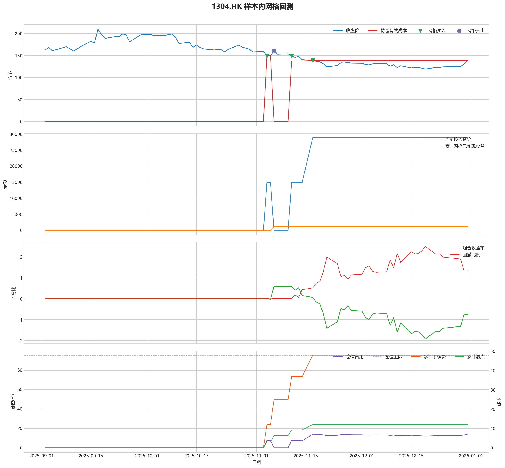
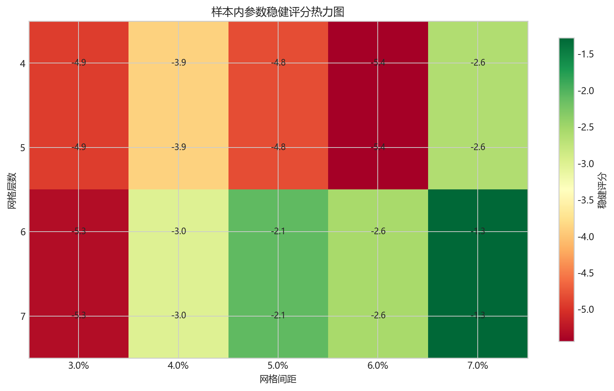
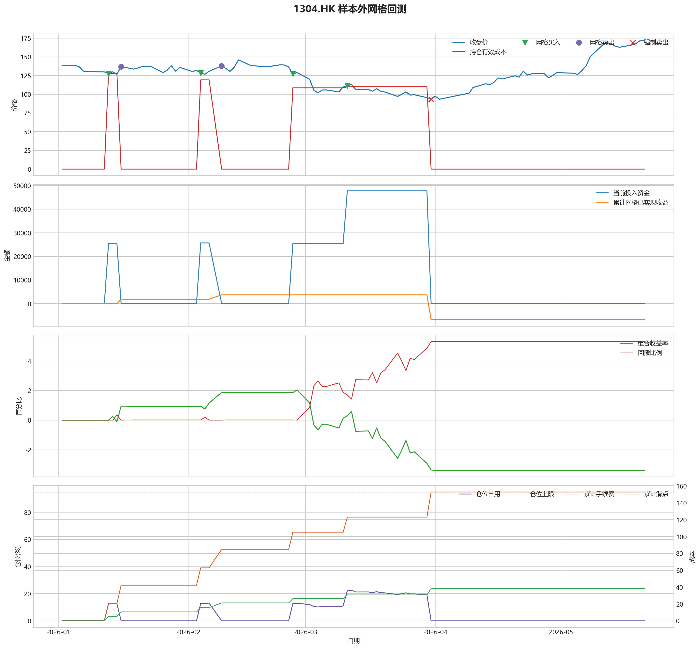

# 1304.HK 网格回测报告

## 摘要

- 标的：`1304.HK`
- 样本内窗口：2025-09-02 至 2025-12-31
- 样本外窗口：2026-01-01 至 2026-05-21
- 网格模式：纯现金网格，不在样本起点建立底仓；第一根 K 线收盘价只作为网格锚点
- 最小交易单位：100 股，来源：AASTOCKS 快照页 Lot Size
- 单层网格固定数量：100 股
- 左侧处理：`both`，强制退出阈值 `5.00%` 总资金浮亏
- 执行口径：`realistic`，手续费 `8.00` bps，滑点 `2.00` bps
- 最优参数：网格间距 7.00% / 网格层数 7 / 止盈比例 3.00%

这套网格当前还不能证明能稳定把总账户做成正收益，左侧下跌风险是主要约束。

## 第一层：先看结论

### 先回答关键问题

| 问题 | 样本内 | 样本外 | 怎么理解 |
| --- | --- | --- | --- |
| 这套策略能不能赚钱 | -0.75% | -3.39% | 当前还不能证明这套网格能稳定盈利，尤其要继续观察单边下跌时未平仓风险如何处理。 |
| 比现金闲置好不好 | -1507.58 | -6772.69 | 正数表示网格策略赚到钱，负数表示不交易反而更好。 |
| 比买入持有好不好 | 26887.69 | -53339.03 | 买入持有用同样资金、交易单位和执行口径估算，正数表示网格更好。 |
| 交易成本高不高 | 47.88 | 152.90 | 这里统计手续费，滑点会单独体现在估算成交价和滑点成本里。 |
| 最坏会亏到什么程度 | 2.49% | 5.32% | 这是账户在样本期间相对阶段高点出现过的最大回撤。 |
| 这组参数稳不稳 | 稳健分 -1.28 | 沿用同一组参数 | 不是只看一整段最高分，而是看多窗口表现是否稳定。当前结果：33% 窗口为正，最差窗口收益 `-1.22%`，收益波动 `0.87` 个百分点。 |

### 一句话判断

- 这套网格当前还不能证明能稳定把总账户做成正收益，左侧下跌风险是主要约束。
- 当前正式拿去实盘的证据还不够，更合理的定位是：先验证它能否通过网格闭环赚钱，再看左侧行情下能否控制亏损。
- 如果你只想知道现在值不值得继续研究，看完上面这张表就够了。

## 第二层：展开细节

### 参数是怎么选的

| 筛选环节 | 结果 | 你该怎么理解 |
| --- | --- | --- |
| 执行口径 | realistic | 手续费 8.00 bps，滑点 2.00 bps。 |
| 候选组合数 | 60 | 先把候选参数全部跑完，不做随机抽样。 |
| 单窗综合分 | -2.21 | 这是整段样本内的收益、回撤、闭环网格利润综合分。 |
| 稳健窗口数 | 3 | 再把样本内按时间顺序拆成多个连续窗口，检查同一参数会不会只在一小段行情里好看。 |
| 稳健分 RobustScore | -1.28 | 计算方式：0.6 x 窗口平均分 + 0.4 x 最差窗口分 - 0.25 x 窗口收益波动。 |
| 最终入选参数 | 间距 7.00% / 层数 7 / 止盈 3.00% | 优先挑多窗口更稳的组合，而不是只挑单窗最亮的孤点。 |

### 关键结果对照

| 指标 | 样本内 | 样本外 | 怎么读 |
| --- | --- | --- | --- |
| 净收益率 | -0.75% | -3.39% | 已经按当前执行口径扣除回测引擎支持的费用影响。 |
| 最大回撤 | 2.49% | 5.32% | 再看亏起来最难受会到什么程度。 |
| 交易成本 | 47.88 | 152.90 | 策略内部估算的手续费累计值，帮助判断网格频繁交易是否吃掉收益。 |
| 滑点成本 | 11.97 | 38.22 | 按收盘价和估算成交价差额累计，属于近似实盘口径。 |
| 未平网格有效成本 | 138.35 | 0.00 | 只在期末仍有未平网格仓位时有意义。 |
| 闭环网格净利润 | 1148.94 | -6791.12 | 这是已经完成低买高卖、真正落袋的利润，不等于总账户收益。 |
| 未平网格浮动盈亏 | -1006.63 | 0.00 | hold 口径会保留这部分风险，force_exit 口径触发后通常回到 0。 |
| 网格闭环次数 | 1 | 2 | 次数越多，说明震荡里成交越频繁；但次数多不等于总账户一定赚钱。 |

### 执行口径和风控约束

| 约束 | 样本内 | 样本外 |
| --- | --- | --- |
| 执行口径 | realistic | realistic |
| 网格模式 | cash | cash |
| 左侧处理口径 | both | both |
| 手续费 / 滑点 | 8.00 / 2.00 bps | 8.00 / 2.00 bps |
| 最大仓位占用 | 13.92% / 上限 95.00% | 22.60% / 上限 95.00% |
| 停手事件 | 2 | 2 |
| 强制退出事件 | 0 | 2 |

### 网格到底有没有帮忙

| 对比项 | 样本内 | 样本外 |
| --- | --- | --- |
| 现金闲置收益率 | 0.00% | 0.00% |
| 买入持有收益率 | -14.20% | 23.28% |
| 网格策略收益率 | -0.75% | -3.39% |
| 网格相对现金闲置多赚/多亏 | -1507.58 | -6772.69 |
| 网格相对买入持有多赚/多亏 | 26887.69 | -53339.03 |

### 左侧行情怎么处理

| 左侧口径 | 样本内净收益率 | 样本内闭环利润 | 样本内浮动盈亏 | 样本内强平 | 样本外净收益率 | 样本外闭环利润 | 样本外浮动盈亏 | 样本外强平 |
| --- | --- | --- | --- | --- | --- | --- | --- | --- |
| hold：未平网格继续持有 | -0.75% | 1148.94 | -1006.63 | 否 | 3.30% | 6569.10 | 0.00 | 否 |
| force_exit：达到亏损阈值强平 | -0.75% | 1148.94 | -1006.63 | 否 | -3.39% | -6791.12 | 0.00 | 是 |

补一句最重要的解释：

- “网格已实现收益”只代表已经完成低买高卖、真正落袋的那部分利润。
- 真正决定你账户最后赚没赚钱的，是“已实现网格收益 + 未平仓网格浮动盈亏 + 现金余额”三者一起的结果。
- 所以完全可能出现“网格已经落袋赚钱，但总账户还是亏钱”的情况。

### 图表速读总结

#### 样本内回测图

- 这一段价格从 `162.70` 走到 `139.20`，区间涨跌幅约 `-14.44%`。
- 样本结束时收盘价 `139.20` 已经回到有效成本 `138.35` 之上，未平网格按当前口径已经转回浮盈区。
- 图里的买卖点一共完成了 `1` 轮网格闭环，已经落袋的网格利润累计 `1148.94`。
- 期末未平网格浮动盈亏为 `-1006.63`。
- 总账户最终仍是亏损状态，期末权益 `198492.42`；也就是说，已实现网格利润还没完全覆盖未平仓或强制退出带来的亏损。

#### 热力图

- 热力图横轴是网格间距，纵轴是网格层数，颜色越偏绿代表稳健评分越高；每个格子里没有单独画出的止盈比例，已经折叠成该格子的最好结果。
- 当前样本里，最优参数落在“网格间距 `7.00%` / 网格层数 `7` / 止盈比例 `3.00%`”。
- 从前几名结果看，高分区域主要集中在网格间距 `7.00%`、网格层数 `7` 附近。
- 最亮的区域不是单个点，而是网格层数 `6` 到 `7` 的一段平台，说明继续把层数加深，并没有明显抬高综合得分。

#### 2026 样本外验证

- 样本外账户最终从 `200000` 走到 `193227.31`，总盈亏 `-6772.69`。
- 样本外单层网格按最小交易单位 `100` 股取整，固定数量是 `200` 股。
- 样本外没有转正，说明这组参数还不能在该行情结构下独立制造稳定盈利。

#### 样本外回测图

- 这一段价格从 `138.30` 走到 `171.70`，区间涨跌幅约 `24.15%`。
- 样本结束时没有未平网格仓位，剩余风险已经体现在现金和已实现利润里。
- 图里的买卖点一共完成了 `2` 轮网格闭环，已经落袋的网格利润累计 `-6791.12`。
- 左侧强制退出已经触发，后续不再继续开新网格。
- 总账户最终仍是亏损状态，期末权益 `193227.31`；也就是说，已实现网格利润还没完全覆盖未平仓或强制退出带来的亏损。

### 交易记录和明细

如果你只是想判断策略值不值得继续，到这里通常已经够了；下面这些表主要用于追交易过程和排查归因。

### 样本内事件流水

| 时间 | 事件类型 | 层级 | 价格 | 估算成交价 | 数量 | 金额 | 手续费 | 滑点成本 | 说明 |
| --- | --- | --- | --- | --- | --- | --- | --- | --- | --- |
| 2025-11-04 | grid_buy | 1 | 149.40 | 149.43 | 100 | 14954.94 | 11.95 | 2.99 | 触发下行网格买入 |
| 2025-11-06 | grid_sell | 1 | 161.20 | 161.17 | 100 | 16103.88 | 12.89 | 3.22 | 达到网格止盈价后卖出本层仓位 |
| 2025-11-11 | grid_buy | 1 | 149.00 | 149.03 | 100 | 14914.90 | 11.92 | 2.98 | 触发下行网格买入 |
| 2025-11-17 | grid_buy | 2 | 138.90 | 138.93 | 100 | 13903.89 | 11.11 | 2.78 | 触发下行网格买入 |
| 2025-11-21 | risk_stop_loss | 0 | 124.20 | 124.20 | 0 | 0.00 | 0.00 | 0.00 | 价格跌破锚定停手线 130.16，暂停新增网格 |
| 2025-11-24 | risk_cooldown | 0 | 127.30 | 127.30 | 0 | 0.00 | 0.00 | 0.00 | 停手机制冷却中，剩余 4 根 K 线 |
| 2025-11-25 | risk_cooldown | 0 | 133.60 | 133.60 | 0 | 0.00 | 0.00 | 0.00 | 停手机制冷却中，剩余 3 根 K 线 |
| 2025-11-26 | risk_cooldown | 0 | 133.00 | 133.00 | 0 | 0.00 | 0.00 | 0.00 | 停手机制冷却中，剩余 2 根 K 线 |
| 2025-11-27 | risk_cooldown | 0 | 134.80 | 134.80 | 0 | 0.00 | 0.00 | 0.00 | 停手机制冷却中，剩余 1 根 K 线 |
| 2025-12-02 | risk_stop_loss | 0 | 129.30 | 129.30 | 0 | 0.00 | 0.00 | 0.00 | 价格跌破锚定停手线 130.16，暂停新增网格 |
| 2025-12-03 | risk_cooldown | 0 | 128.40 | 128.40 | 0 | 0.00 | 0.00 | 0.00 | 停手机制冷却中，剩余 4 根 K 线 |
| 2025-12-04 | risk_cooldown | 0 | 131.00 | 131.00 | 0 | 0.00 | 0.00 | 0.00 | 停手机制冷却中，剩余 3 根 K 线 |
| 2025-12-05 | risk_cooldown | 0 | 131.50 | 131.50 | 0 | 0.00 | 0.00 | 0.00 | 停手机制冷却中，剩余 2 根 K 线 |
| 2025-12-08 | risk_cooldown | 0 | 131.20 | 131.20 | 0 | 0.00 | 0.00 | 0.00 | 停手机制冷却中，剩余 1 根 K 线 |

### 样本内成交结果

| 开仓时间 | 平仓时间 | 持有时长 | 开仓价 | 平仓价 | 数量 | 盈亏 | 收益率(%) | 仓位类型 |
| --- | --- | --- | --- | --- | --- | --- | --- | --- |
| 2025-11-04 00:00:00 | 2025-11-06 00:00:00 | 2 days 00:00:00 | 149.43 | 161.20 | 100 | 1152.16 | 7.71 | 网格 1 |
| 2025-11-11 00:00:00 | 2025-12-30 00:00:00 | 49 days 00:00:00 | 149.03 | 130.90 | 100 | -1835.37 | -12.32 | 网格 1 |
| 2025-11-17 00:00:00 | 2025-12-30 00:00:00 | 43 days 00:00:00 | 138.93 | 130.90 | 100 | -824.36 | -5.93 | 网格 2 |

### 样本外事件流水

| 时间 | 事件类型 | 层级 | 价格 | 估算成交价 | 数量 | 金额 | 手续费 | 滑点成本 | 说明 |
| --- | --- | --- | --- | --- | --- | --- | --- | --- | --- |
| 2026-01-13 | grid_buy | 1 | 127.40 | 127.43 | 200 | 25505.48 | 20.39 | 5.10 | 触发下行网格买入 |
| 2026-01-16 | grid_sell | 1 | 137.00 | 136.97 | 200 | 27372.60 | 21.92 | 5.48 | 达到网格止盈价后卖出本层仓位 |
| 2026-02-04 | grid_buy | 1 | 128.40 | 128.43 | 200 | 25705.68 | 20.55 | 5.14 | 触发下行网格买入 |
| 2026-02-09 | grid_sell | 1 | 137.90 | 137.87 | 200 | 27552.42 | 22.06 | 5.52 | 达到网格止盈价后卖出本层仓位 |
| 2026-02-26 | grid_buy | 1 | 127.00 | 127.03 | 200 | 25425.40 | 20.32 | 5.08 | 触发下行网格买入 |
| 2026-03-03 | risk_stop_loss | 0 | 105.30 | 105.30 | 0 | 0.00 | 0.00 | 0.00 | 价格跌破锚定停手线 110.64，暂停新增网格 |
| 2026-03-04 | risk_cooldown | 0 | 101.90 | 101.90 | 0 | 0.00 | 0.00 | 0.00 | 停手机制冷却中，剩余 4 根 K 线 |
| 2026-03-05 | risk_cooldown | 0 | 105.70 | 105.70 | 0 | 0.00 | 0.00 | 0.00 | 停手机制冷却中，剩余 3 根 K 线 |
| 2026-03-06 | risk_cooldown | 0 | 105.70 | 105.70 | 0 | 0.00 | 0.00 | 0.00 | 停手机制冷却中，剩余 2 根 K 线 |
| 2026-03-09 | risk_cooldown | 0 | 103.20 | 103.20 | 0 | 0.00 | 0.00 | 0.00 | 停手机制冷却中，剩余 1 根 K 线 |
| 2026-03-11 | grid_buy | 2 | 111.50 | 111.52 | 200 | 22322.30 | 17.84 | 4.46 | 触发下行网格买入 |
| 2026-03-13 | risk_stop_loss | 0 | 106.30 | 106.30 | 0 | 0.00 | 0.00 | 0.00 | 价格跌破锚定停手线 110.64，暂停新增网格 |
| 2026-03-16 | risk_cooldown | 0 | 106.40 | 106.40 | 0 | 0.00 | 0.00 | 0.00 | 停手机制冷却中，剩余 4 根 K 线 |
| 2026-03-17 | risk_cooldown | 0 | 103.90 | 103.90 | 0 | 0.00 | 0.00 | 0.00 | 停手机制冷却中，剩余 3 根 K 线 |
| 2026-03-18 | risk_cooldown | 0 | 107.40 | 107.40 | 0 | 0.00 | 0.00 | 0.00 | 停手机制冷却中，剩余 2 根 K 线 |
| 2026-03-19 | risk_cooldown | 0 | 104.00 | 104.00 | 0 | 0.00 | 0.00 | 0.00 | 停手机制冷却中，剩余 1 根 K 线 |
| 2026-03-31 | force_exit_sell | 1 | 93.20 | 93.18 | 200 | 18621.36 | 14.91 | 3.73 | 未平网格浮亏达到总资金 5.00% 阈值，强制卖出本层仓位 |
| 2026-03-31 | force_exit_sell | 2 | 93.20 | 93.18 | 200 | 18621.36 | 14.91 | 3.73 | 未平网格浮亏达到总资金 5.00% 阈值，强制卖出本层仓位 |

### 样本外成交结果

| 开仓时间 | 平仓时间 | 持有时长 | 开仓价 | 平仓价 | 数量 | 盈亏 | 收益率(%) | 仓位类型 |
| --- | --- | --- | --- | --- | --- | --- | --- | --- |
| 2026-01-13 00:00:00 | 2026-01-16 00:00:00 | 3 days 00:00:00 | 127.43 | 137.00 | 200 | 1872.60 | 7.35 | 网格 1 |
| 2026-02-04 00:00:00 | 2026-02-09 00:00:00 | 5 days 00:00:00 | 128.43 | 137.90 | 200 | 1852.25 | 7.21 | 网格 1 |
| 2026-03-11 00:00:00 | 2026-03-31 00:00:00 | 20 days 00:00:00 | 111.52 | 93.20 | 200 | -3697.22 | -16.58 | 网格 2 |
| 2026-02-26 00:00:00 | 2026-03-31 00:00:00 | 33 days 00:00:00 | 127.03 | 93.20 | 200 | -6800.32 | -26.77 | 网格 1 |

## 最终结论

- 这套参数更适合“先跌一段、再进入震荡或反弹”的行情，因为它依赖反弹来兑现网格利润。
- 如果行情持续单边下跌，hold 口径会继续持有未平网格，force_exit 口径会在浮亏达到阈值后清仓并停止交易。
- 当前样本下，闭环网格净利润：样本内 1148.94，样本外 -6791.12。
- 如果后续继续扩展策略，优先方向应该是加入趋势过滤或分阶段停手机制，而不是单纯增加网格层数。
