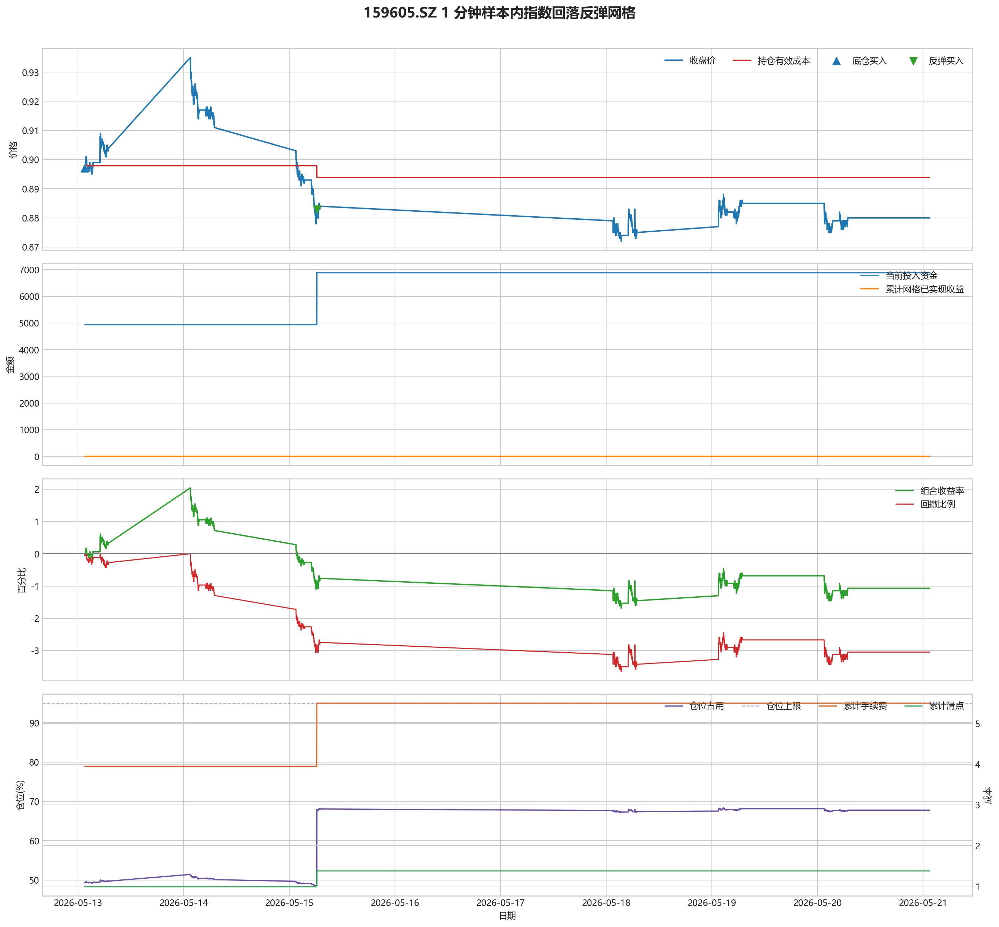
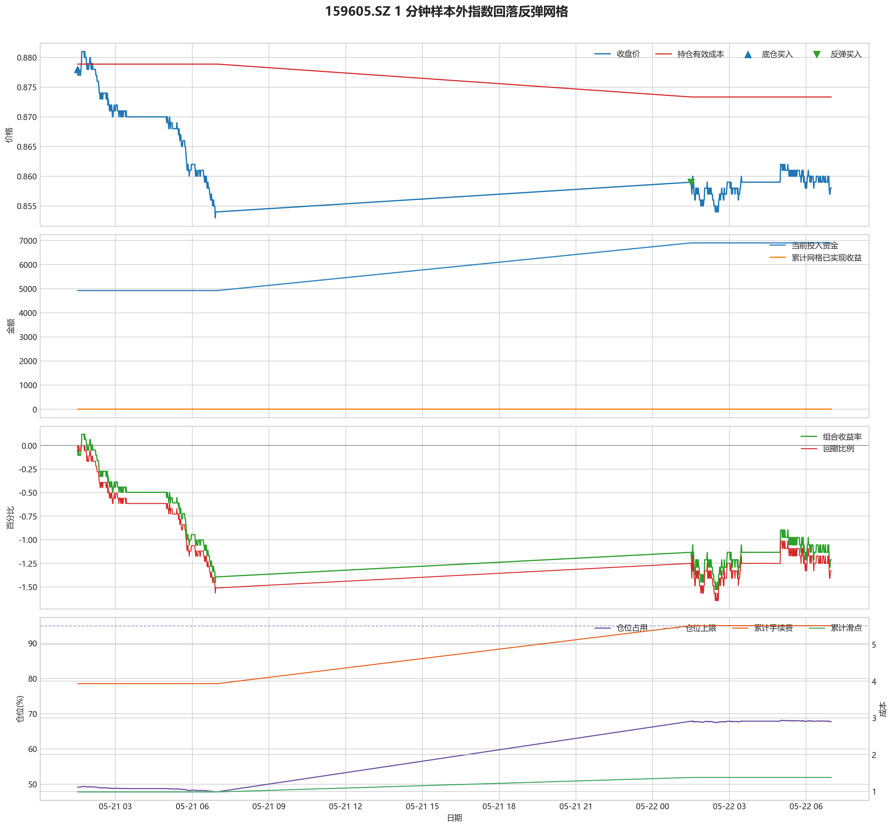

# 159605.SZ 指数回落反弹网格报告

## 摘要

- 标的：`159605.SZ`
- 数据周期：Yahoo Finance 最近 60 天 `1m`
- 样本内窗口：2026-05-13 01:30:00 至 2026-05-21 01:30:00
- 样本外窗口：2026-05-21 01:31:00 至 2026-05-22 06:59:00
- 切分方式：最近分钟线样本按 `75% / 25%` 拆分样本内与样本外
- 交易假设：首根 K 线买入 `50%` 长期底仓，其余资金按总资金 `20%` 的固定单元做网格
- 触发语义：先达到涨跌阈值，再等待从局部高低点回落/反弹确认后成交
- 最小交易单位：100 股，来源：A 股和沪深 ETF 默认 100 股
- 费用口径：`realistic`，手续费 `8.00` bps，滑点 `2.00` bps

这套固定参数在当前样本外窗口里跑赢了同标的买入持有，说明低买高卖至少没有被底仓拖累。

## 第一层：先看结论

### 先回答关键问题

| 问题 | 样本内 | 样本外 |
| --- | --- | --- |
| 策略净收益率 | -1.07% | -1.21% |
| 相对买入持有 | 91.68 | 114.73 |
| 是否跑赢买入持有 | 是 | 是 |
| 网格已实现利润 | 0.00 | 0.00 |
| 底仓浮动盈亏 | -94.49 | -112.98 |
| 网格浮动盈亏 | -8.54 | -4.28 |

### 一句话判断

- 这套固定参数在当前样本外窗口里跑赢了同标的买入持有，说明低买高卖至少没有被底仓拖累。
- 这套策略的收益来源不是“猜趋势”，而是底仓承接指数长期上涨、网格去吃短周期波动里的低买高卖。
- 真正要盯的是“策略相对买入持有多赚了多少”，而不是只看网格已实现利润。

## 第二层：展开细节

### 固定参数与交易单元

| 规则 | 参数 |
| --- | --- |
| 总资金 | 10000.00 |
| 底仓比例 | 50.00% |
| 单次网格比例 | 20.00% |
| 上涨触发 | 2.00% |
| 上涨后回落卖出 | 0.50% |
| 下跌触发 | 2.00% |
| 下跌后反弹买入 | 0.50% |
| 底仓股数 | 5500 |
| 单次网格股数 | 2200 |

### 和买入持有相比到底有没有优势

| 对比项 | 样本内 | 样本外 |
| --- | --- | --- |
| 策略期末权益 | 9893.02 | 9878.81 |
| 买入持有期末权益 | 9801.34 | 9764.08 |
| 策略相对买入持有 | 91.68 | 114.73 |
| 最大回撤 | 3.65% | 1.64% |
| 网格买入次数 | 1 | 1 |
| 网格卖出次数 | 0 | 0 |

### 样本内回测图

- 这一段价格从 `0.90` 走到 `0.88`，区间涨跌幅约 `-1.90%`。
- 样本结束时收盘价 `0.88` 仍低于有效成本 `0.89`，未平网格还处在约 `1.55%` 的浮亏区。
- 这段区间里没有完成任何网格闭环，所以图上即使有持仓波动，也还没有形成已落袋的网格利润。
- 期末未平网格浮动盈亏为 `-103.03`。
- 总账户最终仍是亏损状态，期末权益 `9893.02`；也就是说，已实现网格利润还没完全覆盖未平仓或强制退出带来的亏损。

### 样本外回测图

- 这一段价格从 `0.88` 走到 `0.86`，区间涨跌幅约 `-2.28%`。
- 样本结束时收盘价 `0.86` 仍低于有效成本 `0.87`，未平网格还处在约 `1.76%` 的浮亏区。
- 这段区间里没有完成任何网格闭环，所以图上即使有持仓波动，也还没有形成已落袋的网格利润。
- 期末未平网格浮动盈亏为 `-117.26`。
- 总账户最终仍是亏损状态，期末权益 `9878.81`；也就是说，已实现网格利润还没完全覆盖未平仓或强制退出带来的亏损。

### 交易记录和明细

#### 样本内事件流水

| 时间 | 事件类型 | 层级 | 价格 | 估算成交价 | 数量 | 金额 | 手续费 | 滑点成本 | 说明 |
| --- | --- | --- | --- | --- | --- | --- | --- | --- | --- |
| 2026-05-13 01:30:00 | base_buy | 0 | 0.90 | 0.90 | 5500 | 4938.43 | 3.95 | 0.99 | 首根 K 线建立长期底仓 |
| 2026-05-15 06:15:00 | retrace_buy | 1 | 0.88 | 0.88 | 2200 | 1944.54 | 1.55 | 0.39 | 下跌触发后从局部低点反弹，执行一笔网格买入 |

#### 样本内成交结果

暂无记录。

#### 样本外事件流水

| 时间 | 事件类型 | 层级 | 价格 | 估算成交价 | 数量 | 金额 | 手续费 | 滑点成本 | 说明 |
| --- | --- | --- | --- | --- | --- | --- | --- | --- | --- |
| 2026-05-21 01:31:00 | base_buy | 0 | 0.88 | 0.88 | 5600 | 4921.72 | 3.93 | 0.98 | 首根 K 线建立长期底仓 |
| 2026-05-22 01:30:00 | retrace_buy | 1 | 0.86 | 0.86 | 2300 | 1977.68 | 1.58 | 0.40 | 下跌触发后从局部低点反弹，执行一笔网格买入 |

#### 样本外成交结果

暂无记录。

## 最终结论

- 样本外相对买入持有差额：`114.73`。
- 样本外底仓浮动盈亏：`-112.98`；网格浮动盈亏：`-4.28`。
- 样本外网格已实现利润：`0.00`，网格买卖次数 `买 1 / 卖 0`。
- 这份报告只代表最近 60 天 `1m` 粒度下的结果，不等同于长期稳健结论；后续如果要提高可信度，应继续积累本地 1 分钟历史后重复验证。
