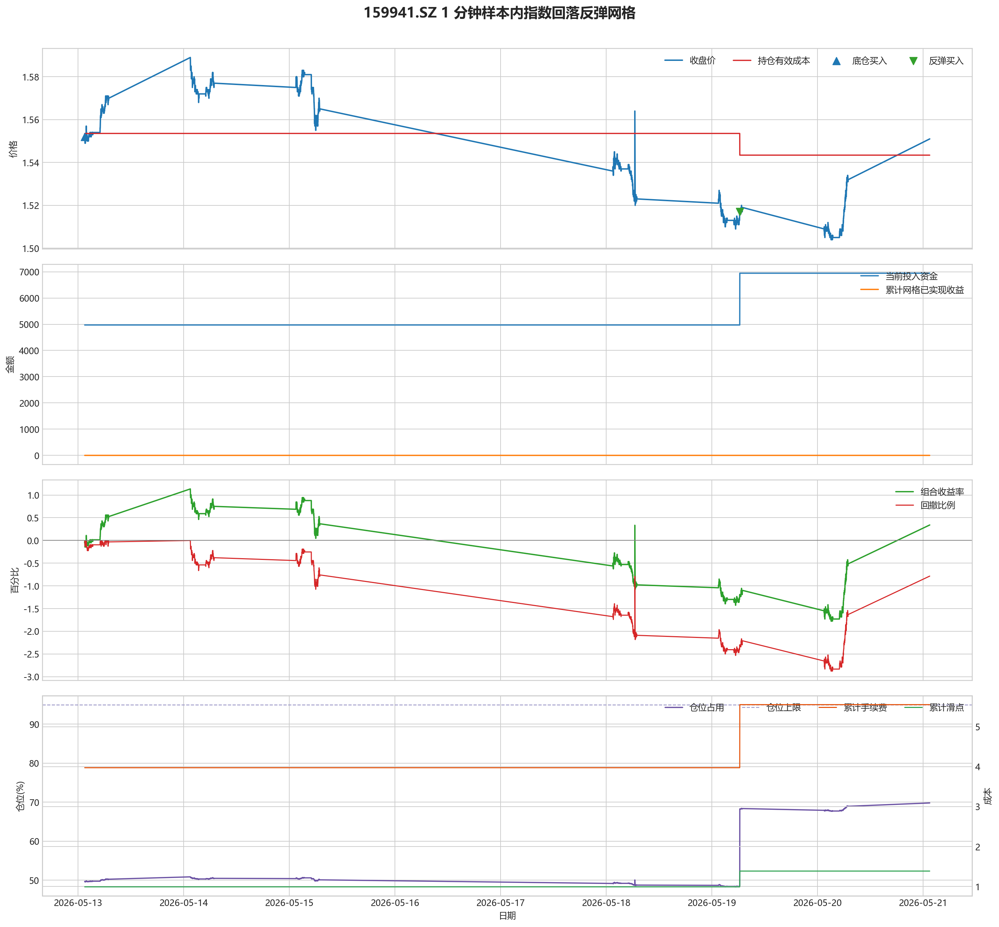
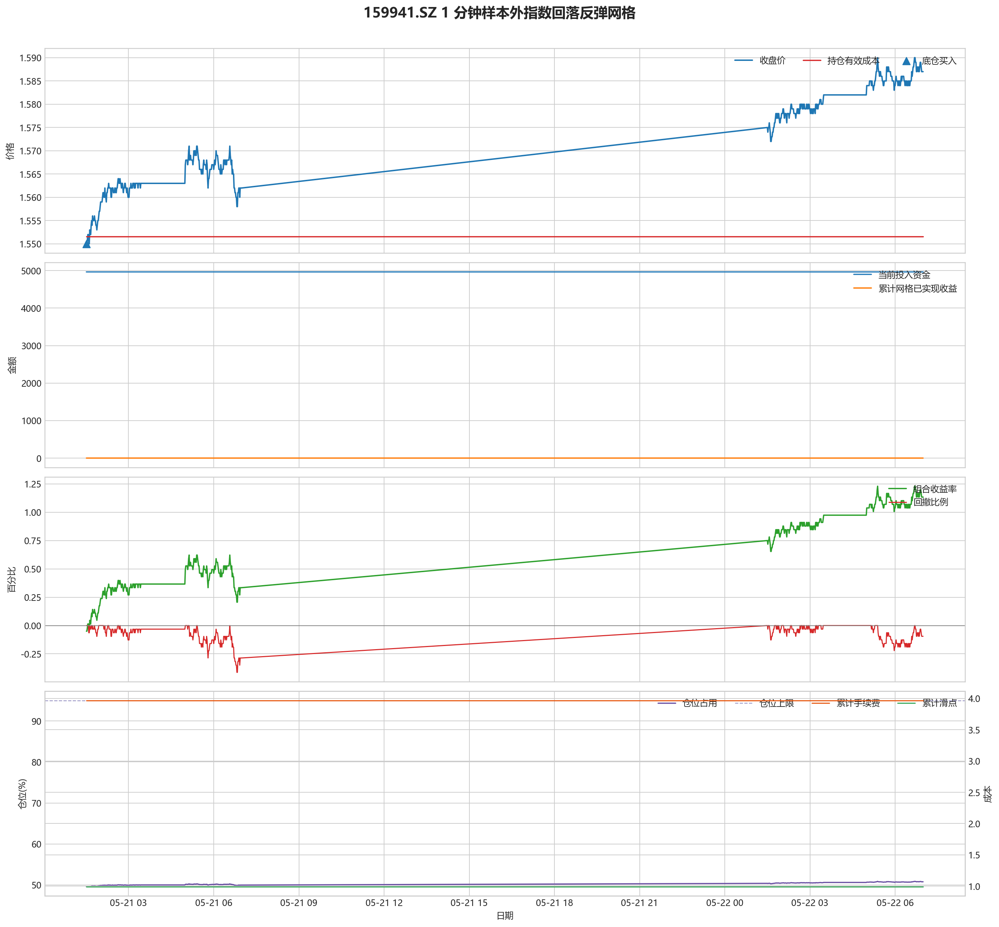

# 159941.SZ 指数回落反弹网格报告

## 摘要

- 标的：`159941.SZ`
- 数据周期：Yahoo Finance 最近 60 天 `1m`
- 样本内窗口：2026-05-13 01:30:00 至 2026-05-21 01:30:00
- 样本外窗口：2026-05-21 01:31:00 至 2026-05-22 06:59:00
- 切分方式：最近分钟线样本按 `75% / 25%` 拆分样本内与样本外
- 交易假设：首根 K 线买入 `50%` 长期底仓，其余资金按总资金 `20%` 的固定单元做网格
- 触发语义：先达到涨跌阈值，再等待从局部高低点回落/反弹确认后成交
- 最小交易单位：100 股，来源：A 股和沪深 ETF 默认 100 股
- 费用口径：`realistic`，手续费 `8.00` bps，滑点 `2.00` bps

这套固定参数在当前样本外窗口里没有跑赢同标的买入持有，说明最近 60 天的波动结构还不足以支撑这套网格占优。

## 第一层：先看结论

### 先回答关键问题

| 问题 | 样本内 | 样本外 |
| --- | --- | --- |
| 策略净收益率 | 0.34% | 1.13% |
| 相对买入持有 | 50.39 | -113.44 |
| 是否跑赢买入持有 | 是 | 否 |
| 网格已实现利润 | 0.00 | 0.00 |
| 底仓浮动盈亏 | -4.19 | 117.41 |
| 网格浮动盈亏 | 42.23 | 0.00 |

### 一句话判断

- 这套固定参数在当前样本外窗口里没有跑赢同标的买入持有，说明最近 60 天的波动结构还不足以支撑这套网格占优。
- 这套策略的收益来源不是“猜趋势”，而是底仓承接指数长期上涨、网格去吃短周期波动里的低买高卖。
- 真正要盯的是“策略相对买入持有多赚了多少”，而不是只看网格已实现利润。

## 第二层：展开细节

### 固定参数与交易单元

| 规则 | 参数 |
| --- | --- |
| 总资金 | 10000.00 |
| 底仓比例 | 50.00% |
| 单次网格比例 | 20.00% |
| 上涨触发 | 2.00% |
| 上涨后回落卖出 | 0.50% |
| 下跌触发 | 2.00% |
| 下跌后反弹买入 | 0.50% |
| 底仓股数 | 3200 |
| 单次网格股数 | 1200 |

### 和买入持有相比到底有没有优势

| 对比项 | 样本内 | 样本外 |
| --- | --- | --- |
| 策略期末权益 | 10034.06 | 10113.44 |
| 买入持有期末权益 | 9983.67 | 10226.88 |
| 策略相对买入持有 | 50.39 | -113.44 |
| 最大回撤 | 2.88% | 0.41% |
| 网格买入次数 | 1 | 0 |
| 网格卖出次数 | 0 | 0 |

### 样本内回测图

- 这一段价格从 `1.55` 走到 `1.55`，区间涨跌幅约 `-0.06%`。
- 样本结束时收盘价 `1.55` 已经回到有效成本 `1.54` 之上，未平网格按当前口径已经转回浮盈区。
- 这段区间里没有完成任何网格闭环，所以图上即使有持仓波动，也还没有形成已落袋的网格利润。
- 期末未平网格浮动盈亏为 `38.03`。
- 总账户最终是盈利状态，期末权益 `10034.06`，说明闭环利润、未平仓浮动盈亏和现金余额合计后已经转正。

### 样本外回测图

- 这一段价格从 `1.55` 走到 `1.59`，区间涨跌幅约 `2.39%`。
- 样本结束时收盘价 `1.59` 已经回到有效成本 `1.55` 之上，未平网格按当前口径已经转回浮盈区。
- 这段区间里没有完成任何网格闭环，所以图上即使有持仓波动，也还没有形成已落袋的网格利润。
- 期末未平网格浮动盈亏为 `117.41`。
- 总账户最终是盈利状态，期末权益 `10113.44`，说明闭环利润、未平仓浮动盈亏和现金余额合计后已经转正。

### 交易记录和明细

#### 样本内事件流水

| 时间 | 事件类型 | 层级 | 价格 | 估算成交价 | 数量 | 金额 | 手续费 | 滑点成本 | 说明 |
| --- | --- | --- | --- | --- | --- | --- | --- | --- | --- |
| 2026-05-13 01:30:00 | base_buy | 0 | 1.55 | 1.55 | 3200 | 4971.37 | 3.97 | 0.99 | 首根 K 线建立长期底仓 |
| 2026-05-19 06:21:00 | retrace_buy | 1 | 1.52 | 1.52 | 1300 | 1974.07 | 1.58 | 0.39 | 下跌触发后从局部低点反弹，执行一笔网格买入 |

#### 样本内成交结果

暂无记录。

#### 样本外事件流水

| 时间 | 事件类型 | 层级 | 价格 | 估算成交价 | 数量 | 金额 | 手续费 | 滑点成本 | 说明 |
| --- | --- | --- | --- | --- | --- | --- | --- | --- | --- |
| 2026-05-21 01:31:00 | base_buy | 0 | 1.55 | 1.55 | 3200 | 4964.96 | 3.97 | 0.99 | 首根 K 线建立长期底仓 |

#### 样本外成交结果

暂无记录。

## 最终结论

- 样本外相对买入持有差额：`-113.44`。
- 样本外底仓浮动盈亏：`117.41`；网格浮动盈亏：`0.00`。
- 样本外网格已实现利润：`0.00`，网格买卖次数 `买 0 / 卖 0`。
- 这份报告只代表最近 60 天 `1m` 粒度下的结果，不等同于长期稳健结论；后续如果要提高可信度，应继续积累本地 1 分钟历史后重复验证。
