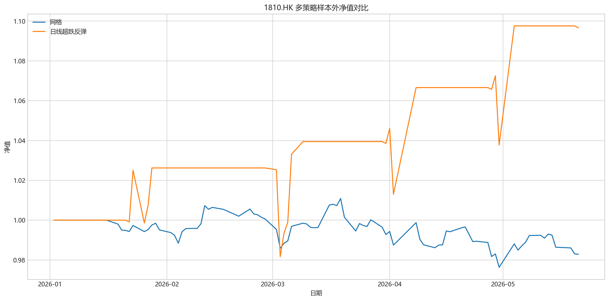

# 1810.HK 多策略对比报告

## 摘要

- 标的：`1810.HK`
- 周期：`1d`
- 策略集合：网格, 日线超跌反弹
- 推荐结论：当前更推荐 `日线超跌反弹`，因为它在样本外给出了 `9.66%` 的净收益率，同时最大回撤控制在 `4.35%`。
- 报告重点回答：在左侧下跌、偶尔反抽和日内冲高回落的结构下，是否有比网格更契合的做多策略。

## 第一层：先看结论

| 策略名称 | 策略代码 | 样本内净收益率 | 样本内最大回撤 | 样本外净收益率 | 样本外最大回撤 | 样本外手续费 | 样本外成交笔数 | 止盈参数(%) |
| --- | --- | --- | --- | --- | --- | --- | --- | --- |
| 网格 | grid | -3.64% | 4.36% | -1.71% | 3.42% | 100.97 | 4 | 3.00 |
| 日线超跌反弹 | daily_rebound | 8.80% | 3.40% | 9.66% | 4.35% | 1345.62 | 4 | 3.00 |

- 当前更推荐 `日线超跌反弹`，因为它在样本外给出了 `9.66%` 的净收益率，同时最大回撤控制在 `4.35%`。
- 如果样本外净收益接近，但新策略显著降低回撤，也视为比网格更契合当前结构。

## 第二层：展开细节

### 各策略样本外净值对比

### 各策略参数与结论

- `网格`：样本内最优参数为 `grid_spacing=7.00%, grid_count=7, take_profit=3.00%`；样本外净收益率 `-1.71%`，最大回撤 `3.42%`。
- `日线超跌反弹`：样本内最优参数为 `rsi_window=8, rsi_entry=20.0, ma_window=10, deviation_entry_pct=-4.0, stop_loss_atr=1.5, max_hold_bars=5`；样本外净收益率 `9.66%`，最大回撤 `4.35%`。

### 结果怎么读

- 网格更依赖价格在下跌后进入震荡，已经落袋的闭环利润不代表总账户一定转正。
- 日线超跌反弹更偏向少做、等极端价差后出手，适合减少左侧持续下跌中的反复接刀。
- 分钟急跌反抽更偏向抓短促回补；叠加冲高回落过滤后，目标是减少日内追高后被砸回来的无效交易。

## 最终结论

- 推荐策略：`日线超跌反弹`。
- 推荐依据：样本外净收益率 `9.66%`，最大回撤 `4.35%`。
- 这份报告只基于仓库当前小米样本，不构成实盘建议；后续若扩到更多港股，应继续做跨标的稳健性检验。
