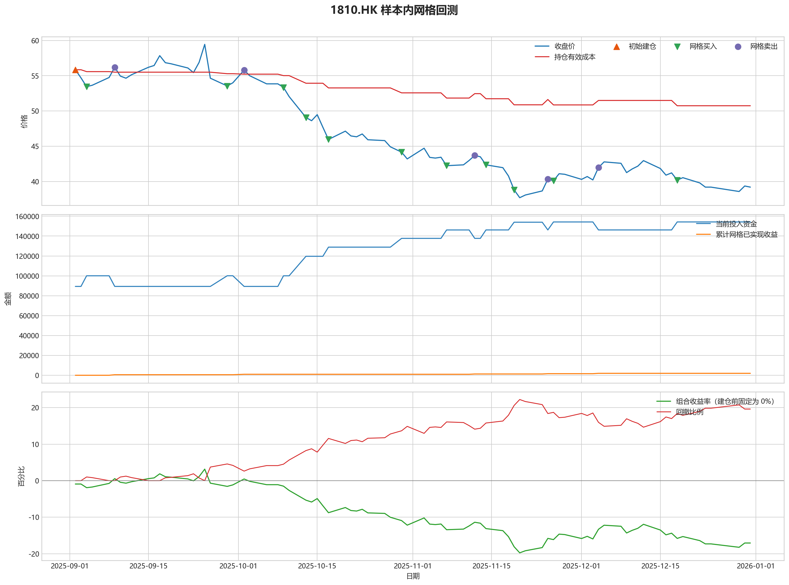
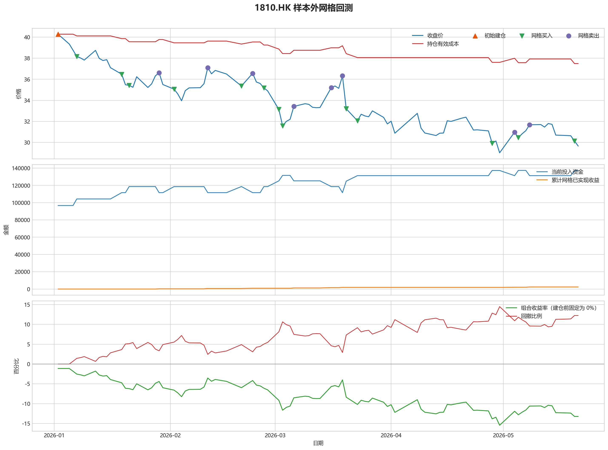

# 1810.HK 网格回测报告

## 摘要

- 标的：`1810.HK`
- 样本内窗口：2025-09-02 至 2025-12-31
- 样本外窗口：2026-01-01 至 2026-05-21
- 初始规则：样本开始时投入 50% 资金建底仓，剩余 50% 资金做网格买卖
- 最小交易单位：200 股，来源：AASTOCKS 快照页 Lot Size
- 固定底仓数量：1600 股
- 单层网格固定数量：200 股
- 最优参数：网格间距 4.00% / 网格层数 7 / 止盈比例 3.00%

这套网格当前更像摊薄成本工具，还不能证明它能稳定把总账户做成正收益。

## 第一层：先看结论

### 先回答 4 个问题

| 问题 | 样本内 | 样本外 | 怎么理解 |
| --- | --- | --- | --- |
| 这套策略能不能赚钱 | -16.30% | -12.24% | 当前还不能证明这套网格能稳定盈利，它更像在下跌和震荡里帮助你摊低持仓成本。 |
| 比只拿底仓好不好 | -7506.00 | -976.00 | 正数表示网格比只拿底仓更好，负数表示网格反而拖累了结果。 |
| 最坏会亏到什么程度 | 22.22% | 14.49% | 这是账户在样本期间相对阶段高点出现过的最大回撤。 |
| 这组参数稳不稳 | 稳健分 -10.32 | 沿用同一组参数 | 不是只看一整段最高分，而是看多窗口表现是否稳定。当前结果：33% 窗口为正，最差窗口收益 `-9.02%`，收益波动 `4.60` 个百分点。 |

### 一句话判断

- 这套网格当前更像摊薄成本工具，还不能证明它能稳定把总账户做成正收益。
- 当前正式拿去实盘的证据还不够，更合理的定位是：先把它当成“网格摊成本策略”，不是“已经验证可稳定盈利的策略”。
- 如果你只想知道现在值不值得继续研究，看完上面这张表就够了。

## 第二层：展开细节

### 参数是怎么选的

| 筛选环节 | 结果 | 你该怎么理解 |
| --- | --- | --- |
| 候选组合数 | 60 | 先把候选参数全部跑完，不做随机抽样。 |
| 单窗综合分 | -27.28 | 这是整段样本内的收益、回撤、成本摊薄综合分。 |
| 稳健窗口数 | 3 | 再把样本内按时间顺序拆成多个连续窗口，检查同一参数会不会只在一小段行情里好看。 |
| 稳健分 RobustScore | -10.32 | 计算方式：0.6 x 窗口平均分 + 0.4 x 最差窗口分 - 0.25 x 窗口收益波动。 |
| 最终入选参数 | 间距 4.00% / 层数 7 / 止盈 3.00% | 优先挑多窗口更稳的组合，而不是只挑单窗最亮的孤点。 |

### 关键结果对照

| 指标 | 样本内 | 样本外 | 怎么读 |
| --- | --- | --- | --- |
| 收益率 | -16.30% | -12.24% | 先看能不能赚钱。 |
| 最大回撤 | 22.22% | 14.49% | 再看亏起来最难受会到什么程度。 |
| 有效持仓成本 | 50.74 | 37.49 | 看网格有没有把手里剩余仓位的成本压低。 |
| 已实现网格收益 | 1972.00 | 2352.00 | 这是已经完成低买高卖、真正落袋的利润，不等于总账户收益。 |
| 网格闭环次数 | 5 | 8 | 次数越多，说明震荡里成交越频繁；但次数多不等于总账户一定赚钱。 |

### 网格到底有没有帮忙

| 对比项 | 样本内 | 样本外 |
| --- | --- | --- |
| 只拿底仓收益率 | -13.32% | -12.74% |
| 网格策略收益率 | -16.30% | -12.24% |
| 网格相对底仓多赚/多亏 | -7506.00 | -976.00 |

补一句最重要的解释：

- “网格已实现收益”只代表已经完成低买高卖、真正落袋的那部分利润。
- 真正决定你账户最后赚没赚钱的，是“底仓浮盈浮亏 + 未平仓网格浮盈浮亏 + 已实现网格收益”三者一起的结果。
- 所以完全可能出现“网格已经落袋赚钱，但总账户还是亏钱”的情况。

### 图表速读总结

#### 样本内回测图

- 这一段价格从 `55.85` 走到 `39.20`，区间涨跌幅约 `-29.81%`。
- 样本结束时收盘价 `39.20` 仍低于有效成本 `50.74`，剩余持仓按摊薄口径还处在约 `22.75%` 的浮亏区。
- 图里的买卖点一共完成了 `5` 轮网格闭环，已经落袋的网格利润累计 `1972.00`。
- 总账户最终仍是亏损状态，期末权益 `165854.00`；也就是说，网格已实现利润还没完全覆盖底仓和未平仓仓位的回撤。

#### 热力图

- 热力图横轴是网格间距，纵轴是网格层数，颜色越偏绿代表稳健评分越高；每个格子里没有单独画出的止盈比例，已经折叠成该格子的最好结果。
- 当前样本里，最优参数落在“网格间距 `4.00%` / 网格层数 `7` / 止盈比例 `3.00%`”。
- 从前几名结果看，高分区域主要集中在网格间距 `4.00%`、网格层数 `7` 附近。
- 最亮的区域不是单个点，而是网格层数 `6` 到 `7` 的一段平台，说明继续把层数加深，并没有明显抬高综合得分。

#### 2026 样本外验证

- 样本外账户最终从 `200000` 走到 `173536.00`，总盈亏 `-26464.00`。
- 样本外固定底仓仍按最小交易单位 `200` 股执行，单层网格固定数量是 `200` 股。
- 样本外没有转正，说明这组参数更像在帮你缓冲下跌，而不是独立制造稳定盈利。

#### 样本外回测图

- 这一段价格从 `40.28` 走到 `29.66`，区间涨跌幅约 `-26.37%`。
- 样本结束时收盘价 `29.66` 仍低于有效成本 `37.49`，剩余持仓按摊薄口径还处在约 `20.89%` 的浮亏区。
- 图里的买卖点一共完成了 `8` 轮网格闭环，已经落袋的网格利润累计 `2352.00`。
- 总账户最终仍是亏损状态，期末权益 `173536.00`；也就是说，网格已实现利润还没完全覆盖底仓和未平仓仓位的回撤。

### 交易记录和明细

如果你只是想判断策略值不值得继续，到这里通常已经够了；下面这些表主要用于追交易过程和排查归因。

### 样本内事件流水

| 时间 | 事件类型 | 层级 | 价格 | 数量 | 金额 | 说明 |
| --- | --- | --- | --- | --- | --- | --- |
| 2025-09-02 | base_buy | 0 | 55.85 | 1600 | 89360.00 | 样本开始时初始建仓 |
| 2025-09-04 | grid_buy | 1 | 53.45 | 200 | 10690.00 | 触发下行网格买入 |
| 2025-09-09 | grid_sell | 1 | 56.20 | 200 | 11240.00 | 达到网格止盈价后卖出本层仓位 |
| 2025-09-29 | grid_buy | 1 | 53.55 | 200 | 10710.00 | 触发下行网格买入 |
| 2025-10-02 | grid_sell | 1 | 55.80 | 200 | 11160.00 | 达到网格止盈价后卖出本层仓位 |
| 2025-10-09 | grid_buy | 1 | 53.35 | 200 | 10670.00 | 触发下行网格买入 |
| 2025-10-13 | grid_buy | 2 | 49.08 | 200 | 9816.00 | 触发下行网格买入 |
| 2025-10-13 | grid_buy | 3 | 49.08 | 200 | 9816.00 | 触发下行网格买入 |
| 2025-10-17 | grid_buy | 4 | 45.96 | 200 | 9192.00 | 触发下行网格买入 |
| 2025-10-30 | grid_buy | 5 | 44.16 | 200 | 8832.00 | 触发下行网格买入 |
| 2025-11-07 | grid_buy | 6 | 42.24 | 200 | 8448.00 | 触发下行网格买入 |
| 2025-11-12 | grid_sell | 6 | 43.70 | 200 | 8740.00 | 达到网格止盈价后卖出本层仓位 |
| 2025-11-14 | grid_buy | 6 | 42.36 | 200 | 8472.00 | 触发下行网格买入 |
| 2025-11-19 | grid_buy | 7 | 38.82 | 200 | 7764.00 | 触发下行网格买入 |
| 2025-11-25 | grid_sell | 7 | 40.34 | 200 | 8068.00 | 达到网格止盈价后卖出本层仓位 |
| 2025-11-26 | grid_buy | 7 | 40.10 | 200 | 8020.00 | 触发下行网格买入 |
| 2025-12-04 | grid_sell | 7 | 41.98 | 200 | 8396.00 | 达到网格止盈价后卖出本层仓位 |
| 2025-12-18 | grid_buy | 7 | 40.20 | 200 | 8040.00 | 触发下行网格买入 |

### 样本内成交结果

| 开仓时间 | 平仓时间 | 持有时长 | 开仓价 | 平仓价 | 数量 | 盈亏 | 收益率(%) | 仓位类型 |
| --- | --- | --- | --- | --- | --- | --- | --- | --- |
| 2025-09-04 00:00:00 | 2025-09-09 00:00:00 | 5 days 00:00:00 | 53.45 | 56.20 | 200 | 550.00 | 5.14 | 网格 1 |
| 2025-09-29 00:00:00 | 2025-10-02 00:00:00 | 3 days 00:00:00 | 53.55 | 55.80 | 200 | 450.00 | 4.20 | 网格 1 |
| 2025-11-07 00:00:00 | 2025-11-12 00:00:00 | 5 days 00:00:00 | 42.24 | 43.70 | 200 | 292.00 | 3.46 | 网格 6 |
| 2025-11-19 00:00:00 | 2025-11-25 00:00:00 | 6 days 00:00:00 | 38.82 | 40.34 | 200 | 304.00 | 3.92 | 网格 7 |
| 2025-11-26 00:00:00 | 2025-12-04 00:00:00 | 8 days 00:00:00 | 40.10 | 41.98 | 200 | 376.00 | 4.69 | 网格 7 |
| 2025-09-02 00:00:00 | 2025-12-30 00:00:00 | 119 days 00:00:00 | 55.85 | 39.36 | 1600 | -26384.00 | -29.53 | 底仓 |
| 2025-10-09 00:00:00 | 2025-12-30 00:00:00 | 82 days 00:00:00 | 53.35 | 39.36 | 200 | -2798.00 | -26.22 | 网格 1 |
| 2025-10-13 00:00:00 | 2025-12-30 00:00:00 | 78 days 00:00:00 | 49.08 | 39.36 | 200 | -1944.00 | -19.80 | 网格 2 |
| 2025-10-13 00:00:00 | 2025-12-30 00:00:00 | 78 days 00:00:00 | 49.08 | 39.36 | 200 | -1944.00 | -19.80 | 网格 3 |
| 2025-10-17 00:00:00 | 2025-12-30 00:00:00 | 74 days 00:00:00 | 45.96 | 39.36 | 200 | -1320.00 | -14.36 | 网格 4 |
| 2025-10-30 00:00:00 | 2025-12-30 00:00:00 | 61 days 00:00:00 | 44.16 | 39.36 | 200 | -960.00 | -10.87 | 网格 5 |
| 2025-11-14 00:00:00 | 2025-12-30 00:00:00 | 46 days 00:00:00 | 42.36 | 39.36 | 200 | -600.00 | -7.08 | 网格 6 |
| 2025-12-18 00:00:00 | 2025-12-30 00:00:00 | 12 days 00:00:00 | 40.20 | 39.36 | 200 | -168.00 | -2.09 | 网格 7 |

### 样本外事件流水

| 时间 | 事件类型 | 层级 | 价格 | 数量 | 金额 | 说明 |
| --- | --- | --- | --- | --- | --- | --- |
| 2026-01-02 | base_buy | 0 | 40.28 | 2400 | 96672.00 | 样本开始时初始建仓 |
| 2026-01-07 | grid_buy | 1 | 38.16 | 200 | 7632.00 | 触发下行网格买入 |
| 2026-01-19 | grid_buy | 2 | 36.48 | 200 | 7296.00 | 触发下行网格买入 |
| 2026-01-21 | grid_buy | 3 | 35.42 | 200 | 7084.00 | 触发下行网格买入 |
| 2026-01-29 | grid_sell | 3 | 36.62 | 200 | 7324.00 | 达到网格止盈价后卖出本层仓位 |
| 2026-02-02 | grid_buy | 3 | 35.06 | 200 | 7012.00 | 触发下行网格买入 |
| 2026-02-11 | grid_sell | 3 | 37.10 | 200 | 7420.00 | 达到网格止盈价后卖出本层仓位 |
| 2026-02-20 | grid_buy | 3 | 35.36 | 200 | 7072.00 | 触发下行网格买入 |
| 2026-02-23 | grid_sell | 3 | 36.56 | 200 | 7312.00 | 达到网格止盈价后卖出本层仓位 |
| 2026-02-26 | grid_buy | 3 | 35.18 | 200 | 7036.00 | 触发下行网格买入 |
| 2026-03-02 | grid_buy | 4 | 33.14 | 200 | 6628.00 | 触发下行网格买入 |
| 2026-03-03 | grid_buy | 5 | 31.58 | 200 | 6316.00 | 触发下行网格买入 |
| 2026-03-06 | grid_sell | 5 | 33.42 | 200 | 6684.00 | 达到网格止盈价后卖出本层仓位 |
| 2026-03-16 | grid_sell | 4 | 35.20 | 200 | 7040.00 | 达到网格止盈价后卖出本层仓位 |
| 2026-03-19 | grid_sell | 3 | 36.32 | 200 | 7264.00 | 达到网格止盈价后卖出本层仓位 |
| 2026-03-20 | grid_buy | 3 | 33.20 | 200 | 6640.00 | 触发下行网格买入 |
| 2026-03-20 | grid_buy | 4 | 33.20 | 200 | 6640.00 | 触发下行网格买入 |
| 2026-03-23 | grid_buy | 5 | 32.06 | 200 | 6412.00 | 触发下行网格买入 |
| 2026-04-28 | grid_buy | 6 | 29.92 | 200 | 5984.00 | 触发下行网格买入 |
| 2026-05-04 | grid_sell | 6 | 30.98 | 200 | 6196.00 | 达到网格止盈价后卖出本层仓位 |
| 2026-05-05 | grid_buy | 6 | 30.46 | 200 | 6092.00 | 触发下行网格买入 |
| 2026-05-08 | grid_sell | 6 | 31.68 | 200 | 6336.00 | 达到网格止盈价后卖出本层仓位 |
| 2026-05-20 | grid_buy | 6 | 30.14 | 200 | 6028.00 | 触发下行网格买入 |

### 样本外成交结果

| 开仓时间 | 平仓时间 | 持有时长 | 开仓价 | 平仓价 | 数量 | 盈亏 | 收益率(%) | 仓位类型 |
| --- | --- | --- | --- | --- | --- | --- | --- | --- |
| 2026-01-21 00:00:00 | 2026-01-29 00:00:00 | 8 days 00:00:00 | 35.42 | 36.62 | 200 | 240.00 | 3.39 | 网格 3 |
| 2026-02-02 00:00:00 | 2026-02-11 00:00:00 | 9 days 00:00:00 | 35.06 | 37.10 | 200 | 408.00 | 5.82 | 网格 3 |
| 2026-02-20 00:00:00 | 2026-02-23 00:00:00 | 3 days 00:00:00 | 35.36 | 36.56 | 200 | 240.00 | 3.39 | 网格 3 |
| 2026-03-03 00:00:00 | 2026-03-06 00:00:00 | 3 days 00:00:00 | 31.58 | 33.42 | 200 | 368.00 | 5.83 | 网格 5 |
| 2026-03-02 00:00:00 | 2026-03-16 00:00:00 | 14 days 00:00:00 | 33.14 | 35.20 | 200 | 412.00 | 6.22 | 网格 4 |
| 2026-02-26 00:00:00 | 2026-03-19 00:00:00 | 21 days 00:00:00 | 35.18 | 36.32 | 200 | 228.00 | 3.24 | 网格 3 |
| 2026-04-28 00:00:00 | 2026-05-04 00:00:00 | 6 days 00:00:00 | 29.92 | 30.98 | 200 | 212.00 | 3.54 | 网格 6 |
| 2026-05-05 00:00:00 | 2026-05-08 00:00:00 | 3 days 00:00:00 | 30.46 | 31.68 | 200 | 244.00 | 4.01 | 网格 6 |
| 2026-01-02 00:00:00 | 2026-05-20 00:00:00 | 138 days 00:00:00 | 40.28 | 30.14 | 2400 | -24336.00 | -25.17 | 底仓 |
| 2026-01-07 00:00:00 | 2026-05-20 00:00:00 | 133 days 00:00:00 | 38.16 | 30.14 | 200 | -1604.00 | -21.02 | 网格 1 |
| 2026-01-19 00:00:00 | 2026-05-20 00:00:00 | 121 days 00:00:00 | 36.48 | 30.14 | 200 | -1268.00 | -17.38 | 网格 2 |
| 2026-03-20 00:00:00 | 2026-05-20 00:00:00 | 61 days 00:00:00 | 33.20 | 30.14 | 200 | -612.00 | -9.22 | 网格 3 |
| 2026-03-20 00:00:00 | 2026-05-20 00:00:00 | 61 days 00:00:00 | 33.20 | 30.14 | 200 | -612.00 | -9.22 | 网格 4 |
| 2026-03-23 00:00:00 | 2026-05-20 00:00:00 | 58 days 00:00:00 | 32.06 | 30.14 | 200 | -384.00 | -5.99 | 网格 5 |
| 2026-05-20 00:00:00 | 2026-05-20 00:00:00 | 0 days 00:00:00 | 30.14 | 30.14 | 200 | 0.00 | 0.00 | 网格 6 |

## 最终结论

- 这套参数更适合“先跌一段、再进入震荡或反弹”的行情，因为它依赖反弹来兑现网格利润。
- 如果行情持续单边下跌，网格只能帮你部分摊低成本，不能替代止损、趋势过滤或停手机制。
- 当前样本下，成本摊薄效果是存在的：样本内下降 9.15%，样本外下降 6.92%。
- 如果后续继续扩展策略，优先方向应该是加入趋势过滤或分阶段停手机制，而不是单纯增加网格层数。
