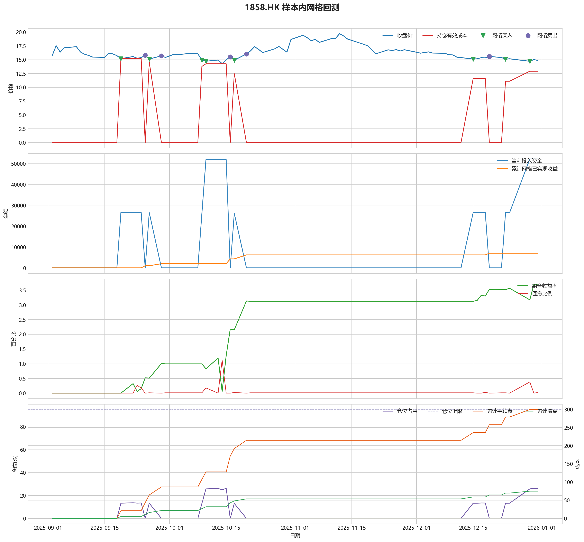
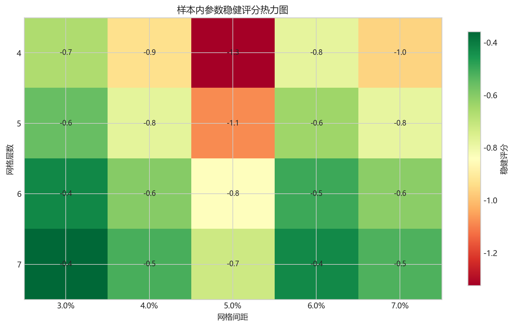
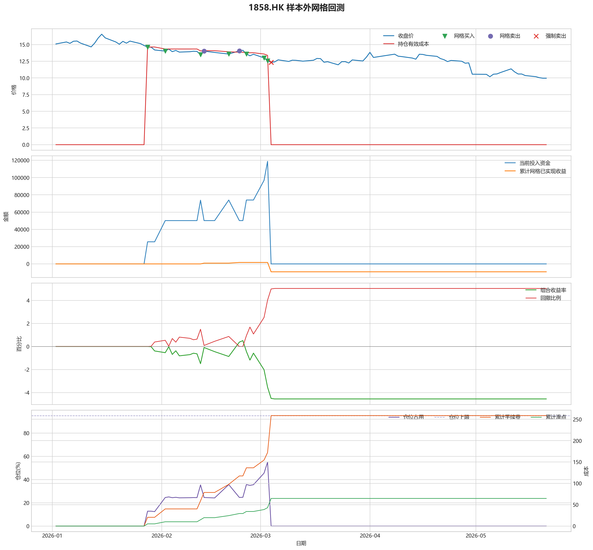

# 1858.HK 网格回测报告

## 摘要

- 标的：`1858.HK`
- 样本内窗口：2025-09-02 至 2025-12-31
- 样本外窗口：2026-01-01 至 2026-05-21
- 网格模式：纯现金网格，不在样本起点建立底仓；第一根 K 线收盘价只作为网格锚点
- 最小交易单位：250 股，来源：AASTOCKS 快照页 Lot Size
- 单层网格固定数量：1750 股
- 左侧处理：`both`，强制退出阈值 `5.00%` 总资金浮亏
- 执行口径：`realistic`，手续费 `8.00` bps，滑点 `2.00` bps
- 最优参数：网格间距 3.00% / 网格层数 7 / 止盈比例 3.00%

这套网格在不同阶段表现不一致，说明它对行情结构比较敏感，不能只看单段结果下结论。

## 第一层：先看结论

### 先回答关键问题

| 问题 | 样本内 | 样本外 | 怎么理解 |
| --- | --- | --- | --- |
| 这套策略能不能赚钱 | 3.68% | -4.56% | 当前还不能证明这套网格能稳定盈利，尤其要继续观察单边下跌时未平仓风险如何处理。 |
| 比现金闲置好不好 | 7363.63 | -9111.81 | 正数表示网格策略赚到钱，负数表示不交易反而更好。 |
| 比买入持有好不好 | 17997.00 | 57774.40 | 买入持有用同样资金、交易单位和执行口径估算，正数表示网格更好。 |
| 交易成本高不高 | 299.39 | 258.58 | 这里统计手续费，滑点会单独体现在估算成交价和滑点成本里。 |
| 最坏会亏到什么程度 | 1.13% | 5.04% | 这是账户在样本期间相对阶段高点出现过的最大回撤。 |
| 这组参数稳不稳 | 稳健分 -0.36 | 沿用同一组参数 | 不是只看一整段最高分，而是看多窗口表现是否稳定。当前结果：67% 窗口为正，最差窗口收益 `-0.24%`，收益波动 `0.45` 个百分点。 |

### 一句话判断

- 这套网格在不同阶段表现不一致，说明它对行情结构比较敏感，不能只看单段结果下结论。
- 当前正式拿去实盘的证据还不够，更合理的定位是：先验证它能否通过网格闭环赚钱，再看左侧行情下能否控制亏损。
- 如果你只想知道现在值不值得继续研究，看完上面这张表就够了。

## 第二层：展开细节

### 参数是怎么选的

| 筛选环节 | 结果 | 你该怎么理解 |
| --- | --- | --- |
| 执行口径 | realistic | 手续费 8.00 bps，滑点 2.00 bps。 |
| 候选组合数 | 60 | 先把候选参数全部跑完，不做随机抽样。 |
| 单窗综合分 | 4.65 | 这是整段样本内的收益、回撤、闭环网格利润综合分。 |
| 稳健窗口数 | 3 | 再把样本内按时间顺序拆成多个连续窗口，检查同一参数会不会只在一小段行情里好看。 |
| 稳健分 RobustScore | -0.36 | 计算方式：0.6 x 窗口平均分 + 0.4 x 最差窗口分 - 0.25 x 窗口收益波动。 |
| 最终入选参数 | 间距 3.00% / 层数 7 / 止盈 3.00% | 优先挑多窗口更稳的组合，而不是只挑单窗最亮的孤点。 |

### 关键结果对照

| 指标 | 样本内 | 样本外 | 怎么读 |
| --- | --- | --- | --- |
| 净收益率 | 3.68% | -4.56% | 已经按当前执行口径扣除回测引擎支持的费用影响。 |
| 最大回撤 | 1.13% | 5.04% | 再看亏起来最难受会到什么程度。 |
| 交易成本 | 299.39 | 258.58 | 策略内部估算的手续费累计值，帮助判断网格频繁交易是否吃掉收益。 |
| 滑点成本 | 74.84 | 64.65 | 按收盘价和估算成交价差额累计，属于近似实盘口径。 |
| 未平网格有效成本 | 12.91 | 0.00 | 只在期末仍有未平网格仓位时有意义。 |
| 闭环网格净利润 | 7004.93 | -9143.22 | 这是已经完成低买高卖、真正落袋的利润，不等于总账户收益。 |
| 未平网格浮动盈亏 | -244.16 | 0.00 | hold 口径会保留这部分风险，force_exit 口径触发后通常回到 0。 |
| 网格闭环次数 | 6 | 2 | 次数越多，说明震荡里成交越频繁；但次数多不等于总账户一定赚钱。 |

### 执行口径和风控约束

| 约束 | 样本内 | 样本外 |
| --- | --- | --- |
| 执行口径 | realistic | realistic |
| 网格模式 | cash | cash |
| 左侧处理口径 | both | both |
| 手续费 / 滑点 | 8.00 / 2.00 bps | 8.00 / 2.00 bps |
| 最大仓位占用 | 26.29% / 上限 95.00% | 54.99% / 上限 95.00% |
| 停手事件 | 0 | 0 |
| 强制退出事件 | 0 | 5 |

### 网格到底有没有帮忙

| 对比项 | 样本内 | 样本外 |
| --- | --- | --- |
| 现金闲置收益率 | 0.00% | 0.00% |
| 买入持有收益率 | -5.32% | -33.44% |
| 网格策略收益率 | 3.68% | -4.56% |
| 网格相对现金闲置多赚/多亏 | 7363.63 | -9111.81 |
| 网格相对买入持有多赚/多亏 | 17997.00 | 57774.40 |

### 左侧行情怎么处理

| 左侧口径 | 样本内净收益率 | 样本内闭环利润 | 样本内浮动盈亏 | 样本内强平 | 样本外净收益率 | 样本外闭环利润 | 样本外浮动盈亏 | 样本外强平 |
| --- | --- | --- | --- | --- | --- | --- | --- | --- |
| hold：未平网格继续持有 | 3.68% | 7004.93 | -244.16 | 否 | -14.04% | 8292.61 | -36435.36 | 否 |
| force_exit：达到亏损阈值强平 | 3.68% | 7004.93 | -244.16 | 否 | -4.56% | -9143.22 | 0.00 | 是 |

补一句最重要的解释：

- “网格已实现收益”只代表已经完成低买高卖、真正落袋的那部分利润。
- 真正决定你账户最后赚没赚钱的，是“已实现网格收益 + 未平仓网格浮动盈亏 + 现金余额”三者一起的结果。
- 所以完全可能出现“网格已经落袋赚钱，但总账户还是亏钱”的情况。

### 图表速读总结

#### 样本内回测图

- 这一段价格从 `15.69` 走到 `14.86`，区间涨跌幅约 `-5.32%`。
- 样本结束时收盘价 `14.86` 已经回到有效成本 `12.91` 之上，未平网格按当前口径已经转回浮盈区。
- 图里的买卖点一共完成了 `6` 轮网格闭环，已经落袋的网格利润累计 `7004.93`。
- 期末未平网格浮动盈亏为 `-244.16`。
- 总账户最终是盈利状态，期末权益 `207363.63`，说明闭环利润、未平仓浮动盈亏和现金余额合计后已经转正。

#### 热力图

- 热力图横轴是网格间距，纵轴是网格层数，颜色越偏绿代表稳健评分越高；每个格子里没有单独画出的止盈比例，已经折叠成该格子的最好结果。
- 当前样本里，最优参数落在“网格间距 `3.00%` / 网格层数 `7` / 止盈比例 `3.00%`”。
- 从前几名结果看，高分区域主要集中在网格间距 `6.00%`、网格层数 `7` 附近。
- 最优点比较集中在网格间距 `3.00%`、网格层数 `7` 附近，说明这组参数不是完全随机撞出来的。

#### 2026 样本外验证

- 样本外账户最终从 `200000` 走到 `190888.19`，总盈亏 `-9111.81`。
- 样本外单层网格按最小交易单位 `250` 股取整，固定数量是 `1750` 股。
- 样本外没有转正，说明这组参数还不能在该行情结构下独立制造稳定盈利。

#### 样本外回测图

- 这一段价格从 `15.09` 走到 `9.96`，区间涨跌幅约 `-34.00%`。
- 样本结束时没有未平网格仓位，剩余风险已经体现在现金和已实现利润里。
- 图里的买卖点一共完成了 `2` 轮网格闭环，已经落袋的网格利润累计 `-9143.22`。
- 左侧强制退出已经触发，后续不再继续开新网格。
- 总账户最终仍是亏损状态，期末权益 `190888.19`；也就是说，已实现网格利润还没完全覆盖未平仓或强制退出带来的亏损。

### 交易记录和明细

如果你只是想判断策略值不值得继续，到这里通常已经够了；下面这些表主要用于追交易过程和排查归因。

### 样本内事件流水

| 时间 | 事件类型 | 层级 | 价格 | 估算成交价 | 数量 | 金额 | 手续费 | 滑点成本 | 说明 |
| --- | --- | --- | --- | --- | --- | --- | --- | --- | --- |
| 2025-09-19 | grid_buy | 1 | 15.18 | 15.19 | 1750 | 26595.64 | 21.26 | 5.31 | 触发下行网格买入 |
| 2025-09-25 | grid_sell | 1 | 15.79 | 15.79 | 1750 | 27611.09 | 22.11 | 5.53 | 达到网格止盈价后卖出本层仓位 |
| 2025-09-26 | grid_buy | 1 | 15.11 | 15.12 | 1750 | 26474.75 | 21.16 | 5.29 | 触发下行网格买入 |
| 2025-09-29 | grid_sell | 1 | 15.69 | 15.69 | 1750 | 27438.74 | 21.97 | 5.49 | 达到网格止盈价后卖出本层仓位 |
| 2025-10-09 | grid_buy | 1 | 14.90 | 14.90 | 1750 | 26094.81 | 20.86 | 5.21 | 触发下行网格买入 |
| 2025-10-10 | grid_buy | 2 | 14.72 | 14.72 | 1750 | 25783.95 | 20.61 | 5.15 | 触发下行网格买入 |
| 2025-10-16 | grid_sell | 1 | 15.50 | 15.49 | 1750 | 27094.03 | 21.69 | 5.42 | 达到网格止盈价后卖出本层仓位 |
| 2025-10-16 | grid_sell | 2 | 15.50 | 15.49 | 1750 | 27094.03 | 21.69 | 5.42 | 达到网格止盈价后卖出本层仓位 |
| 2025-10-17 | grid_buy | 1 | 14.91 | 14.91 | 1750 | 26112.08 | 20.87 | 5.22 | 触发下行网格买入 |
| 2025-10-20 | grid_sell | 1 | 16.04 | 16.04 | 1750 | 28041.98 | 22.45 | 5.61 | 达到网格止盈价后卖出本层仓位 |
| 2025-12-15 | grid_buy | 1 | 15.11 | 15.11 | 1750 | 26468.95 | 21.16 | 5.29 | 触发下行网格买入 |
| 2025-12-19 | grid_sell | 1 | 15.59 | 15.59 | 1750 | 27255.22 | 21.82 | 5.46 | 达到网格止盈价后卖出本层仓位 |
| 2025-12-23 | grid_buy | 1 | 15.09 | 15.09 | 1750 | 26433.91 | 21.13 | 5.28 | 触发下行网格买入 |
| 2025-12-29 | grid_buy | 2 | 14.71 | 14.71 | 1750 | 25768.25 | 20.60 | 5.15 | 触发下行网格买入 |

### 样本内成交结果

| 开仓时间 | 平仓时间 | 持有时长 | 开仓价 | 平仓价 | 数量 | 盈亏 | 收益率(%) | 仓位类型 |
| --- | --- | --- | --- | --- | --- | --- | --- | --- |
| 2025-09-19 00:00:00 | 2025-09-25 00:00:00 | 6 days 00:00:00 | 15.19 | 15.79 | 1750 | 1020.98 | 3.84 | 网格 1 |
| 2025-09-26 00:00:00 | 2025-09-29 00:00:00 | 3 days 00:00:00 | 15.12 | 15.69 | 1750 | 969.48 | 3.66 | 网格 1 |
| 2025-10-10 00:00:00 | 2025-10-16 00:00:00 | 6 days 00:00:00 | 14.72 | 15.50 | 1750 | 1315.50 | 5.11 | 网格 2 |
| 2025-10-09 00:00:00 | 2025-10-16 00:00:00 | 7 days 00:00:00 | 14.90 | 15.50 | 1750 | 1004.64 | 3.85 | 网格 1 |
| 2025-10-17 00:00:00 | 2025-10-20 00:00:00 | 3 days 00:00:00 | 14.91 | 16.04 | 1750 | 1935.51 | 7.42 | 网格 1 |
| 2025-12-15 00:00:00 | 2025-12-19 00:00:00 | 4 days 00:00:00 | 15.11 | 15.59 | 1750 | 791.73 | 2.99 | 网格 1 |
| 2025-12-23 00:00:00 | 2025-12-30 00:00:00 | 7 days 00:00:00 | 15.09 | 15.02 | 1750 | -169.94 | -0.64 | 网格 1 |
| 2025-12-29 00:00:00 | 2025-12-30 00:00:00 | 1 days 00:00:00 | 14.71 | 15.02 | 1750 | 495.73 | 1.93 | 网格 2 |

### 样本外事件流水

| 时间 | 事件类型 | 层级 | 价格 | 估算成交价 | 数量 | 金额 | 手续费 | 滑点成本 | 说明 |
| --- | --- | --- | --- | --- | --- | --- | --- | --- | --- |
| 2026-01-28 | grid_buy | 1 | 14.62 | 14.62 | 1750 | 25610.59 | 20.47 | 5.12 | 触发下行网格买入 |
| 2026-02-02 | grid_buy | 2 | 14.02 | 14.02 | 1750 | 24559.54 | 19.63 | 4.91 | 触发下行网格买入 |
| 2026-02-12 | grid_buy | 3 | 13.48 | 13.48 | 1750 | 23613.59 | 18.88 | 4.72 | 触发下行网格买入 |
| 2026-02-13 | grid_sell | 3 | 14.02 | 14.02 | 1750 | 24510.47 | 19.62 | 4.91 | 达到网格止盈价后卖出本层仓位 |
| 2026-02-20 | grid_buy | 3 | 13.58 | 13.58 | 1750 | 23788.77 | 19.02 | 4.75 | 触发下行网格买入 |
| 2026-02-23 | grid_sell | 3 | 14.06 | 14.06 | 1750 | 24580.40 | 19.68 | 4.92 | 达到网格止盈价后卖出本层仓位 |
| 2026-02-25 | grid_buy | 3 | 13.60 | 13.60 | 1750 | 23823.80 | 19.04 | 4.76 | 触发下行网格买入 |
| 2026-03-02 | grid_buy | 4 | 13.00 | 13.00 | 1750 | 22772.75 | 18.20 | 4.55 | 触发下行网格买入 |
| 2026-03-03 | grid_buy | 5 | 12.57 | 12.57 | 1750 | 22019.50 | 17.60 | 4.40 | 触发下行网格买入 |
| 2026-03-04 | force_exit_sell | 1 | 12.35 | 12.35 | 1750 | 21590.89 | 17.29 | 4.32 | 未平网格浮亏达到总资金 5.00% 阈值，强制卖出本层仓位 |
| 2026-03-04 | force_exit_sell | 2 | 12.35 | 12.35 | 1750 | 21590.89 | 17.29 | 4.32 | 未平网格浮亏达到总资金 5.00% 阈值，强制卖出本层仓位 |
| 2026-03-04 | force_exit_sell | 3 | 12.35 | 12.35 | 1750 | 21590.89 | 17.29 | 4.32 | 未平网格浮亏达到总资金 5.00% 阈值，强制卖出本层仓位 |
| 2026-03-04 | force_exit_sell | 4 | 12.35 | 12.35 | 1750 | 21590.89 | 17.29 | 4.32 | 未平网格浮亏达到总资金 5.00% 阈值，强制卖出本层仓位 |
| 2026-03-04 | force_exit_sell | 5 | 12.35 | 12.35 | 1750 | 21590.89 | 17.29 | 4.32 | 未平网格浮亏达到总资金 5.00% 阈值，强制卖出本层仓位 |

### 样本外成交结果

| 开仓时间 | 平仓时间 | 持有时长 | 开仓价 | 平仓价 | 数量 | 盈亏 | 收益率(%) | 仓位类型 |
| --- | --- | --- | --- | --- | --- | --- | --- | --- |
| 2026-02-12 00:00:00 | 2026-02-13 00:00:00 | 1 days 00:00:00 | 13.48 | 14.02 | 1750 | 901.78 | 3.82 | 网格 3 |
| 2026-02-20 00:00:00 | 2026-02-23 00:00:00 | 3 days 00:00:00 | 13.58 | 14.06 | 1750 | 796.55 | 3.35 | 网格 3 |
| 2026-03-03 00:00:00 | 2026-03-04 00:00:00 | 1 days 00:00:00 | 12.57 | 12.35 | 1750 | -424.29 | -1.93 | 网格 5 |
| 2026-03-02 00:00:00 | 2026-03-04 00:00:00 | 2 days 00:00:00 | 13.00 | 12.35 | 1750 | -1177.54 | -5.17 | 网格 4 |
| 2026-02-25 00:00:00 | 2026-03-04 00:00:00 | 7 days 00:00:00 | 13.60 | 12.35 | 1750 | -2228.59 | -9.36 | 网格 3 |
| 2026-02-02 00:00:00 | 2026-03-04 00:00:00 | 30 days 00:00:00 | 14.02 | 12.35 | 1750 | -2964.33 | -12.08 | 网格 2 |
| 2026-01-28 00:00:00 | 2026-03-04 00:00:00 | 35 days 00:00:00 | 14.62 | 12.35 | 1750 | -4015.38 | -15.69 | 网格 1 |

## 最终结论

- 这套参数更适合“先跌一段、再进入震荡或反弹”的行情，因为它依赖反弹来兑现网格利润。
- 如果行情持续单边下跌，hold 口径会继续持有未平网格，force_exit 口径会在浮亏达到阈值后清仓并停止交易。
- 当前样本下，闭环网格净利润：样本内 7004.93，样本外 -9143.22。
- 如果后续继续扩展策略，优先方向应该是加入趋势过滤或分阶段停手机制，而不是单纯增加网格层数。
