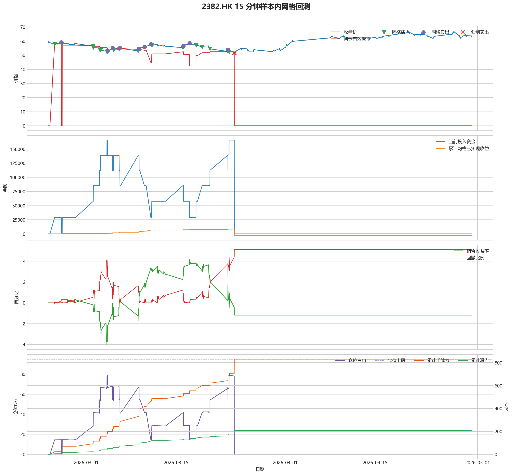
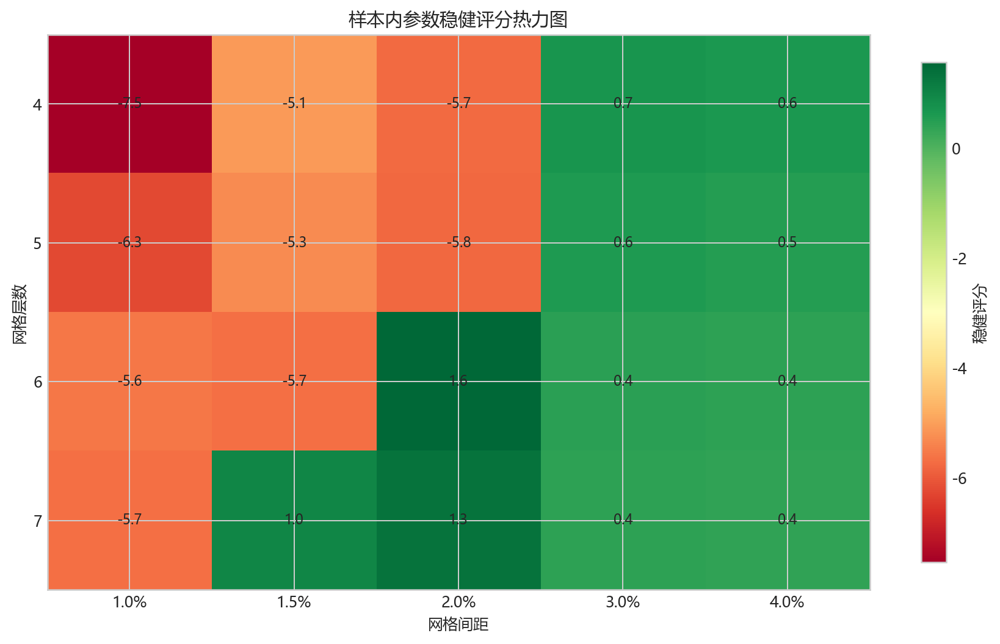
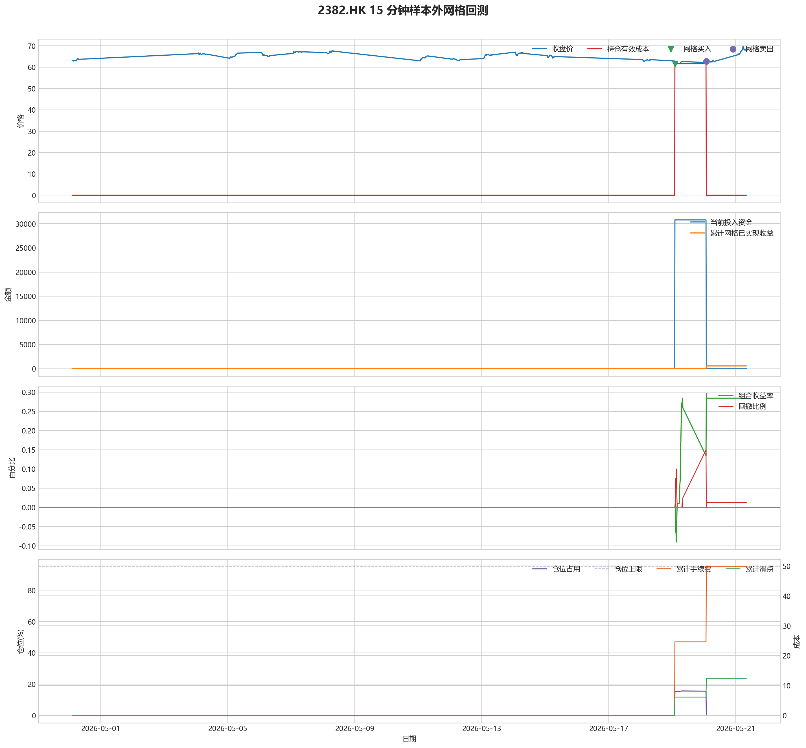

# 2382.HK 网格回测报告

## 摘要

- 标的：`2382.HK`
- 数据周期：Yahoo Finance 最近 60 天 `15m`；下载必须配置代理，Yahoo 失败时流程直接停止
- 样本内窗口：2026-02-23 01:30:00 至 2026-04-30 02:00:00
- 样本外窗口：2026-04-30 02:15:00 至 2026-05-21 08:00:00
- 切分方式：最近分钟线样本按 `75% / 25%` 拆分样本内与样本外
- 网格模式：纯现金网格，不在样本起点建立底仓；第一根 K 线收盘价只作为网格锚点
- 最小交易单位：100 股，来源：AASTOCKS 快照页 Lot Size
- 单层网格固定数量：500 股
- 左侧处理：`both`，强制退出阈值 `5.00%` 总资金浮亏
- 执行口径：`realistic`，手续费 `8.00` bps，滑点 `2.00` bps
- 最优参数：网格间距 2.00% / 网格层数 6 / 止盈比例 2.00%

这套网格在不同阶段表现不一致，说明它对行情结构比较敏感，不能只看单段结果下结论。

## 第一层：先看结论

### 先回答关键问题

| 问题 | 样本内 | 样本外 | 怎么理解 |
| --- | --- | --- | --- |
| 这套策略能不能赚钱 | -1.18% | 0.28% | 样本外已经转正，但样本内没有稳定赚钱，暂时只能说参数在新阶段有改善，不能证明长期稳定盈利。 |
| 比现金闲置好不好 | -2359.44 | 569.10 | 正数表示网格策略赚到钱，负数表示不交易反而更好。 |
| 比买入持有好不好 | -13713.22 | -16595.56 | 买入持有用同样资金、交易单位和执行口径估算，正数表示网格更好。 |
| 交易成本高不高 | 830.42 | 49.74 | 这里统计手续费，滑点会单独体现在估算成交价和滑点成本里。 |
| 最坏会亏到什么程度 | 5.12% | 0.15% | 这是账户在样本期间相对阶段高点出现过的最大回撤。 |
| 这组参数稳不稳 | 稳健分 1.56 | 沿用同一组参数 | 不是只看一整段最高分，而是看多窗口表现是否稳定。当前结果：100% 窗口为正，最差窗口收益 `1.08%`，收益波动 `0.84` 个百分点。 |

### 一句话判断

- 这套网格在不同阶段表现不一致，说明它对行情结构比较敏感，不能只看单段结果下结论。
- 当前正式拿去实盘的证据还不够，更合理的定位是：先验证它能否通过网格闭环赚钱，再看左侧行情下能否控制亏损。
- 如果你只想知道现在值不值得继续研究，看完上面这张表就够了。

## 第二层：展开细节

### 参数是怎么选的

| 筛选环节 | 结果 | 你该怎么理解 |
| --- | --- | --- |
| 执行口径 | realistic | 手续费 8.00 bps，滑点 2.00 bps。 |
| 候选组合数 | 80 | 先把候选参数全部跑完，不做随机抽样。 |
| 单窗综合分 | -5.38 | 这是整段样本内的收益、回撤、闭环网格利润综合分。 |
| 稳健窗口数 | 3 | 再把样本内按时间顺序拆成多个连续窗口，检查同一参数会不会只在一小段行情里好看。 |
| 稳健分 RobustScore | 1.56 | 计算方式：0.6 x 窗口平均分 + 0.4 x 最差窗口分 - 0.25 x 窗口收益波动。 |
| 最终入选参数 | 间距 2.00% / 层数 6 / 止盈 2.00% | 优先挑多窗口更稳的组合，而不是只挑单窗最亮的孤点。 |

### 关键结果对照

| 指标 | 样本内 | 样本外 | 怎么读 |
| --- | --- | --- | --- |
| 净收益率 | -1.18% | 0.28% | 已经按当前执行口径扣除回测引擎支持的费用影响。 |
| 最大回撤 | 5.12% | 0.15% | 再看亏起来最难受会到什么程度。 |
| 交易成本 | 830.42 | 49.74 | 策略内部估算的手续费累计值，帮助判断网格频繁交易是否吃掉收益。 |
| 滑点成本 | 207.61 | 12.43 | 按收盘价和估算成交价差额累计，属于近似实盘口径。 |
| 未平网格有效成本 | 0.00 | 0.00 | 只在期末仍有未平网格仓位时有意义。 |
| 闭环网格净利润 | -2463.02 | 562.83 | 这是已经完成低买高卖、真正落袋的利润，不等于总账户收益。 |
| 未平网格浮动盈亏 | 0.00 | 0.00 | hold 口径会保留这部分风险，force_exit 口径触发后通常回到 0。 |
| 网格闭环次数 | 13 | 1 | 次数越多，说明震荡里成交越频繁；但次数多不等于总账户一定赚钱。 |

### 执行口径和风控约束

| 约束 | 样本内 | 样本外 |
| --- | --- | --- |
| 执行口径 | realistic | realistic |
| 网格模式 | cash | cash |
| 左侧处理口径 | both | both |
| 手续费 / 滑点 | 8.00 / 2.00 bps | 8.00 / 2.00 bps |
| 最大仓位占用 | 79.50% / 上限 95.00% | 15.69% / 上限 95.00% |
| 停手事件 | 0 | 0 |
| 强制退出事件 | 6 | 0 |

### 网格到底有没有帮忙

| 对比项 | 样本内 | 样本外 |
| --- | --- | --- |
| 现金闲置收益率 | 0.00% | 0.00% |
| 买入持有收益率 | 5.68% | 8.58% |
| 网格策略收益率 | -1.18% | 0.28% |
| 网格相对现金闲置多赚/多亏 | -2359.44 | 569.10 |
| 网格相对买入持有多赚/多亏 | -13713.22 | -16595.56 |

### 左侧行情怎么处理

| 左侧口径 | 样本内净收益率 | 样本内闭环利润 | 样本内浮动盈亏 | 样本内强平 | 样本外净收益率 | 样本外闭环利润 | 样本外浮动盈亏 | 样本外强平 |
| --- | --- | --- | --- | --- | --- | --- | --- | --- |
| hold：未平网格继续持有 | 7.59% | 15062.38 | 0.00 | 否 | 0.28% | 562.83 | 0.00 | 否 |
| force_exit：达到亏损阈值强平 | -1.18% | -2463.02 | 0.00 | 是 | 0.28% | 562.83 | 0.00 | 否 |

补一句最重要的解释：

- “网格已实现收益”只代表已经完成低买高卖、真正落袋的那部分利润。
- 真正决定你账户最后赚没赚钱的，是“已实现网格收益 + 未平仓网格浮动盈亏 + 现金余额”三者一起的结果。
- 所以完全可能出现“网格已经落袋赚钱，但总账户还是亏钱”的情况。

### 图表速读总结

#### 样本内回测图

- 这一段价格从 `59.45` 走到 `62.95`，区间涨跌幅约 `5.89%`。
- 样本结束时没有未平网格仓位，剩余风险已经体现在现金和已实现利润里。
- 图里的买卖点一共完成了 `13` 轮网格闭环，已经落袋的网格利润累计 `-2463.02`。
- 左侧强制退出已经触发，后续不再继续开新网格。
- 总账户最终仍是亏损状态，期末权益 `197640.56`；也就是说，已实现网格利润还没完全覆盖未平仓或强制退出带来的亏损。

#### 热力图

- 热力图横轴是网格间距，纵轴是网格层数，颜色越偏绿代表稳健评分越高；每个格子里没有单独画出的止盈比例，已经折叠成该格子的最好结果。
- 当前样本里，最优参数落在“网格间距 `2.00%` / 网格层数 `6` / 止盈比例 `2.00%`”。
- 从前几名结果看，高分区域主要集中在网格间距 `2.00%`、网格层数 `6` 附近。
- 最优点比较集中在网格间距 `2.00%`、网格层数 `6` 附近，说明这组参数不是完全随机撞出来的。

#### 分钟线样本外验证

- 样本外账户最终从 `200000` 走到 `200569.10`，总盈亏 `569.10`。
- 样本外单层网格按最小交易单位 `100` 股取整，固定数量是 `500` 股。
- 样本外结果转正，说明这组参数在新阶段没有立刻失效。

#### 样本外回测图

- 这一段价格从 `63.00` 走到 `68.60`，区间涨跌幅约 `8.89%`。
- 样本结束时没有未平网格仓位，剩余风险已经体现在现金和已实现利润里。
- 图里的买卖点一共完成了 `1` 轮网格闭环，已经落袋的网格利润累计 `562.83`。
- 期末未平网格浮动盈亏为 `0.00`。
- 总账户最终是盈利状态，期末权益 `200569.10`，说明闭环利润、未平仓浮动盈亏和现金余额合计后已经转正。

### 交易记录和明细

如果你只是想判断策略值不值得继续，到这里通常已经够了；下面这些表主要用于追交易过程和排查归因。

### 样本内事件流水

| 时间 | 事件类型 | 层级 | 价格 | 估算成交价 | 数量 | 金额 | 手续费 | 滑点成本 | 说明 |
| --- | --- | --- | --- | --- | --- | --- | --- | --- | --- |
| 2026-02-24 01:30:00 | grid_buy | 1 | 57.85 | 57.86 | 500 | 28953.93 | 23.14 | 5.78 | 触发下行网格买入 |
| 2026-02-25 02:45:00 | grid_sell | 1 | 59.15 | 59.14 | 500 | 29545.43 | 23.66 | 5.92 | 达到网格止盈价后卖出本层仓位 |
| 2026-02-25 06:00:00 | grid_buy | 1 | 58.25 | 58.26 | 500 | 29154.13 | 23.30 | 5.82 | 触发下行网格买入 |
| 2026-03-02 01:30:00 | grid_buy | 2 | 56.35 | 56.36 | 500 | 28203.18 | 22.54 | 5.63 | 触发下行网格买入 |
| 2026-03-02 02:00:00 | grid_buy | 3 | 55.40 | 55.41 | 500 | 27727.71 | 22.16 | 5.54 | 触发下行网格买入 |
| 2026-03-03 02:00:00 | grid_buy | 4 | 54.05 | 54.06 | 500 | 27052.03 | 21.62 | 5.40 | 触发下行网格买入 |
| 2026-03-03 05:30:00 | grid_buy | 5 | 53.50 | 53.51 | 500 | 26776.75 | 21.40 | 5.35 | 触发下行网格买入 |
| 2026-03-04 05:15:00 | grid_buy | 6 | 52.10 | 52.11 | 500 | 26076.05 | 20.84 | 5.21 | 触发下行网格买入 |
| 2026-03-04 07:30:00 | grid_sell | 6 | 53.20 | 53.19 | 500 | 26573.40 | 21.28 | 5.32 | 达到网格止盈价后卖出本层仓位 |
| 2026-03-05 02:15:00 | grid_sell | 5 | 55.10 | 55.09 | 500 | 27522.45 | 22.04 | 5.51 | 达到网格止盈价后卖出本层仓位 |
| 2026-03-05 06:15:00 | grid_buy | 5 | 53.50 | 53.51 | 500 | 26776.75 | 21.40 | 5.35 | 触发下行网格买入 |
| 2026-03-06 03:00:00 | grid_sell | 5 | 54.80 | 54.79 | 500 | 27372.60 | 21.92 | 5.48 | 达到网格止盈价后卖出本层仓位 |
| 2026-03-06 05:45:00 | grid_sell | 4 | 55.25 | 55.24 | 500 | 27597.38 | 22.10 | 5.52 | 达到网格止盈价后卖出本层仓位 |
| 2026-03-09 01:30:00 | grid_buy | 4 | 53.05 | 53.06 | 500 | 26551.53 | 21.22 | 5.30 | 触发下行网格买入 |
| 2026-03-09 01:30:00 | grid_buy | 5 | 53.05 | 53.06 | 500 | 26551.53 | 21.22 | 5.30 | 触发下行网格买入 |
| 2026-03-09 05:30:00 | grid_sell | 4 | 54.35 | 54.34 | 500 | 27147.83 | 21.74 | 5.43 | 达到网格止盈价后卖出本层仓位 |
| 2026-03-09 05:30:00 | grid_sell | 5 | 54.35 | 54.34 | 500 | 27147.83 | 21.74 | 5.43 | 达到网格止盈价后卖出本层仓位 |
| 2026-03-09 05:30:00 | grid_buy | 4 | 54.35 | 54.36 | 500 | 27202.18 | 21.74 | 5.43 | 触发下行网格买入 |
| 2026-03-10 01:30:00 | grid_sell | 4 | 55.80 | 55.79 | 500 | 27872.10 | 22.32 | 5.58 | 达到网格止盈价后卖出本层仓位 |
| 2026-03-11 01:30:00 | grid_sell | 2 | 57.90 | 57.89 | 500 | 28921.06 | 23.16 | 5.79 | 达到网格止盈价后卖出本层仓位 |
| 2026-03-11 01:30:00 | grid_sell | 3 | 57.90 | 57.89 | 500 | 28921.06 | 23.16 | 5.79 | 达到网格止盈价后卖出本层仓位 |
| 2026-03-11 05:00:00 | grid_buy | 2 | 57.00 | 57.01 | 500 | 28528.50 | 22.80 | 5.70 | 触发下行网格买入 |
| 2026-03-16 01:30:00 | grid_buy | 3 | 55.35 | 55.36 | 500 | 27702.68 | 22.14 | 5.53 | 触发下行网格买入 |
| 2026-03-16 03:30:00 | grid_sell | 3 | 56.55 | 56.54 | 500 | 28246.73 | 22.62 | 5.65 | 达到网格止盈价后卖出本层仓位 |
| 2026-03-17 02:00:00 | grid_sell | 2 | 58.45 | 58.44 | 500 | 29195.78 | 23.38 | 5.85 | 达到网格止盈价后卖出本层仓位 |
| 2026-03-18 02:30:00 | grid_buy | 2 | 57.00 | 57.01 | 500 | 28528.50 | 22.80 | 5.70 | 触发下行网格买入 |
| 2026-03-19 01:30:00 | grid_buy | 3 | 55.80 | 55.81 | 500 | 27927.90 | 22.32 | 5.58 | 触发下行网格买入 |
| 2026-03-20 06:30:00 | grid_buy | 4 | 54.50 | 54.51 | 500 | 27277.25 | 21.80 | 5.45 | 触发下行网格买入 |
| 2026-03-23 01:30:00 | grid_buy | 5 | 52.65 | 52.66 | 500 | 26351.33 | 21.06 | 5.27 | 触发下行网格买入 |
| 2026-03-23 02:00:00 | grid_sell | 5 | 53.90 | 53.89 | 500 | 26923.06 | 21.56 | 5.39 | 达到网格止盈价后卖出本层仓位 |
| 2026-03-23 02:15:00 | grid_buy | 5 | 53.50 | 53.51 | 500 | 26776.75 | 21.40 | 5.35 | 触发下行网格买入 |
| 2026-03-23 06:00:00 | grid_buy | 6 | 52.20 | 52.21 | 500 | 26126.10 | 20.88 | 5.22 | 触发下行网格买入 |
| 2026-03-24 01:45:00 | force_exit_sell | 1 | 51.65 | 51.64 | 500 | 25799.18 | 20.66 | 5.17 | 未平网格浮亏达到总资金 5.00% 阈值，强制卖出本层仓位 |
| 2026-03-24 01:45:00 | force_exit_sell | 2 | 51.65 | 51.64 | 500 | 25799.18 | 20.66 | 5.17 | 未平网格浮亏达到总资金 5.00% 阈值，强制卖出本层仓位 |
| 2026-03-24 01:45:00 | force_exit_sell | 3 | 51.65 | 51.64 | 500 | 25799.18 | 20.66 | 5.17 | 未平网格浮亏达到总资金 5.00% 阈值，强制卖出本层仓位 |
| 2026-03-24 01:45:00 | force_exit_sell | 4 | 51.65 | 51.64 | 500 | 25799.18 | 20.66 | 5.17 | 未平网格浮亏达到总资金 5.00% 阈值，强制卖出本层仓位 |
| 2026-03-24 01:45:00 | force_exit_sell | 5 | 51.65 | 51.64 | 500 | 25799.18 | 20.66 | 5.17 | 未平网格浮亏达到总资金 5.00% 阈值，强制卖出本层仓位 |
| 2026-03-24 01:45:00 | force_exit_sell | 6 | 51.65 | 51.64 | 500 | 25799.18 | 20.66 | 5.17 | 未平网格浮亏达到总资金 5.00% 阈值，强制卖出本层仓位 |

### 样本内成交结果

| 开仓时间 | 平仓时间 | 持有时长 | 开仓价 | 平仓价 | 数量 | 盈亏 | 收益率(%) | 仓位类型 |
| --- | --- | --- | --- | --- | --- | --- | --- | --- |
| 2026-02-24 01:30:00 | 2026-02-25 02:45:00 | 1 days 01:15:00 | 57.86 | 59.15 | 500 | 597.41 | 2.06 | 网格 1 |
| 2026-03-04 05:15:00 | 2026-03-04 07:30:00 | 0 days 02:15:00 | 52.11 | 53.20 | 500 | 502.67 | 1.93 | 网格 6 |
| 2026-03-03 05:30:00 | 2026-03-05 02:15:00 | 1 days 20:45:00 | 53.51 | 55.10 | 500 | 751.20 | 2.81 | 网格 5 |
| 2026-03-05 06:15:00 | 2026-03-06 03:00:00 | 0 days 20:45:00 | 53.51 | 54.80 | 500 | 601.33 | 2.25 | 网格 5 |
| 2026-03-03 02:00:00 | 2026-03-06 05:45:00 | 3 days 03:45:00 | 54.06 | 55.25 | 500 | 550.87 | 2.04 | 网格 4 |
| 2026-03-09 01:30:00 | 2026-03-09 05:30:00 | 0 days 04:00:00 | 53.06 | 54.35 | 500 | 601.73 | 2.27 | 网格 5 |
| 2026-03-09 01:30:00 | 2026-03-09 05:30:00 | 0 days 04:00:00 | 53.06 | 54.35 | 500 | 601.73 | 2.27 | 网格 4 |
| 2026-03-09 05:30:00 | 2026-03-10 01:30:00 | 0 days 20:00:00 | 54.36 | 55.80 | 500 | 675.50 | 2.49 | 网格 4 |
| 2026-03-02 02:00:00 | 2026-03-11 01:30:00 | 8 days 23:30:00 | 55.41 | 57.90 | 500 | 1199.14 | 4.33 | 网格 3 |
| 2026-03-02 01:30:00 | 2026-03-11 01:30:00 | 9 days 00:00:00 | 56.36 | 57.90 | 500 | 723.66 | 2.57 | 网格 2 |
| 2026-03-16 01:30:00 | 2026-03-16 03:30:00 | 0 days 02:00:00 | 55.36 | 56.55 | 500 | 549.70 | 1.99 | 网格 3 |
| 2026-03-11 05:00:00 | 2026-03-17 02:00:00 | 5 days 21:00:00 | 57.01 | 58.45 | 500 | 673.12 | 2.36 | 网格 2 |
| 2026-03-23 01:30:00 | 2026-03-23 02:00:00 | 0 days 00:30:00 | 52.66 | 53.90 | 500 | 577.11 | 2.19 | 网格 5 |
| 2026-03-23 06:00:00 | 2026-03-24 01:45:00 | 0 days 19:45:00 | 52.21 | 51.65 | 500 | -321.76 | -1.23 | 网格 6 |
| 2026-03-23 02:15:00 | 2026-03-24 01:45:00 | 0 days 23:30:00 | 53.51 | 51.65 | 500 | -972.41 | -3.63 | 网格 5 |
| 2026-03-20 06:30:00 | 2026-03-24 01:45:00 | 3 days 19:15:00 | 54.51 | 51.65 | 500 | -1472.91 | -5.40 | 网格 4 |
| 2026-03-19 01:30:00 | 2026-03-24 01:45:00 | 5 days 00:15:00 | 55.81 | 51.65 | 500 | -2123.56 | -7.61 | 网格 3 |
| 2026-03-18 02:30:00 | 2026-03-24 01:45:00 | 5 days 23:15:00 | 57.01 | 51.65 | 500 | -2724.16 | -9.56 | 网格 2 |
| 2026-02-25 06:00:00 | 2026-03-24 01:45:00 | 26 days 19:45:00 | 58.26 | 51.65 | 500 | -3349.79 | -11.50 | 网格 1 |

### 样本外事件流水

| 时间 | 事件类型 | 层级 | 价格 | 估算成交价 | 数量 | 金额 | 手续费 | 滑点成本 | 说明 |
| --- | --- | --- | --- | --- | --- | --- | --- | --- | --- |
| 2026-05-19 02:00:00 | grid_buy | 1 | 61.55 | 61.56 | 500 | 30805.78 | 24.62 | 6.15 | 触发下行网格买入 |
| 2026-05-20 01:45:00 | grid_sell | 1 | 62.80 | 62.79 | 500 | 31368.60 | 25.11 | 6.28 | 达到网格止盈价后卖出本层仓位 |

### 样本外成交结果

| 开仓时间 | 平仓时间 | 持有时长 | 开仓价 | 平仓价 | 数量 | 盈亏 | 收益率(%) | 仓位类型 |
| --- | --- | --- | --- | --- | --- | --- | --- | --- |
| 2026-05-19 02:00:00 | 2026-05-20 01:45:00 | 0 days 23:45:00 | 61.56 | 62.80 | 500 | 569.10 | 1.85 | 网格 1 |

## 最终结论

- 这套参数更适合“先跌一段、再进入震荡或反弹”的行情，因为它依赖反弹来兑现网格利润。
- 如果行情持续单边下跌，hold 口径会继续持有未平网格，force_exit 口径会在浮亏达到阈值后清仓并停止交易。
- 当前样本下，闭环网格净利润：样本内 -2463.02，样本外 562.83。
- 这份报告只代表最近 60 天分钟级行情下的短周期表现，不等同于长期日线参数。
