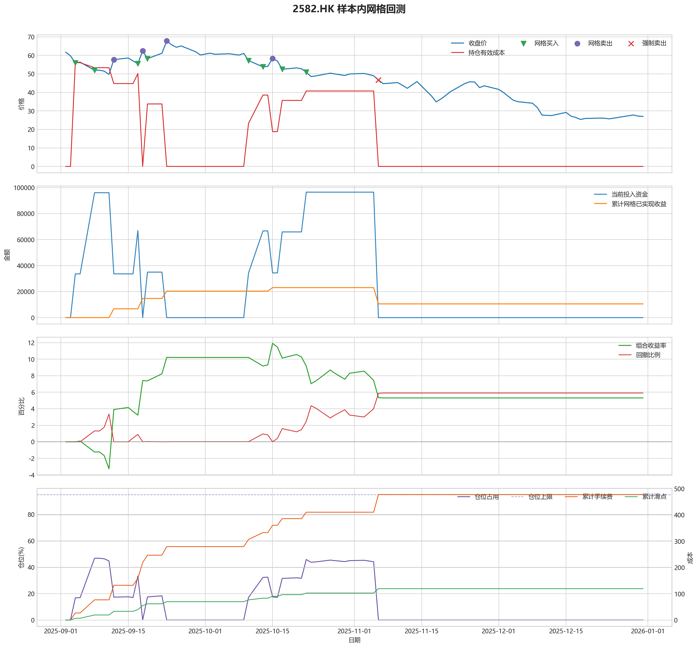
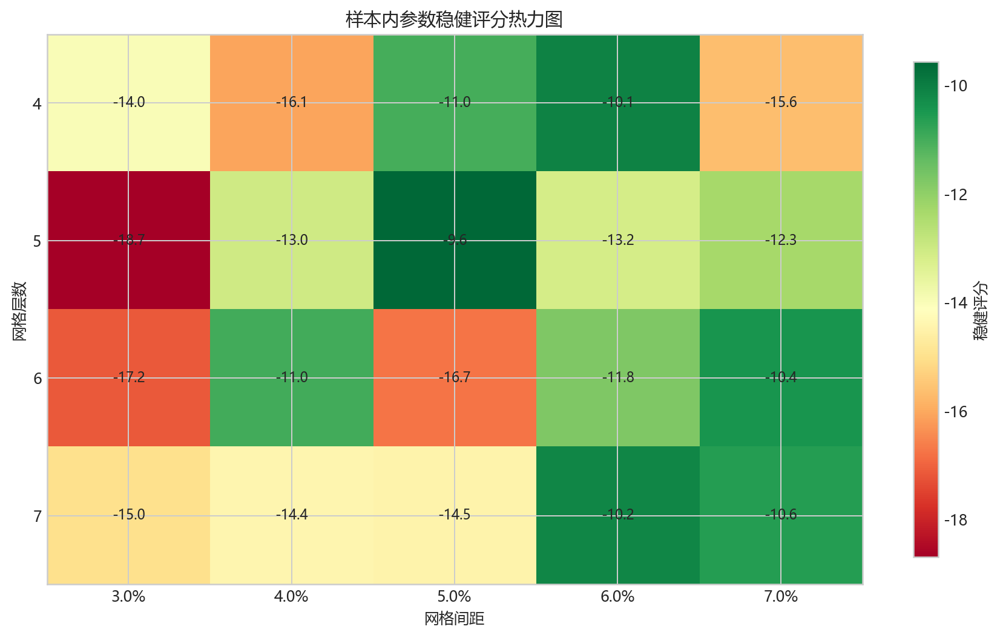
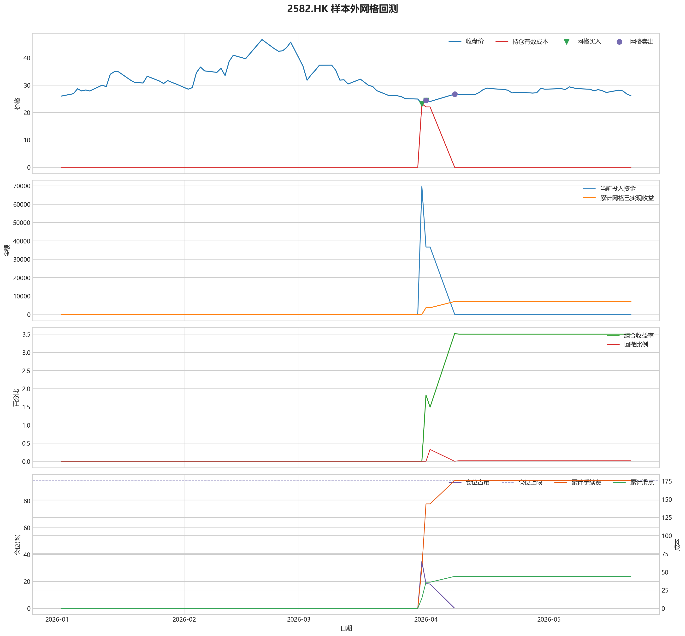

# 2582.HK 网格回测报告

## 摘要

- 标的：`2582.HK`
- 样本内窗口：2025-09-02 至 2025-12-31
- 样本外窗口：2026-01-01 至 2026-05-21
- 网格模式：纯现金网格，不在样本起点建立底仓；第一根 K 线收盘价只作为网格锚点
- 最小交易单位：50 股，来源：AASTOCKS 快照页 Lot Size
- 单层网格固定数量：600 股
- 左侧处理：`both`，强制退出阈值 `5.00%` 总资金浮亏
- 执行口径：`realistic`，手续费 `8.00` bps，滑点 `2.00` bps
- 最优参数：网格间距 5.00% / 网格层数 5 / 止盈比例 5.00%

这套网格在当前样本里样本内外都转正，说明参数具备继续观察的价值。

## 第一层：先看结论

### 先回答关键问题

| 问题 | 样本内 | 样本外 | 怎么理解 |
| --- | --- | --- | --- |
| 这套策略能不能赚钱 | 5.31% | 3.50% | 当前样本内和样本外都为正收益，可以继续观察，但还不能直接等同于稳定实盘盈利。 |
| 比现金闲置好不好 | 10617.94 | 7003.12 | 正数表示网格策略赚到钱，负数表示不交易反而更好。 |
| 比买入持有好不好 | 122015.57 | 6284.04 | 买入持有用同样资金、交易单位和执行口径估算，正数表示网格更好。 |
| 交易成本高不高 | 477.45 | 175.63 | 这里统计手续费，滑点会单独体现在估算成交价和滑点成本里。 |
| 最坏会亏到什么程度 | 5.90% | 0.33% | 这是账户在样本期间相对阶段高点出现过的最大回撤。 |
| 这组参数稳不稳 | 稳健分 -9.57 | 沿用同一组参数 | 不是只看一整段最高分，而是看多窗口表现是否稳定。当前结果：33% 窗口为正，最差窗口收益 `-5.86%`，收益波动 `6.94` 个百分点。 |

### 一句话判断

- 这套网格在当前样本里样本内外都转正，说明参数具备继续观察的价值。
- 当前正式拿去实盘的证据还不够，更合理的定位是：先验证它能否通过网格闭环赚钱，再看左侧行情下能否控制亏损。
- 如果你只想知道现在值不值得继续研究，看完上面这张表就够了。

## 第二层：展开细节

### 参数是怎么选的

| 筛选环节 | 结果 | 你该怎么理解 |
| --- | --- | --- |
| 执行口径 | realistic | 手续费 8.00 bps，滑点 2.00 bps。 |
| 候选组合数 | 60 | 先把候选参数全部跑完，不做随机抽样。 |
| 单窗综合分 | 3.82 | 这是整段样本内的收益、回撤、闭环网格利润综合分。 |
| 稳健窗口数 | 3 | 再把样本内按时间顺序拆成多个连续窗口，检查同一参数会不会只在一小段行情里好看。 |
| 稳健分 RobustScore | -9.57 | 计算方式：0.6 x 窗口平均分 + 0.4 x 最差窗口分 - 0.25 x 窗口收益波动。 |
| 最终入选参数 | 间距 5.00% / 层数 5 / 止盈 5.00% | 优先挑多窗口更稳的组合，而不是只挑单窗最亮的孤点。 |

### 关键结果对照

| 指标 | 样本内 | 样本外 | 怎么读 |
| --- | --- | --- | --- |
| 净收益率 | 5.31% | 3.50% | 已经按当前执行口径扣除回测引擎支持的费用影响。 |
| 最大回撤 | 5.90% | 0.33% | 再看亏起来最难受会到什么程度。 |
| 交易成本 | 477.45 | 175.63 | 策略内部估算的手续费累计值，帮助判断网格频繁交易是否吃掉收益。 |
| 滑点成本 | 119.36 | 43.91 | 按收盘价和估算成交价差额累计，属于近似实盘口径。 |
| 未平网格有效成本 | 0.00 | 0.00 | 只在期末仍有未平网格仓位时有意义。 |
| 闭环网格净利润 | 10557.19 | 6980.46 | 这是已经完成低买高卖、真正落袋的利润，不等于总账户收益。 |
| 未平网格浮动盈亏 | 0.00 | 0.00 | hold 口径会保留这部分风险，force_exit 口径触发后通常回到 0。 |
| 网格闭环次数 | 6 | 3 | 次数越多，说明震荡里成交越频繁；但次数多不等于总账户一定赚钱。 |

### 执行口径和风控约束

| 约束 | 样本内 | 样本外 |
| --- | --- | --- |
| 执行口径 | realistic | realistic |
| 网格模式 | cash | cash |
| 左侧处理口径 | both | both |
| 手续费 / 滑点 | 8.00 / 2.00 bps | 8.00 / 2.00 bps |
| 最大仓位占用 | 46.80% / 上限 95.00% | 34.77% / 上限 95.00% |
| 停手事件 | 2 | 0 |
| 强制退出事件 | 3 | 0 |

### 网格到底有没有帮忙

| 对比项 | 样本内 | 样本外 |
| --- | --- | --- |
| 现金闲置收益率 | 0.00% | 0.00% |
| 买入持有收益率 | -55.70% | 0.36% |
| 网格策略收益率 | 5.31% | 3.50% |
| 网格相对现金闲置多赚/多亏 | 10617.94 | 7003.12 |
| 网格相对买入持有多赚/多亏 | 122015.57 | 6284.04 |

### 左侧行情怎么处理

| 左侧口径 | 样本内净收益率 | 样本内闭环利润 | 样本内浮动盈亏 | 样本内强平 | 样本外净收益率 | 样本外闭环利润 | 样本外浮动盈亏 | 样本外强平 |
| --- | --- | --- | --- | --- | --- | --- | --- | --- |
| hold：未平网格继续持有 | -12.23% | 23073.58 | -47904.97 | 否 | 3.50% | 6980.46 | 0.00 | 否 |
| force_exit：达到亏损阈值强平 | 5.31% | 10557.19 | 0.00 | 是 | 3.50% | 6980.46 | 0.00 | 否 |

补一句最重要的解释：

- “网格已实现收益”只代表已经完成低买高卖、真正落袋的那部分利润。
- 真正决定你账户最后赚没赚钱的，是“已实现网格收益 + 未平仓网格浮动盈亏 + 现金余额”三者一起的结果。
- 所以完全可能出现“网格已经落袋赚钱，但总账户还是亏钱”的情况。

### 图表速读总结

#### 样本内回测图

- 这一段价格从 `61.75` 走到 `27.00`，区间涨跌幅约 `-56.28%`。
- 样本结束时没有未平网格仓位，剩余风险已经体现在现金和已实现利润里。
- 图里的买卖点一共完成了 `6` 轮网格闭环，已经落袋的网格利润累计 `10557.19`。
- 左侧强制退出已经触发，后续不再继续开新网格。
- 总账户最终是盈利状态，期末权益 `210617.94`，说明闭环利润、未平仓浮动盈亏和现金余额合计后已经转正。

#### 热力图

- 热力图横轴是网格间距，纵轴是网格层数，颜色越偏绿代表稳健评分越高；每个格子里没有单独画出的止盈比例，已经折叠成该格子的最好结果。
- 当前样本里，最优参数落在“网格间距 `5.00%` / 网格层数 `5` / 止盈比例 `5.00%`”。
- 从前几名结果看，高分区域主要集中在网格间距 `5.00%`、网格层数 `5` 附近。
- 最优点比较集中在网格间距 `5.00%`、网格层数 `5` 附近，说明这组参数不是完全随机撞出来的。

#### 2026 样本外验证

- 样本外账户最终从 `200000` 走到 `207003.12`，总盈亏 `7003.12`。
- 样本外单层网格按最小交易单位 `50` 股取整，固定数量是 `1500` 股。
- 样本外结果转正，说明这组参数在新阶段没有立刻失效。

#### 样本外回测图

- 这一段价格从 `26.00` 走到 `26.12`，区间涨跌幅约 `0.46%`。
- 样本结束时没有未平网格仓位，剩余风险已经体现在现金和已实现利润里。
- 图里的买卖点一共完成了 `3` 轮网格闭环，已经落袋的网格利润累计 `6980.46`。
- 期末未平网格浮动盈亏为 `0.00`。
- 总账户最终是盈利状态，期末权益 `207003.12`，说明闭环利润、未平仓浮动盈亏和现金余额合计后已经转正。

### 交易记录和明细

如果你只是想判断策略值不值得继续，到这里通常已经够了；下面这些表主要用于追交易过程和排查归因。

### 样本内事件流水

| 时间 | 事件类型 | 层级 | 价格 | 估算成交价 | 数量 | 金额 | 手续费 | 滑点成本 | 说明 |
| --- | --- | --- | --- | --- | --- | --- | --- | --- | --- |
| 2025-09-04 | grid_buy | 1 | 56.00 | 56.01 | 600 | 33633.61 | 26.89 | 6.72 | 触发下行网格买入 |
| 2025-09-08 | grid_buy | 2 | 51.95 | 51.96 | 600 | 31201.18 | 24.94 | 6.23 | 触发下行网格买入 |
| 2025-09-08 | grid_buy | 3 | 51.95 | 51.96 | 600 | 31201.18 | 24.94 | 6.23 | 触发下行网格买入 |
| 2025-09-12 | grid_sell | 2 | 57.70 | 57.69 | 600 | 34585.39 | 27.69 | 6.92 | 达到网格止盈价后卖出本层仓位 |
| 2025-09-12 | grid_sell | 3 | 57.70 | 57.69 | 600 | 34585.39 | 27.69 | 6.92 | 达到网格止盈价后卖出本层仓位 |
| 2025-09-17 | grid_buy | 2 | 55.50 | 55.51 | 600 | 33333.31 | 26.65 | 6.66 | 触发下行网格买入 |
| 2025-09-18 | grid_sell | 1 | 62.50 | 62.49 | 600 | 37462.51 | 29.99 | 7.50 | 达到网格止盈价后卖出本层仓位 |
| 2025-09-18 | grid_sell | 2 | 62.50 | 62.49 | 600 | 37462.51 | 29.99 | 7.50 | 达到网格止盈价后卖出本层仓位 |
| 2025-09-19 | grid_buy | 1 | 58.25 | 58.26 | 600 | 34984.96 | 27.97 | 6.99 | 触发下行网格买入 |
| 2025-09-23 | grid_sell | 1 | 67.80 | 67.79 | 600 | 40639.33 | 32.54 | 8.14 | 达到网格止盈价后卖出本层仓位 |
| 2025-10-10 | grid_buy | 1 | 57.20 | 57.21 | 600 | 34354.33 | 27.46 | 6.86 | 触发下行网格买入 |
| 2025-10-13 | grid_buy | 2 | 53.80 | 53.81 | 600 | 32312.28 | 25.83 | 6.46 | 触发下行网格买入 |
| 2025-10-15 | grid_sell | 2 | 58.40 | 58.39 | 600 | 35004.97 | 28.03 | 7.01 | 达到网格止盈价后卖出本层仓位 |
| 2025-10-17 | grid_buy | 2 | 52.50 | 52.51 | 600 | 31531.51 | 25.21 | 6.30 | 触发下行网格买入 |
| 2025-10-22 | grid_buy | 3 | 50.90 | 50.91 | 600 | 30570.55 | 24.44 | 6.11 | 触发下行网格买入 |
| 2025-10-23 | risk_stop_loss | 0 | 48.56 | 48.56 | 0 | 0.00 | 0.00 | 0.00 | 价格跌破锚定停手线 49.40，暂停新增网格 |
| 2025-10-24 | risk_cooldown | 0 | 48.92 | 48.92 | 0 | 0.00 | 0.00 | 0.00 | 停手机制冷却中，剩余 4 根 K 线 |
| 2025-10-27 | risk_cooldown | 0 | 50.40 | 50.40 | 0 | 0.00 | 0.00 | 0.00 | 停手机制冷却中，剩余 3 根 K 线 |
| 2025-10-28 | risk_cooldown | 0 | 49.94 | 49.94 | 0 | 0.00 | 0.00 | 0.00 | 停手机制冷却中，剩余 2 根 K 线 |
| 2025-10-30 | risk_cooldown | 0 | 49.16 | 49.16 | 0 | 0.00 | 0.00 | 0.00 | 停手机制冷却中，剩余 1 根 K 线 |
| 2025-11-05 | risk_stop_loss | 0 | 49.00 | 49.00 | 0 | 0.00 | 0.00 | 0.00 | 价格跌破锚定停手线 49.40，暂停新增网格 |
| 2025-11-06 | force_exit_sell | 1 | 46.68 | 46.67 | 600 | 27980.00 | 22.40 | 5.60 | 未平网格浮亏达到总资金 5.00% 阈值，强制卖出本层仓位 |
| 2025-11-06 | force_exit_sell | 2 | 46.68 | 46.67 | 600 | 27980.00 | 22.40 | 5.60 | 未平网格浮亏达到总资金 5.00% 阈值，强制卖出本层仓位 |
| 2025-11-06 | force_exit_sell | 3 | 46.68 | 46.67 | 600 | 27980.00 | 22.40 | 5.60 | 未平网格浮亏达到总资金 5.00% 阈值，强制卖出本层仓位 |

### 样本内成交结果

| 开仓时间 | 平仓时间 | 持有时长 | 开仓价 | 平仓价 | 数量 | 盈亏 | 收益率(%) | 仓位类型 |
| --- | --- | --- | --- | --- | --- | --- | --- | --- |
| 2025-09-08 00:00:00 | 2025-09-12 00:00:00 | 4 days 00:00:00 | 51.96 | 57.70 | 600 | 3391.13 | 10.88 | 网格 3 |
| 2025-09-08 00:00:00 | 2025-09-12 00:00:00 | 4 days 00:00:00 | 51.96 | 57.70 | 600 | 3391.13 | 10.88 | 网格 2 |
| 2025-09-17 00:00:00 | 2025-09-18 00:00:00 | 1 days 00:00:00 | 55.51 | 62.50 | 600 | 4136.69 | 12.42 | 网格 2 |
| 2025-09-04 00:00:00 | 2025-09-18 00:00:00 | 14 days 00:00:00 | 56.01 | 62.50 | 600 | 3836.39 | 11.42 | 网格 1 |
| 2025-09-19 00:00:00 | 2025-09-23 00:00:00 | 4 days 00:00:00 | 58.26 | 67.80 | 600 | 5662.50 | 16.20 | 网格 1 |
| 2025-10-13 00:00:00 | 2025-10-15 00:00:00 | 2 days 00:00:00 | 53.81 | 58.40 | 600 | 2699.68 | 8.36 | 网格 2 |
| 2025-10-22 00:00:00 | 2025-11-06 00:00:00 | 15 days 00:00:00 | 50.91 | 46.68 | 600 | -2584.95 | -8.46 | 网格 3 |
| 2025-10-17 00:00:00 | 2025-11-06 00:00:00 | 20 days 00:00:00 | 52.51 | 46.68 | 600 | -3545.91 | -11.25 | 网格 2 |
| 2025-10-10 00:00:00 | 2025-11-06 00:00:00 | 27 days 00:00:00 | 57.21 | 46.68 | 600 | -6368.73 | -18.55 | 网格 1 |

### 样本外事件流水

| 时间 | 事件类型 | 层级 | 价格 | 估算成交价 | 数量 | 金额 | 手续费 | 滑点成本 | 说明 |
| --- | --- | --- | --- | --- | --- | --- | --- | --- | --- |
| 2026-03-31 | grid_buy | 1 | 23.18 | 23.18 | 1500 | 34804.78 | 27.82 | 6.95 | 触发下行网格买入 |
| 2026-03-31 | grid_buy | 2 | 23.18 | 23.18 | 1500 | 34804.78 | 27.82 | 6.95 | 触发下行网格买入 |
| 2026-04-01 | grid_sell | 1 | 24.42 | 24.42 | 1500 | 36593.38 | 29.30 | 7.33 | 达到网格止盈价后卖出本层仓位 |
| 2026-04-01 | grid_sell | 2 | 24.42 | 24.42 | 1500 | 36593.38 | 29.30 | 7.33 | 达到网格止盈价后卖出本层仓位 |
| 2026-04-01 | grid_buy | 1 | 24.42 | 24.42 | 1500 | 36666.64 | 29.31 | 7.33 | 触发下行网格买入 |
| 2026-04-08 | grid_sell | 1 | 26.74 | 26.73 | 1500 | 40069.90 | 32.08 | 8.02 | 达到网格止盈价后卖出本层仓位 |

### 样本外成交结果

| 开仓时间 | 平仓时间 | 持有时长 | 开仓价 | 平仓价 | 数量 | 盈亏 | 收益率(%) | 仓位类型 |
| --- | --- | --- | --- | --- | --- | --- | --- | --- |
| 2026-03-31 00:00:00 | 2026-04-01 00:00:00 | 1 days 00:00:00 | 23.18 | 24.42 | 1500 | 1795.92 | 5.16 | 网格 2 |
| 2026-03-31 00:00:00 | 2026-04-01 00:00:00 | 1 days 00:00:00 | 23.18 | 24.42 | 1500 | 1795.92 | 5.16 | 网格 1 |
| 2026-04-01 00:00:00 | 2026-04-08 00:00:00 | 7 days 00:00:00 | 24.42 | 26.74 | 1500 | 3411.28 | 9.31 | 网格 1 |

## 最终结论

- 这套参数更适合“先跌一段、再进入震荡或反弹”的行情，因为它依赖反弹来兑现网格利润。
- 如果行情持续单边下跌，hold 口径会继续持有未平网格，force_exit 口径会在浮亏达到阈值后清仓并停止交易。
- 当前样本下，闭环网格净利润：样本内 10557.19，样本外 6980.46。
- 如果后续继续扩展策略，优先方向应该是加入趋势过滤或分阶段停手机制，而不是单纯增加网格层数。
