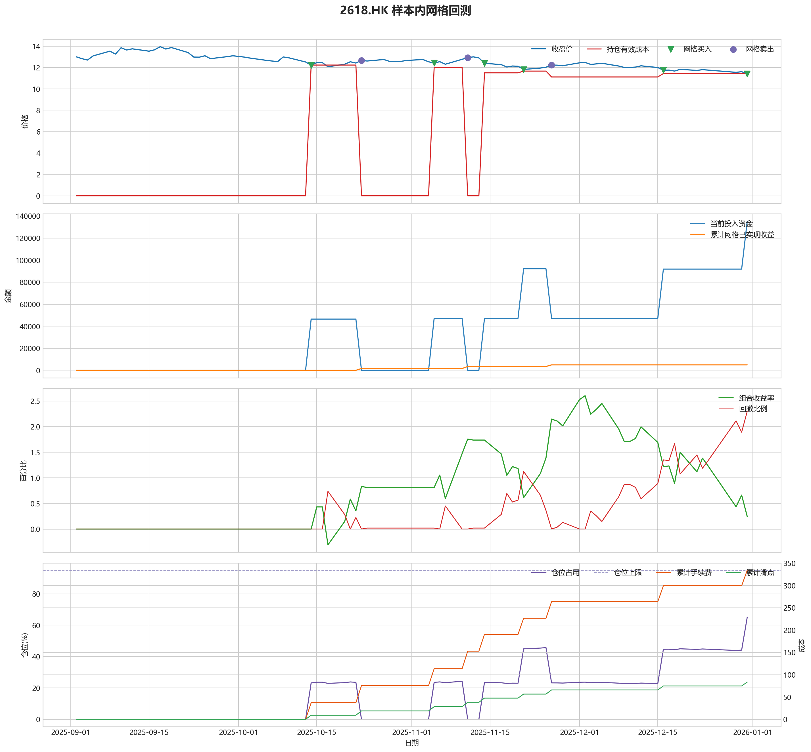
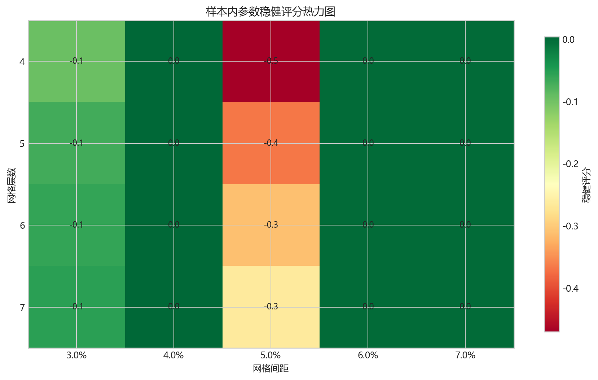
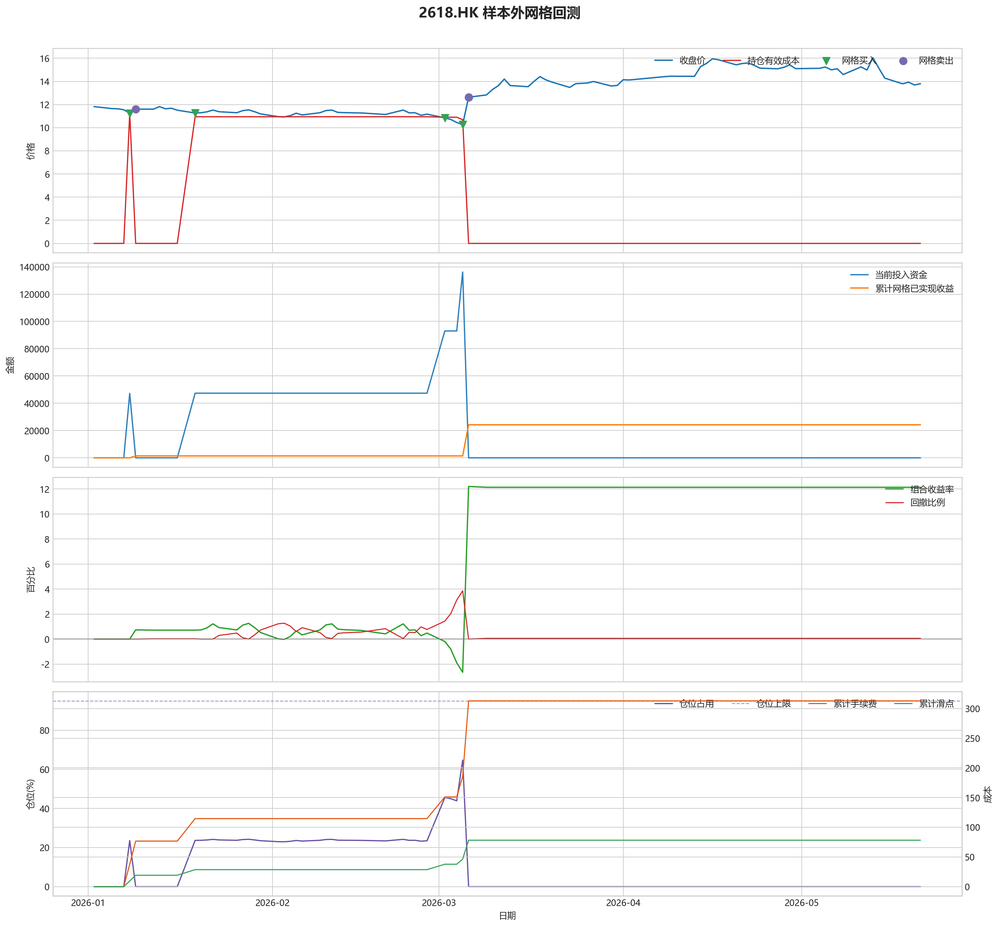

# 2618.HK 网格回测报告

## 摘要

- 标的：`2618.HK`
- 样本内窗口：2025-09-02 至 2025-12-31
- 样本外窗口：2026-01-01 至 2026-05-21
- 网格模式：纯现金网格，不在样本起点建立底仓；第一根 K 线收盘价只作为网格锚点
- 最小交易单位：100 股，来源：AASTOCKS 快照页 Lot Size
- 单层网格固定数量：3800 股
- 左侧处理：`both`，强制退出阈值 `5.00%` 总资金浮亏
- 执行口径：`realistic`，手续费 `8.00` bps，滑点 `2.00` bps
- 最优参数：网格间距 4.00% / 网格层数 4 / 止盈比例 3.00%

这套网格在当前样本里样本内外都转正，说明参数具备继续观察的价值。

## 第一层：先看结论

### 先回答关键问题

| 问题 | 样本内 | 样本外 | 怎么理解 |
| --- | --- | --- | --- |
| 这套策略能不能赚钱 | 0.24% | 12.13% | 当前样本内和样本外都为正收益，可以继续观察，但还不能直接等同于稳定实盘盈利。 |
| 比现金闲置好不好 | 490.00 | 24262.44 | 正数表示网格策略赚到钱，负数表示不交易反而更好。 |
| 比买入持有好不好 | 24862.93 | -8999.78 | 买入持有用同样资金、交易单位和执行口径估算，正数表示网格更好。 |
| 交易成本高不高 | 333.93 | 312.88 | 这里统计手续费，滑点会单独体现在估算成交价和滑点成本里。 |
| 最坏会亏到什么程度 | 2.30% | 3.86% | 这是账户在样本期间相对阶段高点出现过的最大回撤。 |
| 这组参数稳不稳 | 稳健分 0.00 | 沿用同一组参数 | 不是只看一整段最高分，而是看多窗口表现是否稳定。当前结果：33% 窗口为正，最差窗口收益 `0.00%`，收益波动 `0.04` 个百分点。 |

### 一句话判断

- 这套网格在当前样本里样本内外都转正，说明参数具备继续观察的价值。
- 当前正式拿去实盘的证据还不够，更合理的定位是：先验证它能否通过网格闭环赚钱，再看左侧行情下能否控制亏损。
- 如果你只想知道现在值不值得继续研究，看完上面这张表就够了。

## 第二层：展开细节

### 参数是怎么选的

| 筛选环节 | 结果 | 你该怎么理解 |
| --- | --- | --- |
| 执行口径 | realistic | 手续费 8.00 bps，滑点 2.00 bps。 |
| 候选组合数 | 60 | 先把候选参数全部跑完，不做随机抽样。 |
| 单窗综合分 | -0.13 | 这是整段样本内的收益、回撤、闭环网格利润综合分。 |
| 稳健窗口数 | 3 | 再把样本内按时间顺序拆成多个连续窗口，检查同一参数会不会只在一小段行情里好看。 |
| 稳健分 RobustScore | 0.00 | 计算方式：0.6 x 窗口平均分 + 0.4 x 最差窗口分 - 0.25 x 窗口收益波动。 |
| 最终入选参数 | 间距 4.00% / 层数 4 / 止盈 3.00% | 优先挑多窗口更稳的组合，而不是只挑单窗最亮的孤点。 |

### 关键结果对照

| 指标 | 样本内 | 样本外 | 怎么读 |
| --- | --- | --- | --- |
| 净收益率 | 0.24% | 12.13% | 已经按当前执行口径扣除回测引擎支持的费用影响。 |
| 最大回撤 | 2.30% | 3.86% | 再看亏起来最难受会到什么程度。 |
| 交易成本 | 333.93 | 312.88 | 策略内部估算的手续费累计值，帮助判断网格频繁交易是否吃掉收益。 |
| 滑点成本 | 83.48 | 78.22 | 按收盘价和估算成交价差额累计，属于近似实盘口径。 |
| 未平网格有效成本 | 11.44 | 0.00 | 只在期末仍有未平网格仓位时有意义。 |
| 闭环网格净利润 | 4923.77 | 24220.90 | 这是已经完成低买高卖、真正落袋的利润，不等于总账户收益。 |
| 未平网格浮动盈亏 | -5243.35 | 0.00 | hold 口径会保留这部分风险，force_exit 口径触发后通常回到 0。 |
| 网格闭环次数 | 3 | 4 | 次数越多，说明震荡里成交越频繁；但次数多不等于总账户一定赚钱。 |

### 执行口径和风控约束

| 约束 | 样本内 | 样本外 |
| --- | --- | --- |
| 执行口径 | realistic | realistic |
| 网格模式 | cash | cash |
| 左侧处理口径 | both | both |
| 手续费 / 滑点 | 8.00 / 2.00 bps | 8.00 / 2.00 bps |
| 最大仓位占用 | 65.09% / 上限 95.00% | 64.70% / 上限 95.00% |
| 停手事件 | 0 | 0 |
| 强制退出事件 | 0 | 0 |

### 网格到底有没有帮忙

| 对比项 | 样本内 | 样本外 |
| --- | --- | --- |
| 现金闲置收益率 | 0.00% | 0.00% |
| 买入持有收益率 | -12.19% | 16.63% |
| 网格策略收益率 | 0.24% | 12.13% |
| 网格相对现金闲置多赚/多亏 | 490.00 | 24262.44 |
| 网格相对买入持有多赚/多亏 | 24862.93 | -8999.78 |

### 左侧行情怎么处理

| 左侧口径 | 样本内净收益率 | 样本内闭环利润 | 样本内浮动盈亏 | 样本内强平 | 样本外净收益率 | 样本外闭环利润 | 样本外浮动盈亏 | 样本外强平 |
| --- | --- | --- | --- | --- | --- | --- | --- | --- |
| hold：未平网格继续持有 | 0.24% | 4923.77 | -5243.35 | 否 | 12.13% | 24220.90 | 0.00 | 否 |
| force_exit：达到亏损阈值强平 | 0.24% | 4923.77 | -5243.35 | 否 | 12.13% | 24220.90 | 0.00 | 否 |

补一句最重要的解释：

- “网格已实现收益”只代表已经完成低买高卖、真正落袋的那部分利润。
- 真正决定你账户最后赚没赚钱的，是“已实现网格收益 + 未平仓网格浮动盈亏 + 现金余额”三者一起的结果。
- 所以完全可能出现“网格已经落袋赚钱，但总账户还是亏钱”的情况。

### 图表速读总结

#### 样本内回测图

- 这一段价格从 `13.00` 走到 `11.42`，区间涨跌幅约 `-12.15%`。
- 样本结束时收盘价 `11.42` 仍低于有效成本 `11.44`，未平网格还处在约 `0.15%` 的浮亏区。
- 图里的买卖点一共完成了 `3` 轮网格闭环，已经落袋的网格利润累计 `4923.77`。
- 期末未平网格浮动盈亏为 `-5243.35`。
- 总账户最终是盈利状态，期末权益 `200490.00`，说明闭环利润、未平仓浮动盈亏和现金余额合计后已经转正。

#### 热力图

- 热力图横轴是网格间距，纵轴是网格层数，颜色越偏绿代表稳健评分越高；每个格子里没有单独画出的止盈比例，已经折叠成该格子的最好结果。
- 当前样本里，最优参数落在“网格间距 `4.00%` / 网格层数 `4` / 止盈比例 `3.00%`”。
- 从前几名结果看，高分区域主要集中在网格间距 `4.00%`、网格层数 `4` 附近。
- 最优点比较集中在网格间距 `4.00%`、网格层数 `4` 附近，说明这组参数不是完全随机撞出来的。

#### 2026 样本外验证

- 样本外账户最终从 `200000` 走到 `224262.44`，总盈亏 `24262.44`。
- 样本外单层网格按最小交易单位 `100` 股取整，固定数量是 `4200` 股。
- 样本外结果转正，说明这组参数在新阶段没有立刻失效。

#### 样本外回测图

- 这一段价格从 `11.82` 走到 `13.80`，区间涨跌幅约 `16.75%`。
- 样本结束时没有未平网格仓位，剩余风险已经体现在现金和已实现利润里。
- 图里的买卖点一共完成了 `4` 轮网格闭环，已经落袋的网格利润累计 `24220.90`。
- 期末未平网格浮动盈亏为 `0.00`。
- 总账户最终是盈利状态，期末权益 `224262.44`，说明闭环利润、未平仓浮动盈亏和现金余额合计后已经转正。

### 交易记录和明细

如果你只是想判断策略值不值得继续，到这里通常已经够了；下面这些表主要用于追交易过程和排查归因。

### 样本内事件流水

| 时间 | 事件类型 | 层级 | 价格 | 估算成交价 | 数量 | 金额 | 手续费 | 滑点成本 | 说明 |
| --- | --- | --- | --- | --- | --- | --- | --- | --- | --- |
| 2025-10-14 | grid_buy | 1 | 12.22 | 12.22 | 3800 | 46482.44 | 37.16 | 9.29 | 触发下行网格买入 |
| 2025-10-23 | grid_sell | 1 | 12.67 | 12.67 | 3800 | 48097.86 | 38.51 | 9.63 | 达到网格止盈价后卖出本层仓位 |
| 2025-11-05 | grid_buy | 1 | 12.41 | 12.41 | 3800 | 47205.16 | 37.73 | 9.43 | 触发下行网格买入 |
| 2025-11-11 | grid_sell | 1 | 12.92 | 12.92 | 3800 | 49046.91 | 39.27 | 9.82 | 达到网格止盈价后卖出本层仓位 |
| 2025-11-14 | grid_buy | 1 | 12.40 | 12.40 | 3800 | 47167.13 | 37.70 | 9.42 | 触发下行网格买入 |
| 2025-11-21 | grid_buy | 2 | 11.82 | 11.82 | 3800 | 44960.92 | 35.94 | 8.98 | 触发下行网格买入 |
| 2025-11-26 | grid_sell | 2 | 12.23 | 12.23 | 3800 | 46427.53 | 37.17 | 9.29 | 达到网格止盈价后卖出本层仓位 |
| 2025-12-16 | grid_buy | 2 | 11.75 | 11.75 | 3800 | 44694.66 | 35.73 | 8.93 | 触发下行网格买入 |
| 2025-12-31 | grid_buy | 3 | 11.42 | 11.42 | 3800 | 43439.40 | 34.72 | 8.68 | 触发下行网格买入 |

### 样本内成交结果

| 开仓时间 | 平仓时间 | 持有时长 | 开仓价 | 平仓价 | 数量 | 盈亏 | 收益率(%) | 仓位类型 |
| --- | --- | --- | --- | --- | --- | --- | --- | --- |
| 2025-10-14 00:00:00 | 2025-10-23 00:00:00 | 9 days 00:00:00 | 12.22 | 12.67 | 3800 | 1625.04 | 3.50 | 网格 1 |
| 2025-11-05 00:00:00 | 2025-11-11 00:00:00 | 6 days 00:00:00 | 12.41 | 12.92 | 3800 | 1851.56 | 3.93 | 网格 1 |
| 2025-11-21 00:00:00 | 2025-11-26 00:00:00 | 5 days 00:00:00 | 11.82 | 12.23 | 3800 | 1475.90 | 3.29 | 网格 2 |
| 2025-11-14 00:00:00 | 2025-12-30 00:00:00 | 46 days 00:00:00 | 12.40 | 11.61 | 3800 | -3084.42 | -6.54 | 网格 1 |
| 2025-12-16 00:00:00 | 2025-12-30 00:00:00 | 14 days 00:00:00 | 11.75 | 11.61 | 3800 | -611.95 | -1.37 | 网格 2 |

### 样本外事件流水

| 时间 | 事件类型 | 层级 | 价格 | 估算成交价 | 数量 | 金额 | 手续费 | 滑点成本 | 说明 |
| --- | --- | --- | --- | --- | --- | --- | --- | --- | --- |
| 2026-01-08 | grid_buy | 1 | 11.24 | 11.24 | 4200 | 47255.21 | 37.77 | 9.44 | 触发下行网格买入 |
| 2026-01-09 | grid_sell | 1 | 11.60 | 11.60 | 4200 | 48671.29 | 38.97 | 9.74 | 达到网格止盈价后卖出本层仓位 |
| 2026-01-19 | grid_buy | 1 | 11.27 | 11.27 | 4200 | 47381.34 | 37.87 | 9.47 | 触发下行网格买入 |
| 2026-03-02 | grid_buy | 2 | 10.85 | 10.85 | 4200 | 45615.58 | 36.46 | 9.11 | 触发下行网格买入 |
| 2026-03-05 | grid_buy | 3 | 10.27 | 10.27 | 4200 | 43177.14 | 34.51 | 8.63 | 触发下行网格买入 |
| 2026-03-06 | grid_sell | 1 | 12.63 | 12.63 | 4200 | 52992.96 | 42.43 | 10.61 | 达到网格止盈价后卖出本层仓位 |
| 2026-03-06 | grid_sell | 2 | 12.63 | 12.63 | 4200 | 52992.96 | 42.43 | 10.61 | 达到网格止盈价后卖出本层仓位 |
| 2026-03-06 | grid_sell | 3 | 12.63 | 12.63 | 4200 | 52992.96 | 42.43 | 10.61 | 达到网格止盈价后卖出本层仓位 |

### 样本外成交结果

| 开仓时间 | 平仓时间 | 持有时长 | 开仓价 | 平仓价 | 数量 | 盈亏 | 收益率(%) | 仓位类型 |
| --- | --- | --- | --- | --- | --- | --- | --- | --- |
| 2026-01-08 00:00:00 | 2026-01-09 00:00:00 | 1 days 00:00:00 | 11.24 | 11.60 | 4200 | 1425.81 | 3.02 | 网格 1 |
| 2026-03-05 00:00:00 | 2026-03-06 00:00:00 | 1 days 00:00:00 | 10.27 | 12.63 | 4200 | 9826.42 | 22.78 | 网格 3 |
| 2026-03-02 00:00:00 | 2026-03-06 00:00:00 | 4 days 00:00:00 | 10.85 | 12.63 | 4200 | 7387.98 | 16.21 | 网格 2 |
| 2026-01-19 00:00:00 | 2026-03-06 00:00:00 | 46 days 00:00:00 | 11.27 | 12.63 | 4200 | 5622.22 | 11.88 | 网格 1 |

## 最终结论

- 这套参数更适合“先跌一段、再进入震荡或反弹”的行情，因为它依赖反弹来兑现网格利润。
- 如果行情持续单边下跌，hold 口径会继续持有未平网格，force_exit 口径会在浮亏达到阈值后清仓并停止交易。
- 当前样本下，闭环网格净利润：样本内 4923.77，样本外 24220.90。
- 如果后续继续扩展策略，优先方向应该是加入趋势过滤或分阶段停手机制，而不是单纯增加网格层数。
