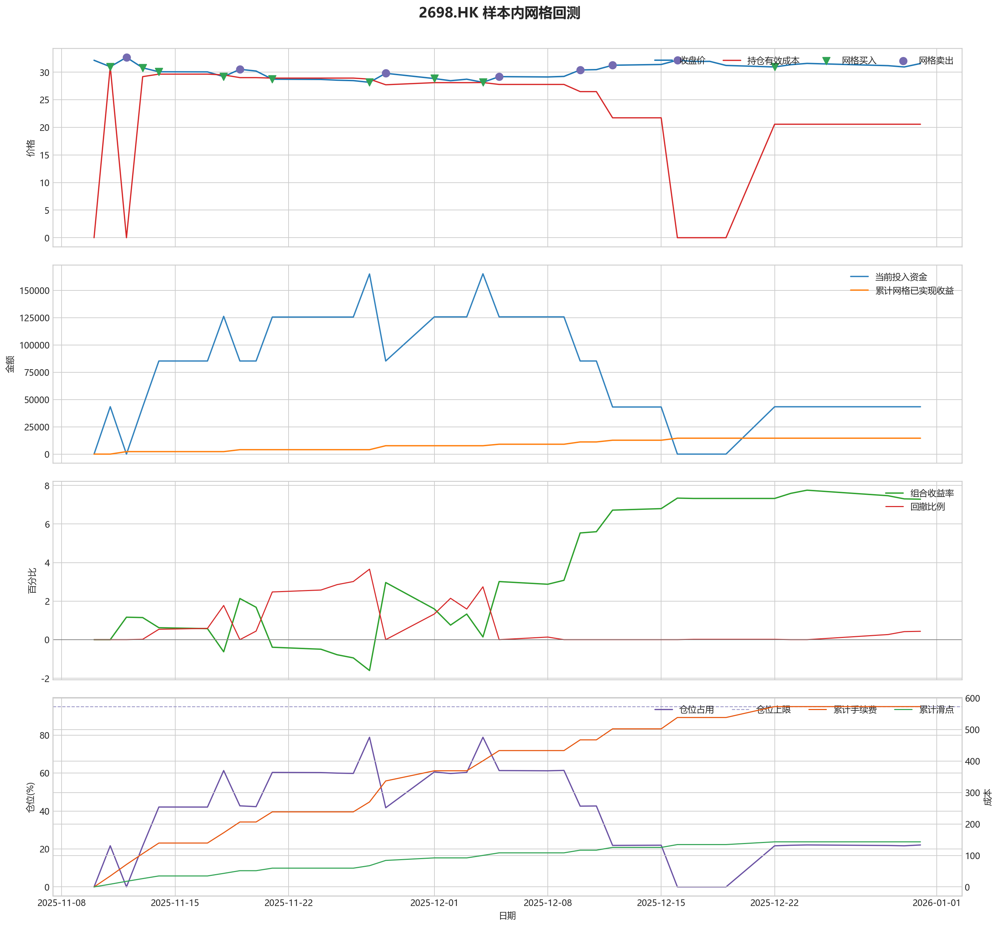
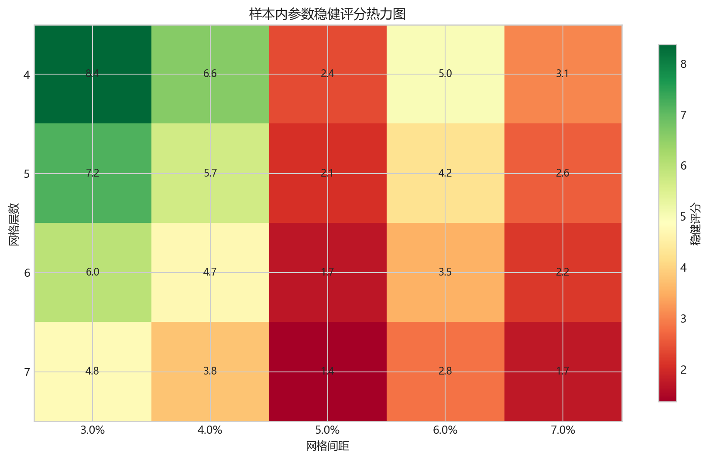
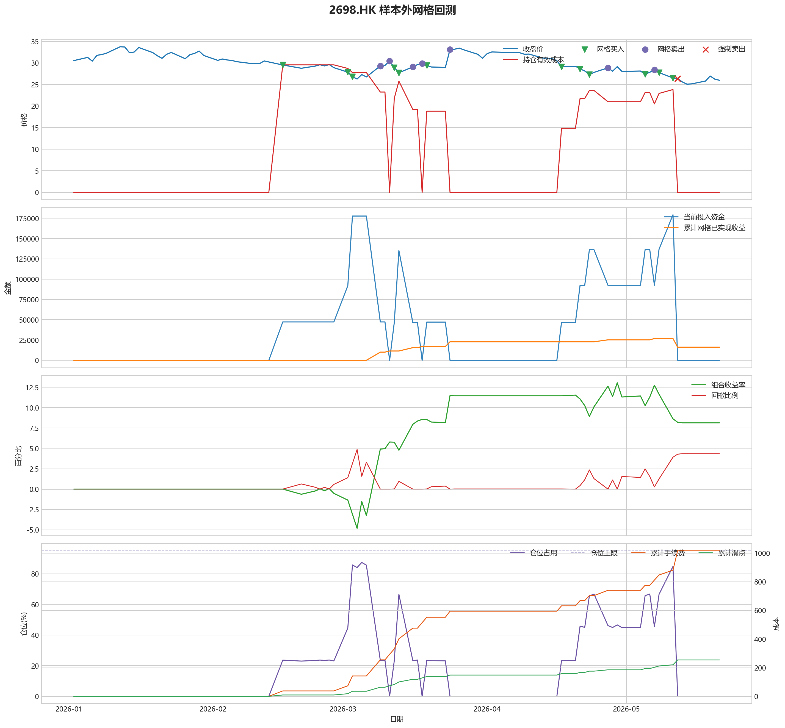

# 2698.HK 网格回测报告

## 摘要

- 标的：`2698.HK`
- 样本内窗口：2025-11-10 至 2025-12-31
- 样本外窗口：2026-01-01 至 2026-05-21
- 网格模式：纯现金网格，不在样本起点建立底仓；第一根 K 线收盘价只作为网格锚点
- 最小交易单位：200 股，来源：AASTOCKS 快照页 Lot Size
- 单层网格固定数量：1400 股
- 左侧处理：`both`，强制退出阈值 `5.00%` 总资金浮亏
- 执行口径：`realistic`，手续费 `8.00` bps，滑点 `2.00` bps
- 最优参数：网格间距 3.00% / 网格层数 4 / 止盈比例 3.00%

这套网格在当前样本里样本内外都转正，说明参数具备继续观察的价值。

## 第一层：先看结论

### 先回答关键问题

| 问题 | 样本内 | 样本外 | 怎么理解 |
| --- | --- | --- | --- |
| 这套策略能不能赚钱 | 7.28% | 8.14% | 当前样本内和样本外都为正收益，可以继续观察，但还不能直接等同于稳定实盘盈利。 |
| 比现金闲置好不好 | 14569.23 | 16274.77 | 正数表示网格策略赚到钱，负数表示不交易反而更好。 |
| 比买入持有好不好 | 18393.43 | 45641.86 | 买入持有用同样资金、交易单位和执行口径估算，正数表示网格更好。 |
| 交易成本高不高 | 573.11 | 1016.07 | 这里统计手续费，滑点会单独体现在估算成交价和滑点成本里。 |
| 最坏会亏到什么程度 | 3.66% | 4.86% | 这是账户在样本期间相对阶段高点出现过的最大回撤。 |
| 这组参数稳不稳 | 稳健分 8.37 | 沿用同一组参数 | 不是只看一整段最高分，而是看多窗口表现是否稳定。当前结果：100% 窗口为正，最差窗口收益 `7.28%`，收益波动 `0.00` 个百分点。 |

### 一句话判断

- 这套网格在当前样本里样本内外都转正，说明参数具备继续观察的价值。
- 当前正式拿去实盘的证据还不够，更合理的定位是：先验证它能否通过网格闭环赚钱，再看左侧行情下能否控制亏损。
- 如果你只想知道现在值不值得继续研究，看完上面这张表就够了。

## 第二层：展开细节

### 参数是怎么选的

| 筛选环节 | 结果 | 你该怎么理解 |
| --- | --- | --- |
| 执行口径 | realistic | 手续费 8.00 bps，滑点 2.00 bps。 |
| 候选组合数 | 60 | 先把候选参数全部跑完，不做随机抽样。 |
| 单窗综合分 | 8.37 | 这是整段样本内的收益、回撤、闭环网格利润综合分。 |
| 稳健窗口数 | 1 | 再把样本内按时间顺序拆成多个连续窗口，检查同一参数会不会只在一小段行情里好看。 |
| 稳健分 RobustScore | 8.37 | 计算方式：0.6 x 窗口平均分 + 0.4 x 最差窗口分 - 0.25 x 窗口收益波动。 |
| 最终入选参数 | 间距 3.00% / 层数 4 / 止盈 3.00% | 优先挑多窗口更稳的组合，而不是只挑单窗最亮的孤点。 |

### 关键结果对照

| 指标 | 样本内 | 样本外 | 怎么读 |
| --- | --- | --- | --- |
| 净收益率 | 7.28% | 8.14% | 已经按当前执行口径扣除回测引擎支持的费用影响。 |
| 最大回撤 | 3.66% | 4.86% | 再看亏起来最难受会到什么程度。 |
| 交易成本 | 573.11 | 1016.07 | 策略内部估算的手续费累计值，帮助判断网格频繁交易是否吃掉收益。 |
| 滑点成本 | 143.28 | 254.02 | 按收盘价和估算成交价差额累计，属于近似实盘口径。 |
| 未平网格有效成本 | 20.57 | 0.00 | 只在期末仍有未平网格仓位时有意义。 |
| 闭环网格净利润 | 14578.45 | 16146.12 | 这是已经完成低买高卖、真正落袋的利润，不等于总账户收益。 |
| 未平网格浮动盈亏 | 785.55 | 0.00 | hold 口径会保留这部分风险，force_exit 口径触发后通常回到 0。 |
| 网格闭环次数 | 8 | 10 | 次数越多，说明震荡里成交越频繁；但次数多不等于总账户一定赚钱。 |

### 执行口径和风控约束

| 约束 | 样本内 | 样本外 |
| --- | --- | --- |
| 执行口径 | realistic | realistic |
| 网格模式 | cash | cash |
| 左侧处理口径 | both | both |
| 手续费 / 滑点 | 8.00 / 2.00 bps | 8.00 / 2.00 bps |
| 最大仓位占用 | 78.85% / 上限 95.00% | 87.37% / 上限 95.00% |
| 停手事件 | 0 | 0 |
| 强制退出事件 | 0 | 4 |

### 网格到底有没有帮忙

| 对比项 | 样本内 | 样本外 |
| --- | --- | --- |
| 现金闲置收益率 | 0.00% | 0.00% |
| 买入持有收益率 | -1.91% | -14.68% |
| 网格策略收益率 | 7.28% | 8.14% |
| 网格相对现金闲置多赚/多亏 | 14569.23 | 16274.77 |
| 网格相对买入持有多赚/多亏 | 18393.43 | 45641.86 |

### 左侧行情怎么处理

| 左侧口径 | 样本内净收益率 | 样本内闭环利润 | 样本内浮动盈亏 | 样本内强平 | 样本外净收益率 | 样本外闭环利润 | 样本外浮动盈亏 | 样本外强平 |
| --- | --- | --- | --- | --- | --- | --- | --- | --- |
| hold：未平网格继续持有 | 7.28% | 14578.45 | 785.55 | 否 | 7.69% | 26829.17 | -13240.49 | 否 |
| force_exit：达到亏损阈值强平 | 7.28% | 14578.45 | 785.55 | 否 | 8.14% | 16146.12 | 0.00 | 是 |

补一句最重要的解释：

- “网格已实现收益”只代表已经完成低买高卖、真正落袋的那部分利润。
- 真正决定你账户最后赚没赚钱的，是“已实现网格收益 + 未平仓网格浮动盈亏 + 现金余额”三者一起的结果。
- 所以完全可能出现“网格已经落袋赚钱，但总账户还是亏钱”的情况。

### 图表速读总结

#### 样本内回测图

- 这一段价格从 `32.16` 走到 `31.57`，区间涨跌幅约 `-1.82%`。
- 样本结束时收盘价 `31.57` 已经回到有效成本 `20.57` 之上，未平网格按当前口径已经转回浮盈区。
- 图里的买卖点一共完成了 `8` 轮网格闭环，已经落袋的网格利润累计 `14578.45`。
- 期末未平网格浮动盈亏为 `785.55`。
- 总账户最终是盈利状态，期末权益 `214569.23`，说明闭环利润、未平仓浮动盈亏和现金余额合计后已经转正。

#### 热力图

- 热力图横轴是网格间距，纵轴是网格层数，颜色越偏绿代表稳健评分越高；每个格子里没有单独画出的止盈比例，已经折叠成该格子的最好结果。
- 当前样本里，最优参数落在“网格间距 `3.00%` / 网格层数 `4` / 止盈比例 `3.00%`”。
- 从前几名结果看，高分区域主要集中在网格间距 `3.00%`、网格层数 `4` 附近。
- 最优点比较集中在网格间距 `3.00%`、网格层数 `4` 附近，说明这组参数不是完全随机撞出来的。

#### 2026 样本外验证

- 样本外账户最终从 `200000` 走到 `216274.77`，总盈亏 `16274.77`。
- 样本外单层网格按最小交易单位 `200` 股取整，固定数量是 `1600` 股。
- 样本外结果转正，说明这组参数在新阶段没有立刻失效。

#### 样本外回测图

- 这一段价格从 `30.54` 走到 `25.98`，区间涨跌幅约 `-14.93%`。
- 样本结束时没有未平网格仓位，剩余风险已经体现在现金和已实现利润里。
- 图里的买卖点一共完成了 `10` 轮网格闭环，已经落袋的网格利润累计 `16146.12`。
- 左侧强制退出已经触发，后续不再继续开新网格。
- 总账户最终是盈利状态，期末权益 `216274.77`，说明闭环利润、未平仓浮动盈亏和现金余额合计后已经转正。

### 交易记录和明细

如果你只是想判断策略值不值得继续，到这里通常已经够了；下面这些表主要用于追交易过程和排查归因。

### 样本内事件流水

| 时间 | 事件类型 | 层级 | 价格 | 估算成交价 | 数量 | 金额 | 手续费 | 滑点成本 | 说明 |
| --- | --- | --- | --- | --- | --- | --- | --- | --- | --- |
| 2025-11-11 | grid_buy | 1 | 30.99 | 30.99 | 1400 | 43424.20 | 34.71 | 8.68 | 触发下行网格买入 |
| 2025-11-12 | grid_sell | 1 | 32.68 | 32.68 | 1400 | 45708.73 | 36.60 | 9.15 | 达到网格止盈价后卖出本层仓位 |
| 2025-11-13 | grid_buy | 1 | 30.79 | 30.80 | 1400 | 43151.09 | 34.49 | 8.62 | 触发下行网格买入 |
| 2025-11-14 | grid_buy | 2 | 30.07 | 30.08 | 1400 | 42140.59 | 33.69 | 8.42 | 触发下行网格买入 |
| 2025-11-18 | grid_buy | 3 | 29.19 | 29.20 | 1400 | 40911.60 | 32.70 | 8.17 | 触发下行网格买入 |
| 2025-11-19 | grid_sell | 3 | 30.52 | 30.51 | 1400 | 42683.29 | 34.17 | 8.55 | 达到网格止盈价后卖出本层仓位 |
| 2025-11-21 | grid_buy | 3 | 28.73 | 28.73 | 1400 | 40256.14 | 32.18 | 8.04 | 触发下行网格买入 |
| 2025-11-27 | grid_buy | 4 | 28.16 | 28.17 | 1400 | 39464.13 | 31.55 | 7.88 | 触发下行网格买入 |
| 2025-11-28 | grid_sell | 3 | 29.80 | 29.79 | 1400 | 41674.81 | 33.37 | 8.34 | 达到网格止盈价后卖出本层仓位 |
| 2025-11-28 | grid_sell | 4 | 29.80 | 29.79 | 1400 | 41674.81 | 33.37 | 8.34 | 达到网格止盈价后卖出本层仓位 |
| 2025-12-01 | grid_buy | 3 | 28.84 | 28.85 | 1400 | 40420.01 | 32.31 | 8.08 | 触发下行网格买入 |
| 2025-12-04 | grid_buy | 4 | 28.16 | 28.17 | 1400 | 39464.13 | 31.55 | 7.88 | 触发下行网格买入 |
| 2025-12-05 | grid_sell | 4 | 29.19 | 29.19 | 1400 | 40829.86 | 32.69 | 8.17 | 达到网格止盈价后卖出本层仓位 |
| 2025-12-10 | grid_sell | 3 | 30.40 | 30.40 | 1400 | 42519.75 | 34.04 | 8.51 | 达到网格止盈价后卖出本层仓位 |
| 2025-12-12 | grid_sell | 2 | 31.26 | 31.25 | 1400 | 43719.03 | 35.00 | 8.75 | 达到网格止盈价后卖出本层仓位 |
| 2025-12-16 | grid_sell | 1 | 32.18 | 32.17 | 1400 | 45000.07 | 36.03 | 9.01 | 达到网格止盈价后卖出本层仓位 |
| 2025-12-22 | grid_buy | 1 | 30.95 | 30.95 | 1400 | 43369.58 | 34.67 | 8.67 | 触发下行网格买入 |

### 样本内成交结果

| 开仓时间 | 平仓时间 | 持有时长 | 开仓价 | 平仓价 | 数量 | 盈亏 | 收益率(%) | 仓位类型 |
| --- | --- | --- | --- | --- | --- | --- | --- | --- |
| 2025-11-11 00:00:00 | 2025-11-12 00:00:00 | 1 days 00:00:00 | 30.99 | 32.68 | 1400 | 2293.68 | 5.29 | 网格 1 |
| 2025-11-18 00:00:00 | 2025-11-19 00:00:00 | 1 days 00:00:00 | 29.20 | 30.52 | 1400 | 1780.22 | 4.35 | 网格 3 |
| 2025-11-27 00:00:00 | 2025-11-28 00:00:00 | 1 days 00:00:00 | 28.17 | 29.80 | 1400 | 2219.01 | 5.63 | 网格 4 |
| 2025-11-21 00:00:00 | 2025-11-28 00:00:00 | 7 days 00:00:00 | 28.73 | 29.80 | 1400 | 1427.00 | 3.55 | 网格 3 |
| 2025-12-04 00:00:00 | 2025-12-05 00:00:00 | 1 days 00:00:00 | 28.17 | 29.19 | 1400 | 1373.90 | 3.48 | 网格 4 |
| 2025-12-01 00:00:00 | 2025-12-10 00:00:00 | 9 days 00:00:00 | 28.85 | 30.40 | 1400 | 2108.25 | 5.22 | 网格 3 |
| 2025-11-14 00:00:00 | 2025-12-12 00:00:00 | 28 days 00:00:00 | 30.08 | 31.26 | 1400 | 1587.18 | 3.77 | 网格 2 |
| 2025-11-13 00:00:00 | 2025-12-16 00:00:00 | 33 days 00:00:00 | 30.80 | 32.18 | 1400 | 1857.98 | 4.31 | 网格 1 |
| 2025-12-22 00:00:00 | 2025-12-30 00:00:00 | 8 days 00:00:00 | 30.95 | 30.95 | 1400 | -77.99 | -0.18 | 网格 1 |

### 样本外事件流水

| 时间 | 事件类型 | 层级 | 价格 | 估算成交价 | 数量 | 金额 | 手续费 | 滑点成本 | 说明 |
| --- | --- | --- | --- | --- | --- | --- | --- | --- | --- |
| 2026-02-16 | grid_buy | 1 | 29.52 | 29.53 | 1600 | 47286.73 | 37.80 | 9.45 | 触发下行网格买入 |
| 2026-03-02 | grid_buy | 2 | 27.87 | 27.87 | 1600 | 44633.68 | 35.68 | 8.92 | 触发下行网格买入 |
| 2026-03-03 | grid_buy | 3 | 26.80 | 26.80 | 1600 | 42917.00 | 34.31 | 8.57 | 触发下行网格买入 |
| 2026-03-03 | grid_buy | 4 | 26.80 | 26.80 | 1600 | 42917.00 | 34.31 | 8.57 | 触发下行网格买入 |
| 2026-03-09 | grid_sell | 2 | 29.31 | 29.30 | 1600 | 46849.60 | 37.51 | 9.38 | 达到网格止盈价后卖出本层仓位 |
| 2026-03-09 | grid_sell | 3 | 29.31 | 29.30 | 1600 | 46849.60 | 37.51 | 9.38 | 达到网格止盈价后卖出本层仓位 |
| 2026-03-09 | grid_sell | 4 | 29.31 | 29.30 | 1600 | 46849.60 | 37.51 | 9.38 | 达到网格止盈价后卖出本层仓位 |
| 2026-03-11 | grid_sell | 1 | 30.46 | 30.45 | 1600 | 48687.45 | 38.98 | 9.75 | 达到网格止盈价后卖出本层仓位 |
| 2026-03-12 | grid_buy | 1 | 28.94 | 28.95 | 1600 | 46350.36 | 37.05 | 9.26 | 触发下行网格买入 |
| 2026-03-13 | grid_buy | 2 | 27.73 | 27.74 | 1600 | 44415.19 | 35.50 | 8.87 | 触发下行网格买入 |
| 2026-03-13 | grid_buy | 3 | 27.73 | 27.74 | 1600 | 44415.19 | 35.50 | 8.87 | 触发下行网格买入 |
| 2026-03-16 | grid_sell | 2 | 29.08 | 29.07 | 1600 | 46475.80 | 37.21 | 9.30 | 达到网格止盈价后卖出本层仓位 |
| 2026-03-16 | grid_sell | 3 | 29.08 | 29.07 | 1600 | 46475.80 | 37.21 | 9.30 | 达到网格止盈价后卖出本层仓位 |
| 2026-03-18 | grid_sell | 1 | 29.88 | 29.87 | 1600 | 47752.95 | 38.23 | 9.56 | 达到网格止盈价后卖出本层仓位 |
| 2026-03-19 | grid_buy | 1 | 29.41 | 29.41 | 1600 | 47099.46 | 37.65 | 9.41 | 触发下行网格买入 |
| 2026-03-24 | grid_sell | 1 | 33.11 | 33.10 | 1600 | 52923.85 | 42.37 | 10.60 | 达到网格止盈价后卖出本层仓位 |
| 2026-04-17 | grid_buy | 1 | 29.10 | 29.10 | 1600 | 46600.06 | 37.25 | 9.31 | 触发下行网格买入 |
| 2026-04-21 | grid_buy | 2 | 28.63 | 28.63 | 1600 | 45850.96 | 36.65 | 9.16 | 触发下行网格买入 |
| 2026-04-23 | grid_buy | 3 | 27.30 | 27.31 | 1600 | 43728.52 | 34.95 | 8.74 | 触发下行网格买入 |
| 2026-04-27 | grid_sell | 3 | 28.86 | 28.86 | 1600 | 46133.15 | 36.94 | 9.24 | 达到网格止盈价后卖出本层仓位 |
| 2026-05-05 | grid_buy | 3 | 27.38 | 27.39 | 1600 | 43853.37 | 35.05 | 8.76 | 触发下行网格买入 |
| 2026-05-07 | grid_sell | 3 | 28.43 | 28.43 | 1600 | 45447.85 | 36.39 | 9.10 | 达到网格止盈价后卖出本层仓位 |
| 2026-05-08 | grid_buy | 3 | 27.75 | 27.76 | 1600 | 44446.40 | 35.53 | 8.88 | 触发下行网格买入 |
| 2026-05-11 | grid_buy | 4 | 26.50 | 26.51 | 1600 | 42448.82 | 33.93 | 8.48 | 触发下行网格买入 |
| 2026-05-12 | force_exit_sell | 1 | 26.38 | 26.37 | 1600 | 42165.80 | 33.76 | 8.44 | 未平网格浮亏达到总资金 5.00% 阈值，强制卖出本层仓位 |
| 2026-05-12 | force_exit_sell | 2 | 26.38 | 26.37 | 1600 | 42165.80 | 33.76 | 8.44 | 未平网格浮亏达到总资金 5.00% 阈值，强制卖出本层仓位 |
| 2026-05-12 | force_exit_sell | 3 | 26.38 | 26.37 | 1600 | 42165.80 | 33.76 | 8.44 | 未平网格浮亏达到总资金 5.00% 阈值，强制卖出本层仓位 |
| 2026-05-12 | force_exit_sell | 4 | 26.38 | 26.37 | 1600 | 42165.80 | 33.76 | 8.44 | 未平网格浮亏达到总资金 5.00% 阈值，强制卖出本层仓位 |

### 样本外成交结果

| 开仓时间 | 平仓时间 | 持有时长 | 开仓价 | 平仓价 | 数量 | 盈亏 | 收益率(%) | 仓位类型 |
| --- | --- | --- | --- | --- | --- | --- | --- | --- |
| 2026-03-03 00:00:00 | 2026-03-09 00:00:00 | 6 days 00:00:00 | 26.80 | 29.31 | 1600 | 3941.97 | 9.19 | 网格 4 |
| 2026-03-03 00:00:00 | 2026-03-09 00:00:00 | 6 days 00:00:00 | 26.80 | 29.31 | 1600 | 3941.97 | 9.19 | 网格 3 |
| 2026-03-02 00:00:00 | 2026-03-09 00:00:00 | 7 days 00:00:00 | 27.87 | 29.31 | 1600 | 2225.29 | 4.99 | 网格 2 |
| 2026-02-16 00:00:00 | 2026-03-11 00:00:00 | 23 days 00:00:00 | 29.53 | 30.46 | 1600 | 1410.46 | 2.99 | 网格 1 |
| 2026-03-13 00:00:00 | 2026-03-16 00:00:00 | 3 days 00:00:00 | 27.74 | 29.08 | 1600 | 2069.91 | 4.66 | 网格 3 |
| 2026-03-13 00:00:00 | 2026-03-16 00:00:00 | 3 days 00:00:00 | 27.74 | 29.08 | 1600 | 2069.91 | 4.66 | 网格 2 |
| 2026-03-12 00:00:00 | 2026-03-18 00:00:00 | 6 days 00:00:00 | 28.95 | 29.88 | 1600 | 1412.14 | 3.05 | 网格 1 |
| 2026-03-19 00:00:00 | 2026-03-24 00:00:00 | 5 days 00:00:00 | 29.41 | 33.11 | 1600 | 5834.98 | 12.40 | 网格 1 |
| 2026-04-23 00:00:00 | 2026-04-27 00:00:00 | 4 days 00:00:00 | 27.31 | 28.86 | 1600 | 2413.86 | 5.52 | 网格 3 |
| 2026-05-05 00:00:00 | 2026-05-07 00:00:00 | 2 days 00:00:00 | 27.39 | 28.43 | 1600 | 1603.57 | 3.66 | 网格 3 |
| 2026-05-11 00:00:00 | 2026-05-12 00:00:00 | 1 days 00:00:00 | 26.51 | 26.38 | 1600 | -274.58 | -0.65 | 网格 4 |
| 2026-05-08 00:00:00 | 2026-05-12 00:00:00 | 4 days 00:00:00 | 27.76 | 26.38 | 1600 | -2272.17 | -5.12 | 网格 3 |
| 2026-04-21 00:00:00 | 2026-05-12 00:00:00 | 21 days 00:00:00 | 28.63 | 26.38 | 1600 | -3676.73 | -8.03 | 网格 2 |
| 2026-04-17 00:00:00 | 2026-05-12 00:00:00 | 25 days 00:00:00 | 29.10 | 26.38 | 1600 | -4425.83 | -9.51 | 网格 1 |

## 最终结论

- 这套参数更适合“先跌一段、再进入震荡或反弹”的行情，因为它依赖反弹来兑现网格利润。
- 如果行情持续单边下跌，hold 口径会继续持有未平网格，force_exit 口径会在浮亏达到阈值后清仓并停止交易。
- 当前样本下，闭环网格净利润：样本内 14578.45，样本外 16146.12。
- 如果后续继续扩展策略，优先方向应该是加入趋势过滤或分阶段停手机制，而不是单纯增加网格层数。
