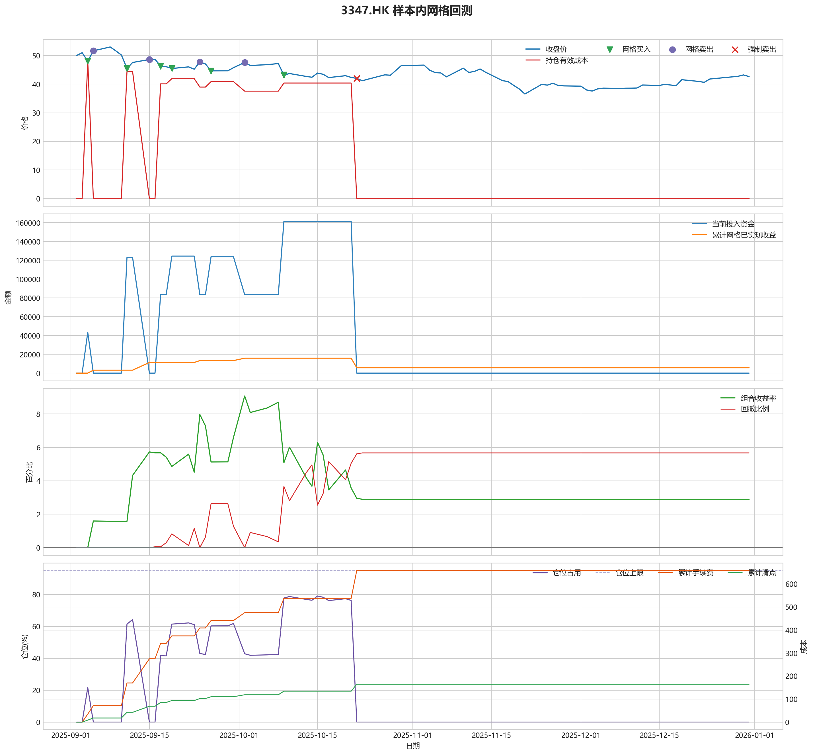
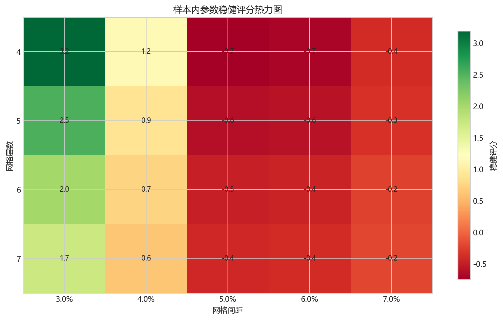
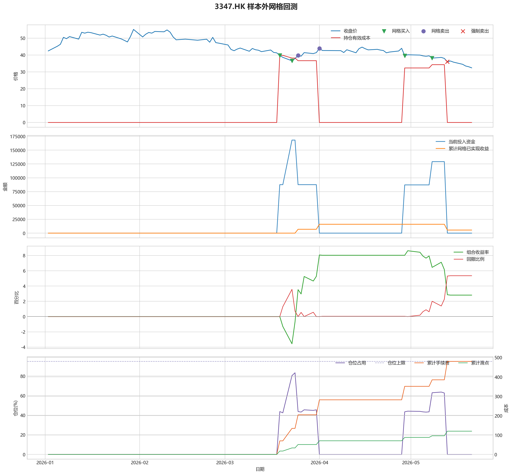

# 3347.HK 网格回测报告

## 摘要

- 标的：`3347.HK`
- 样本内窗口：2025-09-02 至 2025-12-31
- 样本外窗口：2026-01-01 至 2026-05-21
- 网格模式：纯现金网格，不在样本起点建立底仓；第一根 K 线收盘价只作为网格锚点
- 最小交易单位：100 股，来源：AASTOCKS 快照页 Lot Size
- 单层网格固定数量：900 股
- 左侧处理：`both`，强制退出阈值 `5.00%` 总资金浮亏
- 执行口径：`realistic`，手续费 `8.00` bps，滑点 `2.00` bps
- 最优参数：网格间距 3.00% / 网格层数 4 / 止盈比例 5.00%

这套网格在当前样本里样本内外都转正，说明参数具备继续观察的价值。

## 第一层：先看结论

### 先回答关键问题

| 问题 | 样本内 | 样本外 | 怎么理解 |
| --- | --- | --- | --- |
| 这套策略能不能赚钱 | 2.89% | 2.81% | 当前样本内和样本外都为正收益，可以继续观察，但还不能直接等同于稳定实盘盈利。 |
| 比现金闲置好不好 | 5784.65 | 5620.30 | 正数表示网格策略赚到钱，负数表示不交易反而更好。 |
| 比买入持有好不好 | 34605.68 | 53007.79 | 买入持有用同样资金、交易单位和执行口径估算，正数表示网格更好。 |
| 交易成本高不高 | 658.60 | 480.23 | 这里统计手续费，滑点会单独体现在估算成交价和滑点成本里。 |
| 最坏会亏到什么程度 | 5.67% | 5.35% | 这是账户在样本期间相对阶段高点出现过的最大回撤。 |
| 这组参数稳不稳 | 稳健分 3.19 | 沿用同一组参数 | 不是只看一整段最高分，而是看多窗口表现是否稳定。当前结果：100% 窗口为正，最差窗口收益 `1.94%`，收益波动 `1.39` 个百分点。 |

### 一句话判断

- 这套网格在当前样本里样本内外都转正，说明参数具备继续观察的价值。
- 当前正式拿去实盘的证据还不够，更合理的定位是：先验证它能否通过网格闭环赚钱，再看左侧行情下能否控制亏损。
- 如果你只想知道现在值不值得继续研究，看完上面这张表就够了。

## 第二层：展开细节

### 参数是怎么选的

| 筛选环节 | 结果 | 你该怎么理解 |
| --- | --- | --- |
| 执行口径 | realistic | 手续费 8.00 bps，滑点 2.00 bps。 |
| 候选组合数 | 60 | 先把候选参数全部跑完，不做随机抽样。 |
| 单窗综合分 | 0.35 | 这是整段样本内的收益、回撤、闭环网格利润综合分。 |
| 稳健窗口数 | 3 | 再把样本内按时间顺序拆成多个连续窗口，检查同一参数会不会只在一小段行情里好看。 |
| 稳健分 RobustScore | 3.19 | 计算方式：0.6 x 窗口平均分 + 0.4 x 最差窗口分 - 0.25 x 窗口收益波动。 |
| 最终入选参数 | 间距 3.00% / 层数 4 / 止盈 5.00% | 优先挑多窗口更稳的组合，而不是只挑单窗最亮的孤点。 |

### 关键结果对照

| 指标 | 样本内 | 样本外 | 怎么读 |
| --- | --- | --- | --- |
| 净收益率 | 2.89% | 2.81% | 已经按当前执行口径扣除回测引擎支持的费用影响。 |
| 最大回撤 | 5.67% | 5.35% | 再看亏起来最难受会到什么程度。 |
| 交易成本 | 658.60 | 480.23 | 策略内部估算的手续费累计值，帮助判断网格频繁交易是否吃掉收益。 |
| 滑点成本 | 164.65 | 120.06 | 按收盘价和估算成交价差额累计，属于近似实盘口径。 |
| 未平网格有效成本 | 0.00 | 0.00 | 只在期末仍有未平网格仓位时有意义。 |
| 闭环网格净利润 | 5701.74 | 5559.70 | 这是已经完成低买高卖、真正落袋的利润，不等于总账户收益。 |
| 未平网格浮动盈亏 | 0.00 | 0.00 | hold 口径会保留这部分风险，force_exit 口径触发后通常回到 0。 |
| 网格闭环次数 | 6 | 4 | 次数越多，说明震荡里成交越频繁；但次数多不等于总账户一定赚钱。 |

### 执行口径和风控约束

| 约束 | 样本内 | 样本外 |
| --- | --- | --- |
| 执行口径 | realistic | realistic |
| 网格模式 | cash | cash |
| 左侧处理口径 | both | both |
| 手续费 / 滑点 | 8.00 / 2.00 bps | 8.00 / 2.00 bps |
| 最大仓位占用 | 78.98% / 上限 95.00% | 83.38% / 上限 95.00% |
| 停手事件 | 0 | 0 |
| 强制退出事件 | 4 | 3 |

### 网格到底有没有帮忙

| 对比项 | 样本内 | 样本外 |
| --- | --- | --- |
| 现金闲置收益率 | 0.00% | 0.00% |
| 买入持有收益率 | -14.41% | -23.69% |
| 网格策略收益率 | 2.89% | 2.81% |
| 网格相对现金闲置多赚/多亏 | 5784.65 | 5620.30 |
| 网格相对买入持有多赚/多亏 | 34605.68 | 53007.79 |

### 左侧行情怎么处理

| 左侧口径 | 样本内净收益率 | 样本内闭环利润 | 样本内浮动盈亏 | 样本内强平 | 样本外净收益率 | 样本外闭环利润 | 样本外浮动盈亏 | 样本外强平 |
| --- | --- | --- | --- | --- | --- | --- | --- | --- |
| hold：未平网格继续持有 | 6.94% | 21836.59 | -10072.91 | 否 | -3.73% | 16015.65 | -26447.26 | 否 |
| force_exit：达到亏损阈值强平 | 2.89% | 5701.74 | 0.00 | 是 | 2.81% | 5559.70 | 0.00 | 是 |

补一句最重要的解释：

- “网格已实现收益”只代表已经完成低买高卖、真正落袋的那部分利润。
- 真正决定你账户最后赚没赚钱的，是“已实现网格收益 + 未平仓网格浮动盈亏 + 现金余额”三者一起的结果。
- 所以完全可能出现“网格已经落袋赚钱，但总账户还是亏钱”的情况。

### 图表速读总结

#### 样本内回测图

- 这一段价格从 `50.00` 走到 `42.66`，区间涨跌幅约 `-14.68%`。
- 样本结束时没有未平网格仓位，剩余风险已经体现在现金和已实现利润里。
- 图里的买卖点一共完成了 `6` 轮网格闭环，已经落袋的网格利润累计 `5701.74`。
- 左侧强制退出已经触发，后续不再继续开新网格。
- 总账户最终是盈利状态，期末权益 `205784.65`，说明闭环利润、未平仓浮动盈亏和现金余额合计后已经转正。

#### 热力图

- 热力图横轴是网格间距，纵轴是网格层数，颜色越偏绿代表稳健评分越高；每个格子里没有单独画出的止盈比例，已经折叠成该格子的最好结果。
- 当前样本里，最优参数落在“网格间距 `3.00%` / 网格层数 `4` / 止盈比例 `5.00%`”。
- 从前几名结果看，高分区域主要集中在网格间距 `3.00%`、网格层数 `4` 附近。
- 最优点比较集中在网格间距 `3.00%`、网格层数 `4` 附近，说明这组参数不是完全随机撞出来的。

#### 2026 样本外验证

- 样本外账户最终从 `200000` 走到 `205620.30`，总盈亏 `5620.30`。
- 样本外单层网格按最小交易单位 `100` 股取整，固定数量是 `1100` 股。
- 样本外结果转正，说明这组参数在新阶段没有立刻失效。

#### 样本外回测图

- 这一段价格从 `42.44` 走到 `32.40`，区间涨跌幅约 `-23.66%`。
- 样本结束时没有未平网格仓位，剩余风险已经体现在现金和已实现利润里。
- 图里的买卖点一共完成了 `4` 轮网格闭环，已经落袋的网格利润累计 `5559.70`。
- 左侧强制退出已经触发，后续不再继续开新网格。
- 总账户最终是盈利状态，期末权益 `205620.30`，说明闭环利润、未平仓浮动盈亏和现金余额合计后已经转正。

### 交易记录和明细

如果你只是想判断策略值不值得继续，到这里通常已经够了；下面这些表主要用于追交易过程和排查归因。

### 样本内事件流水

| 时间 | 事件类型 | 层级 | 价格 | 估算成交价 | 数量 | 金额 | 手续费 | 滑点成本 | 说明 |
| --- | --- | --- | --- | --- | --- | --- | --- | --- | --- |
| 2025-09-04 | grid_buy | 1 | 48.06 | 48.07 | 900 | 43297.26 | 34.61 | 8.65 | 触发下行网格买入 |
| 2025-09-05 | grid_sell | 1 | 51.65 | 51.64 | 900 | 46438.52 | 37.18 | 9.30 | 达到网格止盈价后卖出本层仓位 |
| 2025-09-11 | grid_buy | 1 | 45.50 | 45.51 | 900 | 40990.96 | 32.77 | 8.19 | 触发下行网格买入 |
| 2025-09-11 | grid_buy | 2 | 45.50 | 45.51 | 900 | 40990.96 | 32.77 | 8.19 | 触发下行网格买入 |
| 2025-09-11 | grid_buy | 3 | 45.50 | 45.51 | 900 | 40990.96 | 32.77 | 8.19 | 触发下行网格买入 |
| 2025-09-15 | grid_sell | 1 | 48.62 | 48.61 | 900 | 43714.25 | 35.00 | 8.75 | 达到网格止盈价后卖出本层仓位 |
| 2025-09-15 | grid_sell | 2 | 48.62 | 48.61 | 900 | 43714.25 | 35.00 | 8.75 | 达到网格止盈价后卖出本层仓位 |
| 2025-09-15 | grid_sell | 3 | 48.62 | 48.61 | 900 | 43714.25 | 35.00 | 8.75 | 达到网格止盈价后卖出本层仓位 |
| 2025-09-17 | grid_buy | 1 | 46.34 | 46.35 | 900 | 41747.71 | 33.37 | 8.34 | 触发下行网格买入 |
| 2025-09-17 | grid_buy | 2 | 46.34 | 46.35 | 900 | 41747.71 | 33.37 | 8.34 | 触发下行网格买入 |
| 2025-09-19 | grid_buy | 3 | 45.48 | 45.49 | 900 | 40972.94 | 32.75 | 8.19 | 触发下行网格买入 |
| 2025-09-24 | grid_sell | 3 | 47.80 | 47.79 | 900 | 42976.99 | 34.41 | 8.60 | 达到网格止盈价后卖出本层仓位 |
| 2025-09-26 | grid_buy | 3 | 44.66 | 44.67 | 900 | 40234.20 | 32.16 | 8.04 | 触发下行网格买入 |
| 2025-10-02 | grid_sell | 3 | 47.60 | 47.59 | 900 | 42797.17 | 34.27 | 8.57 | 达到网格止盈价后卖出本层仓位 |
| 2025-10-09 | grid_buy | 3 | 43.18 | 43.19 | 900 | 38900.87 | 31.10 | 7.77 | 触发下行网格买入 |
| 2025-10-09 | grid_buy | 4 | 43.18 | 43.19 | 900 | 38900.87 | 31.10 | 7.77 | 触发下行网格买入 |
| 2025-10-22 | force_exit_sell | 1 | 42.02 | 42.01 | 900 | 37780.19 | 30.25 | 7.56 | 未平网格浮亏达到总资金 5.00% 阈值，强制卖出本层仓位 |
| 2025-10-22 | force_exit_sell | 2 | 42.02 | 42.01 | 900 | 37780.19 | 30.25 | 7.56 | 未平网格浮亏达到总资金 5.00% 阈值，强制卖出本层仓位 |
| 2025-10-22 | force_exit_sell | 3 | 42.02 | 42.01 | 900 | 37780.19 | 30.25 | 7.56 | 未平网格浮亏达到总资金 5.00% 阈值，强制卖出本层仓位 |
| 2025-10-22 | force_exit_sell | 4 | 42.02 | 42.01 | 900 | 37780.19 | 30.25 | 7.56 | 未平网格浮亏达到总资金 5.00% 阈值，强制卖出本层仓位 |

### 样本内成交结果

| 开仓时间 | 平仓时间 | 持有时长 | 开仓价 | 平仓价 | 数量 | 盈亏 | 收益率(%) | 仓位类型 |
| --- | --- | --- | --- | --- | --- | --- | --- | --- |
| 2025-09-04 00:00:00 | 2025-09-05 00:00:00 | 1 days 00:00:00 | 48.07 | 51.65 | 900 | 3150.55 | 7.28 | 网格 1 |
| 2025-09-11 00:00:00 | 2025-09-15 00:00:00 | 4 days 00:00:00 | 45.51 | 48.62 | 900 | 2732.04 | 6.67 | 网格 3 |
| 2025-09-11 00:00:00 | 2025-09-15 00:00:00 | 4 days 00:00:00 | 45.51 | 48.62 | 900 | 2732.04 | 6.67 | 网格 2 |
| 2025-09-11 00:00:00 | 2025-09-15 00:00:00 | 4 days 00:00:00 | 45.51 | 48.62 | 900 | 2732.04 | 6.67 | 网格 1 |
| 2025-09-19 00:00:00 | 2025-09-24 00:00:00 | 5 days 00:00:00 | 45.49 | 47.80 | 900 | 2012.65 | 4.92 | 网格 3 |
| 2025-09-26 00:00:00 | 2025-10-02 00:00:00 | 6 days 00:00:00 | 44.67 | 47.60 | 900 | 2571.53 | 6.40 | 网格 3 |
| 2025-10-09 00:00:00 | 2025-10-22 00:00:00 | 13 days 00:00:00 | 43.19 | 42.02 | 900 | -1113.12 | -2.86 | 网格 4 |
| 2025-10-09 00:00:00 | 2025-10-22 00:00:00 | 13 days 00:00:00 | 43.19 | 42.02 | 900 | -1113.12 | -2.86 | 网格 3 |
| 2025-09-17 00:00:00 | 2025-10-22 00:00:00 | 35 days 00:00:00 | 46.35 | 42.02 | 900 | -3959.97 | -9.49 | 网格 2 |
| 2025-09-17 00:00:00 | 2025-10-22 00:00:00 | 35 days 00:00:00 | 46.35 | 42.02 | 900 | -3959.97 | -9.49 | 网格 1 |

### 样本外事件流水

| 时间 | 事件类型 | 层级 | 价格 | 估算成交价 | 数量 | 金额 | 手续费 | 滑点成本 | 说明 |
| --- | --- | --- | --- | --- | --- | --- | --- | --- | --- |
| 2026-03-19 | grid_buy | 1 | 39.78 | 39.79 | 1100 | 43801.76 | 35.01 | 8.75 | 触发下行网格买入 |
| 2026-03-19 | grid_buy | 2 | 39.78 | 39.79 | 1100 | 43801.76 | 35.01 | 8.75 | 触发下行网格买入 |
| 2026-03-23 | grid_buy | 3 | 36.58 | 36.59 | 1100 | 40278.25 | 32.20 | 8.05 | 触发下行网格买入 |
| 2026-03-23 | grid_buy | 4 | 36.58 | 36.59 | 1100 | 40278.25 | 32.20 | 8.05 | 触发下行网格买入 |
| 2026-03-25 | grid_sell | 3 | 39.82 | 39.81 | 1100 | 43758.20 | 35.03 | 8.76 | 达到网格止盈价后卖出本层仓位 |
| 2026-03-25 | grid_sell | 4 | 39.82 | 39.81 | 1100 | 43758.20 | 35.03 | 8.76 | 达到网格止盈价后卖出本层仓位 |
| 2026-04-01 | grid_sell | 1 | 43.98 | 43.97 | 1100 | 48329.63 | 38.69 | 9.68 | 达到网格止盈价后卖出本层仓位 |
| 2026-04-01 | grid_sell | 2 | 43.98 | 43.97 | 1100 | 48329.63 | 38.69 | 9.68 | 达到网格止盈价后卖出本层仓位 |
| 2026-04-29 | grid_buy | 1 | 39.58 | 39.59 | 1100 | 43581.55 | 34.84 | 8.71 | 触发下行网格买入 |
| 2026-04-29 | grid_buy | 2 | 39.58 | 39.59 | 1100 | 43581.55 | 34.84 | 8.71 | 触发下行网格买入 |
| 2026-05-08 | grid_buy | 3 | 38.18 | 38.19 | 1100 | 42040.01 | 33.61 | 8.40 | 触发下行网格买入 |
| 2026-05-13 | force_exit_sell | 1 | 36.02 | 36.01 | 1100 | 39582.38 | 31.69 | 7.92 | 未平网格浮亏达到总资金 5.00% 阈值，强制卖出本层仓位 |
| 2026-05-13 | force_exit_sell | 2 | 36.02 | 36.01 | 1100 | 39582.38 | 31.69 | 7.92 | 未平网格浮亏达到总资金 5.00% 阈值，强制卖出本层仓位 |
| 2026-05-13 | force_exit_sell | 3 | 36.02 | 36.01 | 1100 | 39582.38 | 31.69 | 7.92 | 未平网格浮亏达到总资金 5.00% 阈值，强制卖出本层仓位 |

### 样本外成交结果

| 开仓时间 | 平仓时间 | 持有时长 | 开仓价 | 平仓价 | 数量 | 盈亏 | 收益率(%) | 仓位类型 |
| --- | --- | --- | --- | --- | --- | --- | --- | --- |
| 2026-03-23 00:00:00 | 2026-03-25 00:00:00 | 2 days 00:00:00 | 36.59 | 39.82 | 1100 | 3488.71 | 8.67 | 网格 4 |
| 2026-03-23 00:00:00 | 2026-03-25 00:00:00 | 2 days 00:00:00 | 36.59 | 39.82 | 1100 | 3488.71 | 8.67 | 网格 3 |
| 2026-03-19 00:00:00 | 2026-04-01 00:00:00 | 13 days 00:00:00 | 39.79 | 43.98 | 1100 | 4537.53 | 10.37 | 网格 2 |
| 2026-03-19 00:00:00 | 2026-04-01 00:00:00 | 13 days 00:00:00 | 39.79 | 43.98 | 1100 | 4537.53 | 10.37 | 网格 1 |
| 2026-05-08 00:00:00 | 2026-05-13 00:00:00 | 5 days 00:00:00 | 38.19 | 36.02 | 1100 | -2449.70 | -5.83 | 网格 3 |
| 2026-04-29 00:00:00 | 2026-05-13 00:00:00 | 14 days 00:00:00 | 39.59 | 36.02 | 1100 | -3991.24 | -9.17 | 网格 2 |
| 2026-04-29 00:00:00 | 2026-05-13 00:00:00 | 14 days 00:00:00 | 39.59 | 36.02 | 1100 | -3991.24 | -9.17 | 网格 1 |

## 最终结论

- 这套参数更适合“先跌一段、再进入震荡或反弹”的行情，因为它依赖反弹来兑现网格利润。
- 如果行情持续单边下跌，hold 口径会继续持有未平网格，force_exit 口径会在浮亏达到阈值后清仓并停止交易。
- 当前样本下，闭环网格净利润：样本内 5701.74，样本外 5559.70。
- 如果后续继续扩展策略，优先方向应该是加入趋势过滤或分阶段停手机制，而不是单纯增加网格层数。
