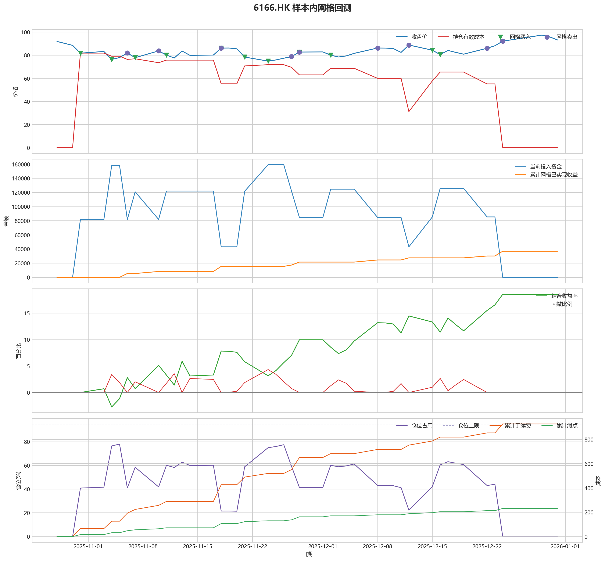
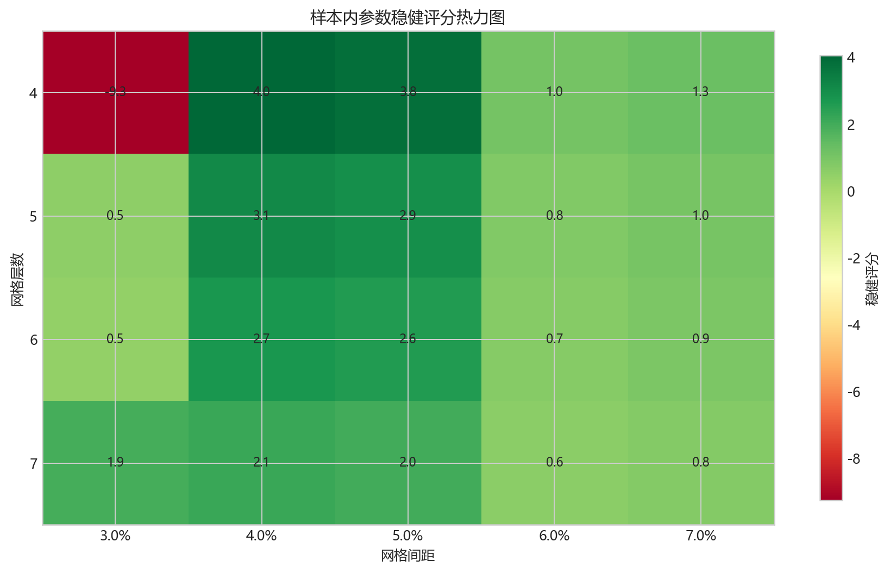
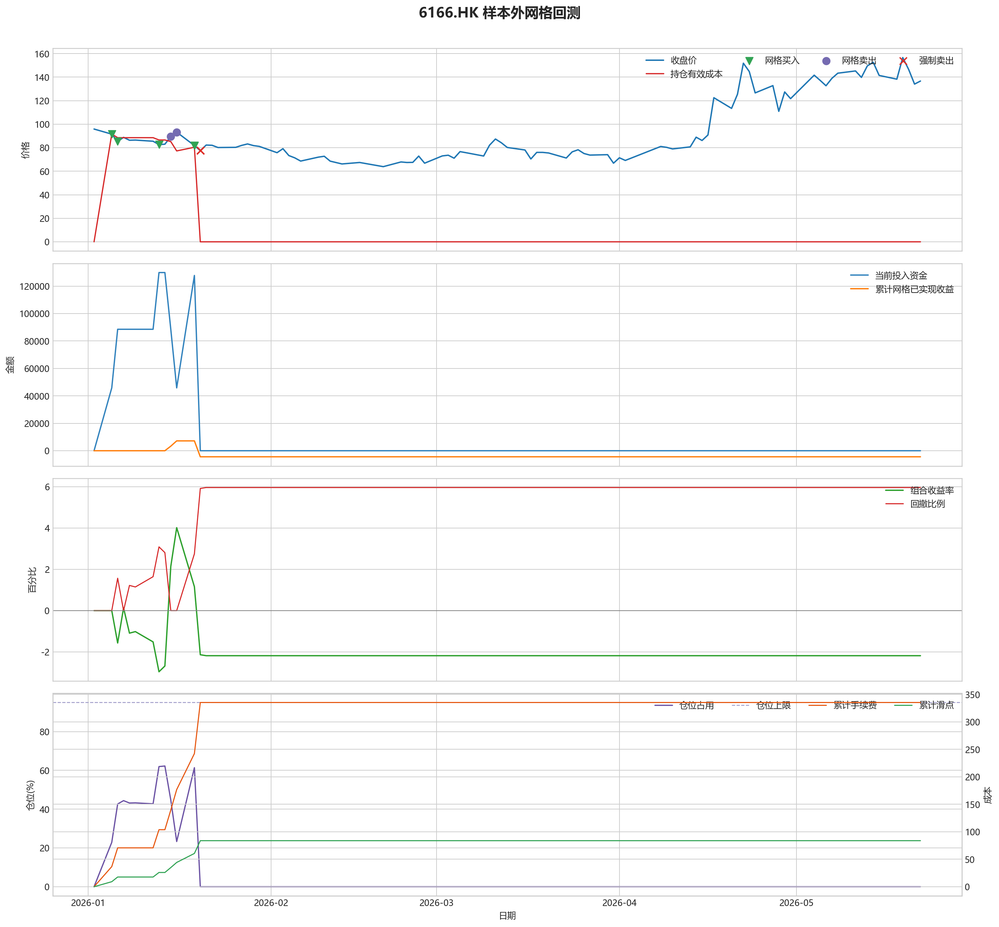

# 6166.HK 网格回测报告

## 摘要

- 标的：`6166.HK`
- 样本内窗口：2025-10-28 至 2025-12-31
- 样本外窗口：2026-01-01 至 2026-05-22
- 网格模式：纯现金网格，不在样本起点建立底仓；第一根 K 线收盘价只作为网格锚点
- 最小交易单位：50 股，来源：AASTOCKS 快照页 Lot Size
- 单层网格固定数量：500 股
- 左侧处理：`both`，强制退出阈值 `5.00%` 总资金浮亏
- 执行口径：`realistic`，手续费 `8.00` bps，滑点 `2.00` bps
- 最优参数：网格间距 4.00% / 网格层数 4 / 止盈比例 5.00%

这套网格在不同阶段表现不一致，说明它对行情结构比较敏感，不能只看单段结果下结论。

## 第一层：先看结论

### 先回答关键问题

| 问题 | 样本内 | 样本外 | 怎么理解 |
| --- | --- | --- | --- |
| 这套策略能不能赚钱 | 18.52% | -2.18% | 当前还不能证明这套网格能稳定盈利，尤其要继续观察单边下跌时未平仓风险如何处理。 |
| 比现金闲置好不好 | 37045.02 | -4368.20 | 正数表示网格策略赚到钱，负数表示不交易反而更好。 |
| 比买入持有好不好 | 34454.44 | -87817.02 | 买入持有用同样资金、交易单位和执行口径估算，正数表示网格更好。 |
| 交易成本高不高 | 926.92 | 335.36 | 这里统计手续费，滑点会单独体现在估算成交价和滑点成本里。 |
| 最坏会亏到什么程度 | 4.34% | 5.96% | 这是账户在样本期间相对阶段高点出现过的最大回撤。 |
| 这组参数稳不稳 | 稳健分 4.05 | 沿用同一组参数 | 不是只看一整段最高分，而是看多窗口表现是否稳定。当前结果：100% 窗口为正，最差窗口收益 `2.29%`，收益波动 `1.64` 个百分点。 |

### 一句话判断

- 这套网格在不同阶段表现不一致，说明它对行情结构比较敏感，不能只看单段结果下结论。
- 当前正式拿去实盘的证据还不够，更合理的定位是：先验证它能否通过网格闭环赚钱，再看左侧行情下能否控制亏损。
- 如果你只想知道现在值不值得继续研究，看完上面这张表就够了。

## 第二层：展开细节

### 参数是怎么选的

| 筛选环节 | 结果 | 你该怎么理解 |
| --- | --- | --- |
| 执行口径 | realistic | 手续费 8.00 bps，滑点 2.00 bps。 |
| 候选组合数 | 60 | 先把候选参数全部跑完，不做随机抽样。 |
| 单窗综合分 | 24.72 | 这是整段样本内的收益、回撤、闭环网格利润综合分。 |
| 稳健窗口数 | 2 | 再把样本内按时间顺序拆成多个连续窗口，检查同一参数会不会只在一小段行情里好看。 |
| 稳健分 RobustScore | 4.05 | 计算方式：0.6 x 窗口平均分 + 0.4 x 最差窗口分 - 0.25 x 窗口收益波动。 |
| 最终入选参数 | 间距 4.00% / 层数 4 / 止盈 5.00% | 优先挑多窗口更稳的组合，而不是只挑单窗最亮的孤点。 |

### 关键结果对照

| 指标 | 样本内 | 样本外 | 怎么读 |
| --- | --- | --- | --- |
| 净收益率 | 18.52% | -2.18% | 已经按当前执行口径扣除回测引擎支持的费用影响。 |
| 最大回撤 | 4.34% | 5.96% | 再看亏起来最难受会到什么程度。 |
| 交易成本 | 926.92 | 335.36 | 策略内部估算的手续费累计值，帮助判断网格频繁交易是否吃掉收益。 |
| 滑点成本 | 231.73 | 83.84 | 按收盘价和估算成交价差额累计，属于近似实盘口径。 |
| 未平网格有效成本 | 0.00 | 0.00 | 只在期末仍有未平网格仓位时有意义。 |
| 闭环网格净利润 | 36925.44 | -4409.69 | 这是已经完成低买高卖、真正落袋的利润，不等于总账户收益。 |
| 未平网格浮动盈亏 | 0.00 | 0.00 | hold 口径会保留这部分风险，force_exit 口径触发后通常回到 0。 |
| 网格闭环次数 | 14 | 2 | 次数越多，说明震荡里成交越频繁；但次数多不等于总账户一定赚钱。 |

### 执行口径和风控约束

| 约束 | 样本内 | 样本外 |
| --- | --- | --- |
| 执行口径 | realistic | realistic |
| 网格模式 | cash | cash |
| 左侧处理口径 | both | both |
| 手续费 / 滑点 | 8.00 / 2.00 bps | 8.00 / 2.00 bps |
| 最大仓位占用 | 78.01% / 上限 95.00% | 62.25% / 上限 95.00% |
| 停手事件 | 0 | 0 |
| 强制退出事件 | 0 | 3 |

### 网格到底有没有帮忙

| 对比项 | 样本内 | 样本外 |
| --- | --- | --- |
| 现金闲置收益率 | 0.00% | 0.00% |
| 买入持有收益率 | 1.30% | 41.72% |
| 网格策略收益率 | 18.52% | -2.18% |
| 网格相对现金闲置多赚/多亏 | 37045.02 | -4368.20 |
| 网格相对买入持有多赚/多亏 | 34454.44 | -87817.02 |

### 左侧行情怎么处理

| 左侧口径 | 样本内净收益率 | 样本内闭环利润 | 样本内浮动盈亏 | 样本内强平 | 样本外净收益率 | 样本外闭环利润 | 样本外浮动盈亏 | 样本外强平 |
| --- | --- | --- | --- | --- | --- | --- | --- | --- |
| hold：未平网格继续持有 | 18.52% | 36925.44 | 0.00 | 否 | 28.93% | 57768.67 | 0.00 | 否 |
| force_exit：达到亏损阈值强平 | 18.52% | 36925.44 | 0.00 | 否 | -2.18% | -4409.69 | 0.00 | 是 |

补一句最重要的解释：

- “网格已实现收益”只代表已经完成低买高卖、真正落袋的那部分利润。
- 真正决定你账户最后赚没赚钱的，是“已实现网格收益 + 未平仓网格浮动盈亏 + 现金余额”三者一起的结果。
- 所以完全可能出现“网格已经落袋赚钱，但总账户还是亏钱”的情况。

### 图表速读总结

#### 样本内回测图

- 这一段价格从 `91.98` 走到 `93.28`，区间涨跌幅约 `1.41%`。
- 样本结束时没有未平网格仓位，剩余风险已经体现在现金和已实现利润里。
- 图里的买卖点一共完成了 `14` 轮网格闭环，已经落袋的网格利润累计 `36925.44`。
- 期末未平网格浮动盈亏为 `0.00`。
- 总账户最终是盈利状态，期末权益 `237045.02`，说明闭环利润、未平仓浮动盈亏和现金余额合计后已经转正。

#### 热力图

- 热力图横轴是网格间距，纵轴是网格层数，颜色越偏绿代表稳健评分越高；每个格子里没有单独画出的止盈比例，已经折叠成该格子的最好结果。
- 当前样本里，最优参数落在“网格间距 `4.00%` / 网格层数 `4` / 止盈比例 `5.00%`”。
- 从前几名结果看，高分区域主要集中在网格间距 `4.00%`、网格层数 `4` 附近。
- 最优点比较集中在网格间距 `4.00%`、网格层数 `4` 附近，说明这组参数不是完全随机撞出来的。

#### 2026 样本外验证

- 样本外账户最终从 `200000` 走到 `195631.80`，总盈亏 `-4368.20`。
- 样本外单层网格按最小交易单位 `50` 股取整，固定数量是 `500` 股。
- 样本外没有转正，说明这组参数还不能在该行情结构下独立制造稳定盈利。

#### 样本外回测图

- 这一段价格从 `95.87` 走到 `136.67`，区间涨跌幅约 `42.56%`。
- 样本结束时没有未平网格仓位，剩余风险已经体现在现金和已实现利润里。
- 图里的买卖点一共完成了 `2` 轮网格闭环，已经落袋的网格利润累计 `-4409.69`。
- 左侧强制退出已经触发，后续不再继续开新网格。
- 总账户最终仍是亏损状态，期末权益 `195631.80`；也就是说，已实现网格利润还没完全覆盖未平仓或强制退出带来的亏损。

### 交易记录和明细

如果你只是想判断策略值不值得继续，到这里通常已经够了；下面这些表主要用于追交易过程和排查归因。

### 样本内事件流水

| 时间 | 事件类型 | 层级 | 价格 | 估算成交价 | 数量 | 金额 | 手续费 | 滑点成本 | 说明 |
| --- | --- | --- | --- | --- | --- | --- | --- | --- | --- |
| 2025-10-31 | grid_buy | 1 | 81.80 | 81.82 | 500 | 40943.29 | 32.73 | 8.18 | 触发下行网格买入 |
| 2025-10-31 | grid_buy | 2 | 81.80 | 81.82 | 500 | 40943.29 | 32.73 | 8.18 | 触发下行网格买入 |
| 2025-11-04 | grid_buy | 3 | 76.42 | 76.43 | 500 | 38247.02 | 30.57 | 7.64 | 触发下行网格买入 |
| 2025-11-04 | grid_buy | 4 | 76.42 | 76.43 | 500 | 38247.02 | 30.57 | 7.64 | 触发下行网格买入 |
| 2025-11-06 | grid_sell | 3 | 82.00 | 81.99 | 500 | 40961.14 | 32.80 | 8.20 | 达到网格止盈价后卖出本层仓位 |
| 2025-11-06 | grid_sell | 4 | 82.00 | 81.99 | 500 | 40961.14 | 32.80 | 8.20 | 达到网格止盈价后卖出本层仓位 |
| 2025-11-07 | grid_buy | 3 | 77.91 | 77.93 | 500 | 38995.99 | 31.17 | 7.79 | 触发下行网格买入 |
| 2025-11-10 | grid_sell | 3 | 83.80 | 83.78 | 500 | 41858.10 | 33.51 | 8.38 | 达到网格止盈价后卖出本层仓位 |
| 2025-11-11 | grid_buy | 3 | 80.16 | 80.17 | 500 | 40119.43 | 32.07 | 8.02 | 触发下行网格买入 |
| 2025-11-18 | grid_sell | 1 | 86.24 | 86.23 | 500 | 43078.97 | 34.49 | 8.62 | 达到网格止盈价后卖出本层仓位 |
| 2025-11-18 | grid_sell | 2 | 86.24 | 86.23 | 500 | 43078.97 | 34.49 | 8.62 | 达到网格止盈价后卖出本层仓位 |
| 2025-11-18 | grid_sell | 3 | 86.24 | 86.23 | 500 | 43078.97 | 34.49 | 8.62 | 达到网格止盈价后卖出本层仓位 |
| 2025-11-18 | grid_buy | 1 | 86.24 | 86.26 | 500 | 43165.21 | 34.50 | 8.62 | 触发下行网格买入 |
| 2025-11-21 | grid_buy | 2 | 78.46 | 78.48 | 500 | 39270.61 | 31.39 | 7.85 | 触发下行网格买入 |
| 2025-11-21 | grid_buy | 3 | 78.46 | 78.48 | 500 | 39270.61 | 31.39 | 7.85 | 触发下行网格买入 |
| 2025-11-24 | grid_buy | 4 | 74.97 | 74.99 | 500 | 37523.03 | 29.99 | 7.50 | 触发下行网格买入 |
| 2025-11-27 | grid_sell | 4 | 78.86 | 78.85 | 500 | 39391.47 | 31.54 | 7.89 | 达到网格止盈价后卖出本层仓位 |
| 2025-11-28 | grid_sell | 2 | 82.80 | 82.79 | 500 | 41359.80 | 33.11 | 8.28 | 达到网格止盈价后卖出本层仓位 |
| 2025-11-28 | grid_sell | 3 | 82.80 | 82.79 | 500 | 41359.80 | 33.11 | 8.28 | 达到网格止盈价后卖出本层仓位 |
| 2025-11-28 | grid_buy | 2 | 82.80 | 82.82 | 500 | 41442.60 | 33.13 | 8.28 | 触发下行网格买入 |
| 2025-12-02 | grid_buy | 3 | 80.11 | 80.12 | 500 | 40094.47 | 32.05 | 8.01 | 触发下行网格买入 |
| 2025-12-08 | grid_sell | 3 | 86.29 | 86.28 | 500 | 43103.88 | 34.51 | 8.63 | 达到网格止盈价后卖出本层仓位 |
| 2025-12-12 | grid_sell | 2 | 88.89 | 88.87 | 500 | 44399.49 | 35.55 | 8.89 | 达到网格止盈价后卖出本层仓位 |
| 2025-12-15 | grid_buy | 2 | 84.40 | 84.42 | 500 | 42241.49 | 33.77 | 8.44 | 触发下行网格买入 |
| 2025-12-16 | grid_buy | 3 | 80.61 | 80.62 | 500 | 40344.12 | 32.25 | 8.06 | 触发下行网格买入 |
| 2025-12-22 | grid_sell | 3 | 86.09 | 86.08 | 500 | 43004.22 | 34.43 | 8.61 | 达到网格止盈价后卖出本层仓位 |
| 2025-12-24 | grid_sell | 1 | 92.23 | 92.21 | 500 | 46068.83 | 36.88 | 9.22 | 达到网格止盈价后卖出本层仓位 |
| 2025-12-24 | grid_sell | 2 | 92.23 | 92.21 | 500 | 46068.83 | 36.88 | 9.22 | 达到网格止盈价后卖出本层仓位 |

### 样本内成交结果

| 开仓时间 | 平仓时间 | 持有时长 | 开仓价 | 平仓价 | 数量 | 盈亏 | 收益率(%) | 仓位类型 |
| --- | --- | --- | --- | --- | --- | --- | --- | --- |
| 2025-11-04 00:00:00 | 2025-11-06 00:00:00 | 2 days 00:00:00 | 76.43 | 82.00 | 500 | 2722.31 | 7.12 | 网格 4 |
| 2025-11-04 00:00:00 | 2025-11-06 00:00:00 | 2 days 00:00:00 | 76.43 | 82.00 | 500 | 2722.31 | 7.12 | 网格 3 |
| 2025-11-07 00:00:00 | 2025-11-10 00:00:00 | 3 days 00:00:00 | 77.93 | 83.80 | 500 | 2870.49 | 7.37 | 网格 3 |
| 2025-11-11 00:00:00 | 2025-11-18 00:00:00 | 7 days 00:00:00 | 80.17 | 86.24 | 500 | 2968.15 | 7.40 | 网格 3 |
| 2025-10-31 00:00:00 | 2025-11-18 00:00:00 | 18 days 00:00:00 | 81.82 | 86.24 | 500 | 2144.29 | 5.24 | 网格 2 |
| 2025-10-31 00:00:00 | 2025-11-18 00:00:00 | 18 days 00:00:00 | 81.82 | 86.24 | 500 | 2144.29 | 5.24 | 网格 1 |
| 2025-11-24 00:00:00 | 2025-11-27 00:00:00 | 3 days 00:00:00 | 74.99 | 78.86 | 500 | 1876.32 | 5.00 | 网格 4 |
| 2025-11-21 00:00:00 | 2025-11-28 00:00:00 | 7 days 00:00:00 | 78.48 | 82.80 | 500 | 2097.46 | 5.35 | 网格 3 |
| 2025-11-21 00:00:00 | 2025-11-28 00:00:00 | 7 days 00:00:00 | 78.48 | 82.80 | 500 | 2097.46 | 5.35 | 网格 2 |
| 2025-12-02 00:00:00 | 2025-12-08 00:00:00 | 6 days 00:00:00 | 80.12 | 86.29 | 500 | 3018.04 | 7.53 | 网格 3 |
| 2025-11-28 00:00:00 | 2025-12-12 00:00:00 | 14 days 00:00:00 | 82.82 | 88.89 | 500 | 2965.77 | 7.16 | 网格 2 |
| 2025-12-16 00:00:00 | 2025-12-22 00:00:00 | 6 days 00:00:00 | 80.62 | 86.09 | 500 | 2668.71 | 6.62 | 网格 3 |
| 2025-12-15 00:00:00 | 2025-12-24 00:00:00 | 9 days 00:00:00 | 84.42 | 92.23 | 500 | 3836.56 | 9.09 | 网格 2 |
| 2025-11-18 00:00:00 | 2025-12-24 00:00:00 | 36 days 00:00:00 | 86.26 | 92.23 | 500 | 2912.83 | 6.75 | 网格 1 |

### 样本外事件流水

| 时间 | 事件类型 | 层级 | 价格 | 估算成交价 | 数量 | 金额 | 手续费 | 滑点成本 | 说明 |
| --- | --- | --- | --- | --- | --- | --- | --- | --- | --- |
| 2026-01-05 | grid_buy | 1 | 91.53 | 91.55 | 500 | 45811.55 | 36.62 | 9.15 | 触发下行网格买入 |
| 2026-01-06 | grid_buy | 2 | 85.35 | 85.36 | 500 | 42715.84 | 34.15 | 8.53 | 触发下行网格买入 |
| 2026-01-13 | grid_buy | 3 | 82.60 | 82.62 | 500 | 41342.74 | 33.05 | 8.26 | 触发下行网格买入 |
| 2026-01-15 | grid_sell | 3 | 89.44 | 89.42 | 500 | 44673.56 | 35.77 | 8.94 | 达到网格止盈价后卖出本层仓位 |
| 2026-01-16 | grid_sell | 2 | 93.23 | 93.21 | 500 | 46567.14 | 37.28 | 9.32 | 达到网格止盈价后卖出本层仓位 |
| 2026-01-19 | grid_buy | 2 | 81.85 | 81.87 | 500 | 40968.26 | 32.75 | 8.19 | 触发下行网格买入 |
| 2026-01-19 | grid_buy | 3 | 81.85 | 81.87 | 500 | 40968.26 | 32.75 | 8.19 | 触发下行网格买入 |
| 2026-01-20 | force_exit_sell | 1 | 77.51 | 77.50 | 500 | 38718.75 | 31.00 | 7.75 | 未平网格浮亏达到总资金 5.00% 阈值，强制卖出本层仓位 |
| 2026-01-20 | force_exit_sell | 2 | 77.51 | 77.50 | 500 | 38718.75 | 31.00 | 7.75 | 未平网格浮亏达到总资金 5.00% 阈值，强制卖出本层仓位 |
| 2026-01-20 | force_exit_sell | 3 | 77.51 | 77.50 | 500 | 38718.75 | 31.00 | 7.75 | 未平网格浮亏达到总资金 5.00% 阈值，强制卖出本层仓位 |

### 样本外成交结果

| 开仓时间 | 平仓时间 | 持有时长 | 开仓价 | 平仓价 | 数量 | 盈亏 | 收益率(%) | 仓位类型 |
| --- | --- | --- | --- | --- | --- | --- | --- | --- |
| 2026-01-13 00:00:00 | 2026-01-15 00:00:00 | 2 days 00:00:00 | 82.62 | 89.44 | 500 | 3339.76 | 8.08 | 网格 3 |
| 2026-01-06 00:00:00 | 2026-01-16 00:00:00 | 10 days 00:00:00 | 85.36 | 93.23 | 500 | 3860.62 | 9.05 | 网格 2 |
| 2026-01-19 00:00:00 | 2026-01-20 00:00:00 | 1 days 00:00:00 | 81.87 | 77.51 | 500 | -2241.76 | -5.48 | 网格 3 |
| 2026-01-19 00:00:00 | 2026-01-20 00:00:00 | 1 days 00:00:00 | 81.87 | 77.51 | 500 | -2241.76 | -5.48 | 网格 2 |
| 2026-01-05 00:00:00 | 2026-01-20 00:00:00 | 15 days 00:00:00 | 91.55 | 77.51 | 500 | -7085.05 | -15.48 | 网格 1 |

## 最终结论

- 这套参数更适合“先跌一段、再进入震荡或反弹”的行情，因为它依赖反弹来兑现网格利润。
- 如果行情持续单边下跌，hold 口径会继续持有未平网格，force_exit 口径会在浮亏达到阈值后清仓并停止交易。
- 当前样本下，闭环网格净利润：样本内 36925.44，样本外 -4409.69。
- 如果后续继续扩展策略，优先方向应该是加入趋势过滤或分阶段停手机制，而不是单纯增加网格层数。
