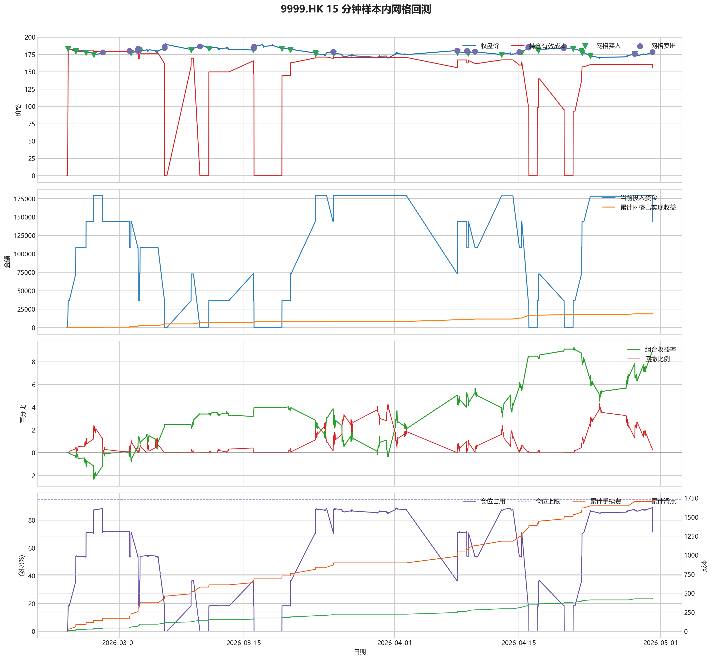
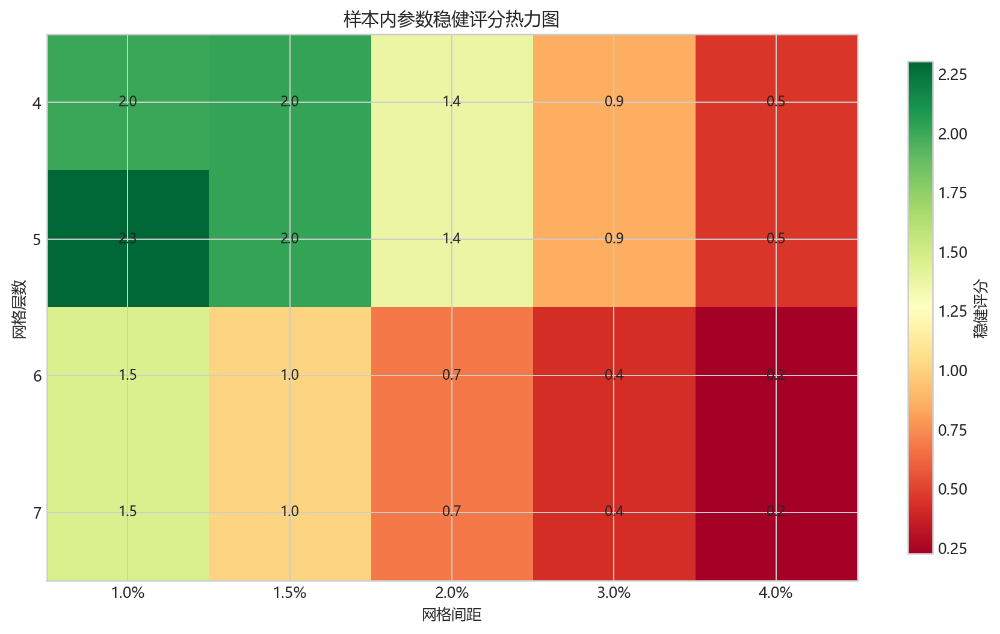
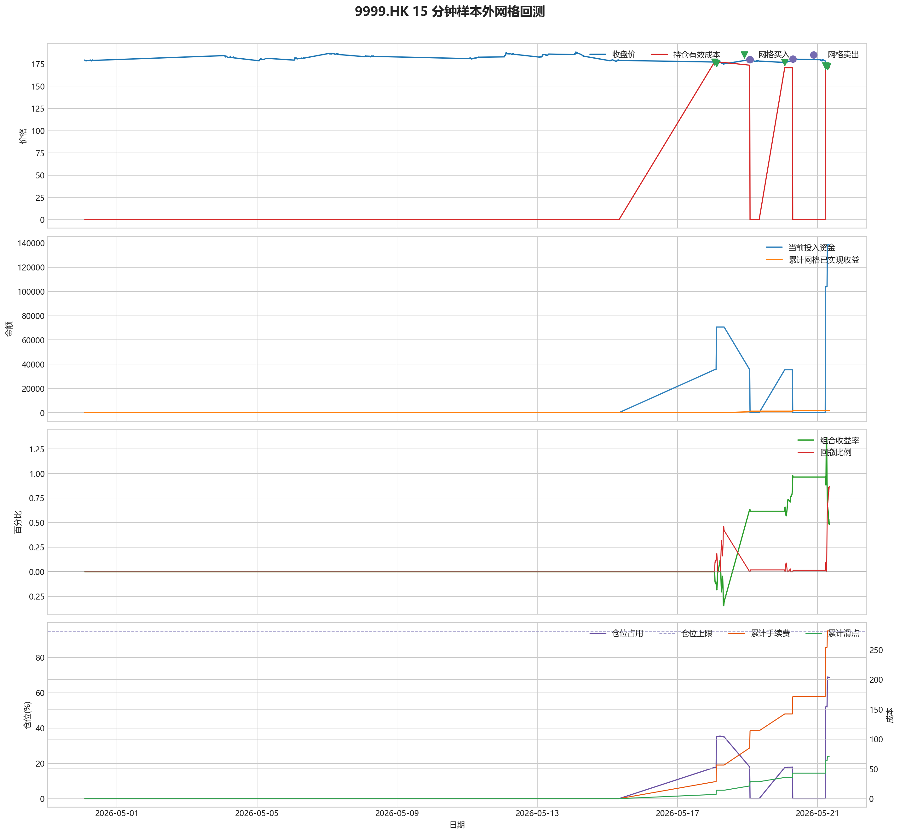

# 9999.HK 网格回测报告

## 摘要

- 标的：`9999.HK`
- 数据周期：Yahoo Finance 最近 60 天 `15m`；下载必须配置代理，Yahoo 失败时流程直接停止
- 样本内窗口：2026-02-23 01:30:00 至 2026-04-30 01:45:00
- 样本外窗口：2026-04-30 02:00:00 至 2026-05-21 08:00:00
- 切分方式：最近分钟线样本按 `75% / 25%` 拆分样本内与样本外
- 网格模式：纯现金网格，不在样本起点建立底仓；第一根 K 线收盘价只作为网格锚点
- 最小交易单位：100 股，来源：AASTOCKS 快照页 Lot Size
- 单层网格固定数量：200 股
- 左侧处理：`both`，强制退出阈值 `5.00%` 总资金浮亏
- 执行口径：`realistic`，手续费 `8.00` bps，滑点 `2.00` bps
- 最优参数：网格间距 1.00% / 网格层数 5 / 止盈比例 1.50%

这套网格在当前样本里样本内外都转正，说明参数具备继续观察的价值。

## 第一层：先看结论

### 先回答关键问题

| 问题 | 样本内 | 样本外 | 怎么理解 |
| --- | --- | --- | --- |
| 这套策略能不能赚钱 | 8.88% | 0.48% | 当前样本内和样本外都为正收益，可以继续观察，但还不能直接等同于稳定实盘盈利。 |
| 比现金闲置好不好 | 17764.61 | 959.35 | 正数表示网格策略赚到钱，负数表示不交易反而更好。 |
| 比买入持有好不好 | 24549.83 | 9626.72 | 买入持有用同样资金、交易单位和执行口径估算，正数表示网格更好。 |
| 交易成本高不高 | 1732.52 | 281.78 | 这里统计手续费，滑点会单独体现在估算成交价和滑点成本里。 |
| 最坏会亏到什么程度 | 4.32% | 0.87% | 这是账户在样本期间相对阶段高点出现过的最大回撤。 |
| 这组参数稳不稳 | 稳健分 2.30 | 沿用同一组参数 | 不是只看一整段最高分，而是看多窗口表现是否稳定。当前结果：100% 窗口为正，最差窗口收益 `2.59%`，收益波动 `0.33` 个百分点。 |

### 一句话判断

- 这套网格在当前样本里样本内外都转正，说明参数具备继续观察的价值。
- 当前正式拿去实盘的证据还不够，更合理的定位是：先验证它能否通过网格闭环赚钱，再看左侧行情下能否控制亏损。
- 如果你只想知道现在值不值得继续研究，看完上面这张表就够了。

## 第二层：展开细节

### 参数是怎么选的

| 筛选环节 | 结果 | 你该怎么理解 |
| --- | --- | --- |
| 执行口径 | realistic | 手续费 8.00 bps，滑点 2.00 bps。 |
| 候选组合数 | 80 | 先把候选参数全部跑完，不做随机抽样。 |
| 单窗综合分 | 10.62 | 这是整段样本内的收益、回撤、闭环网格利润综合分。 |
| 稳健窗口数 | 3 | 再把样本内按时间顺序拆成多个连续窗口，检查同一参数会不会只在一小段行情里好看。 |
| 稳健分 RobustScore | 2.30 | 计算方式：0.6 x 窗口平均分 + 0.4 x 最差窗口分 - 0.25 x 窗口收益波动。 |
| 最终入选参数 | 间距 1.00% / 层数 5 / 止盈 1.50% | 优先挑多窗口更稳的组合，而不是只挑单窗最亮的孤点。 |

### 关键结果对照

| 指标 | 样本内 | 样本外 | 怎么读 |
| --- | --- | --- | --- |
| 净收益率 | 8.88% | 0.48% | 已经按当前执行口径扣除回测引擎支持的费用影响。 |
| 最大回撤 | 4.32% | 0.87% | 再看亏起来最难受会到什么程度。 |
| 交易成本 | 1732.52 | 281.78 | 策略内部估算的手续费累计值，帮助判断网格频繁交易是否吃掉收益。 |
| 滑点成本 | 433.12 | 70.44 | 按收盘价和估算成交价差额累计，属于近似实盘口径。 |
| 未平网格有效成本 | 155.88 | 170.59 | 只在期末仍有未平网格仓位时有意义。 |
| 闭环网格净利润 | 19058.01 | 1906.04 | 这是已经完成低买高卖、真正落袋的利润，不等于总账户收益。 |
| 未平网格浮动盈亏 | -1026.49 | -1155.60 | hold 口径会保留这部分风险，force_exit 口径触发后通常回到 0。 |
| 网格闭环次数 | 28 | 3 | 次数越多，说明震荡里成交越频繁；但次数多不等于总账户一定赚钱。 |

### 执行口径和风控约束

| 约束 | 样本内 | 样本外 |
| --- | --- | --- |
| 执行口径 | realistic | realistic |
| 网格模式 | cash | cash |
| 左侧处理口径 | both | both |
| 手续费 / 滑点 | 8.00 / 2.00 bps | 8.00 / 2.00 bps |
| 最大仓位占用 | 89.05% / 上限 95.00% | 68.88% / 上限 95.00% |
| 停手事件 | 0 | 0 |
| 强制退出事件 | 0 | 0 |

### 网格到底有没有帮忙

| 对比项 | 样本内 | 样本外 |
| --- | --- | --- |
| 现金闲置收益率 | 0.00% | 0.00% |
| 买入持有收益率 | -3.39% | -4.33% |
| 网格策略收益率 | 8.88% | 0.48% |
| 网格相对现金闲置多赚/多亏 | 17764.61 | 959.35 |
| 网格相对买入持有多赚/多亏 | 24549.83 | 9626.72 |

### 左侧行情怎么处理

| 左侧口径 | 样本内净收益率 | 样本内闭环利润 | 样本内浮动盈亏 | 样本内强平 | 样本外净收益率 | 样本外闭环利润 | 样本外浮动盈亏 | 样本外强平 |
| --- | --- | --- | --- | --- | --- | --- | --- | --- |
| hold：未平网格继续持有 | 8.88% | 19058.01 | -1026.49 | 否 | 0.48% | 1906.04 | -1155.60 | 否 |
| force_exit：达到亏损阈值强平 | 8.88% | 19058.01 | -1026.49 | 否 | 0.48% | 1906.04 | -1155.60 | 否 |

补一句最重要的解释：

- “网格已实现收益”只代表已经完成低买高卖、真正落袋的那部分利润。
- 真正决定你账户最后赚没赚钱的，是“已实现网格收益 + 未平仓网格浮动盈亏 + 现金余额”三者一起的结果。
- 所以完全可能出现“网格已经落袋赚钱，但总账户还是亏钱”的情况。

### 图表速读总结

#### 样本内回测图

- 这一段价格从 `185.20` 走到 `178.60`，区间涨跌幅约 `-3.56%`。
- 样本结束时收盘价 `178.60` 已经回到有效成本 `155.88` 之上，未平网格按当前口径已经转回浮盈区。
- 图里的买卖点一共完成了 `28` 轮网格闭环，已经落袋的网格利润累计 `19058.01`。
- 期末未平网格浮动盈亏为 `-1026.49`。
- 总账户最终是盈利状态，期末权益 `217764.61`，说明闭环利润、未平仓浮动盈亏和现金余额合计后已经转正。

#### 热力图

- 热力图横轴是网格间距，纵轴是网格层数，颜色越偏绿代表稳健评分越高；每个格子里没有单独画出的止盈比例，已经折叠成该格子的最好结果。
- 当前样本里，最优参数落在“网格间距 `1.00%` / 网格层数 `5` / 止盈比例 `1.50%`”。
- 从前几名结果看，高分区域主要集中在网格间距 `1.00%`、网格层数 `5` 附近。
- 最优点比较集中在网格间距 `1.00%`、网格层数 `5` 附近，说明这组参数不是完全随机撞出来的。

#### 分钟线样本外验证

- 样本外账户最终从 `200000` 走到 `200959.35`，总盈亏 `959.35`。
- 样本外单层网格按最小交易单位 `100` 股取整，固定数量是 `200` 股。
- 样本外结果转正，说明这组参数在新阶段没有立刻失效。

#### 样本外回测图

- 这一段价格从 `179.40` 走到 `171.70`，区间涨跌幅约 `-4.29%`。
- 样本结束时收盘价 `171.70` 已经回到有效成本 `170.59` 之上，未平网格按当前口径已经转回浮盈区。
- 图里的买卖点一共完成了 `3` 轮网格闭环，已经落袋的网格利润累计 `1906.04`。
- 期末未平网格浮动盈亏为 `-1155.60`。
- 总账户最终是盈利状态，期末权益 `200959.35`，说明闭环利润、未平仓浮动盈亏和现金余额合计后已经转正。

### 交易记录和明细

如果你只是想判断策略值不值得继续，到这里通常已经够了；下面这些表主要用于追交易过程和排查归因。

### 样本内事件流水

| 时间 | 事件类型 | 层级 | 价格 | 估算成交价 | 数量 | 金额 | 手续费 | 滑点成本 | 说明 |
| --- | --- | --- | --- | --- | --- | --- | --- | --- | --- |
| 2026-02-23 05:00:00 | grid_buy | 1 | 182.90 | 182.94 | 200 | 36616.58 | 29.27 | 7.32 | 触发下行网格买入 |
| 2026-02-24 01:30:00 | grid_buy | 2 | 180.10 | 180.14 | 200 | 36056.03 | 28.82 | 7.20 | 触发下行网格买入 |
| 2026-02-24 01:45:00 | grid_buy | 3 | 179.60 | 179.64 | 200 | 35955.93 | 28.74 | 7.18 | 触发下行网格买入 |
| 2026-02-25 05:30:00 | grid_buy | 4 | 177.40 | 177.44 | 200 | 35515.48 | 28.39 | 7.10 | 触发下行网格买入 |
| 2026-02-26 02:00:00 | grid_buy | 5 | 174.60 | 174.63 | 200 | 34954.93 | 27.94 | 6.98 | 触发下行网格买入 |
| 2026-02-27 02:15:00 | grid_sell | 5 | 177.90 | 177.86 | 200 | 35544.42 | 28.46 | 7.12 | 达到网格止盈价后卖出本层仓位 |
| 2026-03-02 03:15:00 | grid_sell | 4 | 180.10 | 180.06 | 200 | 35983.99 | 28.81 | 7.20 | 达到网格止盈价后卖出本层仓位 |
| 2026-03-02 07:00:00 | grid_buy | 4 | 177.00 | 177.04 | 200 | 35435.41 | 28.33 | 7.08 | 触发下行网格买入 |
| 2026-03-03 01:30:00 | grid_sell | 4 | 180.20 | 180.16 | 200 | 36003.97 | 28.83 | 7.21 | 达到网格止盈价后卖出本层仓位 |
| 2026-03-03 02:15:00 | grid_sell | 3 | 182.80 | 182.76 | 200 | 36523.45 | 29.24 | 7.31 | 达到网格止盈价后卖出本层仓位 |
| 2026-03-03 02:30:00 | grid_sell | 2 | 183.40 | 183.36 | 200 | 36643.32 | 29.34 | 7.34 | 达到网格止盈价后卖出本层仓位 |
| 2026-03-03 05:30:00 | grid_buy | 2 | 181.40 | 181.44 | 200 | 36316.28 | 29.03 | 7.26 | 触发下行网格买入 |
| 2026-03-03 07:30:00 | grid_buy | 3 | 179.50 | 179.54 | 200 | 35935.91 | 28.73 | 7.18 | 触发下行网格买入 |
| 2026-03-06 01:30:00 | grid_sell | 2 | 184.40 | 184.36 | 200 | 36843.12 | 29.50 | 7.38 | 达到网格止盈价后卖出本层仓位 |
| 2026-03-06 01:30:00 | grid_sell | 3 | 184.40 | 184.36 | 200 | 36843.12 | 29.50 | 7.38 | 达到网格止盈价后卖出本层仓位 |
| 2026-03-06 02:00:00 | grid_sell | 1 | 186.50 | 186.46 | 200 | 37262.71 | 29.83 | 7.46 | 达到网格止盈价后卖出本层仓位 |
| 2026-03-09 01:30:00 | grid_buy | 1 | 182.10 | 182.14 | 200 | 36456.43 | 29.14 | 7.28 | 触发下行网格买入 |
| 2026-03-09 01:45:00 | grid_buy | 2 | 181.20 | 181.24 | 200 | 36276.25 | 29.00 | 7.25 | 触发下行网格买入 |
| 2026-03-10 01:30:00 | grid_sell | 1 | 186.70 | 186.66 | 200 | 37302.67 | 29.87 | 7.47 | 达到网格止盈价后卖出本层仓位 |
| 2026-03-10 01:30:00 | grid_sell | 2 | 186.70 | 186.66 | 200 | 37302.67 | 29.87 | 7.47 | 达到网格止盈价后卖出本层仓位 |
| 2026-03-11 01:45:00 | grid_buy | 1 | 183.30 | 183.34 | 200 | 36696.67 | 29.33 | 7.33 | 触发下行网格买入 |
| 2026-03-16 01:30:00 | grid_buy | 2 | 181.40 | 181.44 | 200 | 36316.28 | 29.03 | 7.26 | 触发下行网格买入 |
| 2026-03-16 03:00:00 | grid_sell | 2 | 184.30 | 184.26 | 200 | 36823.15 | 29.48 | 7.37 | 达到网格止盈价后卖出本层仓位 |
| 2026-03-16 03:45:00 | grid_sell | 1 | 186.50 | 186.46 | 200 | 37262.71 | 29.83 | 7.46 | 达到网格止盈价后卖出本层仓位 |
| 2026-03-19 07:30:00 | grid_buy | 1 | 183.20 | 183.24 | 200 | 36676.65 | 29.32 | 7.33 | 触发下行网格买入 |
| 2026-03-20 06:00:00 | grid_buy | 2 | 181.20 | 181.24 | 200 | 36276.25 | 29.00 | 7.25 | 触发下行网格买入 |
| 2026-03-23 01:30:00 | grid_buy | 3 | 177.00 | 177.04 | 200 | 35435.41 | 28.33 | 7.08 | 触发下行网格买入 |
| 2026-03-23 01:30:00 | grid_buy | 4 | 177.00 | 177.04 | 200 | 35435.41 | 28.33 | 7.08 | 触发下行网格买入 |
| 2026-03-23 02:15:00 | grid_buy | 5 | 175.90 | 175.94 | 200 | 35215.18 | 28.15 | 7.04 | 触发下行网格买入 |
| 2026-03-25 01:30:00 | grid_sell | 5 | 178.90 | 178.86 | 200 | 35744.22 | 28.62 | 7.16 | 达到网格止盈价后卖出本层仓位 |
| 2026-03-25 03:00:00 | grid_buy | 5 | 175.80 | 175.84 | 200 | 35195.17 | 28.13 | 7.03 | 触发下行网格买入 |
| 2026-04-08 01:30:00 | grid_sell | 3 | 180.70 | 180.66 | 200 | 36103.87 | 28.91 | 7.23 | 达到网格止盈价后卖出本层仓位 |
| 2026-04-08 01:30:00 | grid_sell | 4 | 180.70 | 180.66 | 200 | 36103.87 | 28.91 | 7.23 | 达到网格止盈价后卖出本层仓位 |
| 2026-04-08 01:30:00 | grid_sell | 5 | 180.70 | 180.66 | 200 | 36103.87 | 28.91 | 7.23 | 达到网格止盈价后卖出本层仓位 |
| 2026-04-08 01:45:00 | grid_buy | 3 | 178.50 | 178.54 | 200 | 35735.71 | 28.57 | 7.14 | 触发下行网格买入 |
| 2026-04-08 02:15:00 | grid_buy | 4 | 177.50 | 177.54 | 200 | 35535.51 | 28.41 | 7.10 | 触发下行网格买入 |
| 2026-04-09 03:30:00 | grid_sell | 4 | 180.20 | 180.16 | 200 | 36003.97 | 28.83 | 7.21 | 达到网格止盈价后卖出本层仓位 |
| 2026-04-09 07:15:00 | grid_buy | 4 | 176.40 | 176.44 | 200 | 35315.28 | 28.23 | 7.06 | 触发下行网格买入 |
| 2026-04-10 01:30:00 | grid_sell | 4 | 179.20 | 179.16 | 200 | 35804.17 | 28.67 | 7.17 | 达到网格止盈价后卖出本层仓位 |
| 2026-04-13 01:30:00 | grid_buy | 4 | 174.90 | 174.93 | 200 | 35014.98 | 27.99 | 7.00 | 触发下行网格买入 |
| 2026-04-13 01:30:00 | grid_buy | 5 | 174.90 | 174.93 | 200 | 35014.98 | 27.99 | 7.00 | 触发下行网格买入 |
| 2026-04-15 01:30:00 | grid_sell | 4 | 178.60 | 178.56 | 200 | 35684.29 | 28.57 | 7.14 | 达到网格止盈价后卖出本层仓位 |
| 2026-04-15 01:30:00 | grid_sell | 5 | 178.60 | 178.56 | 200 | 35684.29 | 28.57 | 7.14 | 达到网格止盈价后卖出本层仓位 |
| 2026-04-15 08:00:00 | grid_buy | 4 | 177.70 | 177.74 | 200 | 35575.55 | 28.44 | 7.11 | 触发下行网格买入 |
| 2026-04-16 01:30:00 | grid_sell | 2 | 185.20 | 185.16 | 200 | 37002.97 | 29.63 | 7.41 | 达到网格止盈价后卖出本层仓位 |
| 2026-04-16 01:30:00 | grid_sell | 3 | 185.20 | 185.16 | 200 | 37002.97 | 29.63 | 7.41 | 达到网格止盈价后卖出本层仓位 |
| 2026-04-16 01:30:00 | grid_sell | 4 | 185.20 | 185.16 | 200 | 37002.97 | 29.63 | 7.41 | 达到网格止盈价后卖出本层仓位 |
| 2026-04-16 03:15:00 | grid_sell | 1 | 186.10 | 186.06 | 200 | 37182.79 | 29.77 | 7.44 | 达到网格止盈价后卖出本层仓位 |
| 2026-04-17 02:00:00 | grid_buy | 1 | 182.50 | 182.54 | 200 | 36536.51 | 29.21 | 7.30 | 触发下行网格买入 |
| 2026-04-17 05:15:00 | grid_buy | 2 | 180.70 | 180.74 | 200 | 36176.15 | 28.92 | 7.23 | 触发下行网格买入 |
| 2026-04-20 01:30:00 | grid_sell | 2 | 184.10 | 184.06 | 200 | 36783.19 | 29.45 | 7.36 | 达到网格止盈价后卖出本层仓位 |
| 2026-04-20 02:45:00 | grid_sell | 1 | 186.00 | 185.96 | 200 | 37162.81 | 29.75 | 7.44 | 达到网格止盈价后卖出本层仓位 |
| 2026-04-21 03:00:00 | grid_buy | 1 | 183.20 | 183.24 | 200 | 36676.65 | 29.32 | 7.33 | 触发下行网格买入 |
| 2026-04-22 01:30:00 | grid_buy | 2 | 179.90 | 179.94 | 200 | 36015.98 | 28.79 | 7.20 | 触发下行网格买入 |
| 2026-04-22 01:45:00 | grid_buy | 3 | 178.00 | 178.04 | 200 | 35635.61 | 28.49 | 7.12 | 触发下行网格买入 |
| 2026-04-22 03:00:00 | grid_buy | 4 | 177.00 | 177.04 | 200 | 35435.41 | 28.33 | 7.08 | 触发下行网格买入 |
| 2026-04-23 01:30:00 | grid_buy | 5 | 172.80 | 172.83 | 200 | 34594.57 | 27.65 | 6.91 | 触发下行网格买入 |
| 2026-04-28 01:30:00 | grid_sell | 5 | 175.80 | 175.76 | 200 | 35124.85 | 28.12 | 7.03 | 达到网格止盈价后卖出本层仓位 |
| 2026-04-28 01:30:00 | grid_buy | 5 | 175.80 | 175.84 | 200 | 35195.17 | 28.13 | 7.03 | 触发下行网格买入 |
| 2026-04-30 01:45:00 | grid_sell | 5 | 178.60 | 178.56 | 200 | 35684.29 | 28.57 | 7.14 | 达到网格止盈价后卖出本层仓位 |

### 样本内成交结果

| 开仓时间 | 平仓时间 | 持有时长 | 开仓价 | 平仓价 | 数量 | 盈亏 | 收益率(%) | 仓位类型 |
| --- | --- | --- | --- | --- | --- | --- | --- | --- |
| 2026-02-26 02:00:00 | 2026-02-27 02:15:00 | 1 days 00:15:00 | 174.63 | 177.90 | 200 | 596.61 | 1.71 | 网格 5 |
| 2026-02-25 05:30:00 | 2026-03-02 03:15:00 | 4 days 21:45:00 | 177.44 | 180.10 | 200 | 475.70 | 1.34 | 网格 4 |
| 2026-03-02 07:00:00 | 2026-03-03 01:30:00 | 0 days 18:30:00 | 177.04 | 180.20 | 200 | 575.76 | 1.63 | 网格 4 |
| 2026-02-24 01:45:00 | 2026-03-03 02:15:00 | 7 days 00:30:00 | 179.64 | 182.80 | 200 | 574.83 | 1.60 | 网格 3 |
| 2026-02-24 01:30:00 | 2026-03-03 02:30:00 | 7 days 01:00:00 | 180.14 | 183.40 | 200 | 594.63 | 1.65 | 网格 2 |
| 2026-03-03 07:30:00 | 2026-03-06 01:30:00 | 2 days 18:00:00 | 179.54 | 184.40 | 200 | 914.59 | 2.55 | 网格 3 |
| 2026-03-03 05:30:00 | 2026-03-06 01:30:00 | 2 days 20:00:00 | 181.44 | 184.40 | 200 | 534.21 | 1.47 | 网格 2 |
| 2026-02-23 05:00:00 | 2026-03-06 02:00:00 | 10 days 21:00:00 | 182.94 | 186.50 | 200 | 653.58 | 1.79 | 网格 1 |
| 2026-03-09 01:45:00 | 2026-03-10 01:30:00 | 0 days 23:45:00 | 181.24 | 186.70 | 200 | 1033.88 | 2.85 | 网格 2 |
| 2026-03-09 01:30:00 | 2026-03-10 01:30:00 | 1 days 00:00:00 | 182.14 | 186.70 | 200 | 853.70 | 2.34 | 网格 1 |
| 2026-03-16 01:30:00 | 2026-03-16 03:00:00 | 0 days 01:30:00 | 181.44 | 184.30 | 200 | 514.23 | 1.42 | 网格 2 |
| 2026-03-11 01:45:00 | 2026-03-16 03:45:00 | 5 days 02:00:00 | 183.34 | 186.50 | 200 | 573.49 | 1.56 | 网格 1 |
| 2026-03-23 02:15:00 | 2026-03-25 01:30:00 | 1 days 23:15:00 | 175.94 | 178.90 | 200 | 536.19 | 1.52 | 网格 5 |
| 2026-03-25 03:00:00 | 2026-04-08 01:30:00 | 13 days 22:30:00 | 175.84 | 180.70 | 200 | 915.92 | 2.60 | 网格 5 |
| 2026-03-23 01:30:00 | 2026-04-08 01:30:00 | 16 days 00:00:00 | 177.04 | 180.70 | 200 | 675.68 | 1.91 | 网格 4 |
| 2026-03-23 01:30:00 | 2026-04-08 01:30:00 | 16 days 00:00:00 | 177.04 | 180.70 | 200 | 675.68 | 1.91 | 网格 3 |
| 2026-04-08 02:15:00 | 2026-04-09 03:30:00 | 1 days 01:15:00 | 177.54 | 180.20 | 200 | 475.66 | 1.34 | 网格 4 |
| 2026-04-09 07:15:00 | 2026-04-10 01:30:00 | 0 days 18:15:00 | 176.44 | 179.20 | 200 | 496.04 | 1.41 | 网格 4 |
| 2026-04-13 01:30:00 | 2026-04-15 01:30:00 | 2 days 00:00:00 | 174.93 | 178.60 | 200 | 676.44 | 1.93 | 网格 5 |
| 2026-04-13 01:30:00 | 2026-04-15 01:30:00 | 2 days 00:00:00 | 174.93 | 178.60 | 200 | 676.44 | 1.93 | 网格 4 |
| 2026-04-15 08:00:00 | 2026-04-16 01:30:00 | 0 days 17:30:00 | 177.74 | 185.20 | 200 | 1434.82 | 4.04 | 网格 4 |
| 2026-04-08 01:45:00 | 2026-04-16 01:30:00 | 7 days 23:45:00 | 178.54 | 185.20 | 200 | 1274.66 | 3.57 | 网格 3 |
| 2026-03-20 06:00:00 | 2026-04-16 01:30:00 | 26 days 19:30:00 | 181.24 | 185.20 | 200 | 734.12 | 2.03 | 网格 2 |
| 2026-03-19 07:30:00 | 2026-04-16 03:15:00 | 27 days 19:45:00 | 183.24 | 186.10 | 200 | 513.58 | 1.40 | 网格 1 |
| 2026-04-17 05:15:00 | 2026-04-20 01:30:00 | 2 days 20:15:00 | 180.74 | 184.10 | 200 | 614.40 | 1.70 | 网格 2 |
| 2026-04-17 02:00:00 | 2026-04-20 02:45:00 | 3 days 00:45:00 | 182.54 | 186.00 | 200 | 633.73 | 1.74 | 网格 1 |
| 2026-04-23 01:30:00 | 2026-04-28 01:30:00 | 5 days 00:00:00 | 172.83 | 175.80 | 200 | 537.31 | 1.55 | 网格 5 |
| 2026-04-21 03:00:00 | 2026-04-30 01:30:00 | 8 days 22:30:00 | 183.24 | 178.10 | 200 | -1085.14 | -2.96 | 网格 1 |
| 2026-04-22 01:30:00 | 2026-04-30 01:30:00 | 8 days 00:00:00 | 179.94 | 178.10 | 200 | -424.48 | -1.18 | 网格 2 |
| 2026-04-22 01:45:00 | 2026-04-30 01:30:00 | 7 days 23:45:00 | 178.04 | 178.10 | 200 | -44.10 | -0.12 | 网格 3 |
| 2026-04-22 03:00:00 | 2026-04-30 01:30:00 | 7 days 22:30:00 | 177.04 | 178.10 | 200 | 156.10 | 0.44 | 网格 4 |
| 2026-04-28 01:30:00 | 2026-04-30 01:30:00 | 2 days 00:00:00 | 175.84 | 178.10 | 200 | 396.34 | 1.13 | 网格 5 |

### 样本外事件流水

| 时间 | 事件类型 | 层级 | 价格 | 估算成交价 | 数量 | 金额 | 手续费 | 滑点成本 | 说明 |
| --- | --- | --- | --- | --- | --- | --- | --- | --- | --- |
| 2026-05-18 01:30:00 | grid_buy | 1 | 177.20 | 177.24 | 200 | 35475.45 | 28.36 | 7.09 | 触发下行网格买入 |
| 2026-05-18 02:45:00 | grid_buy | 2 | 175.70 | 175.74 | 200 | 35175.15 | 28.12 | 7.03 | 触发下行网格买入 |
| 2026-05-19 01:30:00 | grid_sell | 2 | 179.80 | 179.76 | 200 | 35924.05 | 28.76 | 7.19 | 达到网格止盈价后卖出本层仓位 |
| 2026-05-19 01:45:00 | grid_sell | 1 | 179.90 | 179.86 | 200 | 35944.02 | 28.78 | 7.20 | 达到网格止盈价后卖出本层仓位 |
| 2026-05-20 01:30:00 | grid_buy | 1 | 176.70 | 176.74 | 200 | 35375.35 | 28.28 | 7.07 | 触发下行网格买入 |
| 2026-05-20 07:00:00 | grid_sell | 1 | 180.50 | 180.46 | 200 | 36063.91 | 28.87 | 7.22 | 达到网格止盈价后卖出本层仓位 |
| 2026-05-21 05:30:00 | grid_buy | 1 | 173.00 | 173.03 | 200 | 34634.61 | 27.69 | 6.92 | 触发下行网格买入 |
| 2026-05-21 05:30:00 | grid_buy | 2 | 173.00 | 173.03 | 200 | 34634.61 | 27.69 | 6.92 | 触发下行网格买入 |
| 2026-05-21 05:30:00 | grid_buy | 3 | 173.00 | 173.03 | 200 | 34634.61 | 27.69 | 6.92 | 触发下行网格买入 |
| 2026-05-21 06:45:00 | grid_buy | 4 | 172.20 | 172.23 | 200 | 34474.44 | 27.56 | 6.89 | 触发下行网格买入 |

### 样本外成交结果

| 开仓时间 | 平仓时间 | 持有时长 | 开仓价 | 平仓价 | 数量 | 盈亏 | 收益率(%) | 仓位类型 |
| --- | --- | --- | --- | --- | --- | --- | --- | --- |
| 2026-05-18 02:45:00 | 2026-05-19 01:30:00 | 0 days 22:45:00 | 175.74 | 179.80 | 200 | 756.09 | 2.15 | 网格 2 |
| 2026-05-18 01:30:00 | 2026-05-19 01:45:00 | 1 days 00:15:00 | 177.24 | 179.90 | 200 | 475.77 | 1.34 | 网格 1 |
| 2026-05-20 01:30:00 | 2026-05-20 07:00:00 | 0 days 05:30:00 | 176.74 | 180.50 | 200 | 695.77 | 1.97 | 网格 1 |
| 2026-05-21 05:30:00 | 2026-05-21 07:45:00 | 0 days 02:15:00 | 173.03 | 171.90 | 200 | -282.11 | -0.82 | 网格 1 |
| 2026-05-21 05:30:00 | 2026-05-21 07:45:00 | 0 days 02:15:00 | 173.03 | 171.90 | 200 | -282.11 | -0.82 | 网格 2 |
| 2026-05-21 05:30:00 | 2026-05-21 07:45:00 | 0 days 02:15:00 | 173.03 | 171.90 | 200 | -282.11 | -0.82 | 网格 3 |
| 2026-05-21 06:45:00 | 2026-05-21 07:45:00 | 0 days 01:00:00 | 172.23 | 171.90 | 200 | -121.95 | -0.35 | 网格 4 |

## 最终结论

- 这套参数更适合“先跌一段、再进入震荡或反弹”的行情，因为它依赖反弹来兑现网格利润。
- 如果行情持续单边下跌，hold 口径会继续持有未平网格，force_exit 口径会在浮亏达到阈值后清仓并停止交易。
- 当前样本下，闭环网格净利润：样本内 19058.01，样本外 1906.04。
- 这份报告只代表最近 60 天分钟级行情下的短周期表现，不等同于长期日线参数。
