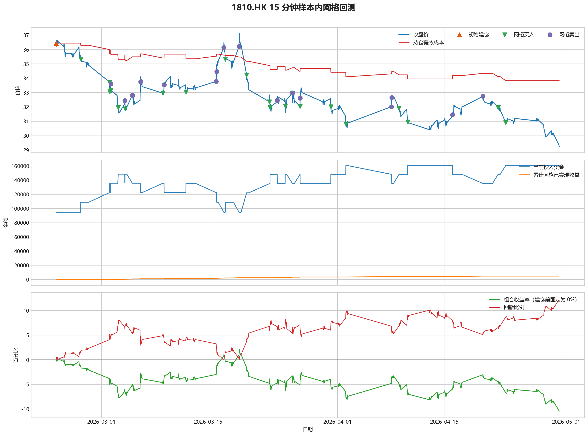
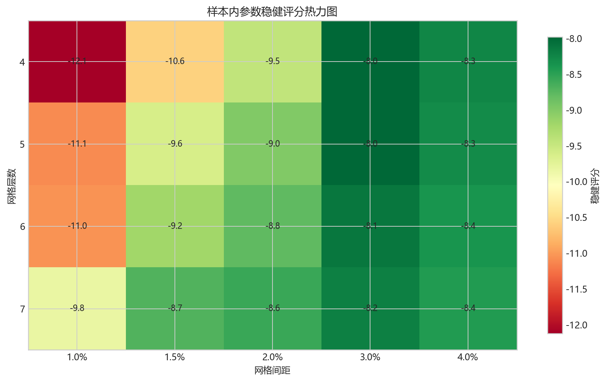
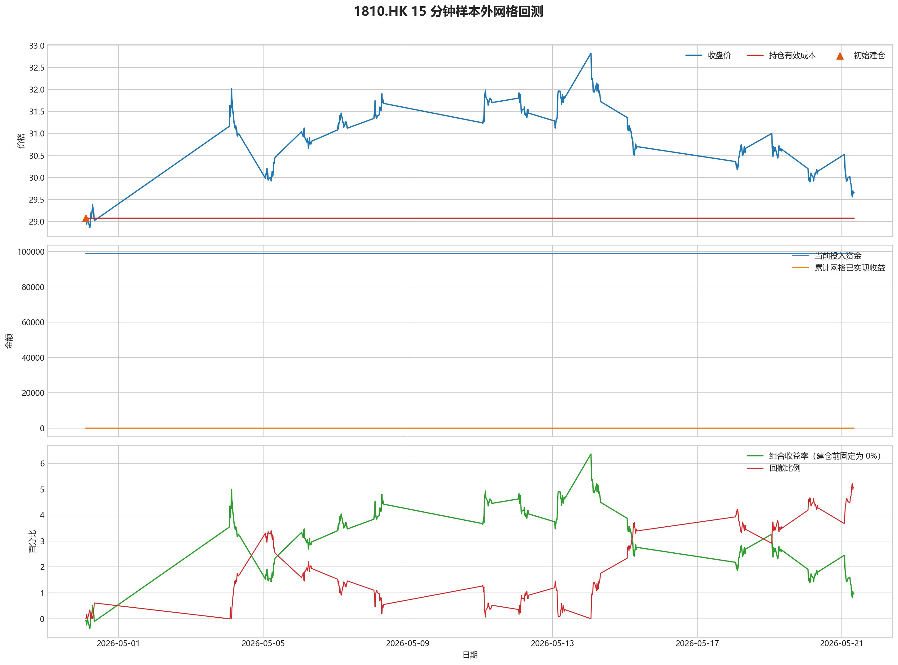

# 1810.HK 网格回测报告

## 摘要

- 标的：`1810.HK`
- 数据周期：Yahoo Finance 最近 60 天 `15m`
- 样本内窗口：2026-02-23 01:30:00 至 2026-04-30 02:00:00
- 样本外窗口：2026-04-30 02:15:00 至 2026-05-21 08:00:00
- 切分方式：最近分钟线样本按 `75% / 25%` 拆分样本内与样本外
- 初始规则：样本开始时投入 50% 资金建底仓，剩余 50% 资金做网格买卖
- 最小交易单位：200 股，来源：AASTOCKS 快照页 Lot Size
- 固定底仓数量：2600 股
- 单层网格固定数量：400 股
- 最优参数：网格间距 3.00% / 网格层数 5 / 止盈比例 1.50%

这套网格在不同阶段表现不一致，说明它对行情结构比较敏感，不能只看单段结果下结论。

## 第一层：先看结论

### 先回答 4 个问题

| 问题 | 样本内 | 样本外 | 怎么理解 |
| --- | --- | --- | --- |
| 这套策略能不能赚钱 | -10.42% | 1.05% | 样本外已经转正，但样本内没有稳定赚钱，暂时只能说参数在新阶段有改善，不能证明长期稳定盈利。 |
| 比只拿底仓好不好 | -2500.01 | 0.00 | 正数表示网格比只拿底仓更好，负数表示网格反而拖累了结果。 |
| 最坏会亏到什么程度 | 12.51% | 5.21% | 这是账户在样本期间相对阶段高点出现过的最大回撤。 |
| 这组参数稳不稳 | 稳健分 -7.98 | 沿用同一组参数 | 不是只看一整段最高分，而是看多窗口表现是否稳定。当前结果：0% 窗口为正，最差窗口收益 `-5.03%`，收益波动 `2.14` 个百分点。 |

### 一句话判断

- 这套网格在不同阶段表现不一致，说明它对行情结构比较敏感，不能只看单段结果下结论。
- 当前正式拿去实盘的证据还不够，更合理的定位是：先把它当成“网格摊成本策略”，不是“已经验证可稳定盈利的策略”。
- 如果你只想知道现在值不值得继续研究，看完上面这张表就够了。

## 第二层：展开细节

### 参数是怎么选的

| 筛选环节 | 结果 | 你该怎么理解 |
| --- | --- | --- |
| 候选组合数 | 80 | 先把候选参数全部跑完，不做随机抽样。 |
| 单窗综合分 | -15.60 | 这是整段样本内的收益、回撤、成本摊薄综合分。 |
| 稳健窗口数 | 3 | 再把样本内按时间顺序拆成多个连续窗口，检查同一参数会不会只在一小段行情里好看。 |
| 稳健分 RobustScore | -7.98 | 计算方式：0.6 x 窗口平均分 + 0.4 x 最差窗口分 - 0.25 x 窗口收益波动。 |
| 最终入选参数 | 间距 3.00% / 层数 5 / 止盈 1.50% | 优先挑多窗口更稳的组合，而不是只挑单窗最亮的孤点。 |

### 关键结果对照

| 指标 | 样本内 | 样本外 | 怎么读 |
| --- | --- | --- | --- |
| 收益率 | -10.42% | 1.05% | 先看能不能赚钱。 |
| 最大回撤 | 12.51% | 5.21% | 再看亏起来最难受会到什么程度。 |
| 有效持仓成本 | 33.83 | 29.08 | 看网格有没有把手里剩余仓位的成本压低。 |
| 已实现网格收益 | 4832.00 | 0.00 | 这是已经完成低买高卖、真正落袋的利润，不等于总账户收益。 |
| 网格闭环次数 | 17 | 0 | 次数越多，说明震荡里成交越频繁；但次数多不等于总账户一定赚钱。 |

### 网格到底有没有帮忙

| 对比项 | 样本内 | 样本外 |
| --- | --- | --- |
| 只拿底仓收益率 | -9.36% | 0.99% |
| 网格策略收益率 | -10.42% | 1.05% |
| 网格相对底仓多赚/多亏 | -2500.01 | 0.00 |

补一句最重要的解释：

- “网格已实现收益”只代表已经完成低买高卖、真正落袋的那部分利润。
- 真正决定你账户最后赚没赚钱的，是“底仓浮盈浮亏 + 未平仓网格浮盈浮亏 + 已实现网格收益”三者一起的结果。
- 所以完全可能出现“网格已经落袋赚钱，但总账户还是亏钱”的情况。

### 图表速读总结

#### 样本内回测图

- 这一段价格从 `36.44` 走到 `29.24`，区间涨跌幅约 `-19.76%`。
- 样本结束时收盘价 `29.24` 仍低于有效成本 `33.83`，剩余持仓按摊薄口径还处在约 `13.58%` 的浮亏区。
- 图里的买卖点一共完成了 `17` 轮网格闭环，已经落袋的网格利润累计 `4832.00`。
- 总账户最终仍是亏损状态，期末权益 `178780.00`；也就是说，网格已实现利润还没完全覆盖底仓和未平仓仓位的回撤。

#### 热力图

- 热力图横轴是网格间距，纵轴是网格层数，颜色越偏绿代表稳健评分越高；每个格子里没有单独画出的止盈比例，已经折叠成该格子的最好结果。
- 当前样本里，最优参数落在“网格间距 `3.00%` / 网格层数 `5` / 止盈比例 `1.50%`”。
- 从前几名结果看，高分区域主要集中在网格间距 `3.00%`、网格层数 `5` 附近。
- 最优点比较集中在网格间距 `3.00%`、网格层数 `5` 附近，说明这组参数不是完全随机撞出来的。

#### 分钟线样本外验证

- 样本外账户最终从 `200000` 走到 `201972.00`，总盈亏 `1972.00`。
- 样本外固定底仓仍按最小交易单位 `200` 股执行，单层网格固定数量是 `600` 股。
- 样本外结果转正，说明这组参数在新阶段没有立刻失效。

#### 样本外回测图

- 这一段价格从 `29.08` 走到 `29.66`，区间涨跌幅约 `1.99%`。
- 样本结束时收盘价 `29.66` 已经回到有效成本 `29.08` 之上，剩余持仓按摊薄口径已经转回浮盈区。
- 这段区间里没有完成任何网格闭环，所以图上即使有持仓波动，也还没有形成已落袋的网格利润。
- 总账户最终是盈利状态，期末权益 `201972.00`，说明底仓浮盈浮亏加上网格利润后，整体结果已经转正。

### 交易记录和明细

如果你只是想判断策略值不值得继续，到这里通常已经够了；下面这些表主要用于追交易过程和排查归因。

### 样本内事件流水

| 时间 | 事件类型 | 层级 | 价格 | 数量 | 金额 | 说明 |
| --- | --- | --- | --- | --- | --- | --- |
| 2026-02-23 01:30:00 | base_buy | 0 | 36.44 | 2600 | 94744.00 | 样本开始时初始建仓 |
| 2026-02-26 07:00:00 | grid_buy | 1 | 35.32 | 400 | 14128.00 | 触发下行网格买入 |
| 2026-03-02 01:30:00 | grid_buy | 2 | 33.74 | 400 | 13496.00 | 触发下行网格买入 |
| 2026-03-02 02:15:00 | grid_buy | 3 | 33.06 | 400 | 13224.00 | 触发下行网格买入 |
| 2026-03-02 05:30:00 | grid_sell | 3 | 33.62 | 400 | 13448.00 | 达到网格止盈价后卖出本层仓位 |
| 2026-03-02 06:00:00 | grid_buy | 3 | 33.16 | 400 | 13264.00 | 触发下行网格买入 |
| 2026-03-03 05:00:00 | grid_buy | 4 | 31.96 | 400 | 12784.00 | 触发下行网格买入 |
| 2026-03-04 02:00:00 | grid_sell | 4 | 32.44 | 400 | 12976.00 | 达到网格止盈价后卖出本层仓位 |
| 2026-03-04 02:30:00 | grid_buy | 4 | 31.88 | 400 | 12752.00 | 触发下行网格买入 |
| 2026-03-05 01:30:00 | grid_sell | 4 | 32.80 | 400 | 13120.00 | 达到网格止盈价后卖出本层仓位 |
| 2026-03-06 03:30:00 | grid_sell | 3 | 33.76 | 400 | 13504.00 | 达到网格止盈价后卖出本层仓位 |
| 2026-03-09 01:30:00 | grid_buy | 3 | 32.96 | 400 | 13184.00 | 触发下行网格买入 |
| 2026-03-09 05:30:00 | grid_sell | 3 | 33.54 | 400 | 13416.00 | 达到网格止盈价后卖出本层仓位 |
| 2026-03-12 02:30:00 | grid_buy | 3 | 33.04 | 400 | 13216.00 | 触发下行网格买入 |
| 2026-03-16 01:30:00 | grid_sell | 3 | 33.78 | 400 | 13512.00 | 达到网格止盈价后卖出本层仓位 |
| 2026-03-16 03:15:00 | grid_sell | 2 | 34.46 | 400 | 13784.00 | 达到网格止盈价后卖出本层仓位 |
| 2026-03-17 01:30:00 | grid_sell | 1 | 36.14 | 400 | 14456.00 | 达到网格止盈价后卖出本层仓位 |
| 2026-03-17 06:15:00 | grid_buy | 1 | 35.32 | 400 | 14128.00 | 触发下行网格买入 |
| 2026-03-19 01:30:00 | grid_sell | 1 | 36.20 | 400 | 14480.00 | 达到网格止盈价后卖出本层仓位 |
| 2026-03-20 01:30:00 | grid_buy | 1 | 34.22 | 400 | 13688.00 | 触发下行网格买入 |
| 2026-03-20 01:30:00 | grid_buy | 2 | 34.22 | 400 | 13688.00 | 触发下行网格买入 |
| 2026-03-23 01:30:00 | grid_buy | 3 | 32.36 | 400 | 12944.00 | 触发下行网格买入 |
| 2026-03-23 03:15:00 | grid_buy | 4 | 31.96 | 400 | 12784.00 | 触发下行网格买入 |
| 2026-03-24 02:00:00 | grid_sell | 4 | 32.46 | 400 | 12984.00 | 达到网格止盈价后卖出本层仓位 |
| 2026-03-25 03:00:00 | grid_buy | 4 | 32.06 | 400 | 12824.00 | 触发下行网格买入 |
| 2026-03-26 01:30:00 | grid_sell | 3 | 32.98 | 400 | 13192.00 | 达到网格止盈价后卖出本层仓位 |
| 2026-03-26 01:30:00 | grid_sell | 4 | 32.98 | 400 | 13192.00 | 达到网格止盈价后卖出本层仓位 |
| 2026-03-26 01:30:00 | grid_buy | 3 | 32.98 | 400 | 13192.00 | 触发下行网格买入 |
| 2026-03-27 01:30:00 | grid_buy | 4 | 32.04 | 400 | 12816.00 | 触发下行网格买入 |
| 2026-03-27 02:00:00 | grid_sell | 4 | 32.62 | 400 | 13048.00 | 达到网格止盈价后卖出本层仓位 |
| 2026-03-31 02:45:00 | grid_buy | 4 | 32.02 | 400 | 12808.00 | 触发下行网格买入 |
| 2026-04-02 02:00:00 | grid_buy | 5 | 30.82 | 400 | 12328.00 | 触发下行网格买入 |
| 2026-04-08 01:30:00 | grid_sell | 5 | 32.02 | 400 | 12808.00 | 达到网格止盈价后卖出本层仓位 |
| 2026-04-08 02:45:00 | grid_sell | 4 | 32.66 | 400 | 13064.00 | 达到网格止盈价后卖出本层仓位 |
| 2026-04-09 01:30:00 | grid_buy | 4 | 31.92 | 400 | 12768.00 | 触发下行网格买入 |
| 2026-04-10 05:00:00 | grid_buy | 5 | 30.96 | 400 | 12384.00 | 触发下行网格买入 |
| 2026-04-16 01:45:00 | grid_sell | 5 | 31.46 | 400 | 12584.00 | 达到网格止盈价后卖出本层仓位 |
| 2026-04-20 01:30:00 | grid_sell | 4 | 32.74 | 400 | 13096.00 | 达到网格止盈价后卖出本层仓位 |
| 2026-04-22 01:30:00 | grid_buy | 4 | 31.96 | 400 | 12784.00 | 触发下行网格买入 |
| 2026-04-23 01:30:00 | grid_buy | 5 | 30.92 | 400 | 12368.00 | 触发下行网格买入 |

### 样本内成交结果

| 开仓时间 | 平仓时间 | 持有时长 | 开仓价 | 平仓价 | 数量 | 盈亏 | 收益率(%) | 仓位类型 |
| --- | --- | --- | --- | --- | --- | --- | --- | --- |
| 2026-03-02 02:15:00 | 2026-03-02 05:30:00 | 0 days 03:15:00 | 33.06 | 33.62 | 400 | 224.00 | 1.69 | 网格 3 |
| 2026-03-03 05:00:00 | 2026-03-04 02:00:00 | 0 days 21:00:00 | 31.96 | 32.44 | 400 | 192.00 | 1.50 | 网格 4 |
| 2026-03-04 02:30:00 | 2026-03-05 01:30:00 | 0 days 23:00:00 | 31.88 | 32.80 | 400 | 368.00 | 2.89 | 网格 4 |
| 2026-03-02 06:00:00 | 2026-03-06 03:30:00 | 3 days 21:30:00 | 33.16 | 33.76 | 400 | 240.00 | 1.81 | 网格 3 |
| 2026-03-09 01:30:00 | 2026-03-09 05:30:00 | 0 days 04:00:00 | 32.96 | 33.54 | 400 | 232.00 | 1.76 | 网格 3 |
| 2026-03-12 02:30:00 | 2026-03-16 01:30:00 | 3 days 23:00:00 | 33.04 | 33.78 | 400 | 296.00 | 2.24 | 网格 3 |
| 2026-03-02 01:30:00 | 2026-03-16 03:15:00 | 14 days 01:45:00 | 33.74 | 34.46 | 400 | 288.00 | 2.13 | 网格 2 |
| 2026-02-26 07:00:00 | 2026-03-17 01:30:00 | 18 days 18:30:00 | 35.32 | 36.14 | 400 | 328.00 | 2.32 | 网格 1 |
| 2026-03-17 06:15:00 | 2026-03-19 01:30:00 | 1 days 19:15:00 | 35.32 | 36.20 | 400 | 352.00 | 2.49 | 网格 1 |
| 2026-03-23 03:15:00 | 2026-03-24 02:00:00 | 0 days 22:45:00 | 31.96 | 32.46 | 400 | 200.00 | 1.56 | 网格 4 |
| 2026-03-25 03:00:00 | 2026-03-26 01:30:00 | 0 days 22:30:00 | 32.06 | 32.98 | 400 | 368.00 | 2.87 | 网格 4 |
| 2026-03-23 01:30:00 | 2026-03-26 01:30:00 | 3 days 00:00:00 | 32.36 | 32.98 | 400 | 248.00 | 1.92 | 网格 3 |
| 2026-03-27 01:30:00 | 2026-03-27 02:00:00 | 0 days 00:30:00 | 32.04 | 32.62 | 400 | 232.00 | 1.81 | 网格 4 |
| 2026-04-02 02:00:00 | 2026-04-08 01:30:00 | 5 days 23:30:00 | 30.82 | 32.02 | 400 | 480.00 | 3.89 | 网格 5 |
| 2026-03-31 02:45:00 | 2026-04-08 02:45:00 | 8 days 00:00:00 | 32.02 | 32.66 | 400 | 256.00 | 2.00 | 网格 4 |
| 2026-04-10 05:00:00 | 2026-04-16 01:45:00 | 5 days 20:45:00 | 30.96 | 31.46 | 400 | 200.00 | 1.61 | 网格 5 |
| 2026-04-09 01:30:00 | 2026-04-20 01:30:00 | 11 days 00:00:00 | 31.92 | 32.74 | 400 | 328.00 | 2.57 | 网格 4 |
| 2026-02-23 01:30:00 | 2026-04-30 01:45:00 | 66 days 00:15:00 | 36.44 | 29.22 | 2600 | -18772.00 | -19.81 | 底仓 |
| 2026-03-20 01:30:00 | 2026-04-30 01:45:00 | 41 days 00:15:00 | 34.22 | 29.22 | 400 | -2000.00 | -14.61 | 网格 1 |
| 2026-03-20 01:30:00 | 2026-04-30 01:45:00 | 41 days 00:15:00 | 34.22 | 29.22 | 400 | -2000.00 | -14.61 | 网格 2 |
| 2026-03-26 01:30:00 | 2026-04-30 01:45:00 | 35 days 00:15:00 | 32.98 | 29.22 | 400 | -1504.00 | -11.40 | 网格 3 |
| 2026-04-22 01:30:00 | 2026-04-30 01:45:00 | 8 days 00:15:00 | 31.96 | 29.22 | 400 | -1096.00 | -8.57 | 网格 4 |
| 2026-04-23 01:30:00 | 2026-04-30 01:45:00 | 7 days 00:15:00 | 30.92 | 29.22 | 400 | -680.00 | -5.50 | 网格 5 |

### 样本外事件流水

| 时间 | 事件类型 | 层级 | 价格 | 数量 | 金额 | 说明 |
| --- | --- | --- | --- | --- | --- | --- |
| 2026-04-30 02:15:00 | base_buy | 0 | 29.08 | 3400 | 98872.00 | 样本开始时初始建仓 |

### 样本外成交结果

| 开仓时间 | 平仓时间 | 持有时长 | 开仓价 | 平仓价 | 数量 | 盈亏 | 收益率(%) | 仓位类型 |
| --- | --- | --- | --- | --- | --- | --- | --- | --- |
| 2026-04-30 02:15:00 | 2026-05-21 07:45:00 | 21 days 05:30:00 | 29.08 | 29.66 | 3400 | 1972.00 | 1.99 | 底仓 |

## 最终结论

- 这套参数更适合“先跌一段、再进入震荡或反弹”的行情，因为它依赖反弹来兑现网格利润。
- 如果行情持续单边下跌，网格只能帮你部分摊低成本，不能替代止损、趋势过滤或停手机制。
- 当前样本下，成本摊薄效果是存在的：样本内下降 7.15%，样本外下降 0.00%。
- 这份报告只代表最近 60 天分钟级行情下的短周期表现，不等同于长期日线参数。
