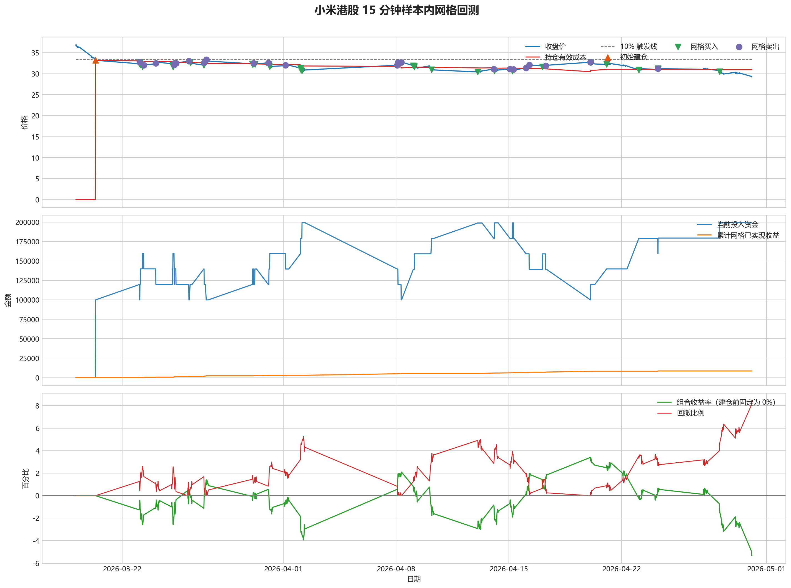
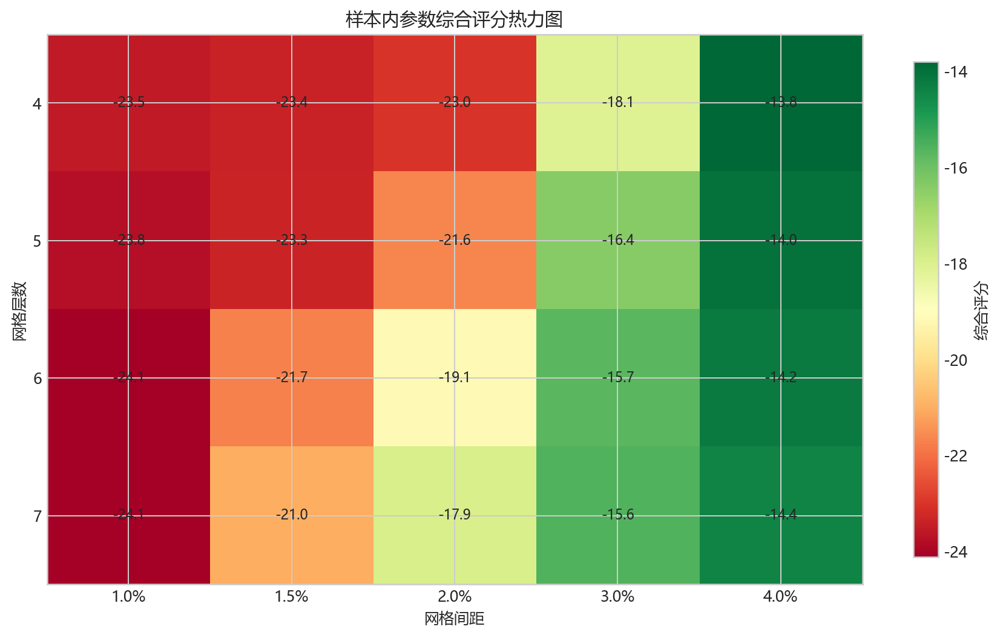
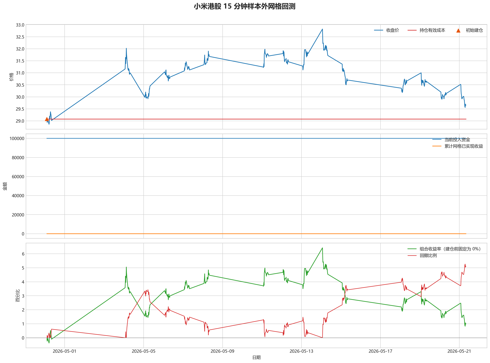

# 小米港股网格回测报告

## 摘要

- 标的：小米集团 `1810.HK`
- 数据周期：Yahoo Finance 最近 60 天 `15m`
- 样本内窗口：2026-02-23 01:30:00 至 2026-04-30 02:00:00
- 样本外窗口：2026-04-30 02:15:00 至 2026-05-21 08:00:00
- 切分方式：最近分钟线样本按 `75% / 25%` 拆分样本内与样本外
- 初始规则：样本开始时投入 50% 资金建底仓，剩余 50% 资金做网格买卖
- 最小交易单位：200 股，来源：AASTOCKS 快照页 Lot Size
- 固定底仓数量：2600 股
- 单层网格固定数量：600 股
- 最优参数：网格间距 4.00% / 网格层数 4 / 止盈比例 1.50%

这轮样本里，网格交易的效果呈现阶段性差异，需要结合样本内外所处行情阶段一起理解。

## 第一层：先看结论

### 老板一眼看懂版

- 先看结论：样本内虽然通过网格把成本压低了 `9.27%`，但总账户最终还是亏损 `9.42%`。
- 最值得关注的参数组合是“网格间距 `4.00%` / 网格层数 `4` / 止盈比例 `1.50%`”。
- 再看样本外：样本外结果转正，收益率 `1.05%`，说明这组参数在新阶段还有一定延续性。

### 怎么使用这份报告

- 如果你只想判断这套参数值不值得继续研究，看完上面 3 条就够了。
- 如果你想知道为什么会得出这个结论，再往下看“第二层：展开细节”。

## 第二层：展开细节

### 样本内寻参结果

- 样本内首笔建仓日：2026-02-23 01:30:00
- 样本内建仓价：36.44
- 最小交易单位：200 股
- 固定底仓数量：2600 股
- 单层网格固定数量：600 股
- 网格层数含义：最多允许开启 4 层“固定股数”网格仓位，不再是“每层分多少钱”
- 样本内收益率：-9.42%
  - 按这套策略跑完样本内区间，账户从 `200000` 走到 `180784.00`，合计亏损 `19216.00`。
- 样本内年化收益率：-42.99%
  - 这个数主要拿来和别的策略横向比较，表示把当前样本期收益折算成年化后的结果。
- 样本内最大回撤：12.11%
  - 这段样本里最难受的时候，账户相对阶段高点最多回撤了 `12.11%`。
- 期末有效持仓成本：33.06
  - 把已经兑现的网格利润算进去后，当前剩余仓位的摊薄成本大约是 `33.06`。
- 相对初始建仓成本下降：9.27%
  - 和最初底仓买入价 `36.44` 相比，当前持仓成本被压低了 `9.27%`。
- 网格已实现收益：7536.00
  - 这部分是已经完成低买高卖、真正落袋的利润，样本内累计为 `7536.00`。
- 完成网格循环次数：16
  - 这段样本里，网格实际完成了 `16` 轮买入后反弹卖出的闭环。

### 样本内怎么看懂

- 如果你只按规则先买 `50%` 底仓，后面完全不做网格，到样本结束时账户大约是 `181280.00`。
- 当前这版网格策略的最终账户是 `180784.00`，收益率 `-9.42%`。
- 这里每次网格买入的不是固定金额，而是固定 `600` 股；只要跌到下一层，就按同样股数再买一层。
- 也就是说：网格本身虽然已经落袋赚了 `7536.00`，但额外接进来的下跌仓位浮盈浮亏也会影响总账户，所以整套策略相对“只拿底仓不做网格”多亏了 `496.01`。
- 所以这里不能把“网格已实现收益”直接理解成“整个策略赚了这么多钱”；它只代表网格来回滚动已经兑现的那部分利润。

### 关于收益曲线为什么看起来像 0

- 图里的收益曲线不是全程为 0。
- 现在这版策略在样本开始时就直接建仓，所以收益曲线会从首笔底仓建立后立即开始波动。
- 如果你肉眼看图时觉得它“贴着 0”，通常是因为整体盈亏波动幅度不大，或者样本后半段虽然有网格利润，但总账户仍在盈亏平衡附近徘徊。

### 图表速读总结

- 这一段价格从 `36.44` 走到 `29.24`，区间涨跌幅约 `-19.76%`。
- 样本结束时收盘价 `29.24` 仍低于有效成本 `33.06`，剩余持仓按摊薄口径还处在约 `11.56%` 的浮亏区。
- 图里的买卖点一共完成了 `16` 轮网格闭环，已经落袋的网格利润累计 `7536.00`。
- 总账户最终仍是亏损状态，期末权益 `180784.00`；也就是说，网格已实现利润还没完全覆盖底仓和未平仓仓位的回撤。

### 热力图速读总结

- 热力图横轴是网格间距，纵轴是网格层数，颜色越偏绿代表综合评分越高；每个格子里没有单独画出的止盈比例，已经折叠成该格子的最好结果。
- 当前样本里，最优参数落在“网格间距 `4.00%` / 网格层数 `4` / 止盈比例 `1.50%`”。
- 从前几名结果看，高分区域主要集中在网格间距 `4.00%`、网格层数 `4` 附近。
- 最优点比较集中在网格间距 `4.00%`、网格层数 `4` 附近，说明这组参数不是完全随机撞出来的。

### 分钟线样本外验证

- 样本外收益率：1.05%
  - 按同一套参数跑完样本外区间，账户从 `200000` 走到 `201972.00`，合计盈利 `1972.00`。
- 样本外年化收益率：19.96%
  - 这个数主要拿来和别的策略横向比较，表示把当前样本外收益折算成年化后的结果。
- 样本外最大回撤：5.21%
  - 样本外这段时间里，账户相对阶段高点最多回撤了 `5.21%`。
- 样本外沿用最小交易单位：200 股
- 样本外单层网格固定数量：800 股
- 期末有效持仓成本：29.08
- 把已经兑现的网格利润算进去后，当前剩余仓位的摊薄成本大约是 `29.08`。
- 相对样本外首笔建仓成本下降：0.00%
- 和样本外首笔底仓买入价相比，当前持仓成本被压低了 `0.00%`。
- 网格已实现收益：0.00
- 这部分是已经完成低买高卖、真正落袋的利润，样本外累计为 `0.00`。
- 完成网格循环次数：0
- 这段样本外区间里，网格实际完成了 `0` 轮买入后反弹卖出的闭环。

分钟线样本外区间收益转正，说明最优参数在新阶段仍具一定延续性。

### 样本外图表速读总结

- 这一段价格从 `29.08` 走到 `29.66`，区间涨跌幅约 `1.99%`。
- 样本结束时收盘价 `29.66` 已经回到有效成本 `29.08` 之上，剩余持仓按摊薄口径已经转回浮盈区。
- 这段区间里没有完成任何网格闭环，所以图上即使有持仓波动，也还没有形成已落袋的网格利润。
- 总账户最终是盈利状态，期末权益 `201972.00`，说明底仓浮盈浮亏加上网格利润后，整体结果已经转正。

### 交易记录

### 样本内事件流水

| 时间 | 事件类型 | 层级 | 价格 | 数量 | 金额 | 说明 |
| --- | --- | --- | --- | --- | --- | --- |
| 2026-02-23 01:30:00 | base_buy | 0 | 36.44 | 2600 | 94744.00 | 样本开始时初始建仓 |
| 2026-02-27 02:00:00 | grid_buy | 1 | 34.90 | 600 | 20940.00 | 触发下行网格买入 |
| 2026-03-02 02:00:00 | grid_buy | 2 | 33.22 | 600 | 19932.00 | 触发下行网格买入 |
| 2026-03-03 05:00:00 | grid_buy | 3 | 31.96 | 600 | 19176.00 | 触发下行网格买入 |
| 2026-03-04 02:00:00 | grid_sell | 3 | 32.44 | 600 | 19464.00 | 达到网格止盈价后卖出本层仓位 |
| 2026-03-04 02:30:00 | grid_buy | 3 | 31.88 | 600 | 19128.00 | 触发下行网格买入 |
| 2026-03-05 01:30:00 | grid_sell | 3 | 32.80 | 600 | 19680.00 | 达到网格止盈价后卖出本层仓位 |
| 2026-03-06 03:30:00 | grid_sell | 2 | 33.76 | 600 | 20256.00 | 达到网格止盈价后卖出本层仓位 |
| 2026-03-06 08:00:00 | grid_buy | 2 | 33.42 | 600 | 20052.00 | 触发下行网格买入 |
| 2026-03-10 01:30:00 | grid_sell | 2 | 34.14 | 600 | 20484.00 | 达到网格止盈价后卖出本层仓位 |
| 2026-03-10 02:30:00 | grid_buy | 2 | 33.38 | 600 | 20028.00 | 触发下行网格买入 |
| 2026-03-11 02:15:00 | grid_sell | 2 | 33.94 | 600 | 20364.00 | 达到网格止盈价后卖出本层仓位 |
| 2026-03-11 03:30:00 | grid_buy | 2 | 33.52 | 600 | 20112.00 | 触发下行网格买入 |
| 2026-03-16 02:00:00 | grid_sell | 2 | 34.20 | 600 | 20520.00 | 达到网格止盈价后卖出本层仓位 |
| 2026-03-17 01:30:00 | grid_sell | 1 | 36.14 | 600 | 21684.00 | 达到网格止盈价后卖出本层仓位 |
| 2026-03-18 01:45:00 | grid_buy | 1 | 34.88 | 600 | 20928.00 | 触发下行网格买入 |
| 2026-03-19 01:30:00 | grid_sell | 1 | 36.20 | 600 | 21720.00 | 达到网格止盈价后卖出本层仓位 |
| 2026-03-20 01:30:00 | grid_buy | 1 | 34.22 | 600 | 20532.00 | 触发下行网格买入 |
| 2026-03-20 06:45:00 | grid_buy | 2 | 33.48 | 600 | 20088.00 | 触发下行网格买入 |
| 2026-03-23 03:15:00 | grid_buy | 3 | 31.96 | 600 | 19176.00 | 触发下行网格买入 |
| 2026-03-24 02:00:00 | grid_sell | 3 | 32.46 | 600 | 19476.00 | 达到网格止盈价后卖出本层仓位 |
| 2026-03-25 03:00:00 | grid_buy | 3 | 32.06 | 600 | 19236.00 | 触发下行网格买入 |
| 2026-03-26 01:30:00 | grid_sell | 3 | 32.98 | 600 | 19788.00 | 达到网格止盈价后卖出本层仓位 |
| 2026-03-27 01:30:00 | grid_buy | 3 | 32.04 | 600 | 19224.00 | 触发下行网格买入 |
| 2026-03-27 02:00:00 | grid_sell | 3 | 32.62 | 600 | 19572.00 | 达到网格止盈价后卖出本层仓位 |
| 2026-03-31 02:45:00 | grid_buy | 3 | 32.02 | 600 | 19212.00 | 触发下行网格买入 |
| 2026-04-02 05:45:00 | grid_buy | 4 | 30.56 | 600 | 18336.00 | 触发下行网格买入 |
| 2026-04-08 01:30:00 | grid_sell | 4 | 32.02 | 600 | 19212.00 | 达到网格止盈价后卖出本层仓位 |
| 2026-04-08 02:45:00 | grid_sell | 3 | 32.66 | 600 | 19596.00 | 达到网格止盈价后卖出本层仓位 |
| 2026-04-09 01:30:00 | grid_buy | 3 | 31.92 | 600 | 19152.00 | 触发下行网格买入 |
| 2026-04-13 01:30:00 | grid_buy | 4 | 30.42 | 600 | 18252.00 | 触发下行网格买入 |
| 2026-04-14 01:30:00 | grid_sell | 4 | 31.10 | 600 | 18660.00 | 达到网格止盈价后卖出本层仓位 |
| 2026-04-14 03:30:00 | grid_buy | 4 | 30.60 | 600 | 18360.00 | 触发下行网格买入 |
| 2026-04-15 01:30:00 | grid_sell | 4 | 31.10 | 600 | 18660.00 | 达到网格止盈价后卖出本层仓位 |
| 2026-04-20 01:30:00 | grid_sell | 3 | 32.74 | 600 | 19644.00 | 达到网格止盈价后卖出本层仓位 |
| 2026-04-22 01:30:00 | grid_buy | 3 | 31.96 | 600 | 19176.00 | 触发下行网格买入 |
| 2026-04-28 01:45:00 | grid_buy | 4 | 30.52 | 600 | 18312.00 | 触发下行网格买入 |

### 样本内成交结果

| 开仓时间 | 平仓时间 | 持有时长 | 开仓价 | 平仓价 | 数量 | 盈亏 | 收益率(%) | 仓位类型 |
| --- | --- | --- | --- | --- | --- | --- | --- | --- |
| 2026-03-03 05:00:00 | 2026-03-04 02:00:00 | 0 days 21:00:00 | 31.96 | 32.44 | 600 | 288.00 | 1.50 | 网格 3 |
| 2026-03-04 02:30:00 | 2026-03-05 01:30:00 | 0 days 23:00:00 | 31.88 | 32.80 | 600 | 552.00 | 2.89 | 网格 3 |
| 2026-03-02 02:00:00 | 2026-03-06 03:30:00 | 4 days 01:30:00 | 33.22 | 33.76 | 600 | 324.00 | 1.63 | 网格 2 |
| 2026-03-06 08:00:00 | 2026-03-10 01:30:00 | 3 days 17:30:00 | 33.42 | 34.14 | 600 | 432.00 | 2.15 | 网格 2 |
| 2026-03-10 02:30:00 | 2026-03-11 02:15:00 | 0 days 23:45:00 | 33.38 | 33.94 | 600 | 336.00 | 1.68 | 网格 2 |
| 2026-03-11 03:30:00 | 2026-03-16 02:00:00 | 4 days 22:30:00 | 33.52 | 34.20 | 600 | 408.00 | 2.03 | 网格 2 |
| 2026-02-27 02:00:00 | 2026-03-17 01:30:00 | 17 days 23:30:00 | 34.90 | 36.14 | 600 | 744.00 | 3.55 | 网格 1 |
| 2026-03-18 01:45:00 | 2026-03-19 01:30:00 | 0 days 23:45:00 | 34.88 | 36.20 | 600 | 792.00 | 3.78 | 网格 1 |
| 2026-03-23 03:15:00 | 2026-03-24 02:00:00 | 0 days 22:45:00 | 31.96 | 32.46 | 600 | 300.00 | 1.56 | 网格 3 |
| 2026-03-25 03:00:00 | 2026-03-26 01:30:00 | 0 days 22:30:00 | 32.06 | 32.98 | 600 | 552.00 | 2.87 | 网格 3 |
| 2026-03-27 01:30:00 | 2026-03-27 02:00:00 | 0 days 00:30:00 | 32.04 | 32.62 | 600 | 348.00 | 1.81 | 网格 3 |
| 2026-04-02 05:45:00 | 2026-04-08 01:30:00 | 5 days 19:45:00 | 30.56 | 32.02 | 600 | 876.00 | 4.78 | 网格 4 |
| 2026-03-31 02:45:00 | 2026-04-08 02:45:00 | 8 days 00:00:00 | 32.02 | 32.66 | 600 | 384.00 | 2.00 | 网格 3 |
| 2026-04-13 01:30:00 | 2026-04-14 01:30:00 | 1 days 00:00:00 | 30.42 | 31.10 | 600 | 408.00 | 2.24 | 网格 4 |
| 2026-04-14 03:30:00 | 2026-04-15 01:30:00 | 0 days 22:00:00 | 30.60 | 31.10 | 600 | 300.00 | 1.63 | 网格 4 |
| 2026-04-09 01:30:00 | 2026-04-20 01:30:00 | 11 days 00:00:00 | 31.92 | 32.74 | 600 | 492.00 | 2.57 | 网格 3 |
| 2026-02-23 01:30:00 | 2026-04-30 01:45:00 | 66 days 00:15:00 | 36.44 | 29.22 | 2600 | -18772.00 | -19.81 | 底仓 |
| 2026-03-20 01:30:00 | 2026-04-30 01:45:00 | 41 days 00:15:00 | 34.22 | 29.22 | 600 | -3000.00 | -14.61 | 网格 1 |
| 2026-03-20 06:45:00 | 2026-04-30 01:45:00 | 40 days 19:00:00 | 33.48 | 29.22 | 600 | -2556.00 | -12.72 | 网格 2 |
| 2026-04-22 01:30:00 | 2026-04-30 01:45:00 | 8 days 00:15:00 | 31.96 | 29.22 | 600 | -1644.00 | -8.57 | 网格 3 |
| 2026-04-28 01:45:00 | 2026-04-30 01:45:00 | 2 days 00:00:00 | 30.52 | 29.22 | 600 | -780.00 | -4.26 | 网格 4 |

### 样本外事件流水

| 时间 | 事件类型 | 层级 | 价格 | 数量 | 金额 | 说明 |
| --- | --- | --- | --- | --- | --- | --- |
| 2026-04-30 02:15:00 | base_buy | 0 | 29.08 | 3400 | 98872.00 | 样本开始时初始建仓 |

### 样本外成交结果

| 开仓时间 | 平仓时间 | 持有时长 | 开仓价 | 平仓价 | 数量 | 盈亏 | 收益率(%) | 仓位类型 |
| --- | --- | --- | --- | --- | --- | --- | --- | --- |
| 2026-04-30 02:15:00 | 2026-05-21 07:45:00 | 21 days 05:30:00 | 29.08 | 29.66 | 3400 | 1972.00 | 1.99 | 底仓 |

## 最终结论

- 这套参数更适合“先急跌、后震荡修复”的行情，能够通过来回做网格降低持仓成本。
- 如果行情持续单边下跌，网格收益只能部分对冲亏损，不能替代趋势止损或更强的择时规则。
- 当前样本下，成本摊薄效果稳定存在：样本内下降 9.27%，样本外下降 0.00%。
- 这份报告只代表最近 60 天分钟级行情下的短周期表现，不等同于长期日线参数。
