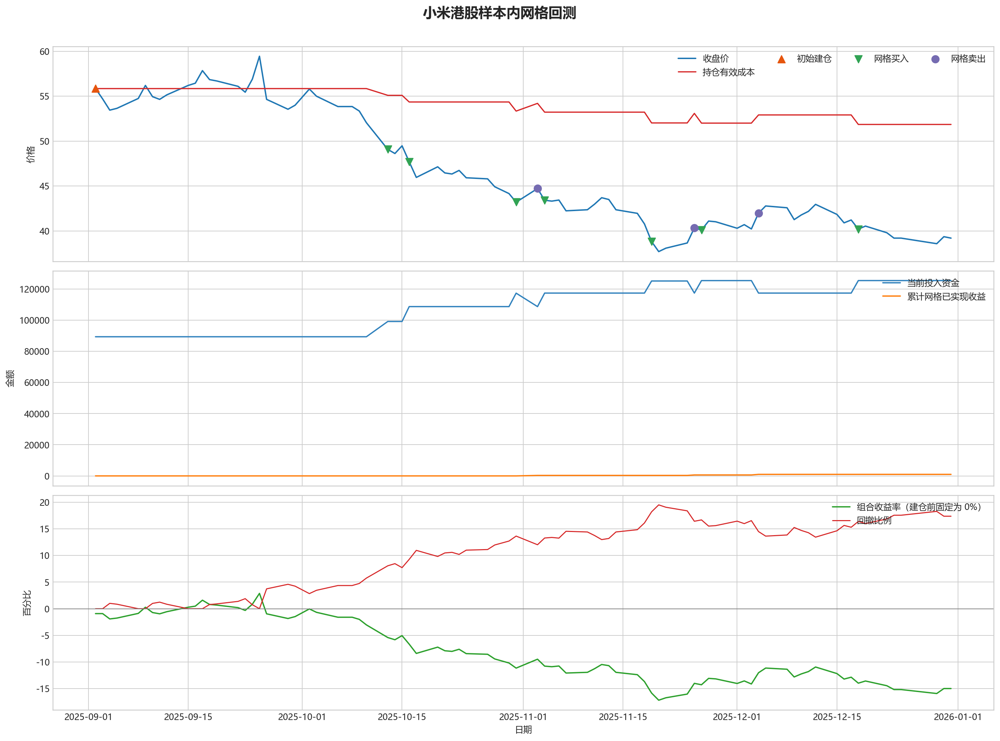
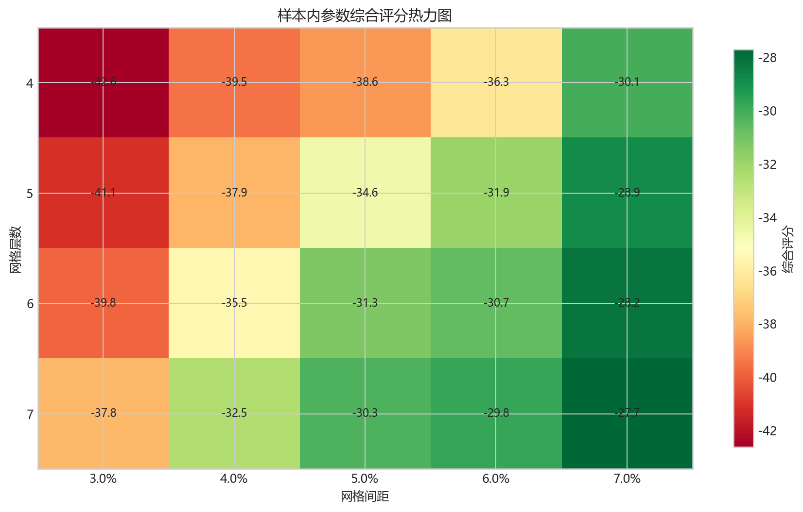
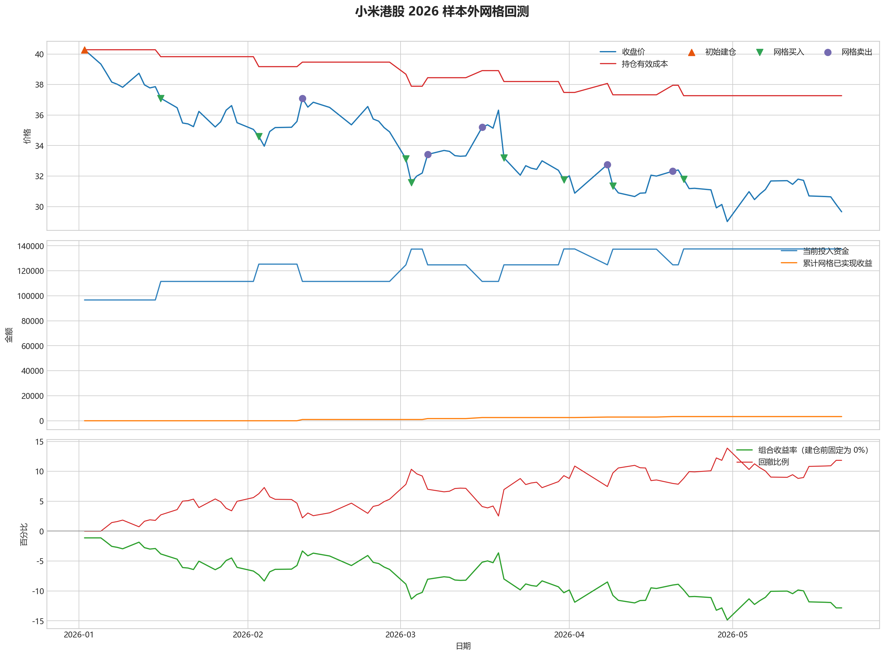

# 小米港股网格回测报告

## 摘要

- 标的：小米集团 `1810.HK`
- 样本内窗口：2025-09-02 至 2025-12-31
- 样本外窗口：2026-01-01 至 2026-05-21
- 初始规则：样本开始时投入 50% 资金建底仓，剩余 50% 资金做网格买卖
- 最小交易单位：200 股，来源：AASTOCKS 快照页 Lot Size
- 固定底仓数量：1600 股
- 单层网格固定数量：200 股
- 最优参数：网格间距 7.00% / 网格层数 5 / 止盈比例 3.00%

在这轮样本里，网格交易能摊薄持仓成本，但还没有把总账户稳定拉回正收益。

## 老板一眼看懂版

- 先看结论：样本内虽然通过网格把成本压低了 `7.15%`，但总账户最终还是亏损 `14.21%`。
- 最值得关注的参数组合是“网格间距 `7.00%` / 网格层数 `5` / 止盈比例 `3.00%`”，而且网格层数 `5` 到 `7` 的表现差别不大。
- 再看样本外：样本外依然没有转正，收益率 `-11.84%`，说明它更像摊薄成本工具，而不是独立盈利策略。

## 样本内寻参结果

- 样本内首笔建仓日：2025-09-02
- 样本内建仓价：55.85
- 最小交易单位：200 股
- 固定底仓数量：1600 股
- 单层网格固定数量：200 股
- 网格层数含义：最多允许开启 5 层“固定股数”网格仓位，不再是“每层分多少钱”
- 样本内收益率：-14.21%
  - 按这套策略跑完样本内区间，账户从 `200000` 走到 `170008.00`，合计亏损 `29992.00`。
- 样本内年化收益率：-37.56%
  - 这个数主要拿来和别的策略横向比较，表示把当前样本期收益折算成年化后的结果。
- 样本内最大回撤：19.51%
  - 这段样本里最难受的时候，账户相对阶段高点最多回撤了 `19.51%`。
- 期末有效持仓成本：51.86
  - 把已经兑现的网格利润算进去后，当前剩余仓位的摊薄成本大约是 `51.86`。
- 相对初始建仓成本下降：7.15%
  - 和最初底仓买入价 `55.85` 相比，当前持仓成本被压低了 `7.15%`。
- 网格已实现收益：984.00
  - 这部分是已经完成低买高卖、真正落袋的利润，样本内累计为 `984.00`。
- 完成网格循环次数：3
  - 这段样本里，网格实际完成了 `3` 轮买入后反弹卖出的闭环。

### 样本内怎么看懂

- 如果你只按规则先买 `50%` 底仓，后面完全不做网格，到样本结束时账户大约是 `173360.00`。
- 当前这版网格策略的最终账户是 `170008.00`，收益率 `-14.21%`。
- 这里每次网格买入的不是固定金额，而是固定 `200` 股；只要跌到下一层，就按同样股数再买一层。
- 也就是说：网格本身虽然已经落袋赚了 `984.00`，但额外接进来的下跌仓位浮盈浮亏也会影响总账户，所以整套策略相对“只拿底仓不做网格”多亏了 `3352.00`。
- 所以这里不能把“网格已实现收益”直接理解成“整个策略赚了这么多钱”；它只代表网格来回滚动已经兑现的那部分利润。

### 关于收益曲线为什么看起来像 0

- 图里的收益曲线不是全程为 0。
- 现在这版策略在样本开始时就直接建仓，所以收益曲线会从首笔底仓建立后立即开始波动。
- 如果你肉眼看图时觉得它“贴着 0”，通常是因为整体盈亏波动幅度不大，或者样本后半段虽然有网格利润，但总账户仍在盈亏平衡附近徘徊。

### 图表速读总结

- 这一段价格从 `55.85` 走到 `39.20`，区间涨跌幅约 `-29.81%`。
- 样本结束时收盘价 `39.20` 仍低于有效成本 `51.86`，剩余持仓按摊薄口径还处在约 `24.41%` 的浮亏区。
- 图里的买卖点一共完成了 `3` 轮网格闭环，已经落袋的网格利润累计 `984.00`。
- 总账户最终仍是亏损状态，期末权益 `170008.00`；也就是说，网格已实现利润还没完全覆盖底仓和未平仓仓位的回撤。

### 热力图速读总结

- 热力图横轴是网格间距，纵轴是网格层数，颜色越偏绿代表综合评分越高；每个格子里没有单独画出的止盈比例，已经折叠成该格子的最好结果。
- 当前样本里，最优参数落在“网格间距 `7.00%` / 网格层数 `5` / 止盈比例 `3.00%`”。
- 从前几名结果看，高分区域主要集中在网格间距 `7.00%`、网格层数 `5` 附近。
- 最亮的区域不是单个点，而是网格层数 `5` 到 `7` 的一段平台，说明继续把层数加深，并没有明显抬高综合得分。

## 2026 样本外验证

- 样本外收益率：-11.84%
  - 按同一套参数跑完样本外区间，账户从 `200000` 走到 `174336.00`，合计亏损 `25664.00`。
- 样本外年化收益率：-28.92%
  - 这个数主要拿来和别的策略横向比较，表示把当前样本外收益折算成年化后的结果。
- 样本外最大回撤：13.88%
  - 样本外这段时间里，账户相对阶段高点最多回撤了 `13.88%`。
- 样本外沿用最小交易单位：200 股
- 样本外单层网格固定数量：400 股
- 期末有效持仓成本：37.27
- 把已经兑现的网格利润算进去后，当前剩余仓位的摊薄成本大约是 `37.27`。
- 相对样本外首笔建仓成本下降：7.48%
- 和样本外首笔底仓买入价相比，当前持仓成本被压低了 `7.48%`。
- 网格已实现收益：3344.00
- 这部分是已经完成低买高卖、真正落袋的利润，样本外累计为 `3344.00`。
- 完成网格循环次数：5
- 这段样本外区间里，网格实际完成了 `5` 轮买入后反弹卖出的闭环。

2026 样本外区间延续了成本摊薄，但收益仍为负，说明策略更像风险缓冲而不是单独的反转信号。

### 样本外图表速读总结

- 这一段价格从 `40.28` 走到 `29.66`，区间涨跌幅约 `-26.37%`。
- 样本结束时收盘价 `29.66` 仍低于有效成本 `37.27`，剩余持仓按摊薄口径还处在约 `20.42%` 的浮亏区。
- 图里的买卖点一共完成了 `5` 轮网格闭环，已经落袋的网格利润累计 `3344.00`。
- 总账户最终仍是亏损状态，期末权益 `174336.00`；也就是说，网格已实现利润还没完全覆盖底仓和未平仓仓位的回撤。

## 交易记录

### 样本内事件流水

| 时间 | 事件类型 | 层级 | 价格 | 数量 | 金额 | 说明 |
| --- | --- | --- | --- | --- | --- | --- |
| 2025-09-02 | base_buy | 0 | 55.85 | 1600 | 89360.00 | 样本开始时初始建仓 |
| 2025-10-13 | grid_buy | 1 | 49.08 | 200 | 9816.00 | 触发下行网格买入 |
| 2025-10-16 | grid_buy | 2 | 47.70 | 200 | 9540.00 | 触发下行网格买入 |
| 2025-10-31 | grid_buy | 3 | 43.20 | 200 | 8640.00 | 触发下行网格买入 |
| 2025-11-03 | grid_sell | 3 | 44.72 | 200 | 8944.00 | 达到网格止盈价后卖出本层仓位 |
| 2025-11-04 | grid_buy | 3 | 43.42 | 200 | 8684.00 | 触发下行网格买入 |
| 2025-11-19 | grid_buy | 4 | 38.82 | 200 | 7764.00 | 触发下行网格买入 |
| 2025-11-25 | grid_sell | 4 | 40.34 | 200 | 8068.00 | 达到网格止盈价后卖出本层仓位 |
| 2025-11-26 | grid_buy | 4 | 40.10 | 200 | 8020.00 | 触发下行网格买入 |
| 2025-12-04 | grid_sell | 4 | 41.98 | 200 | 8396.00 | 达到网格止盈价后卖出本层仓位 |
| 2025-12-18 | grid_buy | 4 | 40.20 | 200 | 8040.00 | 触发下行网格买入 |

### 样本内成交结果

| 开仓时间 | 平仓时间 | 持有时长 | 开仓价 | 平仓价 | 数量 | 盈亏 | 收益率(%) | 仓位类型 |
| --- | --- | --- | --- | --- | --- | --- | --- | --- |
| 2025-10-31 00:00:00 | 2025-11-03 00:00:00 | 3 days 00:00:00 | 43.20 | 44.72 | 200 | 304.00 | 3.52 | 网格 3 |
| 2025-11-19 00:00:00 | 2025-11-25 00:00:00 | 6 days 00:00:00 | 38.82 | 40.34 | 200 | 304.00 | 3.92 | 网格 4 |
| 2025-11-26 00:00:00 | 2025-12-04 00:00:00 | 8 days 00:00:00 | 40.10 | 41.98 | 200 | 376.00 | 4.69 | 网格 4 |
| 2025-09-02 00:00:00 | 2025-12-30 00:00:00 | 119 days 00:00:00 | 55.85 | 39.36 | 1600 | -26384.00 | -29.53 | 底仓 |
| 2025-10-13 00:00:00 | 2025-12-30 00:00:00 | 78 days 00:00:00 | 49.08 | 39.36 | 200 | -1944.00 | -19.80 | 网格 1 |
| 2025-10-16 00:00:00 | 2025-12-30 00:00:00 | 75 days 00:00:00 | 47.70 | 39.36 | 200 | -1668.00 | -17.48 | 网格 2 |
| 2025-11-04 00:00:00 | 2025-12-30 00:00:00 | 56 days 00:00:00 | 43.42 | 39.36 | 200 | -812.00 | -9.35 | 网格 3 |
| 2025-12-18 00:00:00 | 2025-12-30 00:00:00 | 12 days 00:00:00 | 40.20 | 39.36 | 200 | -168.00 | -2.09 | 网格 4 |

### 样本外事件流水

| 时间 | 事件类型 | 层级 | 价格 | 数量 | 金额 | 说明 |
| --- | --- | --- | --- | --- | --- | --- |
| 2026-01-02 | base_buy | 0 | 40.28 | 2400 | 96672.00 | 样本开始时初始建仓 |
| 2026-01-16 | grid_buy | 1 | 37.10 | 400 | 14840.00 | 触发下行网格买入 |
| 2026-02-03 | grid_buy | 2 | 34.60 | 400 | 13840.00 | 触发下行网格买入 |
| 2026-02-11 | grid_sell | 2 | 37.10 | 400 | 14840.00 | 达到网格止盈价后卖出本层仓位 |
| 2026-03-02 | grid_buy | 2 | 33.14 | 400 | 13256.00 | 触发下行网格买入 |
| 2026-03-03 | grid_buy | 3 | 31.58 | 400 | 12632.00 | 触发下行网格买入 |
| 2026-03-06 | grid_sell | 3 | 33.42 | 400 | 13368.00 | 达到网格止盈价后卖出本层仓位 |
| 2026-03-16 | grid_sell | 2 | 35.20 | 400 | 14080.00 | 达到网格止盈价后卖出本层仓位 |
| 2026-03-20 | grid_buy | 2 | 33.20 | 400 | 13280.00 | 触发下行网格买入 |
| 2026-03-31 | grid_buy | 3 | 31.76 | 400 | 12704.00 | 触发下行网格买入 |
| 2026-04-08 | grid_sell | 3 | 32.76 | 400 | 13104.00 | 达到网格止盈价后卖出本层仓位 |
| 2026-04-09 | grid_buy | 3 | 31.36 | 400 | 12544.00 | 触发下行网格买入 |
| 2026-04-20 | grid_sell | 3 | 32.32 | 400 | 12928.00 | 达到网格止盈价后卖出本层仓位 |
| 2026-04-22 | grid_buy | 3 | 31.80 | 400 | 12720.00 | 触发下行网格买入 |

### 样本外成交结果

| 开仓时间 | 平仓时间 | 持有时长 | 开仓价 | 平仓价 | 数量 | 盈亏 | 收益率(%) | 仓位类型 |
| --- | --- | --- | --- | --- | --- | --- | --- | --- |
| 2026-02-03 00:00:00 | 2026-02-11 00:00:00 | 8 days 00:00:00 | 34.60 | 37.10 | 400 | 1000.00 | 7.23 | 网格 2 |
| 2026-03-03 00:00:00 | 2026-03-06 00:00:00 | 3 days 00:00:00 | 31.58 | 33.42 | 400 | 736.00 | 5.83 | 网格 3 |
| 2026-03-02 00:00:00 | 2026-03-16 00:00:00 | 14 days 00:00:00 | 33.14 | 35.20 | 400 | 824.00 | 6.22 | 网格 2 |
| 2026-03-31 00:00:00 | 2026-04-08 00:00:00 | 8 days 00:00:00 | 31.76 | 32.76 | 400 | 400.00 | 3.15 | 网格 3 |
| 2026-04-09 00:00:00 | 2026-04-20 00:00:00 | 11 days 00:00:00 | 31.36 | 32.32 | 400 | 384.00 | 3.06 | 网格 3 |
| 2026-01-02 00:00:00 | 2026-05-20 00:00:00 | 138 days 00:00:00 | 40.28 | 30.14 | 2400 | -24336.00 | -25.17 | 底仓 |
| 2026-01-16 00:00:00 | 2026-05-20 00:00:00 | 124 days 00:00:00 | 37.10 | 30.14 | 400 | -2784.00 | -18.76 | 网格 1 |
| 2026-03-20 00:00:00 | 2026-05-20 00:00:00 | 61 days 00:00:00 | 33.20 | 30.14 | 400 | -1224.00 | -9.22 | 网格 2 |
| 2026-04-22 00:00:00 | 2026-05-20 00:00:00 | 28 days 00:00:00 | 31.80 | 30.14 | 400 | -664.00 | -5.22 | 网格 3 |

## 结论

- 这套参数更适合“先急跌、后震荡修复”的行情，能够通过来回做网格降低持仓成本。
- 如果行情持续单边下跌，网格收益只能部分对冲亏损，不能替代趋势止损或更强的择时规则。
- 当前样本下，成本摊薄效果稳定存在：样本内下降 7.15%，样本外下降 7.48%。
- 如果后续继续扩展策略，优先方向应该是加入趋势过滤或分阶段停手机制，而不是单纯增加网格层数。
